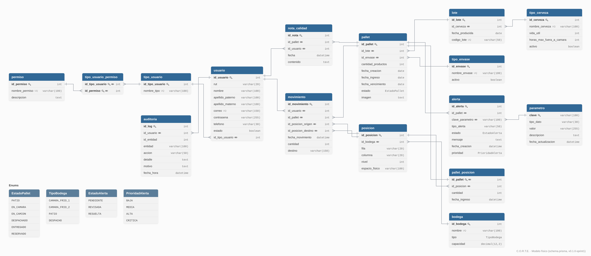
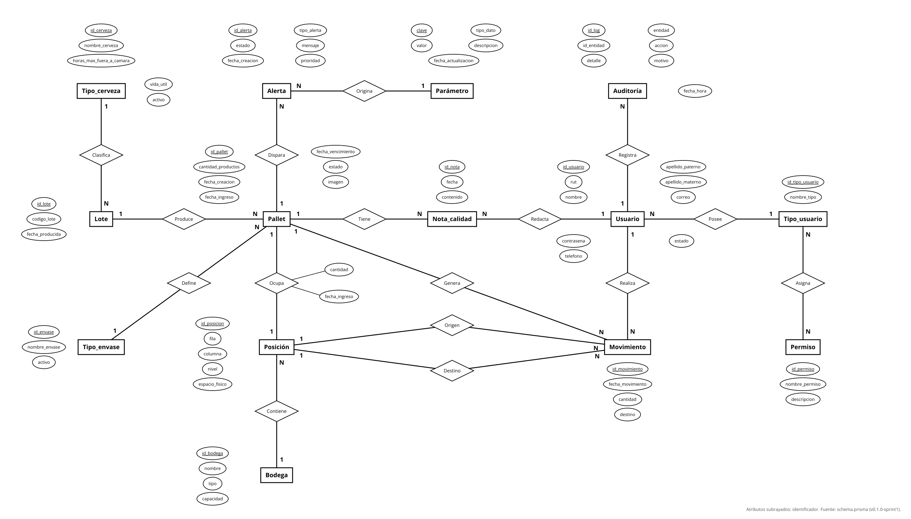
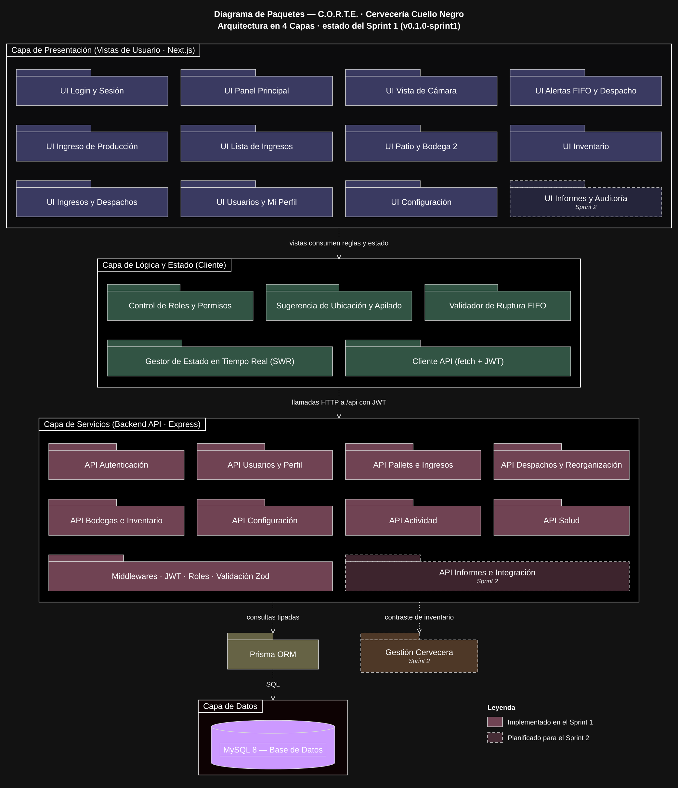

# Catálogo de Diagramas de Arquitectura y Diseño - Proyecto C.O.R.T.E.

En este documento se presentan los diagramas de modelado del sistema para el proyecto **C.O.R.T.E. (Control Operativo y Registro Total de Espacios)** de Cervecería Cuello Negro.

Cada sección contiene la visualización del diagrama, una breve descripción técnica de su propósito y el enlace correspondiente para su consulta o edición externa.

---

### 1. Diagrama de Componentes

* **Comparativa y Propósito:** Ilustra la arquitectura modular del sistema, la interacción entre el cliente (interfaz del Gemelo Digital en tablets/móviles), el API Backend de lógica de negocios, el motor de recomendación espacial (FEFO/FIFO) y la integración con el ERP existente.
* **Cambios realizados:** Se estructuraron las interfaces de comunicación REST/Webhooks y los límites de componentes.

---

### 2. Diagrama de Base de Datos

* **Comparativa y Propósito:** Especifica la implementación física relacional (tablas, tipos de datos, llaves primarias, llaves foráneas e índices) para la persistencia del inventario, gestión de lotes y control de ubicaciones dentro de la bodega de frío.
* **Cambios realizados (09/10/2026):** Se rehízo desde `schema.prisma` (v0.1.0-sprint1). Incorpora las tablas `bodega`, `pallet_posicion`, `auditoria` y `alerta`; `usuario` pasa a tener `id_usuario` como llave primaria; la cerveza se relaciona con el pallet a través del `lote` y la posición a través de `pallet_posicion`. Incluye los enums `EstadoPallet`, `TipoBodega`, `EstadoAlerta` y `PrioridadAlerta`.

---

### 3. Diagrama Entidad-Relación (E/R)

* **Comparativa y Propósito:** Define las entidades del dominio de negocio (Pallet, Lote, Posición, Bodega, Movimiento, Usuario, Alerta, entre otras), sus atributos y sus cardinalidades en notación de Chen.
* **Cambios realizados (09/10/2026):** Se actualizó al modelo vigente: se agregan Bodega, Auditoría, Alerta y Parámetro con sus relaciones; la relación con el tipo de cerveza pasa por el Lote; Ocupa registra cantidad y fecha de ingreso; Asigna representa la relación N:N entre cargos y permisos. Los identificadores van subrayados.

---

### 4. Diagrama de Actividad

* **Comparativa y Propósito:** Modela el flujo operativo paso a paso que realiza un operario de planta desde la recepción e ingreso de producto hasta la asignación de ubicación guiada por el algoritmo y el posterior despacho de lotes.
* **Cambios realizados:** Inclusión de bifurcaciones condicionales para manejo de excepciones de conectividad u offline en la bodega de frío.

---

### 5. Diagrama de Paquetes

* **Comparativa y Propósito:** Muestra la arquitectura en 4 capas (presentación en Next.js, lógica y estado en el cliente, servicios del backend en Express y datos en MySQL mediante Prisma) con los módulos que existen en el Sprint 1.
* **Cambios realizados (09/10/2026):** Se actualizó a las vistas y APIs reales de v0.1.0-sprint1. Los módulos de informes, auditoría e integración con Gestión Cervecera se marcan con borde punteado como planificados para el Sprint 2.

---

### 6. Diagramas de Secuencia
Un diagrama por historia de usuario del Sprint 1, en la carpeta [Diagramas/Diagramas de Secuencia](Diagramas/Diagramas%20de%20Secuencia): US-01, US-02, US-04, US-09, US-15, US-18 y US-21.
