# Manual de usuario — C.O.R.T.E.

**Cervecería Cuello Negro**

**Edición:** 1.5 · **Fecha:** 2 de octubre de 2026

**Aplicación documentada:** US-18: frontend 0.1.0 (`952dfde`) y backend 1.0.0 (`bf5a1d7`). US-02: frontend 0.1.0 (`6ca4992`) y backend 1.0.0 (`152596b`). Base de los capítulos anteriores: frontend 0.1.0 (`3d21cc3`) y backend 1.0.0 (`abb434f`). Los capítulos de US-21 (alertas) y US-15 (configuración) se redactaron a partir del SRS Técnico v0.3 y de las pantallas de la versión actual; su verificación contra el código queda pendiente en el anexo. Las verificaciones históricas conservan el alcance y la fecha indicados en el anexo.

Este manual reúne las instrucciones de uso de la aplicación actual. Comienza por el acceso al sistema y continúa con la gestión de usuarios, roles y permisos, el registro de producción, la consulta del mapa de Bodega 1, el despacho de uno o varios pallets, la consulta de alertas de prioridad de salida y la configuración de parámetros. Las capturas usan cuentas y datos de ejemplo; no utilices esos datos para registrar producción real.

## Índice

1. [Iniciar sesión y acceder según tu perfil — US-01](#acceso)
2. [Gestionar usuarios, roles y permisos — US-02](#usuarios)
3. [Registrar un ingreso de producción — US-04](#ingresos)
4. [Gemelo Digital 2D — Bodega 1 — US-09](#bodega-1)
5. [Despachar uno o varios pallets — US-18](#despachos)
6. [Alertas de prioridad de salida y vencimiento — US-21](#alertas)
7. [Configurar el sistema (Data-Driven) — US-15](#configuracion)
8. [Anexo: validaciones y revisión del manual](#validaciones)
   - [Validación de US-01](#validacion-us-01)
   - [Validación de US-02](#validacion-us-02)
   - [Validación de US-04](#validacion-us-04)
   - [Validación de US-09](#validacion-us-09)
   - [Validación de US-18](#validacion-us-18)
   - [Validación de US-21](#validacion-us-21)
   - [Validación de US-15](#validacion-us-15)

## 1. Iniciar sesión y acceder según tu perfil — US-01

Esta sección explica cómo entrar al sistema, reconocer las opciones de tu perfil y cerrar sesión. Para registrar producción después de entrar, continúa con [Registro de producción](#ingresos).

### 1.1. Antes de comenzar

Necesitas una cuenta activa y la contraseña entregada por el responsable de usuarios. Ten a mano el RUT o correo registrado. No compartas tu contraseña ni utilices la cuenta de otra persona.

La pantalla muestra una indicación sobre la contraseña inicial basada en el RUT. Si no sabes cuál corresponde a tu cuenta, confírmala con el responsable: las cuentas de demostración o las contraseñas modificadas pueden tener valores diferentes.

**Resultado esperado:** tienes tus datos de acceso y ves la pantalla «Iniciar sesión».

### 1.2. Iniciar sesión

1. Abre la dirección de C.O.R.T.E. proporcionada por tu organización.
2. En **RUT o Correo**, escribe el identificador registrado en tu cuenta. Si usas RUT y no se reconoce, comprueba el formato con el responsable o utiliza tu correo registrado.
3. En **Contraseña**, escribe tu contraseña actual. El campo oculta los caracteres.
4. Pulsa **Ingresar** una sola vez y espera mientras aparece **Ingresando…**.

**Resultado esperado:** se abre el **Panel principal** y aparece el menú correspondiente al perfil recibido al iniciar sesión. Actualmente todos los perfiles llegan a ese mismo panel; cambian las opciones del menú.

*Figura 1.1. Campos de acceso. No se incluyen credenciales en las capturas.*

### 1.3. Reconocer las opciones de tu perfil

En pantallas pequeñas, el menú lateral puede mostrarse solo con iconos. Pulsa la flecha de su borde para desplegar los nombres.

La siguiente tabla describe **visibilidad del menú**, no certifica todos los permisos de cada operación.

| Opción del menú | Jefe de Planta | Personal de reparto, Operario y Encargado |
|---|:---:|:---:|
| Panel principal | Sí | Sí |
| Vista de Cámara | Sí | Sí |
| Alertas FIFO | Sí | Sí |
| Inventario | Sí | Sí |
| Patio | Sí | Sí |
| Bodega 2 | Sí | Sí |
| Mi perfil | Sí | Sí |
| Lista de Ingresos | Sí | No |
| Ingresos y Despachos | Sí | No |
| Configuración | Sí | No |
| Usuarios | Sí | No |

En esta versión, las cuentas clasificadas como **Ayudante** o **Calidad** se asocian al perfil de interfaz **Operario**. Si tu menú no corresponde a tu trabajo, solicita una revisión de tu cuenta al responsable.

No uses el selector «Perfil» del menú lateral como procedimiento para obtener permisos: en esta versión cambia la vista del menú y no sustituye la asignación de rol de tu cuenta. Los nombres que muestra ese selector son etiquetas fijas y no deben usarse para comprobar la identidad de la persona conectada.

**Resultado esperado:** identificas las herramientas visibles para tu perfil y solicitas ayuda si falta alguna necesaria.

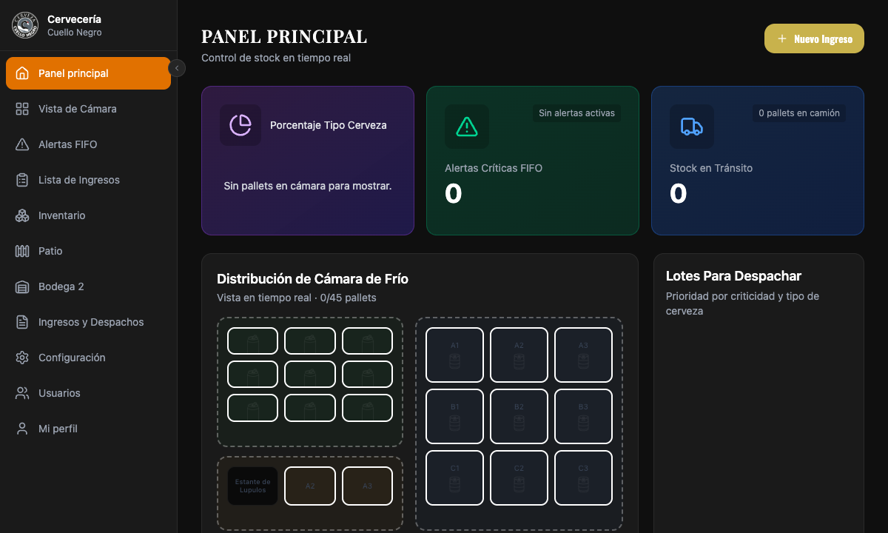

*Figura 1.2. Opciones visibles al entrar con Jefe de Planta; se excluye el pie del perfil de la captura.*

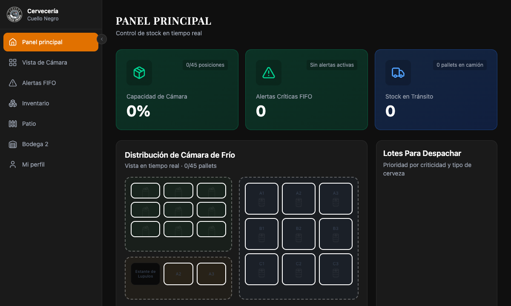

*Figura 1.3. Opciones visibles al entrar con Personal de reparto.*

### 1.4. Cerrar sesión

1. Guarda o termina la tarea que estés realizando.
2. En la parte inferior del menú lateral, pulsa el botón con el icono de salida, **Cerrar sesión**.
3. Comprueba que vuelve a aparecer **Iniciar sesión**, como en la figura 1.1.

**Resultado esperado:** sales de la sesión en esa ventana. En un equipo compartido, cierra también la pestaña al terminar. No basta con dejar de usar la aplicación o cambiar de página.

### 1.5. Resolver problemas de acceso

| Situación o mensaje | Qué hacer |
|---|---|
| «Ingrese RUT o correo y contraseña» | Completa ambos campos e intenta nuevamente. |
| «Credenciales incorrectas» | Revisa el identificador, las mayúsculas de la contraseña y que no hayas añadido espacios al copiarla. |
| «Credenciales incorrectas o usuario inactivo» | Confirma tus datos. Si son correctos, pide al responsable que revise si tu cuenta está activa. El mensaje por sí solo no permite distinguir ambas causas. |
| «No se pudo conectar con el servidor backend» o error de conexión | Revisa tu conexión e inténtalo de nuevo. Si continúa, informa al responsable; no cambies tu contraseña por este mensaje. |
| Olvidaste tu contraseña | Contacta al responsable de usuarios. El botón «¿Olvidaste tu contraseña?» está visible, pero todavía no inicia una recuperación. |
| Al recargar desaparece el menú o dejan de abrirse los formularios | Vuelve a la dirección de acceso terminada en `/login` e inicia sesión otra vez. La versión actual no restaura automáticamente la sesión visual después de recargar. |
| Una operación indica que la sesión es inválida o expiró | Vuelve a iniciar sesión. Si sigue fallando, comunica el mensaje y la operación al responsable, sin compartir la contraseña. |
| No ves una opción o aparece acceso denegado | Solicita que revisen el rol de tu cuenta. No utilices credenciales de otra persona. |

**Resultado esperado:** corriges los datos de acceso o identificas cuándo pedir ayuda. Si solicitas soporte, indica la hora aproximada y el mensaje; no envíes tu contraseña ni códigos de sesión.

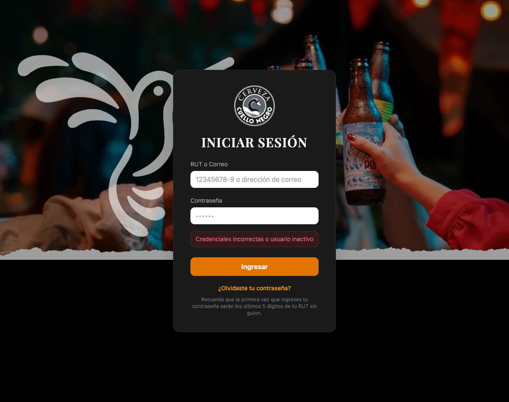

*Figura 1.4. Error de acceso. Se vaciaron los campos antes de tomar la captura.*

---

**Alcance:** inicio y cierre de sesión y navegación por perfil. Para crear cuentas, asignar cargos o restablecer contraseñas desde administración, continúa con [Gestión de usuarios](#usuarios). Las verificaciones y diferencias respecto de la historia se registran en el anexo [Validación US-01](#validacion-us-01).

---

## 2. Gestionar usuarios, roles y permisos — US-02

Este capítulo está dirigido al **Jefe de Planta**. Explica cómo registrar colaboradores, corregir sus datos, asignarles un cargo y activar o desactivar su acceso. Corresponde a [US-02 — Gestión de usuarios, roles y permisos (3 SP)](https://trello.com/c/6ND3asV2).

### 2.1. Antes de comenzar

Inicia sesión con una cuenta activa de **Jefe de Planta**, siguiendo el [capítulo de acceso](#acceso). Ten a mano el RUT, nombre, apellido paterno, correo y cargo autorizado del colaborador. El apellido materno y el teléfono son opcionales.

Las imágenes muestran la interfaz con **datos ficticios y respuestas simuladas** para ilustrar los pasos. No corresponden a cuentas reales ni prueban el guardado en una base de datos. El ejemplo sigue a **Ana Ejemplo**, primero como Ayudante y después como Calidad. No copies sus datos al registrar a una persona real.

**Resultado esperado:** puedes entrar a **Usuarios** desde el menú lateral. Si no aparece, pide al responsable que compruebe el cargo de tu cuenta. Cambiar el selector «Perfil» del menú no asigna permisos a una cuenta.

### 2.2. Consultar y buscar usuarios

1. En el menú lateral, selecciona **Usuarios**. Si solo ves iconos, pulsa la flecha del borde para desplegar los nombres.
2. Espera a que termine **Cargando…**. La tabla muestra **Nombre, Apellido, Cargo, RUT, Correo, Teléfono, Editar y Estado**.
3. Escribe parte del nombre, apellido, cargo, RUT o correo en **Buscar por nombre, cargo o RUT…**. Aunque el texto del campo no menciona el correo, también permite buscarlo.
4. En el filtro de estado, selecciona **Cualquiera**, **Activo** o **Inactivo**. La búsqueda y el estado se aplican conjuntamente; el contador indica cuántas cuentas coinciden.
5. Para volver a ver todas las cuentas, borra la búsqueda y elige **Cualquiera**.

**Resultado esperado:** identificas la cuenta por nombre y RUT antes de modificarla. Si no aparece un RUT con puntos y guion, busca sus dígitos sin separadores o utiliza el correo. En una pantalla pequeña, desplaza la tabla horizontalmente para ver **Editar** y **Estado**.

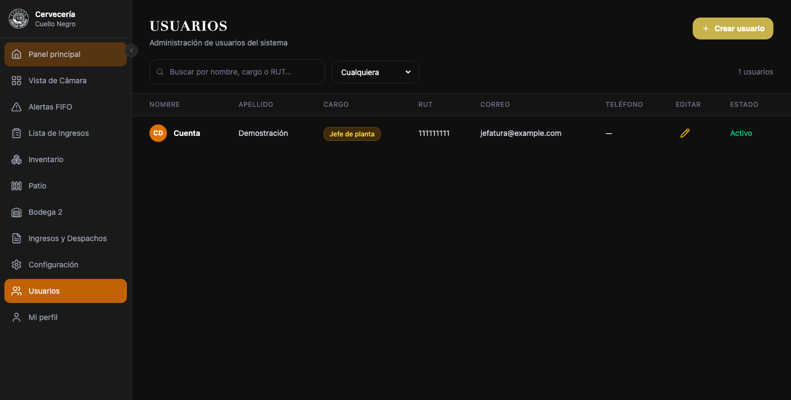

*Figura 2.1. Acceso a la administración. Cuenta de demostración; el pie del perfil queda fuera de la captura.*

### 2.3. Crear una cuenta

1. Pulsa **Crear usuario**, en la parte superior de la lista.
2. Completa **Datos del usuario**, siguiendo esta tabla. Los campos marcados con **\*** son obligatorios.

| Campo | Qué ingresar |
|---|---|
| RUT * | RUT de la persona, incluido el dígito verificador. Admite puntos y guion; se guarda sin separadores y con K mayúscula. No reutilices un RUT ya registrado. |
| Nombre * | Nombre de la persona; hasta 100 caracteres. |
| Apellido paterno * | Apellido paterno; hasta 100 caracteres. |
| Apellido materno | Opcional; hasta 100 caracteres. |
| Correo electrónico * | Dirección válida y diferente de las de otras cuentas; hasta 150 caracteres. |
| Teléfono | Opcional; hasta 30 caracteres. |
| Tipo de usuario * | Cargo autorizado para la cuenta. Al abrir el formulario aparece **Ayudante** como selección inicial. |

3. En **Cargo y acceso**, selecciona **Tipo de usuario**. Las opciones actuales son **Jefe de plata**, **Ayudante**, **Calidad** y **Personal de reparto**. La etiqueta «Jefe de plata» tiene un error de escritura en la interfaz: corresponde a **Jefe de Planta** y concede acceso administrativo.
4. Comprueba identidad, correo y cargo antes de enviar. La creación no ofrece un campo para escoger la contraseña ni un selector de estado: la cuenta nueva queda activa.
5. Pulsa **Crear usuario** una sola vez. Durante el envío aparece **Guardando…** y los controles se bloquean.
6. Cuando el formulario se cierre y aparezca la notificación, busca la nueva cuenta en la lista y comprueba su **Cargo** y estado **Activo**. Si el filtro estaba en Inactivo, cámbialo a Cualquiera o Activo.

**Resultado esperado:** la cuenta aparece en el listado con los datos ingresados y puede iniciar sesión con sus credenciales. Si la respuesta demora o hay un error, busca primero el RUT antes de intentar crearla otra vez.

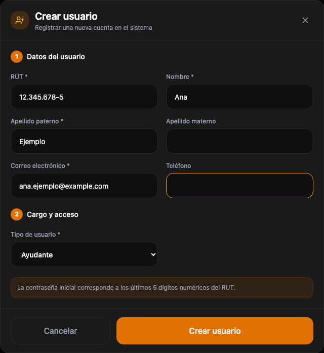

*Figura 2.2. Datos obligatorios, selección de cargo e indicación de contraseña inicial.*

**Contraseña inicial:** el sistema toma los últimos **cinco dígitos numéricos del RUT completo**, después de eliminar los caracteres no numéricos. Si el dígito verificador es un número, se incluye; si es K, no se incluye. Entrégala a la persona por el canal interno acordado, sin publicarla en capturas o listas compartidas. Solicita que la cambie desde **Mi perfil**. En esa pantalla la nueva contraseña exige al menos 12 caracteres, con mayúscula, minúscula y número.

**Salir sin crear:** pulsa **Cancelar** o la **X** antes de enviar. Los datos sin guardar se descartan.

### 2.4. Editar datos y cambiar el cargo

1. Busca a la persona en **Usuarios** y verifica su RUT.
2. Pulsa el **lápiz** de su fila, en **Editar**. Se abre **Editar usuario** con los datos actuales.
3. Corrige solo los datos necesarios. Los campos obligatorios y límites son los mismos que al crear.
4. Para cambiar sus accesos, selecciona el nuevo **Tipo de usuario**. En el ejemplo se cambia **Ayudante** por **Calidad**.
5. Revisa **Estado**. En cuentas de otras personas puedes elegir **Activo** o **Inactivo** desde este formulario. En tu propia cuenta no aparece este control.
6. Si no necesitas cambiar la contraseña, deja **Nueva contraseña (opcional)** vacía. Si debes restablecerla, escribe una nueva de **8 a 72 caracteres**, que es el límite de esta pantalla, y entrégala por el canal interno acordado. La contraseña anterior no se muestra. Cambiar únicamente el RUT no vuelve a generar la contraseña inicial.
7. Pulsa **Aceptar** una sola vez. Espera el regreso a **Usuarios** y comprueba los datos, cargo y estado. Si necesitas verificar un dato completo, vuelve a abrir el lápiz.

**Resultado esperado:** la cuenta conserva los datos que no modificaste y muestra los nuevos valores. **Cancelar** vuelve a la lista sin guardar. En esta pantalla, cambiar el estado y pulsar Aceptar lo guarda directamente; no abre la confirmación del interruptor de la lista.

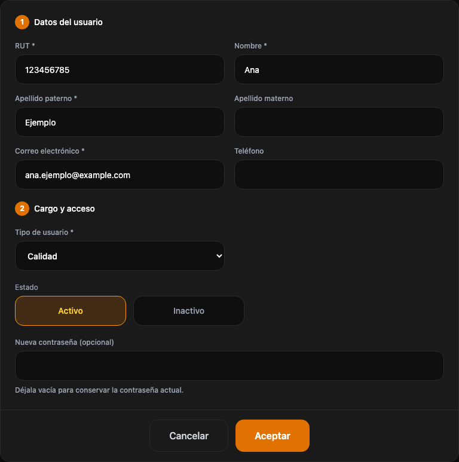

*Figura 2.3. Cargo, estado y contraseña opcional. La contraseña se deja vacía para conservarla.*

Si cambias tu propio cargo y dejas de ser Jefe de Planta, puedes perder el acceso administrativo al guardar. Coordina la continuidad con otro jefe activo. El sistema impide quitar ese cargo al **último Jefe de Planta activo**.

### 2.5. Entender y comprobar los permisos

El **cargo** determina los accesos asociados a la cuenta; el **estado** determina si puede iniciar sesión. Activar una cuenta no la convierte en administradora.

Para consultar la referencia visual, entra a **Configuración → Permisos de usuarios**. La tabla actual muestra:

| Acceso mostrado en Configuración | Jefe de Planta | Ayudante | Calidad | Personal de reparto |
|---|:---:|:---:|:---:|:---:|
| Consultar inventario | Sí | Sí | Sí | Sí |
| Ver cámara y alertas | Sí | Sí | Sí | Sí |
| Ingresos y despachos | Sí | No | No | No |
| Administrar usuarios | Sí | No | No | No |
| Configuración | Sí | No | No | No |

**La tabla es de consulta:** las casillas, **Nuevo cargo** y **Editar** están deshabilitados. No se pueden crear cargos ni configurar permisos individuales desde ella. Para reasignar una persona, utiliza **Usuarios → lápiz → Tipo de usuario**. La tabla describe los accesos mostrados, no constituye una comprobación de autorización de todas las operaciones del sistema.

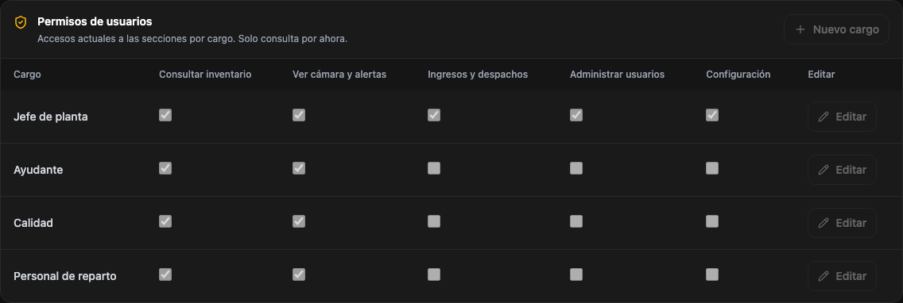

*Figura 2.4. Referencia de accesos por cargo; los controles de edición están deshabilitados.*

**Cuándo se aplica el cambio:** una vez guardado, el servidor consulta el cargo y estado actuales en cada solicitud para administrar **Usuarios** y **Configuración**, sin reiniciar el sistema. Sin embargo, el menú de una sesión ya abierta conserva el perfil anterior. Para ver el menú correspondiente al nuevo cargo, pide al colaborador que cierre sesión y vuelva a entrar. Ayudante y Calidad se muestran con el perfil de interfaz **Operario**.

**Resultado esperado:** el listado muestra el cargo nuevo y, tras un nuevo inicio de sesión, la persona reconoce su menú. Si recibe acceso denegado aunque un enlace siga visible, solicita revisión del cargo; la presencia del enlace no confirma autorización. No se ha verificado en este manual la aplicación inmediata de permisos en todos los módulos.

### 2.6. Desactivar una cuenta

Utiliza esta opción cuando una persona ya no deba iniciar sesión. **Desactivar conserva la cuenta y sus registros**; no elimina su historial.

1. Busca la cuenta y confirma nombre y RUT.
2. En **Estado**, pulsa el interruptor de una cuenta **Activa**.
3. Lee **¿Seguro de desactivar el usuario…?** y comprueba que el nombre sea correcto.
4. Pulsa **Aceptar**. Si elegiste otra cuenta por error o decides mantenerla activa, pulsa **Cancelar**.
5. Espera el cierre del mensaje y comprueba **Inactivo** en la lista. Si usabas el filtro Activo, la fila desaparece de ese filtro: selecciona Inactivo o Cualquiera para encontrarla.

**Resultado esperado:** la cuenta figura como Inactiva y no puede iniciar una nueva sesión. También pierde la autorización para administrar Usuarios y Configuración. No se promete un cierre automático de todas sus sesiones abiertas ni la revocación de todos los accesos: ese alcance permanece sin verificar.

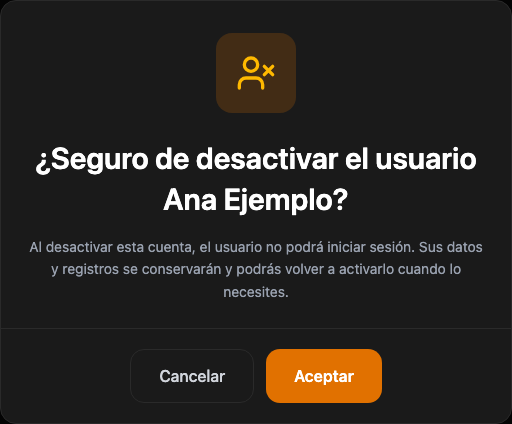

*Figura 2.5. Comprueba la identidad antes de aceptar; Cancelar mantiene el estado anterior.*

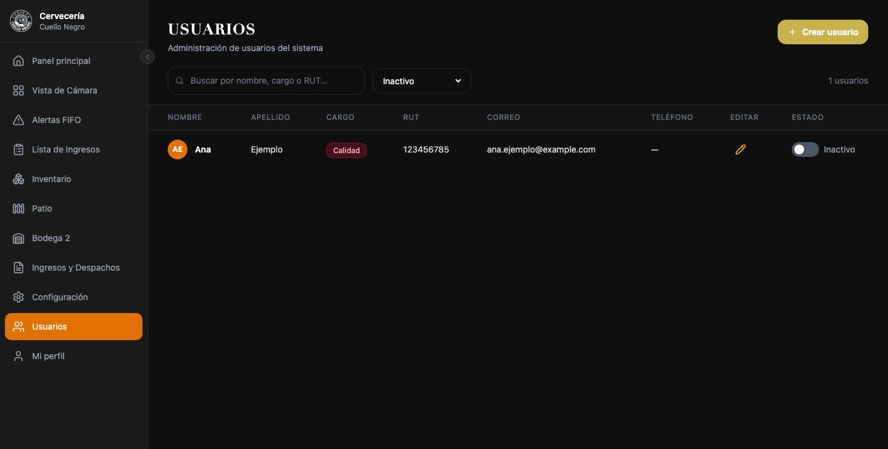

*Figura 2.6. El cargo Calidad se conserva al desactivar. La imagen ilustra el resultado con datos simulados.*

**Protecciones:** no puedes desactivar tu propia cuenta. Su fila no muestra el interruptor. Tampoco se permite desactivar al último Jefe de Planta activo ni cambiarle el cargo; debe permanecer al menos uno para administrar el sistema.

### 2.7. Reactivar una cuenta

1. En **Usuarios**, elige **Inactivo** o **Cualquiera** y busca a la persona.
2. Revisa su **Cargo** antes de devolverle acceso. Si ya no corresponde, corrígelo con el lápiz.
3. Pulsa el interruptor de la cuenta inactiva.
4. Lee **¿Seguro de activar el usuario…?** y pulsa **Aceptar**.
5. Selecciona **Activo** o **Cualquiera** y verifica que la cuenta aparece como Activa. Si mantenías Inactivo, dejará de verse porque ya no cumple el filtro.

**Resultado esperado:** la persona puede volver a iniciar sesión con su contraseña vigente y los accesos del cargo asignado. Reactivar no genera una contraseña nueva. Si no recuerda la anterior, utiliza **Nueva contraseña (opcional)** en la edición de su cuenta.

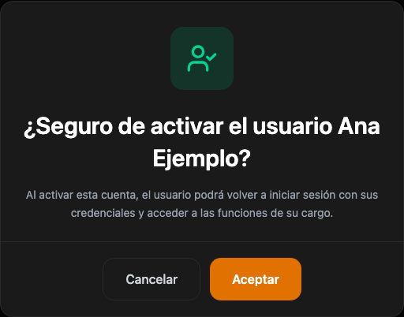

*Figura 2.7. La activación recupera el acceso con las credenciales y el cargo de la cuenta.*

### 2.8. Resolver problemas

| Situación o mensaje | Qué hacer |
|---|---|
| «Sin resultados» | Borra la búsqueda y selecciona Cualquiera. Comprueba el RUT sin puntos ni guion o busca por correo. No crees otra cuenta antes de descartar filtros. |
| El navegador pide completar un campo | Revisa los campos con asterisco y el formato del correo. |
| «Ingrese un RUT válido» | Revisa que incluya el cuerpo y dígito verificador, sin espacios. La validación de formato no reemplaza la comprobación del RUT de la persona. |
| «Ya existe un usuario con ese RUT» o «…con ese correo» | Busca la cuenta existente. Si está inactiva, evalúa reactivarla. Si el dato pertenece a otra persona, corrige el formulario. |
| «El tipo de usuario no está configurado en la base de datos» | Informa al responsable técnico del cargo seleccionado. No elijas un cargo más privilegiado para evitar el error. |
| «No puedes desactivar tu propia cuenta» | Solicita la gestión a otro Jefe de Planta activo. |
| «No se puede desactivar ni cambiar el cargo del último jefe de planta activo…» | Conserva esa cuenta y coordina que exista otro jefe activo y autorizado antes de repetir el cambio. |
| «Otro administrador está modificando usuarios. Vuelva a intentarlo» | Consulta nuevamente los datos actuales, coordina el cambio y repítelo si sigue siendo necesario. |
| «Solo el jefe de planta puede administrar usuarios» | Solicita revisar el rol y estado de tu cuenta; después de un cambio de cargo, cierra sesión y entra nuevamente. |
| «Inicie sesión nuevamente…» o «Token inválido o expirado» | Vuelve a iniciar sesión. Si recargar te deja sin menú, abre la dirección de acceso terminada en `/login`. |
| Error de carga, conexión o guardado | Comprueba la conexión. Vuelve a consultar la cuenta antes de reenviar para evitar duplicados o repetir una operación que sí se guardó. |
| «Usuario no encontrado» | Regresa a Usuarios y busca nuevamente la cuenta; no sigas usando una edición antigua. |
| La nueva contraseña no se acepta | En edición administrativa debe tener entre 8 y 72 caracteres. Si no quieres cambiarla, deja el campo vacío. |
| El cargo cambió pero la otra persona conserva el menú anterior | Pídele cerrar sesión y volver a entrar. No uses el selector visual Perfil como comprobación del cambio. |

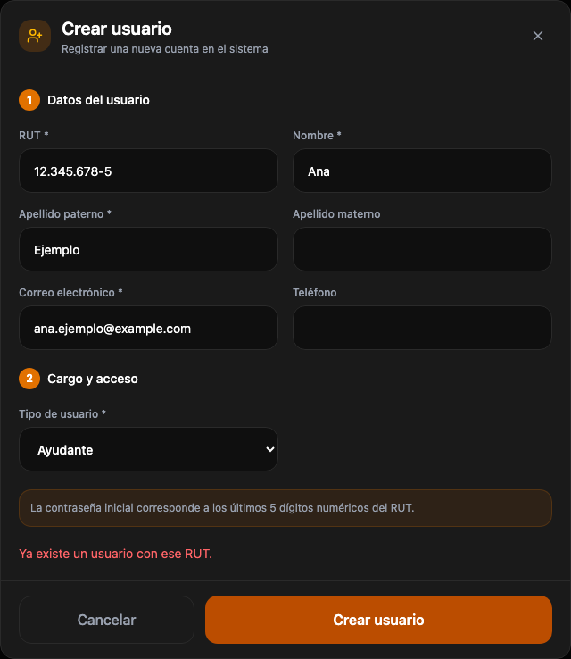

*Figura 2.8. Error ilustrado con una respuesta simulada que reproduce el mensaje del servidor. El formulario conserva los datos para corregirlos.*

Si necesitas soporte, indica la operación, el mensaje exacto y la hora aproximada. No envíes contraseñas. Antes de terminar, verifica el cargo y estado de cada cuenta modificada y [cierra sesión](#acceso).

---

**Control del documento:** pasos contrastados con la interfaz y el código disponibles el 29-09-2026. Las capturas usan respuestas simuladas; las comprobaciones y sus límites se detallan en [Validación de US-02](#validacion-us-02).

---

## 3. Registrar un ingreso de producción — US-04

Esta sección explica cómo registrar un pallet y comprobar que quedó guardado. Las capturas de este recorrido se tomaron en un entorno de prueba aislado.

### 3.1. Antes de comenzar

Inicia sesión con tu cuenta habitual y ten a mano el estilo de cerveza, el tipo de envase, el código de lote y la cantidad que vas a ingresar. No uses los datos de este ejemplo para registrar producción real.

El recorrido se comprobó con el perfil **Jefe de Planta**, que puede elegir otra ubicación. No se ha confirmado el acceso con un perfil Ayudante. Si tu cuenta no muestra las opciones necesarias, consulta al responsable de planta.

Usaremos el mismo ejemplo en toda la guía:

| Dato | Ejemplo ficticio |
|---|---|
| Estilo | Lager |
| ID de Lote | 26-904 |
| Cantidad (cajas) | 48 |
| Envase | Lata |
| Ubicación elegida | Fila C · Posición 3 · Nivel 1 |

La disponibilidad cambia con el inventario. C3 solo sirve para este ejemplo si está libre y habilitada.

**Resultado esperado:** puedes entrar a «Vista de Cámara» y reconocer el botón «Nuevo Ingreso» de la figura 3.1.

### 3.2. Abrir el formulario

1. En el menú lateral, entra a **Vista de Cámara**. En una pantalla pequeña el menú puede mostrar únicamente iconos; usa la flecha del borde para desplegarlo.
2. Pulsa **Nuevo Ingreso**.

**Resultado esperado:** aparece «Registrar Ingreso», con las opciones de estilo de cerveza. Las secciones siguientes se muestran a medida que eliges los datos; desplázate dentro del formulario para verlas.

*Figura 3.1. Acceso al registro desde Vista de Cámara. El menú está contraído.*

### 3.3. Completar los datos

1. En **¿Qué estilo vas a ingresar?**, elige el estilo real del pallet. Para el ejemplo, selecciona **Lager**.
2. Revisa **ID de Lote**. La aplicación propone un código automáticamente: reemplázalo por el código que corresponda a tu producción. En el ejemplo se usa **26-904**.
3. Ajusta **Cantidad (cajas)** con los botones **−** y **+**. El rango es **1 a 60**; al llegar a un extremo se deshabilita el botón correspondiente. Para el ejemplo, deja **48**.
4. Desplázate hasta **¿Qué tipo de envase vas a ingresar?** y selecciona **Lata** o **Barril**. Para el ejemplo, selecciona **Lata**.

**Resultado esperado:** quedan seleccionados el estilo y el envase, se muestran el lote y la cantidad correctos, y aparece la sección de ubicación.

> Si cambias el estilo después de completar los datos, vuelve a revisar el lote y la cantidad: la aplicación los reemplaza por nuevos valores sugeridos. La etiqueta de cantidad sigue diciendo «cajas» incluso al elegir Barril; consulta la unidad de registro con el responsable antes de ingresar barriles.

*Figura 3.2a. Datos del ejemplo. Continúa hacia abajo para elegir el envase.*

*Figura 3.2b. El envase elegido queda resaltado. Ambas capturas corresponden al mismo ejemplo.*

**Campos opcionales:** en este recorrido deja vacíos «Fotos del pallet» y «Nota de calidad». Aunque aparecen en el formulario, esta versión no guarda las fotos ni la nota al crear el ingreso. No los uses como respaldo de información.

### 3.4. Revisar la ubicación

1. Baja hasta **Ubicación sugerida** y lee la fila, posición y nivel indicados debajo del plano.
2. Si la sugerencia corresponde al lugar donde ubicarás el pallet, puedes conservarla.
3. Con el perfil **Jefe de Planta**, puedes pulsar **Elegir otra ubicación** y tocar una celda habilitada. Para reproducir el ejemplo, selecciona **C3** si está disponible.
4. Comprueba el resumen: **Fila C · Posición 3 · Nivel 1**. El título cambia a «Ubicación elegida» y la celda aparece marcada con **AQUÍ**.

Para **Lata**, el nivel es siempre 1. Para **Barril**, el formulario muestra botones de «Nivel de apilado»; revisa el nivel seleccionado antes de confirmar. No interpretes la selección como prueba de que se hayan realizado movimientos físicos de otros pallets.

Si todavía estás seleccionando, **Cancelar selección** sale de ese modo. Si ya elegiste una posición, **Volver a la sugerencia del sistema** recupera la propuesta automática.

**Resultado esperado:** el resumen identifica la ubicación donde quedará registrado el pallet. No necesitas buscar ni escribir el ID numérico de la bodega.

*Figura 3.3. Ubicación manual del ejemplo y botón de confirmación.*

### 3.5. Confirmar y verificar el ingreso

1. Revisa una última vez estilo, lote, cantidad, envase y ubicación.
2. Pulsa **Confirmar Ingreso** una sola vez. Mientras se procesa, el botón muestra **Guardando...**.
3. Cuando el formulario se cierre, busca el código del lote en la cámara. En el ejemplo, **26-904** aparece en la zona de latas, C3.
4. Toca el pallet para abrir **Detalles del Lote**. Comprueba **Lager**, **48 cajas**, **Lata** y el estado **En Cámara**.
5. Para verificar que quedó guardado, recarga la página y busca nuevamente el lote. En esta versión puede desaparecer el menú o dejar de abrirse el detalle tras recargar: vuelve a la pantalla de inicio de sesión, ingresa de nuevo y entra a «Vista de Cámara». **No registres el pallet otra vez.**

**Resultado esperado:** el pallet continúa visible después de recargar. El ejemplo 26-904 se guardó y permaneció visible durante la prueba.

*Figura 3.4. Registro exitoso: lote 26-904, Lager, 48 cajas, Lata y estado En Cámara.*

El formulario usa automáticamente la fecha del momento del ingreso; no permite elegir una fecha de envasado. En la versión probada se observó una diferencia de fecha al mostrar el detalle. Si necesitas registrar una producción de otra fecha o la fecha visible no corresponde, informa al responsable antes de continuar; no tomes el indicador de tiempo del ejemplo como referencia para tu producción.

### 3.6. Si algo no funciona

| Lo que ves | Qué hacer | Resultado esperado |
|---|---|---|
| «Confirmar Ingreso» está deshabilitado | Selecciona estilo y envase y comprueba que exista una ubicación disponible. Revisa también el lote y la cantidad antes de enviar. | El botón se habilita cuando están completas las selecciones necesarias. |
| No puedes bajar de 1 o subir de 60 | Es el límite de «Cantidad (cajas)». Revisa cómo dividir el ingreso con el responsable si tu producción supera ese rango. | La cantidad permanece dentro del rango permitido. |
| «Cámara llena» | No hay una posición compatible disponible para la selección actual. Consulta al responsable para revisar disponibilidad y movimientos reales. | Continúas cuando exista una ubicación adecuada; no cambies el envase para forzar el ingreso. |
| Error al guardar | Revisa los datos y comprueba primero si el lote ya aparece en la cámara. Un lote repetido también puede causar un error. | Evitas repetir un ingreso que ya se haya guardado. |
| El envío demora o no sabes si terminó | Espera y verifica el lote antes de volver a confirmar. Si persiste el problema, informa el código de lote y el mensaje que aparece. | El responsable puede revisar el caso sin duplicar el registro. |
| No aparece «Elegir otra ubicación» | Esa opción está disponible para Jefe de Planta. Consulta a ese perfil si necesitas cambiar la propuesta. | Se revisa la ubicación con el perfil adecuado. |
| Al recargar desaparece el menú o no abre «Nuevo Ingreso» | Vuelve a iniciar sesión y entra desde el menú a «Vista de Cámara». | Recuperas los controles de la sesión; los ingresos guardados permanecen. |

*Figura 3.5. Validación visible al abrir el formulario: todavía no hay un estilo seleccionado.*

Para salir sin registrar, pulsa **Cancelar** antes de confirmar. Si ya confirmaste, cerrar el formulario no elimina el ingreso.

---

**Control del documento:** se verificaron el acceso con Jefe de Planta, las selecciones, la ubicación manual, el guardado y la persistencia tras recargar en un entorno aislado. La revisión de comprensión por un compañero sigue pendiente; su pauta está en el anexo [Validación del manual US-04](#validacion-us-04).

---

## 4. Gemelo Digital 2D — Bodega 1 — US-09

El gemelo digital es el mapa interactivo de Bodega 1. Permite consultar los pallets registrados en cámara, distinguir variedades, reconocer niveles de apilado y abrir el detalle de un lote.

### 4.1. Entrar a Bodega 1

1. Inicia sesión siguiendo el [capítulo de acceso](#acceso).
2. En el menú lateral, selecciona **Vista de Cámara**.
3. Espera a que cargue **Distribución de Cámara de Frío** y revisa el resumen de ocupación.

La vista identifica automáticamente la cámara principal. No necesitas escribir el número de bodega ni cambiar la dirección después de una carga de datos.

El recorrido se comprobó con **Jefe de Planta** y **Calidad**. En esta versión, Calidad utiliza el perfil de interfaz **Operario**. Ambos pueden consultar la grilla y abrir detalles; el botón **Reorganizar** aparece para Jefe de Planta.

**Resultado esperado:** ves el mapa con Zona Latas, Zona Extra y Zona Barriles, como en la figura 4.1.

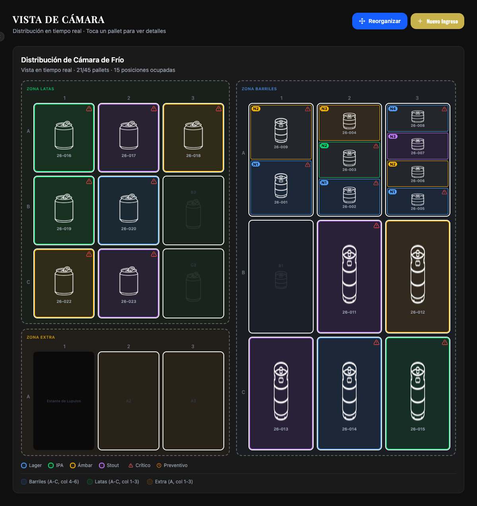

*Figura 4.1. Vista de Cámara con datos de ejemplo. Las cantidades y alertas pueden cambiar según el inventario y la hora de consulta.*

### 4.2. Leer la ocupación y las zonas

En el encabezado, **21/45 pallets** significa que se muestran 21 pallets en cámara frente a una capacidad de referencia de 45. Si aparece además **15 posiciones ocupadas**, varias de esas posiciones contienen más de un pallet apilado. Los números de este ejemplo no son valores que deban repetirse en tu bodega.

La grilla muestra solo pallets en estado **En Cámara**. Un pallet **En Camión**, despachado o en otra ubicación no aparece como ocupación de esta cámara. Una celda sin pallet visible no demuestra por sí sola que el espacio físico esté disponible: contrasta la información con la operación real.

| Zona visible | Cómo reconocerla |
|---|---|
| Zona Latas | Filas A, B y C; posiciones 1, 2 y 3. Los pallets se muestran con el dibujo de una lata. |
| Zona Barriles | Filas A, B y C, con niveles N1, N2, etc. cuando hay varios pallets. El encabezado visual numera sus tres columnas como 1, 2 y 3, mientras la leyenda general las identifica como 4, 5 y 6. |
| Zona Extra | Sector separado con posiciones A2 y A3 y el **Estante de Lupulos**, que está bloqueado para ingresar pallets. No confundas estos rótulos con A2 y A3 de Zona Latas. |

Para identificar una posición, menciona **zona, fila, columna visible y nivel**. Por ejemplo: «Zona Barriles, fila A, segunda columna, N2». Esa segunda columna corresponde a la columna general 5. Verifica también el código de lote antes de actuar.

**Resultado esperado:** distingues cantidad de pallets de posiciones ocupadas y reconoces el sector correcto en la figura 4.1.

### 4.3. Interpretar colores y niveles

| Señal | Significado |
|---|---|
| Azul | Lager |
| Verde | IPA |
| Ámbar o amarillo | Ámbar |
| Morado | Stout |
| Triángulo rojo | Alerta **Crítico** |
| Reloj naranja | Alerta **Preventivo** |
| N1, N2, N3, N4 | Nivel del pallet dentro de una posición apilada; N1 es la base. |

El **color identifica la variedad**; el **icono indica una alerta**. No interpretes verde como una autorización para mover o despachar: también es el color de IPA. Confirma el estilo y el estado abriendo el detalle.

En una torre, cada nivel visible tiene su propio lote y puede tener una variedad o alerta diferente. Toca el nivel que quieres consultar, no solo la posición completa. Las posiciones no tienen necesariamente la misma cantidad de niveles disponibles.

**Resultado esperado:** localizas un pallet por lote y nivel utilizando el mapa y la leyenda de la figura 4.1.

### 4.4. Consultar el detalle de un pallet

1. En modo de consulta normal, toca un pallet ocupado. Si hay varios apilados, toca directamente el nivel deseado.
2. Se abre el panel **Detalles del Lote**.
3. Revisa **ID Lote**, **Estilo**, **Cantidad**, **Estado**, **Envase** y **Fecha de Envasado**. En la parte superior aparece el indicador de alerta y tiempo restante.
4. Cierra el panel con la **X** de su esquina superior para volver al mapa.

En el ejemplo se toca **N2** de la segunda columna de Zona Barriles, fila A: se abre el lote **26-003**, de estilo **IPA**, con **48 cajas**, envase **Barril** y estado **En Cámara**.

**Resultado esperado:** el código del panel coincide con el pallet que tocaste. Consultar y cerrar el detalle no cambia su ubicación ni su estado.

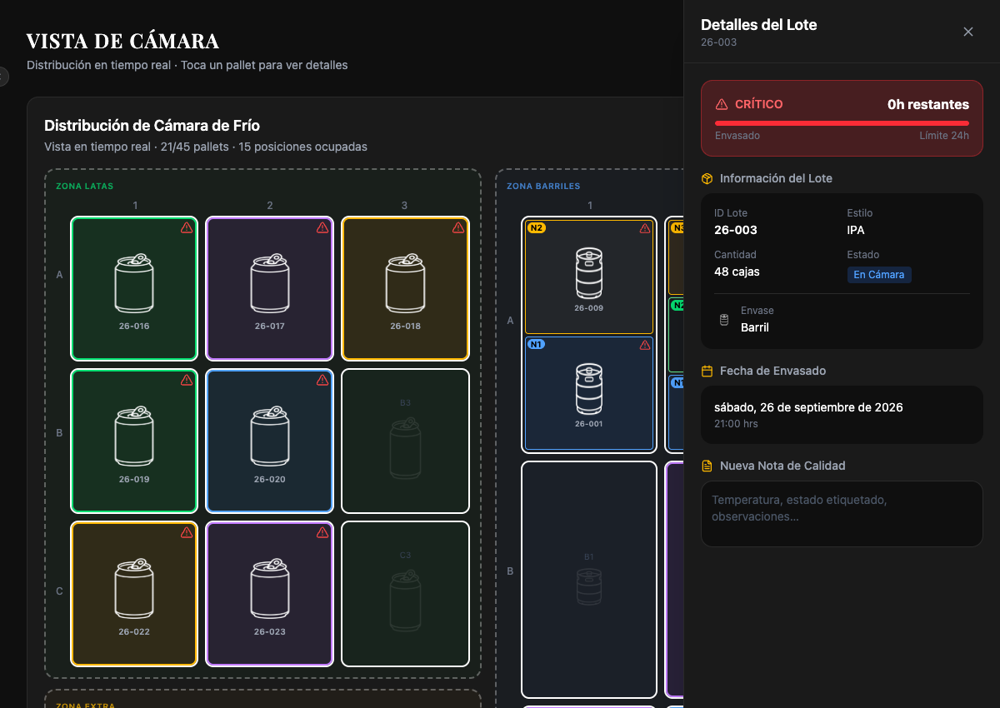

*Figura 4.2. Consulta de un nivel específico de la torre. La fecha y la alerta son datos mostrados por la versión probada; su cálculo tiene las limitaciones indicadas en el anexo.*

El detalle también puede mostrar acciones como **Registrar Despacho** o un campo de nota. No necesitas usarlos para consultar el lote. Si quieres registrar un pallet nuevo, sigue el [capítulo de ingresos](#ingresos).

### 4.5. Consultar con Calidad y actualizar la información

Con una cuenta de Calidad, abre **Vista de Cámara** y toca el pallet del mismo modo. No necesitas cambiar el selector de perfil para consultar los datos.

Aunque la pantalla dice «Vista en tiempo real», no uses esa frase como garantía de actualización instantánea. Si acabas de registrar una operación y no ves el resultado esperado, vuelve a consultar la vista. Si recargas la página y desaparecen el menú o los paneles, vuelve a iniciar sesión como se explica en [problemas de acceso](#acceso).

**Resultado esperado:** Calidad puede leer la ocupación y los detalles sin entrar en modo de reorganización.

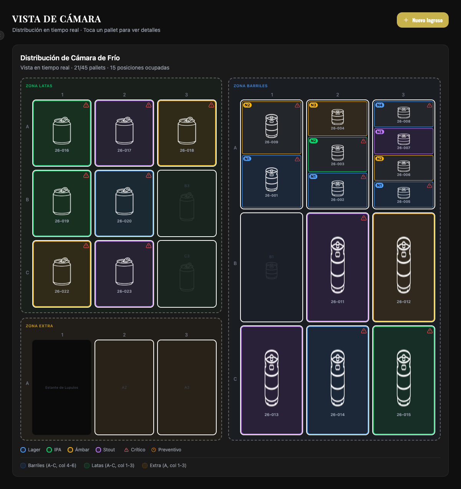

*Figura 4.3. Mapa disponible para Calidad; no aparece el botón Reorganizar.*

### 4.6. Si algo no coincide

| Situación | Qué hacer |
|---|---|
| No aparece un lote | Comprueba su estado y ubicación. Esta grilla muestra solo lo registrado En Cámara en Bodega 1. |
| El mapa aparece vacío o con cero pallets inesperadamente | Espera la carga y vuelve a consultar. Si continúa, informa al responsable: esta versión puede mostrar una grilla vacía cuando falla la consulta. No concluyas que la bodega está vacía. |
| Al tocar el pallet se selecciona para moverlo | Estás en **Reorganizar**. Sal de ese modo antes de consultar. Si aparecen cambios pendientes que no deseas conservar, **Cancelar** en «¿Desea guardar los cambios?» los descarta y sale; no mantiene los movimientos pendientes. |
| El detalle no abre después de recargar | Vuelve a iniciar sesión y entra a la vista desde el menú. |
| El número de columna no coincide con otra pantalla | Identifica zona, fila, columna y lote. En Barriles, las columnas visibles 1–3 corresponden a las generales 4–6. |
| No reconoces un Petainer | No te guíes solo por la imagen: la versión actual no distingue su dibujo del de un barril. Consulta el texto de Envase y confirma con el responsable. |
| La fecha o la alerta parece incorrecta | Informa al responsable y contrasta la fecha del lote antes de tomar decisiones. No modifiques el inventario solo para hacer coincidir el indicador. |

**Reorganización:** este capítulo cubre la consulta del mapa. El guardado de movimientos no se ha validado en esta versión; una previsualización no confirma que se haya guardado una nueva ubicación.

---

## 5. Despachar uno o varios pallets — US-18

Este capítulo explica cómo registrar la salida de pallets de **Lata** y **Barril**, revisar la prioridad de salida y comprobar la actualización de la cámara. Corresponde a [US-18 — Despacho de pallets (1 y varios) (5 SP)](https://trello.com/c/3jhBa3jN), dirigida al **Personal de Reparto** y al **Jefe de Planta**.

### 5.1. Antes de comenzar

Inicia sesión con tu cuenta activa siguiendo el [capítulo de acceso](#acceso). Confirma qué pallets saldrán y ten a mano el camión, cliente o pedido de destino. Comprueba el lote, envase, cantidad y ubicación física antes de registrar la salida.

**Se despacha el pallet completo:** estos formularios no permiten indicar una cantidad parcial de cajas o barriles. Si necesitas dividirlo o enviar pallets a distintos destinos, coordina el procedimiento con el responsable. Cada despacho múltiple utiliza un único destino para todos sus pallets.

> **Estado de salida en esta versión:** el sistema registra **En Camión**, libera la ubicación de cámara y conserva el registro del pallet. No equivale a confirmar entrega al cliente. Aunque la historia solicita `DESPACHADO`, la implementación actual guarda `EN_CAMION`; no busques un cambio automático a Entregado o Despachado.

Las capturas se tomaron de la interfaz local con **datos ficticios y respuestas simuladas**, sin modificar inventario real. El recorrido visual se realizó con Jefe de Planta. Las opciones del Personal de Reparto se contrastaron en código; no se certificó un despacho real con ese perfil.

Utilizaremos estos pallets de demostración, todos inicialmente **En Cámara**:

| Lote | Estilo | Envase | Cantidad mostrada | Posición inicial | Uso en el ejemplo |
|---|---|---|---:|---|---|
| 26-901 | Lager | Lata | 48 | A1 · Nivel 1 | Despacho individual a Pedido DEMO-18 · Ruta Sur. |
| 26-902 | Lager | Lata | 36 | A2 · Nivel 1 | Despacho múltiple a Pedido DEMO-19 · Ruta Norte. |
| 26-903 | Lager | Lata | 48 | A3 · Nivel 1 | Despacho múltiple; existen Lager más antiguos. |
| 26-904 | IPA | Barril | 12 | A4 · Nivel 1 | Despacho múltiple junto con las latas. |
| 26-905 | Stout | Barril | 12 | A4 · Nivel 2 | Permanece en cámara; permite ilustrar la actualización de niveles. |

Las posiciones A4 de los formularios corresponden a la primera columna visible de Zona Barriles; consulta la explicación de zonas del [mapa de Bodega 1](#bodega-1). La interfaz individual y el historial usan la etiqueta «cajas» también para Barril: confirma la unidad operativa con el responsable y no conviertas cantidades por tu cuenta.

**Resultado esperado:** reconoces los pallets autorizados para la salida y su destino. Los códigos, fechas y cantidades de las imágenes solo sirven para explicar el procedimiento.

### 5.2. Localizar pallets y revisar la prioridad

1. En el menú lateral, selecciona **Alertas FIFO**. Si el menú muestra solo iconos, despliega sus nombres con la flecha del borde.
2. Revisa las pestañas **Todos**, **Crítico**, **Preventivo** y **Óptimo**. Para preparar una salida con varios pallets, comienza en **Todos**.
3. Identifica cada tarjeta por su **lote**, **estilo**, **posición**, **fecha de envasado** y estado **En Cámara**. Desplázate hacia abajo para ver todos los registros.
4. Si necesitas comprobar su ubicación, pulsa **Ver en Cámara** y consulta el detalle del pallet. En una torre verifica también el nivel.

**Resultado esperado:** encuentras el pallet correcto y reconoces si hay otros que deberían salir primero. Alertas FIFO muestra únicamente los pallets En Cámara; un pallet ya retirado de esta cámara no debe volver a seleccionarse para la misma salida.

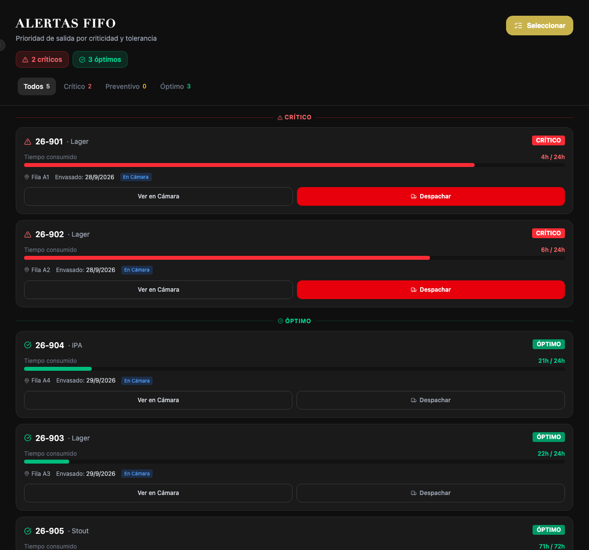

*Figura 5.1. Inicio del ejemplo con cinco pallets. Parte del listado queda más abajo; desplázate para verlo completo.*

**Cómo interpretar la prioridad:** FIFO significa dar salida primero a lo más antiguo; FEFO, a lo que vence primero. Alertas FIFO ordena por horas restantes calculadas por la aplicación. Además, al despachar, avisa si quedan pallets del mismo estilo con fecha de envasado anterior. Los indicadores dependen de las fechas y límites de esta versión: contrástalos con la información real del lote. Un color Óptimo no sustituye esa comprobación y un aviso Crítico no es una autorización de despacho.

También puedes abrir el despacho individual desde **Inventario**: busca el lote, filtra **En Cámara** y utiliza **Por Vencimiento** o **Por Fecha** para revisar el orden. En computador, pasa el puntero por la fila y pulsa el icono del camión **Despachar**; en móvil aparece un botón con ese nombre. Otra entrada es **Vista de Cámara → pallet → Registrar Despacho**. Las tres entradas abren el mismo formulario individual.

### 5.3. Despachar un pallet

1. En **Alertas FIFO**, pulsa **Despachar** en la tarjeta del lote que corresponda.
2. Se abre **Registrar Despacho**, con el subtítulo **Salida de pallet hacia camión**.
3. Revisa el lote, estilo, cantidad, posición y fecha de envasado. Este formulario no permite cambiarlos. Si elegiste otro pallet, pulsa **Cancelar** y vuelve a seleccionarlo.
4. Completa **Destino / Pedido**, obligatorio, con el camión, cliente o pedido. Admite hasta **150 caracteres**; un campo vacío o compuesto solo por espacios no habilita el envío.
5. Para el despacho individual del ejemplo, selecciona **26-901** y escribe **Pedido DEMO-18 · Ruta Sur**.
6. Pulsa **Confirmar Despacho** una sola vez. Si aparece una advertencia FIFO, sigue la sección siguiente. Durante el guardado se muestra **Guardando…** y no se permite cerrar el formulario.
7. Espera a que cierre el formulario y aparezca la notificación **Despacho registrado**. Comprueba que el pallet deja de estar disponible en Alertas FIFO y realiza las verificaciones de la [sección de resultados](#resultado-despacho).

**Resultado esperado:** se registra una salida del pallet completo con su destino. No vuelvas a enviarla si la confirmación demora: consulta primero el resultado.

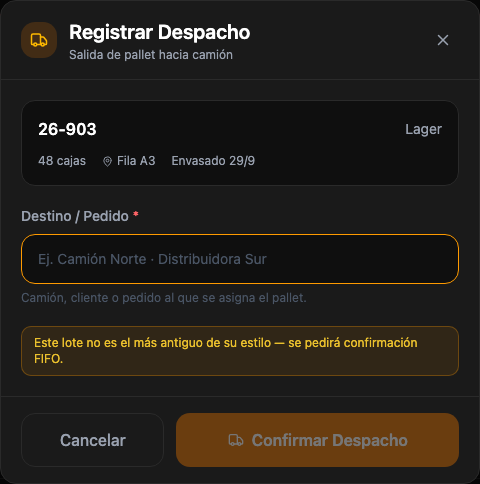

*Figura 5.2. Ejemplo con 26-903: Confirmar Despacho está deshabilitado y se anticipa una advertencia FIFO. Abrir el formulario no registra ninguna salida.*

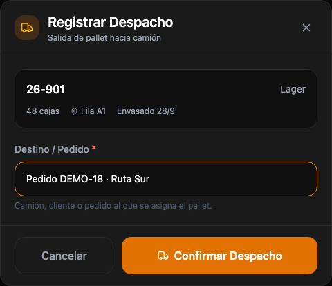

*Figura 5.3. Ejemplo individual que respeta el orden de antigüedad de los Lager.*

### 5.4. Atender una advertencia FIFO individual

Si intentas despachar un pallet y quedan otros más antiguos del **mismo estilo** en cámara, aparece **Despacho fuera de orden FIFO**. Por ejemplo, al elegir 26-903 antes de despachar los otros Lager, se muestran 26-901 y 26-902.

1. Lee la lista de lotes anteriores y la **Sugerencia FIFO**.
2. Para respetar el orden, pulsa **Cancelar** en la advertencia. Esto vuelve al formulario individual; no registra el despacho.
3. Pulsa **Cancelar** en el formulario para regresar al listado y selecciona el lote sugerido. En el ejemplo, **26-901**.
4. Si la operación requiere una excepción, revísala con el responsable antes de utilizar **Despachar de todos modos**. Ese botón envía el despacho del pallet elegido; no cambia automáticamente la selección al lote sugerido.

**Resultado esperado:** priorizas el lote anterior o continúas conscientemente con una excepción acordada. La pantalla actual no pide un motivo escrito; no interpretes el botón como registro de una justificación o aprobación formal.

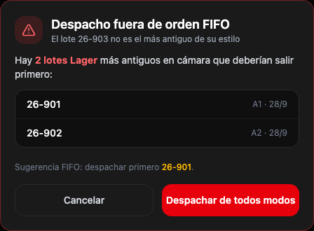

*Figura 5.4. Se recomienda 26-901 antes de 26-903. Cancelar permite revisar la selección sin despachar.*

### 5.5. Seleccionar varios pallets

1. En **Alertas FIFO**, elige **Todos** y pulsa **Seleccionar**, arriba a la derecha.
2. Marca las casillas de los pallets que compartirán destino. Puedes combinar **Lata** y **Barril**.
3. Revisa el número del botón inferior **Despachar N**. Puedes desmarcar una casilla para retirar ese pallet; con cero seleccionados, el botón permanece deshabilitado.
4. Antes de continuar, revisa todas las selecciones. Cambiar de pestaña de prioridad no borra las casillas marcadas en las otras pestañas.
5. Pulsa **Despachar N** para abrir el resumen. Esto todavía no guarda la salida.

**Resultado esperado:** el resumen contiene exactamente los pallets que quieres enviar. No confundas **lotes** con **pallets**: puede haber varios pallets del mismo lote. El encabezado cuenta lotes distintos y el subtítulo indica el total de pallets seleccionados.

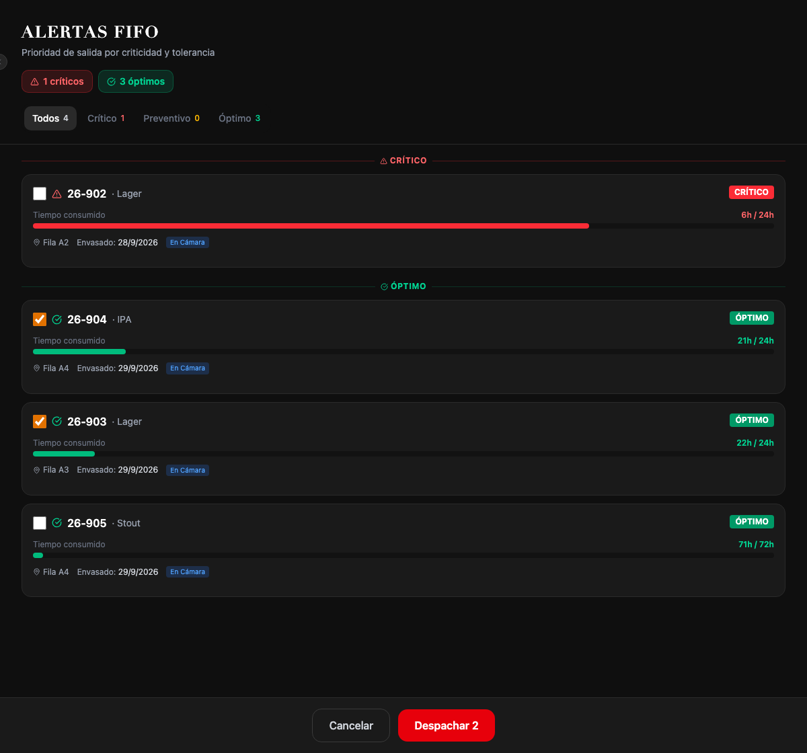

*Figura 5.5. 26-903 y 26-904 seleccionados. Esta selección deja fuera al Lager 26-902 y generará una advertencia.*

**Cancelar la selección:** pulsa **Cancelar** en la barra inferior. Saldrás del modo de selección y se quitarán todas las marcas. No se registra ninguna salida.

### 5.6. Revisar y confirmar el despacho múltiple

1. En **¿Seguro que quieres despachar…?**, revisa cada tarjeta: **lote, estilo, Pallet #, envase, cantidad, fila, nivel, fecha de envasado, tiempo restante y estado**. Desplázate dentro del cuadro si no ves todos los datos.
2. Completa **Destino / Pedido**. Es obligatorio, admite hasta 150 caracteres y se aplicará a todos los pallets de ese envío. Para el ejemplo múltiple, utiliza **Pedido DEMO-19 · Ruta Norte**.
3. Si aparece **Hay lotes más antiguos del mismo estilo sin seleccionar…**, revisa la selección. Para incluir los anteriores, pulsa **Cancelar**: el cuadro se cierra y se borran las marcas; vuelve a **Seleccionar** y elige los pallets correctos.
4. En el ejemplo, tras despachar 26-901 individualmente, selecciona **26-902, 26-903 y 26-904**. Así incluyes los dos Lager pendientes y el pallet de barriles IPA, sin omitir un Lager anterior.
5. Si existe una excepción acordada para dejar pallets anteriores, la casilla del aviso permite reconocerla. Sin marcarla, **Confirmar despacho** queda deshabilitado. No la marques simplemente para saltarte la revisión.
6. Pulsa **Confirmar despacho** una sola vez y espera **Guardando…**. Al terminar se cierra el cuadro, se limpia la selección y aparece una notificación con el número de pallets despachados y el destino.

**Resultado esperado:** todos los pallets seleccionados salen de la disponibilidad de cámara en la misma operación. El servidor valida el grupo completo antes de guardar: si alguno ya no está disponible, rechaza el despacho y no guarda salidas parciales de ese envío.

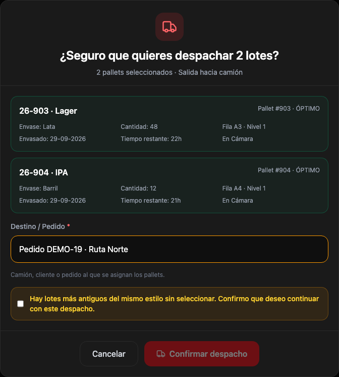

*Figura 5.6. La casilla sin marcar mantiene deshabilitada la confirmación aunque el destino esté completo.*

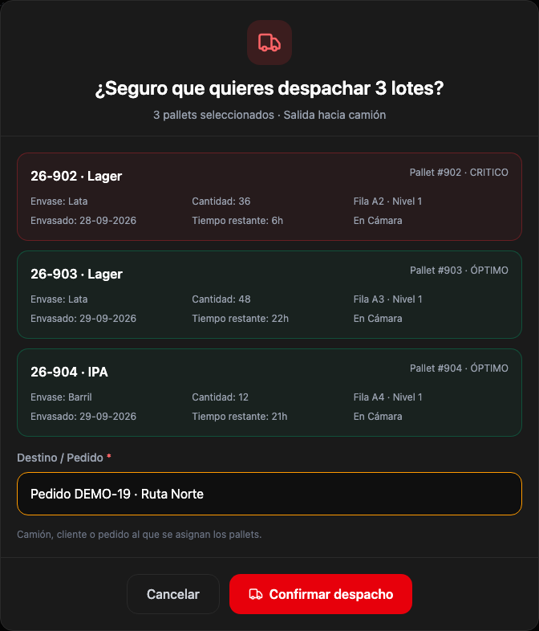

*Figura 5.7. Selección corregida: 26-902, 26-903 y 26-904. Las cantidades corresponden a pallets completos.*

### 5.7. Verificar la salida, el espacio y el historial

1. En **Alertas FIFO**, comprueba que los pallets enviados ya no aparecen entre los disponibles.
2. En **Vista de Cámara**, verifica que las posiciones de latas retiradas quedan sin esos pallets. Si salieron pallets de una torre de barriles, los restantes se muestran en niveles consecutivos. La actualización del mapa no demuestra por sí sola que se hayan realizado los movimientos físicos.
3. En el ejemplo completo se despacharon cuatro pallets: 26-901 individualmente y 26-902, 26-903 y 26-904 en grupo. Solo permanece **26-905** en cámara, ahora en el nivel 1 de su posición de barriles. La ocupación del ejemplo queda en **1/45 pallets**.
4. Si eres **Jefe de Planta**, entra a **Ingresos y Despachos**, selecciona la fecha de la operación y pulsa **Despachos**. Comprueba lote, cantidad mostrada, destino, hora y usuario responsable. En un envío de varios pallets aparece un registro por cada pallet.
5. Si eres **Personal de Reparto** y no ves ese historial, solicita la comprobación al Jefe de Planta. Esa opción del menú está reservada a dicho perfil.
6. Para comprobar persistencia, vuelve a consultar la cámara y el historial. Si recargar deja la aplicación sin menú, entra de nuevo desde `/login`. **No repitas el despacho solo para comprobarlo.**

**Resultado esperado:** el mapa y el historial son coherentes con las salidas realizadas. La disponibilidad de cámara disminuye por los pallets retirados; esto no equivale a poner su cantidad en cero ni a borrar sus registros.

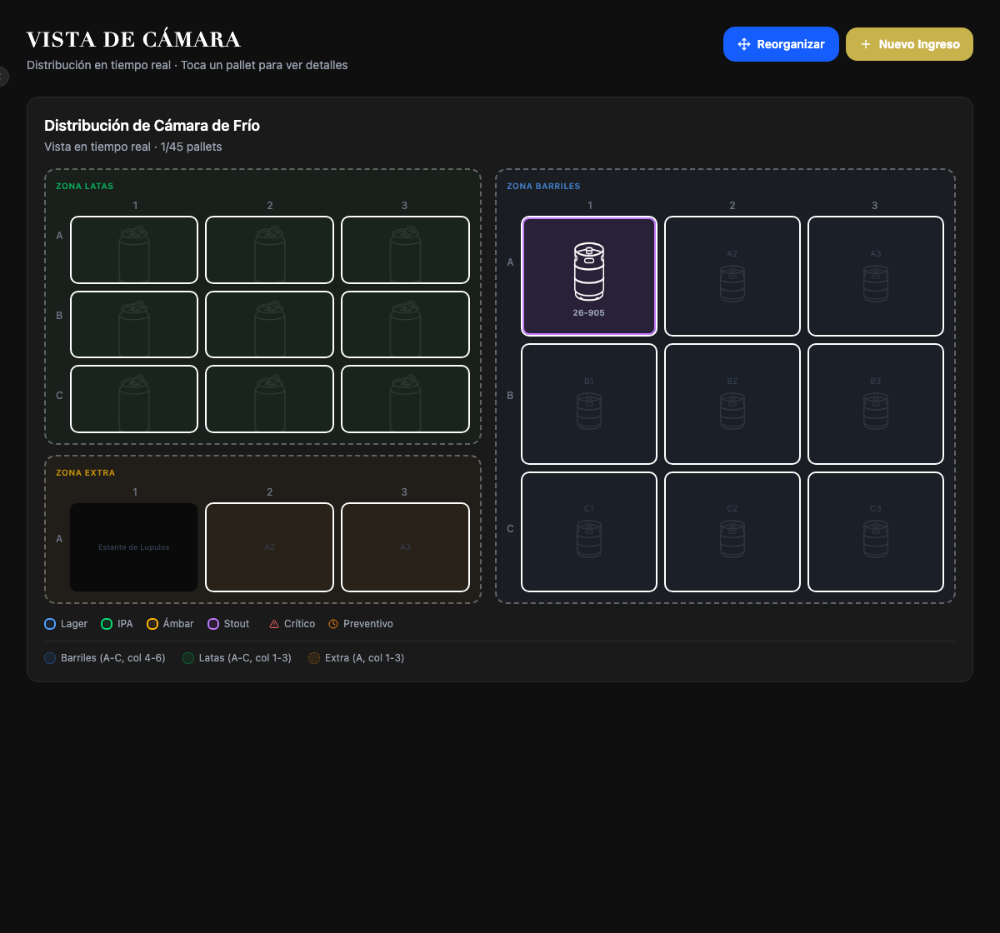

*Figura 5.8. Resultado ilustrativo con respuestas simuladas: posiciones de lata libres y 26-905 como único pallet restante.*

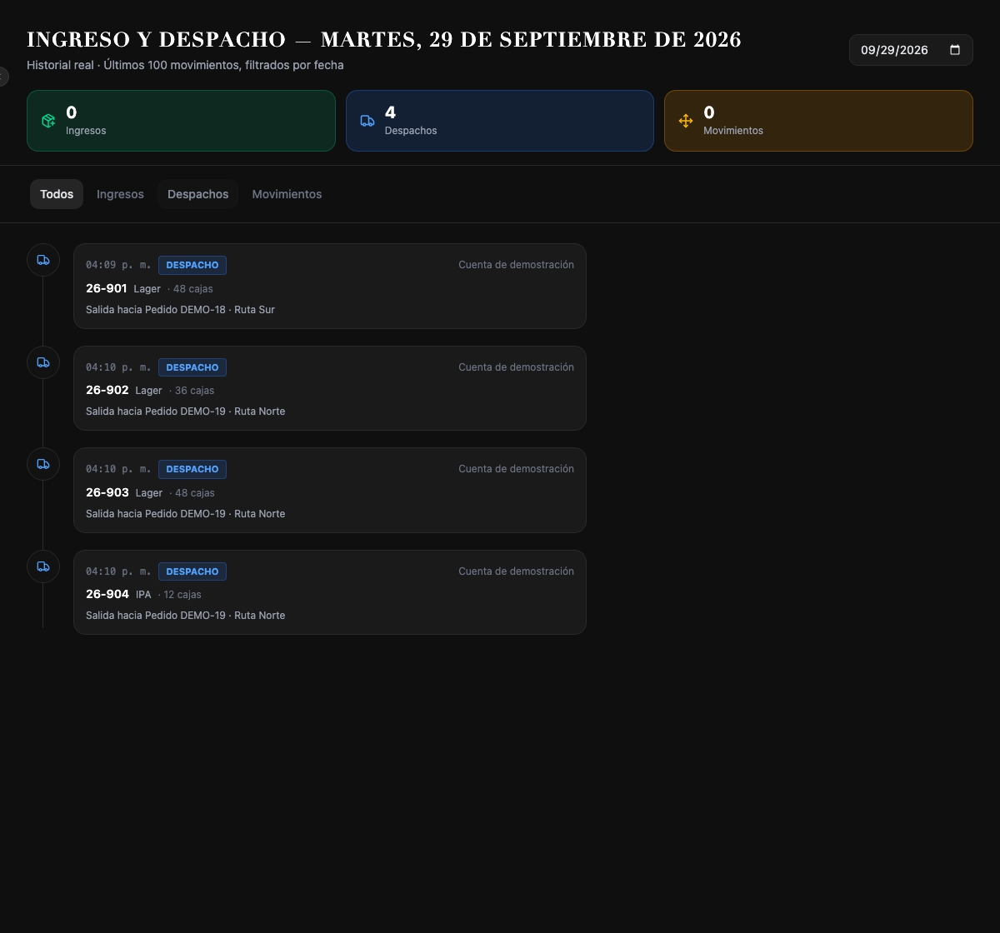

*Figura 5.9. Registros ficticios de una salida individual y una múltiple, filtrados por Despachos. El texto «Historial real» es una etiqueta de la aplicación; esta captura utiliza datos simulados.*

**Límites de la consulta:** el historial presenta los últimos 100 movimientos, filtrados por fecha; la ausencia de un registro antiguo no prueba que nunca se despachó. Inventario utiliza los datos de la cámara y un pallet cuya posición fue liberada puede dejar de aparecer allí, incluso al elegir En Camión. Usa el historial para verificar la salida y no tomes un contador En Tránsito en cero como prueba de que no hubo despachos.

### 5.8. Resolver problemas y cancelar

| Situación o mensaje | Qué hacer | Resultado esperado |
|---|---|---|
| Confirmar Despacho está deshabilitado | Completa Destino / Pedido con texto, no solo espacios. En el envío múltiple, revisa también la selección y el aviso FIFO. | El botón se habilita cuando se cumplen los requisitos. |
| No aparece Seleccionar | Comprueba que estás en Alertas FIFO y fuera del modo de selección. | Encuentras el acceso al despacho múltiple. |
| Seleccionar está deshabilitado o no hay tarjetas | Revisa la pestaña Todos y la carga de datos; no asumas que la cámara está vacía ante un problema de conexión. | Distingues falta de pallets disponibles de un fallo de consulta. |
| El resumen incluye más pallets de los visibles | Cambia a Todos y revisa las marcas; las selecciones persisten al cambiar de pestaña. Puedes cancelar y seleccionarlos nuevamente. | Envías únicamente los pallets correctos. |
| «Uno de los pallets seleccionados ya salió o no está en cámara… No se despachó ningún pallet» | Cancela el cuadro, actualiza la consulta y vuelve a seleccionar los disponibles. Otra operación puede haber cambiado el inventario. | El envío rechazado no genera salidas parciales. |
| «La cámara cambió durante la operación. Actualiza los datos y vuelve a intentarlo» | Consulta nuevamente los pallets y el historial antes de repetir. | Trabajas con el estado vigente y evitas duplicados. |
| «Indica un pallet válido y un destino de hasta 150 caracteres» o «Selecciona pallets distintos…» | Revisa el destino y vuelve a seleccionar desde el listado actual. El límite del envío múltiple es de 200 pallets. | Corriges los datos o divides la operación con el responsable. |
| «La cuenta no está activa» o token inválido/expirado | Inicia sesión nuevamente si corresponde; si la cuenta está inactiva, solicita revisión al responsable. | Recuperas el acceso con tu propia cuenta autorizada. |
| «No se encontró la cámara principal» o nivel no configurado | Informa al responsable técnico; no cambies posiciones físicas para evitar el mensaje. | Se revisa la configuración antes de continuar. |
| Error de conexión, guardado o espera prolongada | Comprueba cámara e historial antes de reenviar. Si no puedes confirmar el resultado, comunica lotes, destino, hora y mensaje al responsable. | Evitas registrar dos veces una salida dudosa. |
| La cantidad dice «cajas» para Barril o la fecha parece incorrecta | Contrasta la unidad y fecha con el lote real y solicita revisión. | No tomas decisiones basándote únicamente en esa etiqueta o alerta. |

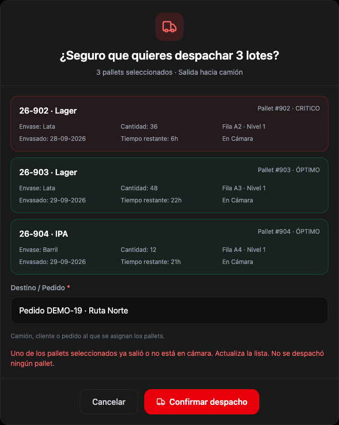

*Figura 5.10. Mensaje simulado que reproduce el rechazo del servidor. Cancela y consulta el estado vigente antes de preparar otro envío.*

Antes de enviar, **Cancelar** cierra el formulario individual; en el múltiple también borra la selección. Cancelar la advertencia FIFO individual solo vuelve al formulario. **Después de guardar, Cancelar no deshace el despacho**: no hay una acción de reversión en estos formularios. Si registraste una salida incorrecta, comunica el caso al responsable y evita crear un ingreso duplicado para compensarla.

---

**Control del documento:** procedimientos contrastados con la interfaz y el código del 29-09-2026. Las diez capturas usan respuestas simuladas. Las pruebas de lógica, las diferencias con la historia y la revisión de comprensión pendiente se detallan en [Validación de US-18](#validacion-us-18).

---

## 6. Alertas de prioridad de salida y vencimiento — US-21

Este capítulo explica cómo consultar la prioridad de salida de los lotes para despachar a tiempo y en el orden correcto. Corresponde a **US-21 — Alertas FEFO/FIFO y de vencimiento (5 SP)** y sirve a cualquier perfil que supervise la cámara.

### 6.1. Antes de comenzar

Inicia sesión con tu cuenta activa siguiendo el [capítulo de acceso](#acceso). La alerta se calcula automáticamente: no necesitas registrar nada para verla. Las capturas usan datos de ejemplo; las horas, los colores y las fechas cambian con el inventario y el momento de la consulta, así que no tomes los valores de las imágenes como referencia de tu operación.

**Qué significan los criterios:** *FIFO* («primero en entrar, primero en salir») prioriza el lote más antiguo; *FEFO* («primero en vencer, primero en salir») prioriza el que vence antes. Como la vida útil es fija por estilo, dentro de un mismo estilo ambos criterios coinciden.

> **Alcance de esta versión.** El requisito define dos alertas distintas: **Fuera de frío** (pallets en el patio) y **Vencimiento** (pallets en la cámara), cada una con umbrales configurables. En la versión actual, la pantalla de alertas aplica **un solo cálculo**: el tiempo transcurrido desde la **fecha de envasado** frente al **límite de horas del estilo**, y todavía no separa ambas alertas (es una funcionalidad parcial). Por eso un mismo lote puede mostrarse con una criticidad distinta en esta pantalla y en la Lista de ingresos: contrasta siempre con la fecha real del lote antes de decidir.

**Resultado esperado:** puedes entrar al **Panel principal** y a **Alertas FIFO** desde el menú lateral.

### 6.2. Ver el resumen en el Panel principal

1. En el menú lateral, entra a **Panel principal**.
2. En la fila superior de tarjetas, localiza **Alertas Críticas FIFO**: muestra cuántos lotes requieren atención inmediata. A su lado, **Porcentaje Tipo Cerveza** resume la distribución por estilo y **Stock en Tránsito** cuenta los pallets en camión.
3. A la derecha, revisa la lista **Lotes Para Despachar**, ordenada por criticidad y tipo de cerveza. Cada fila muestra el lote y el estilo, la etiqueta de criticidad, la fecha de envasado, el tiempo restante y el estado.

**Resultado esperado:** obtienes una visión rápida de cuántos lotes son críticos y cuáles deberían salir primero, sin entrar al detalle.

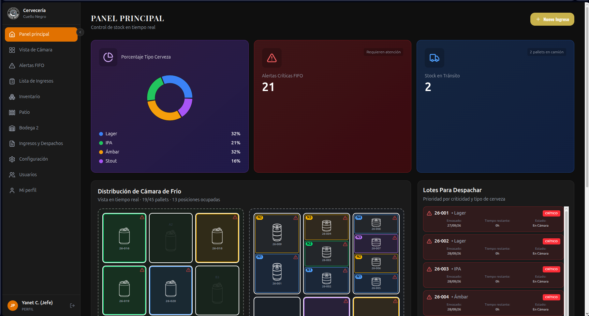

*Figura 6.1. Resumen de alertas en el panel. Las cantidades son de ejemplo y cambian según el inventario.*

### 6.3. Consultar el panel de Alertas FIFO

1. En el menú lateral, selecciona **Alertas FIFO**. Si el menú muestra solo iconos, despliega sus nombres con la flecha del borde.
2. Espera a que cargue el listado, bajo el subtítulo **«Prioridad de salida por criticidad y tolerancia»**. Arriba verás los chips de resumen (por ejemplo, **19 críticos** y **0 óptimos**) y las pestañas de filtro **Todos**, **Crítico**, **Preventivo** y **Óptimo**, cada una con su conteo.
3. Recorre las tarjetas, agrupadas por nivel. Cada una muestra:
   - el **código de lote** y el **estilo**, con la etiqueta de criticidad (**CRÍTICO**, **PREVENTIVO** u **ÓPTIMO**);
   - la barra **Tiempo consumido**, con el formato **horas consumidas / límite del estilo** (por ejemplo, `0h / 24h` para Lager e IPA, `0h / 72h` para Ámbar y Stout);
   - la **posición** (fila), la **fecha de envasado** y el estado **En Cámara**;
   - los botones **Ver en Cámara** y **Despachar**.

**Resultado esperado:** ves la lista completa de lotes clasificados por su prioridad de salida.

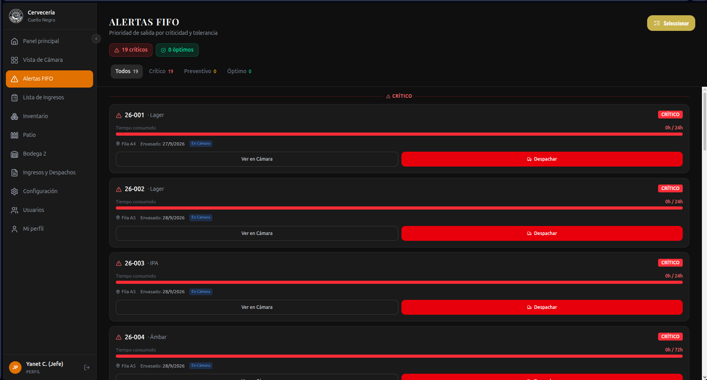

*Figura 6.2. Vista general de alertas con datos de ejemplo. Desplázate para ver todas las tarjetas.*

### 6.4. Interpretar la criticidad

La **barra Tiempo consumido** indica cuánto del límite del estilo se ha consumido desde el envasado. El **nivel** de cada lote se asigna según las **horas restantes** (límite del estilo menos el tiempo transcurrido), con estos umbrales, que el Jefe de Planta puede configurar:

| Nivel | Señal | Horas restantes |
|---|---|---|
| **Crítico** | Triángulo rojo · barra roja llena | Menos de 6 horas |
| **Preventivo** | Reloj naranja · barra parcial | Entre 6 y menos de 12 horas |
| **Óptimo** | Verde | 12 horas o más |

Cuando el límite del estilo ya se cumplió, el lote aparece en **Crítico** con **0 h restantes** y la barra completamente roja. Un nivel **Óptimo** no sustituye la comprobación del lote real, y un aviso **Crítico** no es una autorización automática de despacho: contrasta siempre con la fecha y el estado reales del lote.

> En esta base de ejemplo todos los lotes están en **Crítico** (0 preventivos y 0 óptimos), porque sus fechas de envasado superan el límite del estilo. Un lote **Preventivo** se vería con el reloj naranja y la barra parcialmente llena.

### 6.5. Filtrar y actuar sobre un lote

1. Para concentrarte en lo urgente, pulsa la pestaña **Crítico**. La lista muestra solo los lotes de ese nivel; el número de la pestaña indica cuántos coinciden.
2. Para ubicar físicamente un lote, pulsa **Ver en Cámara**: se abre la **Vista de Cámara** con el panel **Detalles del Lote**, donde ves la criticidad, las horas restantes, el ID de lote, el estilo, la cantidad, el envase, la fecha de envasado y el historial de notas. En una torre, verifica también el nivel.
3. Para registrar su salida, pulsa **Despachar** (o **Registrar Despacho** desde el detalle) y sigue el [capítulo de despacho](#despachos). Al despachar, el sistema avisa si quedan lotes más antiguos del mismo estilo en cámara.

**Resultado esperado:** acotas la lista al nivel que necesitas y pasas a ubicar o despachar el lote correcto.

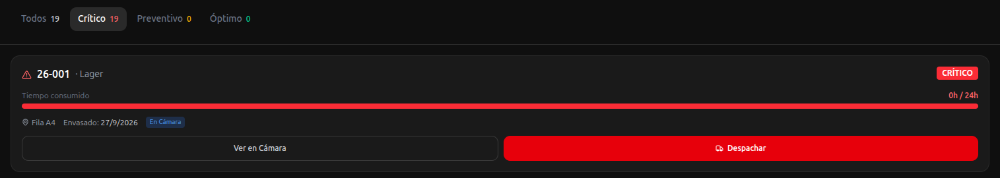

*Figura 6.3. Filtro Crítico aplicado. La tarjeta muestra la barra de tiempo consumido, la posición, el envasado y las acciones.*

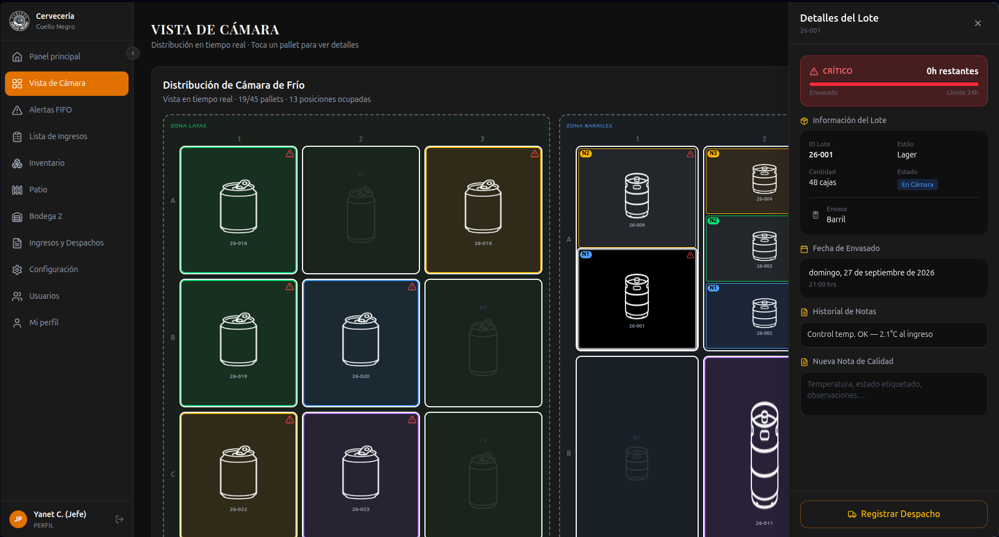

*Figura 6.4. Detalle del lote con su criticidad, información y acceso a Registrar Despacho. Consultar el detalle no cambia el estado del pallet.*

### 6.6. Si algo no coincide

| Situación | Qué hacer |
|---|---|
| El mismo lote aparece con distinta criticidad que en la Lista de ingresos | Es una limitación conocida de esta versión: las pantallas usan cálculos distintos (horas desde el envasado vs. días al vencimiento). Contrasta con la fecha real del lote antes de decidir. |
| Todos los lotes aparecen en Crítico | Puede deberse a que sus fechas de envasado superan el límite del estilo. Revisa las fechas reales; no modifiques el inventario para cambiar el indicador. |
| El panel aparece vacío o sin tarjetas | Espera la carga y vuelve a consultar. Si continúa, informa al responsable; no concluyas que no hay lotes por vencer ante un fallo de conexión. |
| El tiempo restante parece incorrecto | Recuerda que esta versión cuenta desde el envasado. Contrasta con la fecha real del lote y comunícalo al responsable. |
| No ves la opción "Alertas FIFO" en el menú | Solicita al responsable que revise el rol y estado de tu cuenta. |
| Al recargar desaparece el menú | Vuelve a la dirección terminada en `/login` e inicia sesión otra vez. |

**Resultado esperado:** distingues una limitación conocida de un fallo de datos, y sabes cuándo pedir ayuda.

---

**Control del documento:** capítulo redactado a partir del SRS Técnico v0.3 (RF-FIFO-01, RF-FIFO-02, RN-007, RN-008, DPO-002) y de las pantallas de Panel principal, Alertas FIFO y Vista de Cámara de la versión actual. Las capturas corresponden a un entorno de prueba con datos de ejemplo. La verificación de los pasos contra el código queda **pendiente**; su pauta se registrará en el anexo [Validación de US-21](#validacion-us-21). Los umbrales (6 h / 12 h) y la separación de las alertas Fuera de frío y Vencimiento corresponden al requisito; la implementación actual es parcial (un solo cálculo desde el envasado).

---

## 7. Configurar el sistema (Data-Driven) — US-15

Este capítulo explica cómo revisar y ajustar los **parámetros del negocio** sin modificar el código: los **tipos de cerveza** (con su vida útil y su tiempo máximo fuera de cámara), los **tipos de envase** y los **tipos de alerta**. También incluye una tabla de **permisos por cargo** de solo consulta. Corresponde a **US-15 — Configuración Data-Driven de parámetros (5 SP)** y está dirigido al **Jefe de Planta**.

> **Estado de esta versión.** La configuración es la fuente de la verdad del negocio: los tipos de cerveza, envases y alertas se administran desde aquí, no desde el código. La administración de **tipos de cerveza, envase y alertas está disponible**; la tabla de **permisos por cargo es de solo consulta**; y la aplicación inmediata de algunos cambios en todos los cálculos todavía es parcial (al cambiar un valor, verifica su efecto en las pantallas correspondientes). La **temperatura fue retirada del alcance** y no aparece en esta pantalla.

### 7.1. Antes de comenzar

Inicia sesión con una cuenta activa de **Jefe de Planta**, siguiendo el [capítulo de acceso](#acceso). Según la tabla de permisos de esta versión, solo el Jefe de Planta tiene acceso a Configuración. Ten claro qué vas a cambiar y por qué: estos valores afectan a todo el sistema (alertas, formularios de ingreso, cálculos de vencimiento). Las capturas usan datos de ejemplo; no modifiques la configuración real para reproducir el manual.

**Resultado esperado:** puedes entrar a **Configuración** desde el menú lateral. Si no aparece, solicita al responsable que revise el cargo de tu cuenta.

### 7.2. Abrir Configuración

1. En el menú lateral, selecciona **Configuración**. Si el menú muestra solo iconos, despliega sus nombres con la flecha del borde.
2. Bajo el subtítulo **«Permisos, catálogos y tipos de alertas del sistema»**, desplázate para ver sus cuatro secciones, en este orden: **Permisos de usuarios**, **Tipos de envase**, **Tipos de cerveza** y **Tipos de alertas**.

**Resultado esperado:** ves la pantalla de Configuración con sus cuatro secciones.

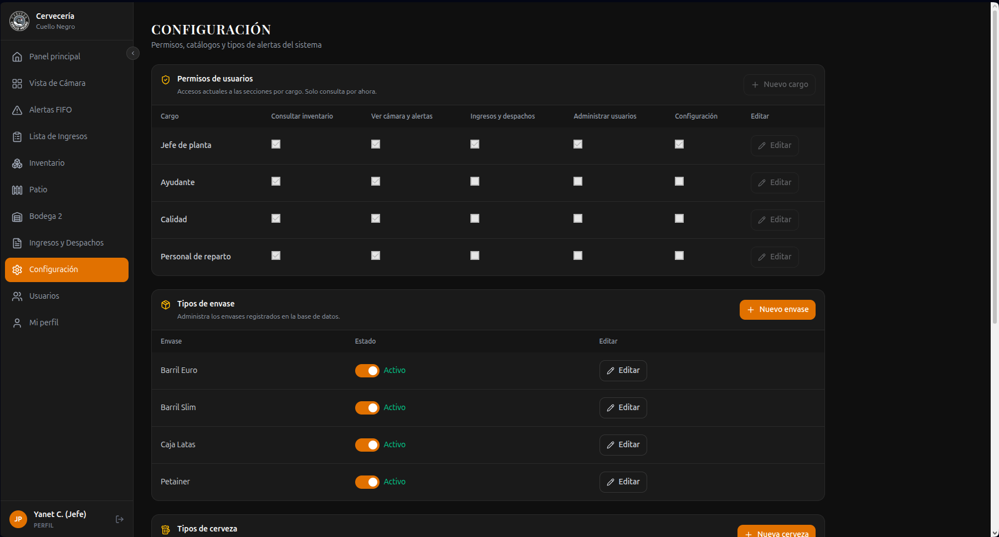

*Figura 7.1. Vista superior de Configuración con datos de ejemplo.*

### 7.3. Administrar tipos de cerveza

Los tipos de cerveza definen la **vida útil** (días hasta el vencimiento) y el **tiempo máximo fuera de cámara** (horas) que usan las alertas. En el ejemplo: Ámbar 120 días / 72 h, IPA 60 días / 24 h, Kombucha 45 días / 12 h, Lager 90 días / 24 h, Stout 120 días / 72 h.

1. Ve a la sección **Tipos de cerveza**. La tabla muestra, por cada cerveza: **Cerveza**, **Vida útil**, **Máx. fuera de cámara**, **Estado** y **Editar**.
2. Para **agregar**, pulsa **+ Nueva cerveza**. Completa **Nombre**, **Vida útil (días)** y **Máximo fuera de cámara (horas)**, deja marcado **Registro activo** y pulsa **Guardar cambios**.
3. Para **editar**, pulsa **Editar** en la fila, ajusta los valores y guarda.
4. Para dejar de usar una cerveza sin borrar su historial, desactiva su interruptor de **Estado** (o desmarca **Registro activo** en el formulario).

> El propio formulario advierte: **«Cambiar la vida útil no modifica las fechas de vencimiento de pallets ya registrados»**. El nuevo valor aplica a los ingresos futuros, no a los lotes que ya existen.

**Resultado esperado:** la cerveza aparece en la tabla con sus valores y queda disponible en los formularios de ingreso y en el cálculo de alertas.

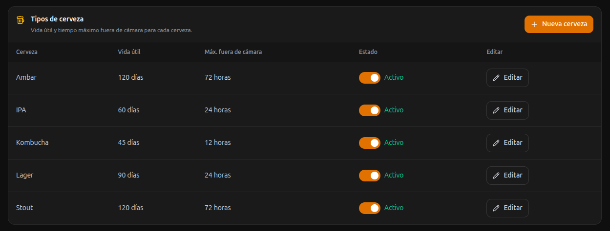

*Figura 7.2. Catálogo de cervezas. El «Máx. fuera de cámara» es el límite que usa la barra de Tiempo consumido de las alertas.*

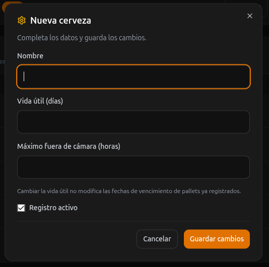

*Figura 7.3. Campos de la cerveza: nombre, vida útil, máximo fuera de cámara y registro activo.*

### 7.4. Administrar tipos de envase

Los envases disponibles en el ejemplo son **Barril Euro**, **Barril Slim**, **Caja Latas** y **Petainer**.

1. Ve a la sección **Tipos de envase**. La tabla muestra **Envase**, **Estado** y **Editar**.
2. Para **agregar**, pulsa **+ Nuevo envase**, escribe el **Nombre**, deja marcado **Registro activo** y pulsa **Guardar cambios**.
3. Para **editar** o **activar/desactivar** un envase, usa **Editar** o el interruptor de **Estado**.

> En esta versión, el formulario de envase solo pide **nombre** y **estado**: la **cantidad máxima por pallet no se configura aquí** (se gestiona como parámetro del sistema, no desde esta pantalla).

**Resultado esperado:** el envase queda disponible (o inactivo) para el registro de producción.

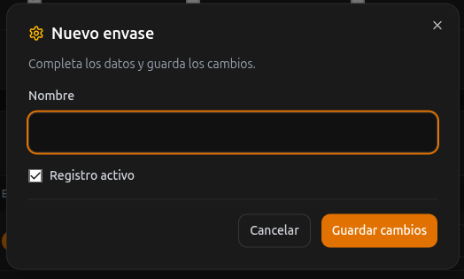

*Figura 7.4. El envase se define solo con nombre y estado.*

### 7.5. Administrar tipos de alerta

Esta sección administra las **alertas de stock** (por ejemplo, stock mínimo).

1. Ve a la sección **Tipos de alertas** y pulsa **+ Nueva alerta** (o **Editar** sobre una existente).
2. Completa el **Nombre**, elige el **Tipo de alerta** (por ejemplo, **Stock mínimo**), indica el **Umbral de stock (unidades)**, deja marcado **Registro activo** y pulsa **Guardar cambios**.

> Esta configuración corresponde a las alertas de **stock**. Los niveles Crítico/Preventivo de las alertas **FIFO/vencimiento** no se editan aquí: dependen del **Máx. fuera de cámara** de cada cerveza (ver el [capítulo de alertas](#alertas)).

**Resultado esperado:** la alerta de stock queda registrada con su umbral.

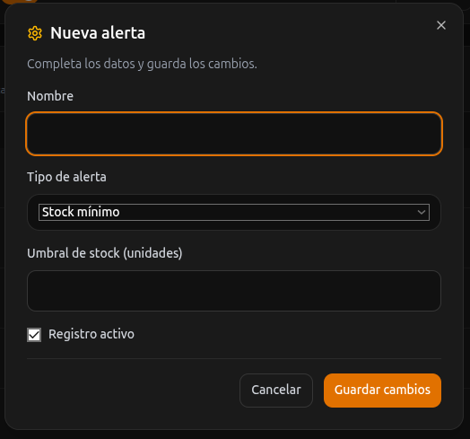

*Figura 7.5. Alerta de tipo Stock mínimo con su umbral en unidades.*

### 7.6. Consultar los permisos por cargo

La primera sección, **Permisos de usuarios**, muestra qué puede hacer cada cargo. Es de **solo consulta**: su subtítulo lo indica («Solo consulta por ahora») y los botones **+ Nuevo cargo** y **Editar** están deshabilitados.

La tabla cruza cada cargo con los accesos **Consultar inventario**, **Ver cámara y alertas**, **Ingresos y despachos**, **Administrar usuarios** y **Configuración**:

| Cargo | Consultar inventario | Ver cámara y alertas | Ingresos y despachos | Administrar usuarios | Configuración |
|---|:---:|:---:|:---:|:---:|:---:|
| Jefe de planta | Sí | Sí | Sí | Sí | Sí |
| Ayudante | Sí | Sí | No | No | No |
| Calidad | Sí | Sí | No | No | No |
| Personal de reparto | Sí | Sí | No | No | No |

Para reasignar a una persona, usa **Usuarios** (ver el [capítulo de gestión de usuarios](#usuarios)); no se editan permisos individuales desde esta tabla.

**Resultado esperado:** entiendes qué accesos tiene cada cargo; los controles de edición de esta sección están deshabilitados.

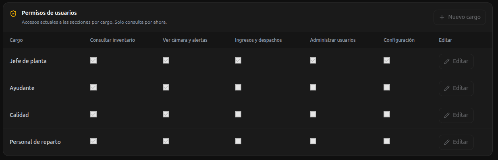

*Figura 7.6. Referencia de accesos por cargo; «Nuevo cargo» y «Editar» están deshabilitados.*

### 7.7. Si algo no coincide

| Situación | Qué hacer |
|---|---|
| No ves la opción "Configuración" en el menú | En esta versión solo el Jefe de Planta accede a Configuración. Solicita que revisen el cargo de tu cuenta. |
| Cambiaste la vida útil y un lote antiguo no cambió su vencimiento | Es el comportamiento esperado: el nuevo valor aplica a ingresos futuros, no a los pallets ya registrados. |
| No encuentras dónde fijar la cantidad por pallet de un envase | No se configura en esta pantalla; se gestiona como parámetro del sistema. Consulta al responsable técnico. |
| Cambiaste el "Máx. fuera de cámara" y las alertas no cambian de inmediato | La aplicación en todos los cálculos es parcial en esta versión. Verifica en Alertas FIFO e informa al responsable. |
| Quieres editar los permisos de un cargo | No es posible desde aquí (tabla de solo consulta). Reasigna a la persona desde **Usuarios**. |
| Un cambio de configuración no aparece en la auditoría | En esta versión, los cambios de configuración no generan registro de auditoría todavía. |

**Resultado esperado:** distingues una limitación conocida de un error, y sabes a quién avisar.

---

**Control del documento:** capítulo redactado a partir del SRS Técnico v0.3 (RF-CFG-01 a RF-CFG-05, DPO-010, DPO-018, DPO-027) y de la pantalla de Configuración de la versión actual, con datos de ejemplo. La verificación de los pasos contra el código queda **pendiente**; su pauta se registrará en el anexo [Validación de US-15](#validacion-us-15). La separación de alertas, la aplicación inmediata de todos los cambios (RF-CFG-05) y la auditoría de configuración corresponden al requisito y hoy son parciales o propuestas.

---

## 8. Anexo: validaciones y revisión del manual

Este anexo conserva las comprobaciones realizadas, las diferencias observadas y las pautas pendientes de revisión con un compañero. Está dirigido al equipo que mantiene el manual; no es necesario seguirlo para operar la aplicación.

### 8.1. Validación de US-01

**Fecha de comprobación:** 28-09-2026 · **Edición comprobada:** 1.0

**Historia:** [US-01 — Autenticación y control de acceso por roles](https://trello.com/c/iIdhv6rm).

#### Alcance

El capítulo documenta el funcionamiento actual. Las pruebas de navegador usan una copia temporal del frontend y las cuentas de ejemplo del seed del backend local. No se crearon ni editaron usuarios, contraseñas, roles o registros de producción. Las capturas omiten las credenciales y el pie del menú con etiquetas de perfil.

#### Pruebas ejecutadas en navegador

| Prueba | Resultado |
|---|---|
| Pantalla inicial sin credenciales | Capturada y revisada; figura 1.1 |
| Identificador inexistente | Mensaje «Credenciales incorrectas o usuario inactivo»; figura 1.4 |
| Inicio con Jefe de Planta | Redirección a Panel principal y 11 enlaces del menú; figura 1.2 |
| Inicio con Personal de reparto | Redirección a Panel principal y 7 enlaces del menú; figura 1.3 |
| Cierre de sesión de ambos perfiles | Retorno a la pantalla de inicio de sesión |
| Credenciales en imágenes | Campos vacíos y pie de perfil excluido de las capturas de menú |

Las pruebas validan autenticación y navegación, no las cifras del inventario del panel. No se ejecutaron pruebas de vencimiento del token, revocación, usuario inactivo ni operaciones protegidas de cada rol. Operario y Encargado se documentan según la configuración del menú revisada en código; no se realizó un inicio de sesión con esos perfiles en esta revisión.

#### Comparación con Trello y revisión de código

| Criterio o comportamiento | Implementación encontrada |
|---|---|
| Identificación por RUT | Admite RUT o correo; busca el RUT introducido y una variante sin puntos ni guion. Esto no garantiza todas las combinaciones si los datos guardados usan formatos diferentes. |
| Validación de contraseña | Compara la contraseña con bcrypt y busca únicamente cuentas activas al iniciar sesión. |
| Mínimo de 10 caracteres alfanuméricos | No es una política uniforme en esta versión. Login exige un valor no vacío; creación de usuarios genera cinco dígitos del RUT; cambio desde Mi perfil exige 12 caracteres con mayúscula, minúscula y número; edición administrativa admite al menos 8. |
| Emisión de JWT | Implementada; duración por defecto de 8 horas, configurable. No se incluyen tokens en el manual. |
| Redirección por rol | Todos los perfiles navegan a `/dashboard`; el menú se filtra por rol. |
| Asignación de rol | Ayudante y Calidad se mapean a OPERARIO. Los nombres no reconocidos caen en JEFE_PLANTA; el seed usa «Jefe de Planta» y el mapa contiene «Jefe de planta». Ese valor por defecto debe revisarse antes de certificar el control de acceso. |
| Protección por rol | Usuarios y Configuración verifican en el servidor que la cuenta esté activa y sea Jefe de Planta. No todas las rutas tienen controles equivalentes: las rutas de pallets y la grilla no usan requireAuth. No se certifica aislamiento completo por rol. |
| Selector de perfil | Cambia el estado y el menú del frontend; no emite un nuevo token ni reasigna el rol de la cuenta. No se documenta como mecanismo de autorización. |
| Restauración de sesión | El token se guarda, pero AppProvider inicia sin sesión y no la restaura tras recargar. |
| Cierre de sesión | Borra el token del almacenamiento de esa ventana y vuelve al login. No implementa revocación del JWT en el servidor. |
| Recuperación de contraseña | El botón visible no tiene una acción implementada. |

Estas diferencias se registran como hallazgos de implementación, no como cambios incluidos en el trabajo del manual. No se modificó el código ni la tarjeta de Trello.

#### Prueba de comprensión con un compañero — pendiente

Entregar el capítulo a una persona con una cuenta de prueba asignada. Solicitar: «Inicia sesión, identifica las opciones que corresponden a tu perfil, localiza cómo pedir ayuda si olvidas la contraseña y cierra sesión. Usa solo el manual y anota cualquier paso que necesite explicación».

| Tarea | Resultado |
|---|---|
| Encontrar los campos y entrar | Pendiente |
| Reconocer las opciones de su perfil | Pendiente |
| Interpretar un mensaje de acceso incorrecto | Pendiente |
| Entender cómo recuperar el acceso tras recargar | Pendiente |
| Cerrar sesión y reconocer la pantalla final | Pendiente |

**Revisor, fecha y observaciones:** pendientes. Corregir los pasos donde pida ayuda y repetirlos antes de aprobar esta revisión.

### 8.2. Validación de US-02

**Historia:** [US-02 — Gestión de usuarios, roles y permisos (3 SP)](https://trello.com/c/6ND3asV2).

**Fecha:** 29-09-2026 · **Edición del manual:** 1.3.

**Código consultado:** frontend 0.1.0 (`6ca4992`) y backend 1.0.0 (`152596b`). Las verificaciones históricas de US-01, US-04 y US-09 conservan sus fechas y versiones; no se han repetido para esta edición.

#### Método y evidencia

Las capturas del capítulo 2 se obtuvieron del frontend local con solicitudes de datos interceptadas y respuestas simuladas en el navegador. Se utilizaron una cuenta de demostración y Ana Ejemplo, con correos del dominio reservado `example.com`. Las operaciones del recorrido solo modifican datos temporales en memoria; no se crearon ni modificaron cuentas reales. Las imágenes muestran los componentes de la aplicación, no diseños recreados. Los mensajes de error simulados se contrastaron con el código del servidor.

| Comprobación | Evidencia y alcance |
|---|---|
| Acceso a Usuarios, buscador y filtro | Figura 2.1; inspección de la interfaz y lógica del filtro. |
| Campos y creación | Figura 2.2; envío de formulario con respuesta simulada y aparición de la fila. No certifica persistencia real. |
| Edición y cambio Ayudante → Calidad | Figura 2.3; formulario real y actualización simulada de la lista. |
| Consulta de permisos | Figura 2.4; tabla estática y controles deshabilitados. |
| Desactivación, estado y filtro | Figuras 2.5 y 2.6; confirmación y resultado con respuesta simulada. |
| Reactivación | Figura 2.7; confirmación y retorno simulado al estado Activo. |
| RUT duplicado | Figura 2.8; mensaje simulado coincidente con el controlador. |
| Creación, edición, contraseña y errores del servidor | Prueba existente `tests/usuarios.test.ts`: aprobada. Sustituye las consultas de base de datos; no es una prueba de integración con MySQL. |
| Protección del último jefe activo | Encontrada en `services/user-state.service.ts`. La prueba existente `tests/last-chief.test.ts` no pudo iniciarse: importa `../src/lib/user-state`, ruta inexistente tras el traslado a servicios. No se modificó código para corregirla. |
| Aplicación inmediata y sesiones abiertas | Revisión de código; no se ejecutó una prueba de integración con dos sesiones ni revocación completa. |

#### Comparación con el criterio de Trello

La tarjeta pide crear, editar y desactivar cuentas, asignar roles y aplicar permisos de inmediato sin reiniciar. El código guarda los cambios y consulta el estado y rol actuales para autorizar cada solicitud de administración de Usuarios y Configuración. El contexto del frontend, en cambio, mantiene el rol recibido al iniciar sesión y no lo sincroniza automáticamente. Por eso el procedimiento pide un nuevo inicio de sesión para actualizar el menú.

Esta revisión **no certifica el cumplimiento integral del criterio de permisos inmediatos**: falta comprobar con sesiones concurrentes todos los módulos y los accesos de una cuenta desactivada. No se presenta la desactivación como cierre global de sesiones ni se considera la matriz visual una garantía de autorización del servidor.

#### Particularidades de la versión

- El selector muestra «Jefe de plata»; el servidor lo traduce a «Jefe de planta». El manual conserva la etiqueta visible y explica su significado.
- La creación admite cuatro cargos. La edición puede conservar un cargo preexistente distinto, pero no es un mecanismo para crear nuevos cargos.
- El RUT se normaliza eliminando puntos y guion. La validación comprueba el formato; no calcula el dígito verificador.
- La contraseña inicial usa cinco dígitos numéricos del RUT completo. Editar el RUT sin enviar contraseña no cambia la contraseña vigente.
- La contraseña administrativa admite 8–72 caracteres; Mi perfil utiliza una política distinta. No se unificaron esas reglas como parte de este trabajo.
- Se oculta el cambio de estado de la propia cuenta y el servidor rechaza su desactivación. Existe una protección transaccional para conservar al menos un jefe activo, contrastada en código con la limitación de prueba indicada arriba.
- Configuración presenta una tabla fija de permisos de solo consulta. No existe edición individual de permisos desde esa pantalla.
- Se conserva la limitación de restauración de sesión tras recargar descrita en US-01.

#### Revisión con un compañero — pendiente

En un entorno de prueba con cuentas desechables y al menos un jefe activo, entregar el capítulo 2 y solicitar: «Crea un colaborador ficticio con datos únicos, encuéntralo, cambia su cargo, desactívalo, comprueba el filtro Inactivo y reactívalo. Explica cómo consultar sus permisos y qué hacer si el menú no cambia. Usa solo el manual».

| Tarea | Resultado |
|---|---|
| Distinguir campos obligatorios y opcionales | Pendiente |
| Crear y localizar la cuenta sin duplicarla | Pendiente |
| Editar el cargo conservando la contraseña | Pendiente |
| Comprender el carácter de consulta de la tabla de permisos | Pendiente |
| Desactivar y reactivar interpretando los filtros | Pendiente |
| Reconocer las protecciones de la propia cuenta y último jefe | Pendiente |
| Reconocer los límites de las sesiones abiertas y pedir ayuda | Pendiente |

**Revisor, fecha y observaciones:** pendientes. Ajustar los pasos que requieran explicaciones adicionales antes de aprobar la comprensión del manual.

### 8.3. Validación de US-04

**Fecha de comprobación:** 28-09-2026 · **Edición comprobada:** 1.0

#### Evidencia de recorrido

Se utilizó una copia temporal del frontend y el código actual del backend, conectados a MySQL temporal con datos del seed. No se modificaron el código de la aplicación, sus APIs ni la base habitual `corte_db`.

| Comprobación | Resultado |
|---|---|
| Acceso con cuenta ficticia Jefe de Planta | Verificado mediante inicio de sesión y navegación |
| Nuevo Ingreso sin selecciones | Confirmación deshabilitada; figura 3.5 |
| Datos del ejemplo | Lager, lote 26-904, 48 cajas, Lata; figuras 3.2a y 3.2b |
| Ubicación manual | C3, nivel 1; figura 3.3 |
| Guardado mediante la interfaz | El formulario cerró y el pallet apareció en cámara |
| Detalle del ingreso | Lote, estilo, cantidad, envase y estado correctos; figura 3.4 |
| Persistencia después de recargar | El botón del pallet 26-904 siguió visible |
| Nuevo ingreso duplicado para capturar el envase | No se envió: se abrió el formulario y se canceló |
| Imágenes | Se revisaron para legibilidad y ausencia de credenciales y datos personales visibles |

Los perfiles y límites se contrastaron con la interfaz y el código. Solo se realizó el recorrido autenticado completo con **Jefe de Planta**. No se certifican los permisos de otros perfiles ni el acceso de Ayudante. Los límites 1–60 y el estado deshabilitado de los controles en sus extremos se comprobaron en el código; no se afirma haber enviado cantidades fuera del rango.

#### Diferencias observadas

- La historia solicita `PENDIENTE_UBICACION`; la aplicación registra `EN_CAMARA` con posición.
- Las fotos no se incluyen en el envío y la nota de calidad no se persiste en el controlador de creación.
- Al recargar se pierde el estado de sesión del frontend; la cámara puede verse, pero los paneles y el menú requieren volver a iniciar sesión.
- La fecha de envasado se genera al enviar y se guarda en un campo de fecha. En el detalle del ingreso realizado el 28-09-2026 se mostró 27-09-2026, 21:00, consistente con una conversión de zona horaria. No se corrigió código ni se presenta esa fecha como comportamiento correcto.
- La unidad visible es «cajas» incluso para Barril.

#### Prueba con un compañero — pendiente

Entregar el manual y una cuenta del entorno de prueba a una persona que no haya redactado los pasos. El entorno temporal usado para las capturas se apaga al finalizar; antes de esta revisión hay que disponer de un entorno de prueba activo. No usar la producción real ni reutilizar un código de lote ya registrado.

**Solicitud para el compañero:** «Registra un pallet de prueba siguiendo únicamente el manual. Usa un lote nuevo y una posición libre. Anota dónde necesitaste ayuda, qué indicación no coincidió con la pantalla y cómo comprobaste que quedó guardado».

| Tarea | Hecho / dificultad |
|---|---|
| Encontrar Vista de Cámara y Nuevo Ingreso | Pendiente |
| Completar estilo, lote, cantidad y envase | Pendiente |
| Interpretar la ubicación y el nivel | Pendiente |
| Confirmar una sola vez y encontrar el resultado | Pendiente |
| Recuperar el acceso y verificar tras recargar | Pendiente |
| Entender qué hacer ante un error o envío dudoso | Pendiente |

**Revisor:** pendiente · **Fecha:** pendiente · **Observaciones:** pendientes.

Criterio de aceptación: la persona completa el recorrido sin instrucciones adicionales y reconoce el lote, cantidad, envase, estado y ubicación correctos. Ajustar los pasos donde pida ayuda y repetir esas partes antes de marcar esta revisión como aprobada.

### 8.4. Validación de US-09

**Historia:** [US-09 — Gemelo Digital 2D — Bodega 1](https://trello.com/c/bUMsBE5E).

**Fecha:** 28-09-2026 · **Edición del manual:** 1.2. Se consultó la API local y una copia temporal del frontend, sin crear, mover, despachar ni modificar pallets. Las capturas excluyen la identidad de la cuenta.

#### Comprobaciones

| Comprobación | Resultado |
|---|---|
| Consulta de la cámara principal | La API devolvió Bodega 1, 23 pallets posicionados; 21 En Cámara y 2 En Camión. |
| Resumen del mapa | Se observaron 21/45 pallets y 15 posiciones ocupadas. Los 2 En Camión no ocupan una celda visual. |
| Jefe de Planta | Acceso a Vista de Cámara y apertura del lote 26-003 desde N2. |
| Calidad | Acceso a Vista de Cámara con interfaz Operario y apertura del lote 26-016. |
| Detalle de nivel | El lote 26-003 mostró IPA, 48 cajas, Barril y En Cámara. |
| Código de colores y torres | Contrastados con las capturas y la leyenda del código. |
| Guardado de movimientos, despacho y notas | No ejecutados; no forman parte de esta validación de consulta. |

#### Límites de la versión documentada

- La historia menciona niveles de barriles/Petainer. La API conserva el nombre Petainer, pero la representación visual utiliza el dibujo de barril para envases distintos de Lata. El seed no contiene un pallet Petainer para validar sus niveles. No se da ese criterio por comprobado.
- Las torres se consultan tocando directamente cada nivel en la grilla; se abre un panel lateral «Detalles del Lote». No se describe un selector intermedio de niveles que no se haya observado.
- La grilla usa la capacidad de referencia 45 del frontend. No se comprobó su sincronización ante cambios de capacidad en la base de datos.
- SWR consulta y revalida los datos; no hay un intervalo de actualización explícito ni suscripción en tiempo real en `usePallets`. No se certifica una latencia de actualización.
- La vista no presenta un estado de error o carga diferenciado: antes de recibir los datos o ante un fallo puede parecer vacía.
- Zona Barriles muestra columnas 1–3, que corresponden a las columnas generales 4–6. Zona Extra muestra A2/A3 aunque se corresponde con la fila interna D. El manual utiliza zona y lote para evitar ambigüedades.
- Las alertas usan la fecha de envasado y límites definidos en el frontend. Permanece la diferencia de fecha/zona horaria registrada en la validación de US-04; no se certifica el cálculo operativo de las alertas.
- El frontend muestra Reorganizar para Jefe de Planta y previsualiza movimientos. El router de pallets revisado no tiene la ruta PATCH que invoca ese guardado; por ello no se presenta el movimiento persistente como una función validada.

#### Revisión con un compañero — pendiente

Solicitar que, usando solo el capítulo 4, entre a la cámara, distinga pallets de posiciones ocupadas, identifique las tres zonas, consulte un nivel de una torre y cierre el detalle sin modificar datos. Debe reconocer qué indican los colores y qué debe hacer si el mapa aparece vacío inesperadamente.

**Revisor, fecha y observaciones:** pendientes. Ajustar cualquier paso que requiera ayuda antes de aprobar la revisión de comprensión.

### 8.5. Validación de US-18

**Historia:** [US-18 — Despacho de pallets (1 y varios) (5 SP)](https://trello.com/c/3jhBa3jN).

**Fecha:** 29-09-2026 · **Edición del manual:** 1.4.

**Código consultado:** frontend 0.1.0 (`952dfde`) y backend 1.0.0 (`bf5a1d7`). Los capítulos anteriores conservan sus comprobaciones históricas; no se han vuelto a certificar en esta edición.

#### Método y evidencia

Se revisaron los formularios individual y múltiple, Alertas FIFO, Inventario, el detalle de pallet, el contexto de la aplicación, el historial y los servicios de despacho. Las capturas usan los componentes del frontend local con respuestas de datos interceptadas en el navegador. La cuenta, los pallets y los movimientos son ficticios; las operaciones solo cambian datos temporales en memoria. No se modificaron inventario, usuarios, posiciones ni movimientos de la base habitual.

| Comprobación | Resultado y alcance |
|---|---|
| Entrada por Alertas FIFO con Jefe de Planta | Recorrida en navegador con sesión simulada; figura 5.1. |
| Formulario individual sin destino | Confirmación deshabilitada; figura 5.2. |
| Formulario individual completo | Lote 26-901 y Pedido DEMO-18 · Ruta Sur; figura 5.3. Envío y cierre con respuesta simulada. |
| Advertencia FIFO individual | 26-903 detecta 26-901 y 26-902 anteriores; figura 5.4. Se canceló la advertencia y luego el formulario. |
| Selección múltiple | Casillas de 26-903 y 26-904 y contador Despachar 2; figura 5.5. |
| Advertencia por un pallet anterior omitido | Casilla sin marcar y confirmación deshabilitada; figura 5.6. No se envió la excepción. |
| Mezcla de envases | Resumen de 26-902 y 26-903 en Lata, y 26-904 en Barril, con un destino común; figura 5.7. |
| Error de disponibilidad | Respuesta 409 simulada, sin modificar los datos de demostración, y mensaje visible; figura 5.10. Se canceló y preparó nuevamente la selección. |
| Resultado e historial | Un pallet restante en cámara y cuatro registros de despacho simulados; figuras 5.8 y 5.9. No constituyen prueba de persistencia MySQL. |
| Imágenes | Revisadas para legibilidad, campos, botones y ausencia de contraseñas o datos de cuentas reales. |

#### Pruebas de lógica existentes

La ejecución directa de `tests/pallet-operations.test.ts` falla antes de ejecutar sus casos porque importa `../src/lib/pallet-operations`, archivo inexistente tras el traslado del servicio. Para comprobar la lógica sin modificar el repositorio de la aplicación, se ejecutó una copia temporal del mismo archivo sustituyendo únicamente esa importación por la ruta actual de `src/services/pallet-operations.service.ts`.

Los **cinco casos de esa copia temporal pasaron**, con una base simulada:

| Caso | Resultado |
|---|---|
| Despacho individual libera la cámara, compacta la torre y registra una sola salida | Aprobado; verifica estado EN_CAMION, posición y movimiento. |
| Despacho múltiple confirma todas las salidas y compacta la cámara | Aprobado. |
| Despacho múltiple inválido no guarda salidas parciales | Aprobado. |
| Reorganización conserva movimientos repetidos, compacta e inserta niveles | Aprobado; comprobación complementaria del servicio compartido. |
| Reorganización inválida revierte cambios y rechaza conflictos o permisos insuficientes | Aprobado; no certifica una política exclusiva de roles para despacho. |

Estas pruebas verifican el comportamiento del servicio frente a una base simulada. No se ejecutó la prueba de integración MySQL ni se midió la persistencia real tras recargar. La importación original sigue pendiente de corrección fuera del alcance de este manual.

#### Comparación con Trello y límites

| Criterio o comportamiento | Implementación encontrada |
|---|---|
| Despachar uno o varios pallets de lata o barril | Existen formulario individual y selección múltiple en Alertas FIFO. El grupo utiliza un destino común y despacha pallets completos. |
| Estado final DESPACHADO | Diferencia: el servicio guarda EN_CAMION y la notificación individual muestra En Camión. No hay transición final a DESPACHADO en esta operación. |
| Descontar stock | El servicio retira la asociación del pallet con su posición; así disminuye la disponibilidad de cámara. No reduce a cero la cantidad del pallet ni prueba un descuento global en todas las bodegas. Inventario se alimenta de la grilla de cámara. |
| Liberar o actualizar posición | El servicio elimina la posición del pallet despachado y compacta los niveles restantes en la misma transacción. La imagen del resultado es simulada; la lógica se comprobó con los casos indicados. |
| Priorizar FEFO/FIFO | Alertas ordena por horas restantes calculadas con límites por estilo. Los avisos de despacho comparan fechas de envasado entre pallets del mismo estilo, incluso si tienen distinto envase. No se valida una política FEFO completa basada en vencimientos configurados. |
| Excepciones FIFO | El individual ofrece Despachar de todos modos y el múltiple una casilla. El servidor no recibe una justificación ni una confirmación FIFO específica y no vuelve a ejecutar esa comparación. No se certifica bloqueo de excepciones desde el servidor. |
| Personal de Reparto y Jefe de Planta | Ambos tienen acceso al menú Alertas FIFO según el frontend. El servicio exige una cuenta activa para despachar, pero no restringe esa operación exclusivamente a esos dos roles. Solo se recorrió visualmente Jefe de Planta con sesión simulada. |
| Consistencia de varios pallets | El servicio valida todos los seleccionados y usa una transacción serializable. Un pallet no disponible provoca rechazo del grupo; las pruebas simuladas comprueban ausencia de salidas parciales. |
| Historial | Registra un movimiento por pallet con destino, cantidad y usuario. Puede registrar además cambios de posición de pallets que quedan en una torre. La vista consulta los últimos 100 movimientos y luego filtra por fecha y tipo. |
| Validaciones | Destino obligatorio de 1 a 150 caracteres tras quitar espacios extremos; grupo de 1 a 200 identificadores positivos distintos. No hay campo de cantidad parcial. |

Las cifras de tiempo, colores y fechas de las capturas son ilustrativas. Continúan los límites de interpretación de fechas descritos en los capítulos anteriores. No se cambiaron código, políticas, estado de la historia en Trello ni datos operativos como parte de esta documentación.

#### Revisión con un compañero — pendiente

En un entorno de pruebas aislado, preparar pallets de lata y barril, al menos dos del mismo estilo con fechas diferentes y una torre. Entregar el capítulo 5 y solicitar: «Despacha un pallet al destino de prueba; luego selecciona varios con un destino común. Reconoce la advertencia FIFO, cancela una selección incorrecta y verifica las salidas y el espacio restante usando solo el manual».

| Tarea | Resultado |
|---|---|
| Localizar lote, envase, cantidad y posición | Pendiente |
| Registrar un destino y un despacho individual | Pendiente |
| Interpretar y cancelar una advertencia FIFO | Pendiente |
| Seleccionar pallets de lata y barril y distinguir pallets de lotes | Pendiente |
| Corregir la omisión de un lote anterior en el envío múltiple | Pendiente |
| Verificar mapa, niveles e historial sin repetir el despacho | Pendiente |
| Explicar En Camión frente a entrega final y cómo actuar ante un error | Pendiente |

**Revisor, fecha y observaciones:** pendientes. Ajustar los pasos que requieran ayuda y repetirlos antes de aprobar la revisión de comprensión.

### 8.6. Validación de US-21 — pendiente

**Historia:** US-21 — Alertas FEFO/FIFO y de vencimiento (5 SP).

**Estado:** capítulo redactado a partir del SRS Técnico v0.3 y de las pantallas de la versión actual (Panel principal, Alertas FIFO y Vista de Cámara), con datos de ejemplo. **Falta la verificación contra el código y la revisión de comprensión con un compañero.**

#### Comprobaciones pendientes

| Comprobación | Estado |
|---|---|
| Nombre exacto del menú y subtítulo («Alertas FIFO» / «Prioridad de salida por criticidad y tolerancia») | Pendiente de contraste con la interfaz |
| Chips de resumen y pestañas con sus conteos | Pendiente |
| Barra «Tiempo consumido» (formato horas consumidas / límite del estilo) | Pendiente |
| Umbrales de criticidad (Crítico < 6 h, Preventivo 6–12 h, Óptimo ≥ 12 h) | Pendiente de verificación en el código |
| Separación de las alertas Fuera de frío y Vencimiento | Documentada como parcial (un solo cálculo desde el envasado); confirmar en el código |
| Diferencia de criticidad entre esta pantalla y la Lista de ingresos (H-08) | Pendiente de reproducción |
| Cálculo del tiempo desde el envasado vs. desde el registro en patio (H-07) | Pendiente de verificación |

#### Revisión con un compañero — pendiente

Entregar el capítulo 6 y solicitar: «Consulta el resumen del Panel principal y abre Alertas FIFO. Identifica un lote crítico, interpreta su barra de tiempo, filtra por nivel y ubica el lote con Ver en Cámara, usando solo el manual».

**Revisor, fecha y observaciones:** pendientes.

### 8.7. Validación de US-15 — pendiente

**Historia:** US-15 — Configuración Data-Driven de parámetros (5 SP).

**Estado:** capítulo redactado a partir del SRS Técnico v0.3 y de la pantalla de Configuración de la versión actual, con datos de ejemplo. **Falta la verificación contra el código y la revisión de comprensión con un compañero.**

#### Comprobaciones pendientes

| Comprobación | Estado |
|---|---|
| Secciones de Configuración y su orden (Permisos, Tipos de envase, Tipos de cerveza, Tipos de alertas) | Pendiente de contraste con la interfaz |
| Formulario de cerveza (nombre, vida útil, máximo fuera de cámara, registro activo) y su aviso sobre pallets ya registrados | Pendiente |
| Formulario de envase (solo nombre y estado; sin cantidad por pallet) | Pendiente de verificación |
| Formulario de alerta de stock (tipo y umbral en unidades) | Pendiente |
| Tabla de permisos por cargo de solo consulta («Nuevo cargo» y «Editar» deshabilitados) | Pendiente |
| Acceso restringido a Jefe de Planta; rol previsto de Calidad (DPO-018) | Pendiente de verificación |
| Aplicación inmediata de los cambios en los cálculos (RF-CFG-05) | Documentada como parcial; confirmar en el código |
| Ausencia de sección de temperatura (DPO-027) | Confirmada en las capturas; verificar en el código |
| Registro de auditoría de los cambios de configuración | Documentado como ausente; confirmar |

#### Revisión con un compañero — pendiente

Entregar el capítulo 7 y solicitar: «Abre Configuración, agrega un estilo de cerveza ficticio con su vida útil y su máximo fuera de cámara, revisa los tipos de envase y de alerta, y consulta la tabla de permisos por cargo, usando solo el manual».

**Revisor, fecha y observaciones:** pendientes.
