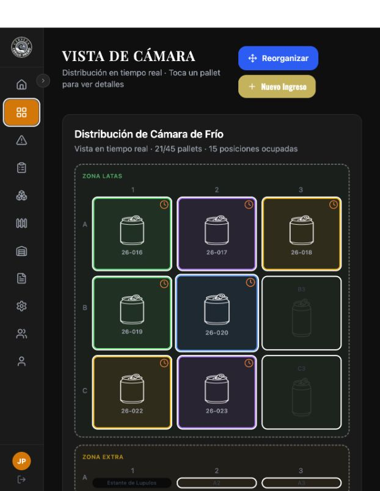
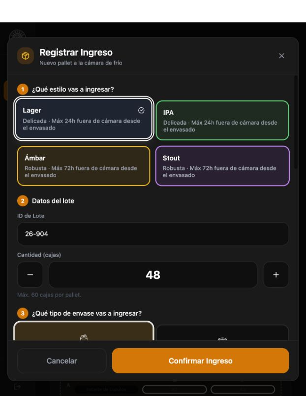
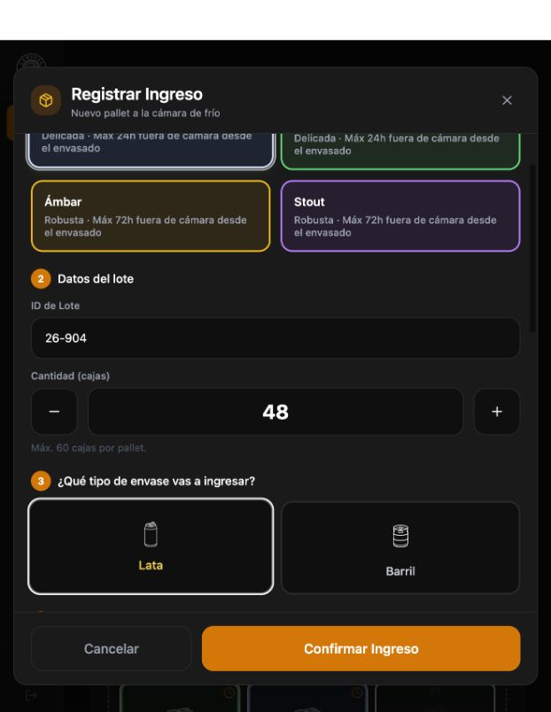
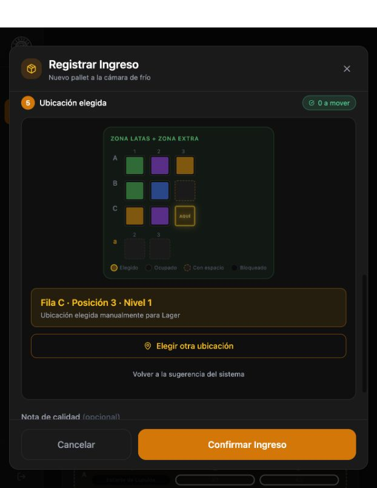
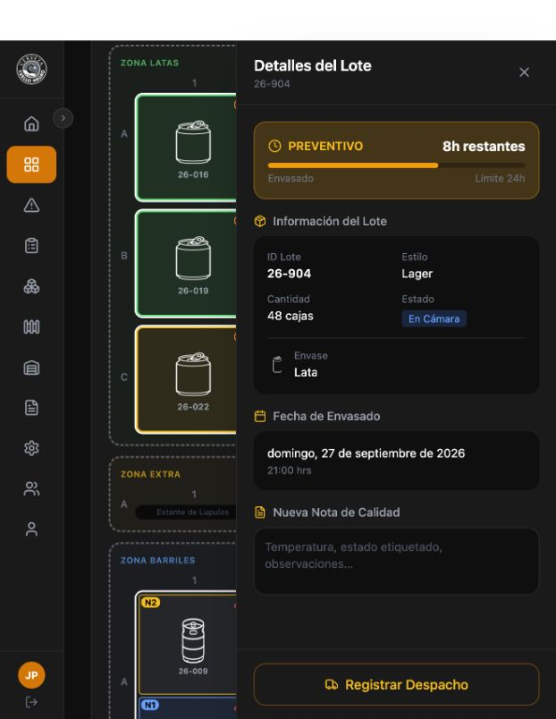
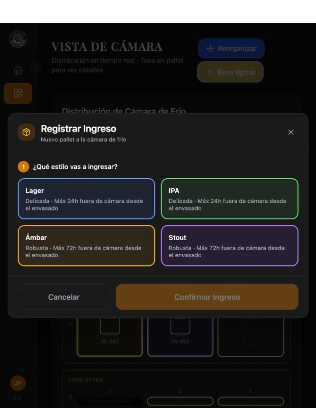

# Manual de usuario — Registrar un ingreso de producción

**C.O.R.T.E. · Cervecería Cuello Negro · US-04**
**Edición:** 1.0 · **Fecha:** 28 de septiembre de 2026
**Aplicación documentada:** frontend 0.1.0 (`3d21cc3`) y backend 1.0.0 (`abb434f`).

Esta guía explica cómo registrar un pallet y comprobar que quedó guardado. Describe la aplicación disponible en esta versión. Las capturas son reales, tomadas con datos ficticios en un entorno de prueba.

## 1. Antes de comenzar

Inicia sesión con tu cuenta habitual y ten a mano el estilo de cerveza, el tipo de envase, el código de lote y la cantidad que vas a ingresar. No uses los datos de este ejemplo para registrar producción real.

El recorrido se comprobó con el perfil **Jefe de Planta**, que puede elegir otra ubicación. No se ha confirmado el acceso con un perfil Ayudante. Si tu cuenta no muestra las opciones necesarias, consulta al responsable de planta.

Usaremos el mismo ejemplo en toda la guía:

| Dato | Ejemplo ficticio |
|---|---|
| Estilo | Lager |
| ID de Lote | 26-904 |
| Cantidad (cajas) | 48 |
| Envase | Lata |
| Ubicación elegida | Fila C · Posición 3 · Nivel 1 |

La disponibilidad cambia con el inventario. C3 solo sirve para este ejemplo si está libre y habilitada.

**Resultado esperado:** puedes entrar a «Vista de Cámara» y reconocer el botón «Nuevo Ingreso» de la figura 1.

## 2. Abrir el formulario

1. En el menú lateral, entra a **Vista de Cámara**. En una pantalla pequeña el menú puede mostrar únicamente iconos; usa la flecha del borde para desplegarlo.
2. Pulsa **Nuevo Ingreso**.

**Resultado esperado:** aparece «Registrar Ingreso», con las opciones de estilo de cerveza. Las secciones siguientes se muestran a medida que eliges los datos; desplázate dentro del formulario para verlas.

*Figura 1. Acceso al registro desde Vista de Cámara. El menú está contraído.*

## 3. Completar los datos

1. En **¿Qué estilo vas a ingresar?**, elige el estilo real del pallet. Para el ejemplo, selecciona **Lager**.
2. Revisa **ID de Lote**. La aplicación propone un código automáticamente: reemplázalo por el código que corresponda a tu producción. En el ejemplo se usa **26-904**.
3. Ajusta **Cantidad (cajas)** con los botones **−** y **+**. El rango es **1 a 60**; al llegar a un extremo se deshabilita el botón correspondiente. Para el ejemplo, deja **48**.
4. Desplázate hasta **¿Qué tipo de envase vas a ingresar?** y selecciona **Lata** o **Barril**. Para el ejemplo, selecciona **Lata**.

**Resultado esperado:** quedan seleccionados el estilo y el envase, se muestran el lote y la cantidad correctos, y aparece la sección de ubicación.

> Si cambias el estilo después de completar los datos, vuelve a revisar el lote y la cantidad: la aplicación los reemplaza por nuevos valores sugeridos. La etiqueta de cantidad sigue diciendo «cajas» incluso al elegir Barril; consulta la unidad de registro con el responsable antes de ingresar barriles.

*Figura 2a. Datos del ejemplo. Continúa hacia abajo para elegir el envase.*

*Figura 2b. El envase elegido queda resaltado. Ambas capturas corresponden al mismo ejemplo.*

**Campos opcionales:** en este recorrido deja vacíos «Fotos del pallet» y «Nota de calidad». Aunque aparecen en el formulario, esta versión no guarda las fotos ni la nota al crear el ingreso. No los uses como respaldo de información.

## 4. Revisar la ubicación

1. Baja hasta **Ubicación sugerida** y lee la fila, posición y nivel indicados debajo del plano.
2. Si la sugerencia corresponde al lugar donde ubicarás el pallet, puedes conservarla.
3. Con el perfil **Jefe de Planta**, puedes pulsar **Elegir otra ubicación** y tocar una celda habilitada. Para reproducir el ejemplo, selecciona **C3** si está disponible.
4. Comprueba el resumen: **Fila C · Posición 3 · Nivel 1**. El título cambia a «Ubicación elegida» y la celda aparece marcada con **AQUÍ**.

Para **Lata**, el nivel es siempre 1. Para **Barril**, el formulario muestra botones de «Nivel de apilado»; revisa el nivel seleccionado antes de confirmar. No interpretes la selección como prueba de que se hayan realizado movimientos físicos de otros pallets.

Si todavía estás seleccionando, **Cancelar selección** sale de ese modo. Si ya elegiste una posición, **Volver a la sugerencia del sistema** recupera la propuesta automática.

**Resultado esperado:** el resumen identifica la ubicación donde quedará registrado el pallet. No necesitas buscar ni escribir el ID numérico de la bodega.

*Figura 3. Ubicación manual del ejemplo y botón de confirmación.*

## 5. Confirmar y verificar el ingreso

1. Revisa una última vez estilo, lote, cantidad, envase y ubicación.
2. Pulsa **Confirmar Ingreso** una sola vez. Mientras se procesa, el botón muestra **Guardando...**.
3. Cuando el formulario se cierre, busca el código del lote en la cámara. En el ejemplo, **26-904** aparece en la zona de latas, C3.
4. Toca el pallet para abrir **Detalles del Lote**. Comprueba **Lager**, **48 cajas**, **Lata** y el estado **En Cámara**.
5. Para verificar que quedó guardado, recarga la página y busca nuevamente el lote. En esta versión puede desaparecer el menú o dejar de abrirse el detalle tras recargar: vuelve a la pantalla de inicio de sesión, ingresa de nuevo y entra a «Vista de Cámara». **No registres el pallet otra vez.**

**Resultado esperado:** el pallet continúa visible después de recargar. El ejemplo 26-904 se guardó y permaneció visible durante la prueba.

*Figura 4. Registro exitoso: lote 26-904, Lager, 48 cajas, Lata y estado En Cámara.*

El formulario usa automáticamente la fecha del momento del ingreso; no permite elegir una fecha de envasado. En la versión probada se observó una diferencia de fecha al mostrar el detalle. Si necesitas registrar una producción de otra fecha o la fecha visible no corresponde, informa al responsable antes de continuar; no tomes el indicador de tiempo del ejemplo como referencia para tu producción.

## 6. Si algo no funciona

| Lo que ves | Qué hacer | Resultado esperado |
|---|---|---|
| «Confirmar Ingreso» está deshabilitado | Selecciona estilo y envase y comprueba que exista una ubicación disponible. Revisa también el lote y la cantidad antes de enviar. | El botón se habilita cuando están completas las selecciones necesarias. |
| No puedes bajar de 1 o subir de 60 | Es el límite de «Cantidad (cajas)». Revisa cómo dividir el ingreso con el responsable si tu producción supera ese rango. | La cantidad permanece dentro del rango permitido. |
| «Cámara llena» | No hay una posición compatible disponible para la selección actual. Consulta al responsable para revisar disponibilidad y movimientos reales. | Continúas cuando exista una ubicación adecuada; no cambies el envase para forzar el ingreso. |
| Error al guardar | Revisa los datos y comprueba primero si el lote ya aparece en la cámara. Un lote repetido también puede causar un error. | Evitas repetir un ingreso que ya se haya guardado. |
| El envío demora o no sabes si terminó | Espera y verifica el lote antes de volver a confirmar. Si persiste el problema, informa el código de lote y el mensaje que aparece. | El responsable puede revisar el caso sin duplicar el registro. |
| No aparece «Elegir otra ubicación» | Esa opción está disponible para Jefe de Planta. Consulta a ese perfil si necesitas cambiar la propuesta. | Se revisa la ubicación con el perfil adecuado. |
| Al recargar desaparece el menú o no abre «Nuevo Ingreso» | Vuelve a iniciar sesión y entra desde el menú a «Vista de Cámara». | Recuperas los controles de la sesión; los ingresos guardados permanecen. |

*Figura 5. Validación visible al abrir el formulario: todavía no hay un estilo seleccionado.*

Para salir sin registrar, pulsa **Cancelar** antes de confirmar. Si ya confirmaste, cerrar el formulario no elimina el ingreso.

---

**Control del documento:** se verificaron el acceso con Jefe de Planta, las selecciones, la ubicación manual, el guardado y la persistencia tras recargar en un entorno aislado. La revisión de comprensión por un compañero sigue pendiente; su pauta está en [Validación del manual US-04](Validacion-US-04.md).
