# ESPECIFICACIÓN DE REQUISITOS DE SOFTWARE — SRS TÉCNICO

## C.O.R.T.E. — Control Operativo y Registro Total de Espacios

*Asistente de organización espacial de la cámara de frío de Cervecería Cuello Negro SpA*

**Código del proyecto:** CORTE (INFO282 · Grupo 2)
**Versión del documento:** 0.3
**Estado:** En revisión
**Fecha:** 30/09/2026
**Responsables:** Serruchos Dev Team (Product Owner: Giorgio Carlin)
**Equipo:** Serruchos Dev Team — Ingeniería Civil en Informática, Universidad Austral de Chile

> **Cómo se construyó este borrador.** Se obtuvo por ingeniería inversa de los repositorios del proyecto en GitHub (versiones en §1.8) y de los documentos formales del repositorio de documentación (Project Charter, Kickoff, Convenio, Historias de Usuario, estimación PCU y Carta Gantt).
>
> El documento describe dos cosas por separado:
> - lo que el sistema **hace hoy**, según el código;
> - lo **comprometido que aún no está implementado**, según la documentación del proyecto.
>
> Cada requisito indica su estado. Las brechas, la deuda técnica y las preguntas abiertas están en §83–§86.
>
> **Versión 0.2.** El Product Owner respondió las ambigüedades del borrador el 29/09/2026. Sus decisiones (**DPO-xxx**, §0.5) definen el comportamiento esperado y prevalecen sobre las HU y el código cuando difieren.

**Estados de requisito usados en este documento**

| Estado | Significado |
|---|---|
| Implementado | Funciona de punta a punta (interfaz, API y base de datos) en la versión analizada |
| Parcial | Existe una parte (por ejemplo, la pantalla) pero falta otra (persistencia, permisos, validación) |
| Propuesto | Comprometido en HU, PCU, Charter o Gantt, o recomendado por este análisis; no implementado |
| Verificado | Implementado y aceptado por el cliente en UAT (ningún requisito tiene aún este estado) |
| Descartado | Excluido de esta versión por una decisión del PO. Se conserva para la trazabilidad |

Las marcas **H-xx** remiten a los hallazgos del levantamiento de casos de uso (REF-08, §9), donde está el detalle técnico de cada brecha.

---

## Índice

- [0. CONTROL DEL DOCUMENTO](#0-control-del-documento)
- [1. INTRODUCCIÓN](#1-introducción)
- [2. CONTEXTO DEL SISTEMA](#2-contexto-del-sistema)
- [3. STAKEHOLDERS](#3-stakeholders)
- [4. ACTORES DEL SISTEMA](#4-actores-del-sistema)
- [5. PROCESOS DEL NEGOCIO](#5-procesos-del-negocio)
- [6. REGLAS DE NEGOCIO](#6-reglas-de-negocio)
- [7. CATÁLOGO GENERAL DE REQUISITOS](#7-catálogo-general-de-requisitos)
- [8. REQUISITOS FUNCIONALES](#8-requisitos-funcionales)
- [9. REQUISITOS NO FUNCIONALES](#9-requisitos-no-funcionales)
- [10. PRIORIZACIÓN DE REQUISITOS](#10-priorización-de-requisitos)
- [11. DEPENDENCIAS ENTRE REQUISITOS](#11-dependencias-entre-requisitos)
- [12. CASOS DE USO](#12-casos-de-uso)
- [13. DIAGRAMA GENERAL DE CASOS DE USO](#13-diagrama-general-de-casos-de-uso)
- [14. FLUJOS DE ACTIVIDAD](#14-flujos-de-actividad)
- [15. ESCENARIOS LÍMITE](#15-escenarios-límite)
- [16. MODELO DE DOMINIO](#16-modelo-de-dominio)
- [17. MODELO DE DATOS](#17-modelo-de-datos)
- [18. DICCIONARIO DE DATOS](#18-diccionario-de-datos)
- [19. CICLO DE VIDA DE ENTIDADES](#19-ciclo-de-vida-de-entidades)
- [20. ARQUITECTURA GENERAL](#20-arquitectura-general)
- [21. COMPONENTES DEL SISTEMA](#21-componentes-del-sistema)
- [22. MÓDULOS DEL SISTEMA](#22-módulos-del-sistema)
- [23. INTERFACES INTERNAS](#23-interfaces-internas)
- [24. API](#24-api)
- [25. ESTÁNDAR DE RESPUESTAS DE API](#25-estándar-de-respuestas-de-api)
- [26. PAGINACIÓN](#26-paginación)
- [27. FILTROS Y ORDENAMIENTO](#27-filtros-y-ordenamiento)
- [28. AUTENTICACIÓN](#28-autenticación)
- [29. AUTORIZACIÓN](#29-autorización)
- [30. MANEJO DE SESIONES](#30-manejo-de-sesiones)
- [31. VALIDACIONES](#31-validaciones)
- [32. MANEJO DE ERRORES](#32-manejo-de-errores)
- [33. CATÁLOGO DE ERRORES](#33-catálogo-de-errores)
- [34. TRANSACCIONES](#34-transacciones)
- [35. CONCURRENCIA](#35-concurrencia)
- [36. IDEMPOTENCIA](#36-idempotencia)
- [37. LOGGING](#37-logging)
- [38. AUDITORÍA](#38-auditoría)
- [39. NOTIFICACIONES](#39-notificaciones)
- [40. TAREAS ASÍNCRONAS](#40-tareas-asíncronas)
- [41. EVENTOS DEL SISTEMA](#41-eventos-del-sistema)
- [42. INTEGRACIONES EXTERNAS](#42-integraciones-externas)
- [43. WEBHOOKS](#43-webhooks)
- [44. ARCHIVOS](#44-archivos)
- [45. IMPORTACIÓN DE DATOS](#45-importación-de-datos)
- [46. EXPORTACIÓN DE DATOS](#46-exportación-de-datos)
- [47. CONFIGURACIÓN DEL SISTEMA](#47-configuración-del-sistema)
- [48. VARIABLES DE ENTORNO](#48-variables-de-entorno)
- [49. ENTORNOS](#49-entornos)
- [50. DESPLIEGUE](#50-despliegue)
- [51. INFRAESTRUCTURA](#51-infraestructura)
- [52. BACKUPS](#52-backups)
- [53. RECUPERACIÓN ANTE DESASTRES](#53-recuperación-ante-desastres)
- [54. SEGURIDAD TÉCNICA](#54-seguridad-técnica)
- [55. RATE LIMITING](#55-rate-limiting)
- [56. GESTIÓN DE DATOS](#56-gestión-de-datos)
- [57. SOFT DELETE](#57-soft-delete)
- [58. CONSISTENCIA E INTEGRIDAD](#58-consistencia-e-integridad)
- [59. FECHA, HORA Y ZONA HORARIA](#59-fecha-hora-y-zona-horaria)
- [60. LOCALIZACIÓN](#60-localización)
- [61. BÚSQUEDAS](#61-búsquedas)
- [62. CACHÉ](#62-caché)
- [63. DIAGRAMAS DE SECUENCIA](#63-diagramas-de-secuencia)
- [64. DIAGRAMAS DE ACTIVIDAD](#64-diagramas-de-actividad)
- [65. DIAGRAMAS DE ESTADO](#65-diagramas-de-estado)
- [66. DIAGRAMAS DE COMPONENTES](#66-diagramas-de-componentes)
- [67. DIAGRAMA DE ARQUITECTURA](#67-diagrama-de-arquitectura)
- [68. DIAGRAMA DE DESPLIEGUE](#68-diagrama-de-despliegue)
- [69. DECISIONES TÉCNICAS](#69-decisiones-técnicas)
- [70. CONVENCIONES DE DESARROLLO](#70-convenciones-de-desarrollo)
- [71. VERSIONADO](#71-versionado)
- [72. COMPATIBILIDAD HACIA ATRÁS](#72-compatibilidad-hacia-atrás)
- [73. MIGRACIONES DE BASE DE DATOS](#73-migraciones-de-base-de-datos)
- [74. PRUEBAS](#74-pruebas)
- [75. CRITERIOS DE ACEPTACIÓN](#75-criterios-de-aceptación)
- [76. CASOS DE PRUEBA](#76-casos-de-prueba)
- [77. DEFINICIÓN DE TERMINADO](#77-definición-de-terminado)
- [78. MATRIZ DE TRAZABILIDAD](#78-matriz-de-trazabilidad)
- [79. RIESGOS TÉCNICOS](#79-riesgos-técnicos)
- [80. SUPUESTOS](#80-supuestos)
- [81. RESTRICCIONES TÉCNICAS](#81-restricciones-técnicas)
- [82. DEPENDENCIAS EXTERNAS](#82-dependencias-externas)
- [83. LIMITACIONES CONOCIDAS](#83-limitaciones-conocidas)
- [84. DEUDA TÉCNICA CONOCIDA](#84-deuda-técnica-conocida)
- [85. PREGUNTAS ABIERTAS](#85-preguntas-abiertas)
- [86. PENDIENTES](#86-pendientes)
- [87. ROADMAP TÉCNICO](#87-roadmap-técnico)
- [88. ANEXOS](#88-anexos)
- [89. CHECKLIST FINAL DEL SRS](#89-checklist-final-del-srs)
- [90. APROBACIÓN FINAL](#90-aprobación-final)

---

# 0. CONTROL DEL DOCUMENTO

## 0.1 Control de versiones

| Versión | Fecha | Autor | Descripción del cambio |
|---|---|---|---|
| 0.1 | 28/09/2026 | Serruchos Dev Team | Borrador inicial por ingeniería inversa de `NEXO-C.O.R.T.E@86ee1c9`, `frontend_corte@20bb26f`, `backend_corte@6c280aa` y `documentacion_corte@211e708` |
| 0.2 | 29/09/2026 | Giorgio Carlin (PO) y Serruchos Dev Team | Incorpora las 34 decisiones del PO sobre las preguntas abiertas y los hallazgos (§0.5): ingreso por el patio, dos alertas, lotes con varios pallets, cantidades por envase, Kombucha y Petainer, matriz de permisos editable, política de contraseñas, anulación de ingresos y motivo de ruptura FIFO. Quedan 6 preguntas abiertas (§85) |
| 0.3 | 30/09/2026 | Serruchos Dev Team | Verificación de aceptación del PO (30/09/2026, §76.1): US-01, US-02, US-09, US-18 y TECH-02 aceptadas; API-035 (despacho múltiple), CA-RF-DES-01-04, TC-029 y DT-019 a DT-021. RF-AUT-05 pasa a **Implementado** (`frontend_corte@a7f46a0`, rama `fix/redireccion-login`): la sesión se restaura desde el JWT al recargar y una guardia central protege todas las rutas (se cierra la observación de RF-AUT-04 sobre pantallas sin guarda, H-12 y DT-014). `GET /api/actividad` ya no se consulta sin sesión (`frontend_corte@30df2db`). RNF-SEG-004 pasa a **Parcial**: producción corre en `https://corte-cuellonegro.inf.uach.cl` con TLS 1.2+; faltan HSTS y cerrar el dominio anterior por HTTP |
| 1.0 | | | Versión aprobada por el cliente |

## 0.2 Estado del documento

- Borrador
- **En revisión** ← estado actual (revisión del equipo en el pull request de la versión 0.2)
- Aprobado
- Obsoleto

## 0.3 Responsables

| Rol | Responsable | Responsabilidad |
|---|---|---|
| Product Owner | Giorgio Carlin | Prioriza requisitos, valida el alcance con el cliente y administra el convenio por parte del equipo |
| Scrum Master | Francisco Contreras | Planificación de sprints y seguimiento del avance |
| Líder técnico / Arquitecto | Ángel Leal | Arquitectura y decisiones técnicas (§69) |
| Backend | Por confirmar | API, modelo de datos y seguridad del servidor |
| Frontend / UX-UI | Javier Martínez (UX/UI y desarrollo) | Interfaz, usabilidad y accesibilidad |
| QA | Francisco Hernández (Ingeniero de Calidad) | Plan de pruebas, criterios de aceptación y registro de defectos |
| DevOps | Giorgio Carlin | CI/CD, despliegue, respaldos y monitoreo |
| Cliente | Benjamín Tapia (Administrador del convenio) | Valida requisitos y acepta entregables |
| Patrocinador | Esteban Barra | Dirección general del proyecto |
| Profesora guía | Valeria Henríquez | Asesoría experta (INFO282) |

Los roles del equipo provienen del Kickoff y del Project Charter. El PO asignó el despliegue (DevOps) y el desarrollo frontend el 29/09/2026 (DPO-034). El rol de Backend sigue "Por confirmar".

## 0.4 Aprobaciones

| Rol | Nombre | Fecha | Estado |
|---|---|---|---|
| Product Owner | Giorgio Carlin | | Pendiente |
| Líder técnico | Ángel Leal | | Pendiente |
| QA | Francisco Hernández | | Pendiente |
| Cliente | Benjamín Tapia | | Pendiente |
| Patrocinador | Esteban Barra | | Pendiente |

## 0.5 Decisiones del Product Owner

El 29/09/2026 el PO (Giorgio Carlin) respondió las ambigüedades del borrador 0.1: las preguntas abiertas (§85) y los hallazgos del levantamiento (REF-08, §9). Cada decisión tiene un ID **DPO-xxx**, que el resto del documento cita.

Cuando una decisión contradice una HU o el código, **prevalece la decisión**. El código deberá ajustarse (el estado de cada requisito lo indica).

**Tiempos, alertas y patio**

| ID | Decisión | Resuelve |
|---|---|---|
| DPO-001 | El plazo de **24 h** (Lager, IPA) y **72 h** (Ámbar, Stout) es el tiempo máximo **fuera de frío** que un pallet puede esperar para **entrar a la cámara**. Corre desde que se registra en el patio (con la hora exacta del sistema) y se detiene al ubicarlo en la cámara. Es configurable por estilo | PA-002 |
| DPO-002 | Hay **dos alertas separadas**, con nombres distintos: **Fuera de frío** (pallets en el patio: Crítico con menos de 6 h restantes, Preventivo con menos de 12 h) y **Vencimiento** (pallets en la cámara: Crítico con 7 días o menos para vencer, Preventivo con 14 días o menos). Los umbrales son configurables | PA-001, H-08 |
| DPO-003 | Si un pallet supera su plazo en el patio, la alerta **queda registrada en el pallet de forma permanente** (trazabilidad) y el pallet **sigue su flujo normal**: no se retiene ni se da de baja | — |
| DPO-004 | De la fecha de envasado solo importa la **fecha**, sin hora. Se escribe a mano o se recibe desde Gestión Cervecera | H-13 |
| DPO-005 | Todo pallet queda primero **en el patio** (estado Patio) y después se **ubica en la cámara** | PA-003 |

**Lotes, cantidades y catálogo**

| ID | Decisión | Resuelve |
|---|---|---|
| DPO-006 | Un lote puede repartirse en **varios pallets**. Al ingresar se elige un lote existente o se crea uno nuevo | PA-020 |
| DPO-007 | El código de lote se escribe a mano o viene de Gestión Cervecera. Formato **`AA-NNN`**: AA son los dos últimos dígitos del año de producción y NNN el número de cocción o producción (por ejemplo, `26-001`) | H-17 |
| DPO-008 | Las latas se cuentan en **cajas**; los barriles, en **barriles**, y los petainers, por unidad | PA-013 |
| DPO-009 | La cantidad máxima por pallet depende del **envase**, no del estilo (sea cerveza o Kombucha): **72 cajas** de latas, **16 barriles Euro**, **15 barriles Slim** y **9 petainers**. El formulario propone el máximo (pallet completo) y el operario lo baja si el pallet viene incompleto. Los valores son configurables | — |
| DPO-010 | **Configuración manda**: estilos, envases, plazos, umbrales de alerta y cantidades se leen de Configuración, no del código | H-07 |
| DPO-011 | **Kombucha** (Sprint 2): viene en lata y solo puede ir en **D2**. D2 también acepta cerveza en lata | PA-014 |
| DPO-012 | **Petainer** (Sprint 2): máximo 9 por pallet; solo en torres de la zona de barriles; siempre en la cima (nada encima); puede ocupar **un nivel sobre el límite de la torre**: nivel 5 en A4–A6, B5, B6, C5 y C6, y nivel 4 en B4. En **C4** no pasa del nivel 2, porque choca con el marco de la puerta | PA-014 |

**Cámara y ubicación**

| ID | Decisión | Resuelve |
|---|---|---|
| DPO-013 | La nomenclatura oficial de las posiciones es **A1–D6** (columnas 1 a 6 en toda la cámara). La grilla debe dejar de numerar los barriles 1–3 y de rotular la Zona Extra como A1–A3 | H-19 |
| DPO-014 | Al ubicar un pallet solo se puede elegir el **primer nivel libre** de la torre (queda arriba). Para cambiar el orden de una torre está la reorganización | H-18 |
| DPO-015 | La sugerencia de ubicación **evita tapar pallets que vencen antes**. Sus razones y el número de pallets a mover se calculan (hoy son texto fijo) | PA-022, H-22 |

**Permisos y cuentas**

| ID | Decisión | Resuelve |
|---|---|---|
| DPO-016 | Matriz de permisos inicial (el Jefe de Planta puede todo): **todos los cargos** registran ingresos en el patio, ubican pallets en la cámara, cambian la ubicación sugerida, reorganizan y registran notas de calidad. **Despachan** el Jefe, Calidad y Reparto; el **Ayudante no despacha**. Solo el Jefe administra usuarios. Detalle en §29.4 | PA-004, PA-005 |
| DPO-017 | Los permisos por cargo **se editan desde la aplicación** (el Jefe), y el backend los aplica en cada operación | H-26 |
| DPO-018 | El Encargado de Calidad **administra la configuración** (estilos, envases, plazos, umbrales y cantidades), pero **no los usuarios**. Tiene un rol propio | H-27 |
| DPO-019 | Una sola **política de contraseñas** para todos: 12 a 72 caracteres, con al menos una mayúscula, una minúscula y un número, también cuando la asigna el Jefe | H-15 |
| DPO-020 | La **contraseña inicial** sigue siendo los últimos 5 dígitos del RUT, pero el sistema **obliga a cambiarla** en el primer acceso, antes de operar | RN-018 |
| DPO-021 | Una contraseña olvidada **la restablece el Jefe** desde Usuarios (vuelve a la inicial, con cambio obligatorio). "¿Olvidaste tu contraseña?" indica pedírsela al Jefe. No se necesita correo | H-20, PA-023 |

**Operación**

| ID | Decisión | Resuelve |
|---|---|---|
| DPO-022 | Un ingreso se puede **editar** (lote, cantidad, envase, fecha de envasado) y **anular con motivo**. La anulación es lógica, todo queda en el historial y ambas acciones tienen un permiso propio (por defecto, el Jefe) | H-04 |
| DPO-023 | En esta versión se despacha siempre el **pallet completo**. El despacho parcial queda para una versión posterior | PA-006 |
| DPO-024 | Si un despacho rompe el orden de salida, el **motivo es obligatorio** (se elige de una lista o se escribe) y queda registrado | H-28 |
| DPO-025 | El ciclo del pallet **termina en "En camión"**. No se usan los estados Reservado ni Entregado. "Stock en tránsito" son los pallets despachados en el día | PA-007, H-09 |

**Datos, calidad y alcance**

| ID | Decisión | Resuelve |
|---|---|---|
| DPO-026 | Las **fotos** de los pallets se implementan más adelante (Sprint 2 o después). Mientras tanto, se oculta el paso de fotos del ingreso | PA-012, H-03 |
| DPO-027 | La **temperatura** de la cámara **no se registra** en el sistema. Se quitan los umbrales de temperatura y el indicador sin uso | PA-016 |
| DPO-028 | Los movimientos, las notas de calidad y la auditoría se conservan **mientras dure el servicio** | PA-010 |
| DPO-029 | Hay **buena señal** (Wi-Fi o datos) dentro de la cámara. No se necesita un modo sin conexión | PA-011 |
| DPO-030 | Rigen las **metas del Kickoff**: 90 % de disponibilidad y 95 % de los procesos sin problemas visuales | PA-015 |
| DPO-031 | **Fuera de alcance** (confirmado): varias plantas o empresas; clientes, ventas, pedidos y rutas de reparto; aplicación nativa (el sistema es solo web); otros idiomas | PA-018 |
| DPO-032 | Al término del convenio, el sistema **se traspasa al cliente**, porque el servidor del curso es temporal. Dónde se alojará se definirá más adelante con TI del cliente | PA-009 (en parte) |
| DPO-033 | La priorización MoSCoW (§10) queda **aprobada** con los ajustes de estas decisiones | §10 |
| DPO-034 | Responsables: **DevOps**, Giorgio Carlin; **desarrollo frontend**, Javier Martínez | §0.3 |

**Criterios del análisis que no requirieron consulta** (corrigen fallas sin alternativas razonables):
- El selector de perfil del menú lateral se elimina: el rol lo define el servidor (H-10).
- Un tipo de usuario desconocido no recibe acceso (hoy recibe `JEFE_PLANTA`, H-11).

---

# 1. INTRODUCCIÓN

## 1.1 Propósito

Hoy, en Cervecería Cuello Negro, la ubicación de los pallets dentro de la cámara de frío se controla con papel y con la memoria de los operarios. C.O.R.T.E. existe para reemplazar ese control manual por una aplicación web que:
- muestra la cámara como un **gemelo digital 2D**;
- lleva el **inventario en tiempo real**;
- **sugiere dónde ubicar** cada pallet;
- **controla el tiempo fuera de frío** de cada pallet mientras espera en el patio;
- **prioriza qué despachar primero** según el vencimiento de cada lote (FIFO/FEFO).

Este documento define qué debe hacer el sistema, cómo está construido y bajo qué condiciones se opera, prueba, despliega y mantiene.

## 1.2 Objetivo del SRS

Definir los requisitos funcionales, técnicos y de calidad necesarios para implementar, probar, desplegar y mantener C.O.R.T.E. El documento tiene dos usos:
- **Para el equipo de desarrollo:** es la línea base de los sprints restantes. Dice qué está hecho, qué falta y qué debe corregirse.
- **Para el equipo de TI del cliente:** describe la arquitectura, los datos, la seguridad, la configuración y el despliegue que necesita para recibir, operar y mantener el sistema al término del convenio.

## 1.3 Alcance del sistema

**Funcionalidades que cubre el sistema** (según el Project Charter y el código):

1. Autenticación con RUT o correo y control de acceso por rol, con permisos por cargo editables.
2. Administración de usuarios: alta, edición, activación, desactivación y restablecimiento de contraseña.
3. Registro de ingresos de producción en el patio y ubicación en la cámara con sugerencia automática (DPO-005).
4. Gemelo digital 2D de la cámara de frío (Bodega 1): zonas, torres de hasta 4 niveles (5 para el Petainer, DPO-012) y estado de cada pallet.
5. Inventario de la cámara, con búsqueda y filtros, e inventario por ubicación (Patio y Bodega 2).
6. Dos alertas: tiempo fuera de frío (pallets en el patio) y vencimiento (pallets en la cámara), cada una con los niveles Crítico, Preventivo y Óptimo (DPO-002).
7. Despacho de pallets completos con destino, y motivo obligatorio si se rompe el orden de salida (DPO-024).
8. Reorganización de la cámara mediante arrastrar y soltar.
9. Trazabilidad de movimientos (ingresos, ubicaciones, despachos, reubicaciones y anulaciones) y notas de calidad.
10. Configuración de catálogos (tipos de envase y de cerveza), plazos, umbrales de alerta y cantidades por envase (DPO-010).

**Comprometido en el Charter y la Carta Gantt, pero aún no implementado:**
- gestión multi-bodega con tránsitos entre bodegas y editor de planos;
- organización diaria asistida;
- conteo físico de inventario y conciliación de diferencias;
- bitácora de auditoría e informes;
- integración con la plataforma Gestión Cervecera.

**Definido por el PO para el Sprint 2:** Kombucha y Petainer (DPO-011, DPO-012). Las fotos de los pallets quedan para el Sprint 2 o después (DPO-026).

## 1.4 Fuera de alcance

**Exclusiones explícitas del Project Charter y el Kickoff:**

| Exclusión | Fuente |
|---|---|
| Desarrollo, instalación o mantenimiento de hardware y sensores IoT (peso, temperatura) | Charter §C |
| Automatización o robótica física (montacargas autónomos, brazos robóticos) | Charter §C |
| Gestión financiera, contabilidad, nómina y facturación electrónica | Charter §C |

**Exclusiones confirmadas por el PO** (DPO-027, DPO-029, DPO-031):

| Exclusión | Detalle |
|---|---|
| Varias plantas o empresas | El sistema es para una sola planta y una sola empresa |
| Clientes, ventas, pedidos y rutas de reparto | El destino del despacho es texto libre |
| Aplicación móvil nativa | El sistema es solo web (responsivo) |
| Interfaz en otros idiomas | La interfaz está solo en español |
| Registro de la temperatura de la cámara | No hay lectura de sensores, campo de temperatura ni umbrales. Las notas de calidad siguen siendo texto libre |
| Modo sin conexión | Hay buena señal dentro de la cámara |
| Despacho parcial de un pallet | Queda para una versión posterior (DPO-023) |

**Exclusión propuesta por este análisis, aún sin confirmar:** la planificación de la producción y del envasado. El sistema comienza con el registro del pallet en el patio.

## 1.5 Audiencia del documento

| Audiencia | Secciones de mayor interés |
|---|---|
| Product Owner y cliente | §1–§8, §10, §12, §79–§87 |
| Desarrolladores (frontend y backend) | Todo el documento, en especial §6–§8, §16–§62 y §69–§74 |
| Arquitecto | §20–§24, §34–§36, §54, §69 |
| QA | §8, §15, §31–§33, §74–§78 |
| DevOps y TI del cliente | §20–§21, §28–§30, §37, §47–§59, §73, §82 |
| Soporte y administradores del sistema | §4, §29, §32–§33, §47–§48, §52–§53 |

## 1.6 Definiciones

| Término | Definición |
|---|---|
| SRS | *Software Requirements Specification*: especificación de requisitos de software |
| API | *Application Programming Interface*: interfaz REST del backend, bajo el prefijo `/api` |
| JWT | *JSON Web Token*: token firmado que identifica al usuario en cada solicitud |
| RBAC | *Role-Based Access Control*: control de acceso basado en roles |
| FIFO | *First In, First Out*: sale primero lo que entró primero. En C.O.R.T.E., sale primero el lote envasado antes, dentro del mismo estilo |
| FEFO | *First Expired, First Out*: sale primero lo que vence primero. Es el criterio de salida de la cámara (DPO-002). Como la vida útil es fija por estilo, dentro de un estilo coincide con FIFO |
| Plazo fuera de frío | Horas máximas que un pallet puede esperar en el patio antes de entrar a la cámara: 24 h (Lager, IPA) o 72 h (Ámbar, Stout), configurables por estilo (DPO-001) |
| Alerta Fuera de frío | Clasificación de un pallet en el patio según las horas que le quedan de su plazo fuera de frío (DPO-002) |
| Alerta Vencimiento | Clasificación de un pallet en la cámara según los días que le quedan para vencer (DPO-002) |
| Gemelo digital | Representación 2D de la cámara de frío que refleja sus posiciones, torres y pallets |
| Cámara de frío / Bodega 1 | Bodega principal (tipo `CAMARA_FRIO_1`): grilla de 4 filas (A–D) × 6 columnas y capacidad de 45 pallets |
| Bodega 2 | Segunda cámara (tipo `CAMARA_FRIO_2`), con 6 posiciones |
| Patio | Área de acopio (tipo `PATIO`) donde queda todo pallet al salir de producción, antes de entrar a la cámara (DPO-005) |
| Pallet | Unidad de almacenamiento. Contiene cajas de latas, barriles o petainers de un único lote |
| Lote | Producción de un estilo en una cocción. Su código tiene el formato `AA-NNN` (año de producción y número de cocción, p. ej. `26-001`) y puede repartirse en varios pallets (DPO-006, DPO-007) |
| Posición | Lugar físico identificado por fila (A–D), columna (1–6) y nivel (1–4; el Petainer puede llegar al 5). Se nombra A1–D6 en toda la cámara (DPO-013) |
| Torre | Conjunto de pallets apilados en una misma fila y columna |
| Zona | Área de la cámara según el envase: Latas (A1–C3), Barriles (A4–C6) y Extra (D2–D3). D2 es la única posición de la Kombucha (DPO-011) |
| Envase | Tipo de contenedor: Caja de latas, Barril Euro, Barril Slim o Petainer. Cada uno tiene su cantidad máxima por pallet (DPO-009). Hoy la interfaz lo simplifica a *Lata* o *Barril* (H-07) |
| Estilo | Tipo de producto: Lager, IPA, Ámbar o Stout; Kombucha desde el Sprint 2 (el catálogo admite más) |
| Estado FIFO | Nombre que usa el código actual para la clasificación Crítico, Preventivo u Óptimo. Se reemplaza por las alertas Fuera de frío y Vencimiento (DPO-002) |
| Horas restantes | Plazo fuera de frío del estilo menos las horas transcurridas desde el registro en el patio (DPO-001). Hoy el código las cuenta desde el envasado |
| Vida útil | Días desde el envasado hasta el vencimiento, definidos por estilo |
| Despacho | Salida de un pallet completo de la cámara hacia un camión (DPO-023) |
| Reorganización | Conjunto de cambios de posición de pallets que se guardan juntos |
| Movimiento | Registro histórico de un ingreso, una ubicación, un despacho, un cambio de posición o una anulación |
| Anulación | Baja lógica de un ingreso registrado por error, con motivo. El pallet no se borra: queda en el historial (DPO-022) |
| Nota de calidad | Observación de calidad asociada a un pallet, con autor y fecha |
| Gestión Cervecera | Plataforma de gestión (ERP) que usa actualmente el cliente |
| Seed | Script que carga datos de prueba en la BD. **Borra todos los datos existentes** |
| SWR | Biblioteca del frontend para obtener datos con caché y revalidación automática |
| ORM | *Object-Relational Mapping*. En este proyecto es Prisma |
| Caddy | Proxy inverso del servidor del taller, que enruta el tráfico a los contenedores |
| GHCR | GitHub Container Registry: registro donde se publican las imágenes Docker |

## 1.7 Acrónimos y abreviaciones

| Sigla | Significado |
|---|---|
| BD | Base de datos |
| BFF | *Backend for Frontend*. Aquí es la ruta interna de Next.js que reenvía el login al backend |
| CA | Criterio de aceptación |
| CI/CD | Integración y despliegue continuos |
| CORS | *Cross-Origin Resource Sharing* |
| CU / UC | Caso de uso (UC-0nn en este documento equivale a CU-nn del levantamiento) |
| DER | Diagrama entidad-relación |
| DS | Diagrama de secuencia |
| ERP | *Enterprise Resource Planning* |
| HU | Historia de usuario |
| KPI | Indicador clave de desempeño |
| MVP | Producto mínimo viable |
| PCU | Puntos de casos de uso (método de estimación) |
| PK / FK / UK | Clave primaria / foránea / única |
| PO | Product Owner |
| RF / RNF / RN | Requisito funcional / Requisito no funcional / Regla de negocio |
| RPO / RTO | Pérdida de datos máxima tolerada / tiempo máximo de recuperación |
| TC | Caso de prueba |
| TLS | *Transport Layer Security* (base de HTTPS) |
| UAT | Pruebas de aceptación de usuario |
| UTC | Tiempo universal coordinado |
| WMS | *Warehouse Management System* |
| XSS / CSRF | *Cross-Site Scripting* / *Cross-Site Request Forgery* |

## 1.8 Referencias

| ID | Documento | Ubicación | Versión / fecha |
|---|---|---|---|
| REF-01 | Historias de Usuario | `documentacion_corte/Documentos/Historias_de_usuario.pdf` | 2026 |
| REF-02 | Estimación por Puntos de Casos de Uso | `documentacion_corte/Documentos/Serruchos PCU_Estimación PM.xlsx` | v1.0 |
| REF-03 | Project Charter | `documentacion_corte/Documentos/Project_Charter_CORTE.pdf` | v1.0, 17/08/2026 |
| REF-04 | Presentación de Kickoff | `documentacion_corte/Documentos/Kickoff.pdf` | 2026 |
| REF-05 | Convenio de colaboración | `documentacion_corte/Documentos/Contrato.pdf` | 25/08/2026 |
| REF-06 | Carta Gantt | `documentacion_corte/Documentos/Carta_Gantt_CORTE.xlsx` | 2026 |
| REF-07 | Catálogo de diagramas | `documentacion_corte/Diagramas.md` y `documentacion_corte/Diagramas/` | 2026 |
| REF-08 | Levantamiento de casos de uso desde el frontend | `documentacion_corte/Casos_de_Uso/Levantamiento_Frontend.md` | 28/09/2026; decisiones del PO agregadas el 29/09/2026 |
| REF-09 | Manual de usuario (US-01, US-02, US-04, US-09 y US-18) y sus validaciones | `documentacion_corte/Manuales/` | 30/09/2026 (rama `main`, `9df1d3f`) |
| REF-10 | Guía de instalación y despliegue | `NEXO-C.O.R.T.E/INSTALACION.md` y `README.md` | `86ee1c9` |
| REF-11 | README del backend | `backend_corte/README.md` | `6c280aa` |
| REF-12 | Evaluación heurística (HCI) | `frontend_corte/docs/HCI/` | 21/06/2026 |
| REF-13 | README y arquitectura del frontend | `frontend_corte/README.md`, `frontend_corte/docs/ARQUITECTURA.md` | Desactualizados: describen el backend simulado (DT-012) |
| REF-14 | Repositorios (organización `SerruchosDevTeam`) | `NEXO-C.O.R.T.E`, `frontend_corte`, `backend_corte`, `documentacion_corte` | `86ee1c9`, `20bb26f`, `6c280aa`, `211e708` |
| REF-15 | ISO/IEC/IEEE 29148:2018 (ingeniería de requisitos) e IEEE 830-1998 | Norma | — |
| REF-16 | D.S. N° 594 (MINSAL), Ley N° 16.744 y Código del Trabajo (DFL N° 1), citados en el Charter como fundamento del límite de apilamiento | Normativa chilena | — |
| REF-17 | Ley N° 19.628 sobre protección de la vida privada, y Ley N° 21.719 que la reforma (entrada en vigencia prevista para diciembre de 2026; verificar) | Normativa chilena | — |
| REF-18 | Ley N° 17.336 sobre propiedad intelectual | Normativa chilena | — |
| REF-19 | OWASP Top 10 (2021) y OWASP ASVS 4.0 | Estándar de seguridad | — |
| REF-20 | WCAG 2.1 (W3C) | Estándar de accesibilidad | — |

---

# 2. CONTEXTO DEL SISTEMA

## 2.1 Problema actual

Según el Kickoff y el Project Charter, la cámara de frío se organiza de forma manual. Eso produce tres problemas:

1. **Registro y planificación manual.** La ubicación física de cada pallet depende del papel o de la memoria del operario, y se pierde tiempo buscando.
2. **Sobremovimientos de pallets.** Para retirar lotes antiguos que quedaron al fondo hay que mover varios pallets intermedios, sin planificación previa.
3. **Riesgo de rotación incorrecta.** No hay visibilidad en tiempo real para priorizar los lotes por vencer, lo que arriesga mermas de producto.

## 2.2 Solución propuesta

Una aplicación web táctil con tres componentes:
- un **frontend** Next.js, usable en computador, tablet o celular;
- una **API REST** Express con Prisma ORM;
- una **base de datos** MySQL 8.

Todo corre en contenedores Docker.

La aplicación representa la cámara como gemelo digital 2D. Cada pallet se registra primero en el patio, donde corre su plazo fuera de frío. Al ubicarlo en la cámara, el sistema sugiere la mejor posición según el envase, el apilado permitido, la cercanía a pallets del mismo estilo y el vencimiento de los pallets de la torre. Además, prioriza la salida por vencimiento, exige un motivo cuando un despacho rompe ese orden y registra quién movió qué, cuándo y hacia dónde.

## 2.3 Objetivos del sistema

Las metas medibles provienen de la sección H del Project Charter, salvo la disponibilidad y la ausencia de errores visuales: ahí rigen las metas del Kickoff, 90 % y 95 % (DPO-030).

### OBJ-001 — Digitalizar la cámara de frío

Representar en 2D el 100 % del espacio físico, los lotes y el stock en tiempo real.
*Meta:* el mapa 2D carga en ≤ 500 ms (Charter §H).

### OBJ-002 — Reducir movimientos y tiempos de maniobra

Sugerir automáticamente la ubicación de cada pallet para eliminar sobremovimientos.
*Meta:* 100 % de pruebas superadas en la lógica crítica (algoritmo FIFO y sugerencia de ubicación).

### OBJ-003 — Asegurar la rotación correcta del producto

Controlar el tiempo fuera de frío en el patio, priorizar la salida de los lotes próximos a vencer y exigir un motivo cuando se rompe el orden, para evitar mermas.

### OBJ-004 — Eliminar el registro manual

Reemplazar las listas en papel por una interfaz táctil usable con guantes y en condiciones de frío.
*Meta:* 95 % de los flujos operativos sin errores visuales en computador, tablet y celular (Kickoff, DPO-030).

### OBJ-005 — Trazabilidad total por lote

Registrar ingresos, movimientos, despachos y notas de calidad con usuario, fecha y hora.

### OBJ-006 — Sincronizar con Gestión Cervecera

Mantener el inventario de C.O.R.T.E. consistente con la plataforma de gestión del cliente.
*Meta:* sin desajustes entre el inventario del sistema y la bodega real (Charter §C, impactos).

### OBJ-007 — Cumplir las reglas de apilamiento

Impedir que se sugiera o registre un apilado superior al permitido (máximo 4 niveles por torre; el Petainer puede ocupar un nivel extra en la cima, DPO-012).

### OBJ-008 — Controlar el acceso por rol

Cada trabajador accede solo a las funciones de su cargo, y la configuración crítica queda protegida.

**Metas transversales**
- 90 % de las HU del MVP completadas en plazo (Charter).
- Disponibilidad ≥ 90 % durante la fase de pruebas (Kickoff, DPO-030; el Charter pedía 99 %).
- 0 defectos críticos al desplegar.
- 100 % de las HU del MVP aprobadas en UAT.

## 2.4 Contexto operacional

| Aspecto | Descripción |
|---|---|
| Dónde | Planta de Cervecería Cuello Negro, Valdivia (Chile), dentro y en el acceso a la cámara de frío |
| Quién | Jefe(a) de planta, encargado(a) de calidad, ayudantes operativos y personal de reparto (§4) |
| Dispositivos | Hardware existente de la planta: celulares, tablet y computador (Charter §E) |
| Condiciones de uso | Ambiente cercano a 2 °C, operario con guantes gruesos, pantalla húmeda, baja visibilidad y urgencia operativa (evaluación HCI, REF-12) |
| Conectividad | Wi-Fi o datos móviles. El Charter advertía que la aislación de la cámara podía bloquear la señal (RSK-001), pero el PO confirmó que hay buena señal dentro de la cámara. No se necesita modo sin conexión (DPO-029) |
| Horario de operación | Por confirmar con el cliente (PA-019) |
| Alojamiento | Hoy, el servidor del taller INFO282 de la universidad, disponible hasta enero de 2027 (Charter §E). Después, el sistema se traspasa al cliente; la infraestructura se definirá con su TI (DPO-032, PA-009) |
| Otros sistemas | Gestión Cervecera (integración planificada, no implementada); GitHub (código, CI/CD y registro de imágenes) |

## 2.5 Diagrama de contexto

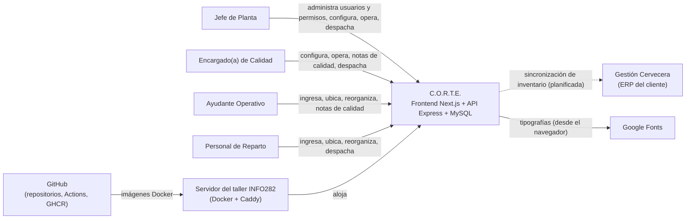

## 2.6 Sistemas externos

| Sistema | Tipo | Propósito | Estado |
|---|---|---|---|
| Gestión Cervecera | ERP del cliente (API a definir) | Sincronizar ingresos, despachos y ajustes de stock; comparar inventarios | No implementado (INT-001) |
| GitHub + GitHub Actions | Plataforma de código y CI | Versionar el código y construir las imágenes Docker en cada push a `main` del repo NEXO | Operativo (INT-002) |
| GitHub Container Registry (GHCR) | Registro de imágenes | Publicar `corte-backend:latest` y `corte-frontend:latest` | Operativo (INT-002) |
| Caddy (servidor del taller) | Proxy inverso | Enrutar el tráfico HTTP a los contenedores `grupo2_*` | Operativo, administrado por el curso (INT-003) |
| Google Fonts | CDN de tipografías | Cargar las fuentes Oswald y Playfair Display en el navegador | Operativo (INT-004) |
| Sensor de temperatura | Hardware | Lectura de la temperatura de la cámara | Fuera de alcance (Charter). La temperatura no se registra en el sistema (DPO-027): se elimina el componente de visualización sin uso (INT-005) |

---

# 3. STAKEHOLDERS

## 3.1 Stakeholders internos (equipo de desarrollo y universidad)

| ID | Stakeholder | Responsabilidad |
|---|---|---|
| STK-001 | Product Owner y Encargado de proyecto (Giorgio Carlin) | Prioriza el backlog, se relaciona con el cliente y administra el convenio |
| STK-002 | Scrum Master (Francisco Contreras) | Facilita sprints, seguimiento y reportes |
| STK-003 | Arquitecto de software (Ángel Leal) | Diseño técnico y decisiones de arquitectura |
| STK-004 | Ingeniero de calidad (Francisco Hernández) | Estrategia de pruebas y control de defectos |
| STK-005 | UX/UI (Javier Martínez) | Diseño de interfaz y evaluación de usabilidad |
| STK-006 | Profesora guía (Valeria Henríquez) | Asesora como experta y participa en las decisiones técnicas |
| STK-007 | Escuela de Ingeniería Civil en Informática, UACh | Provee el servidor de pruebas y despliegue hasta enero de 2027 |

## 3.2 Stakeholders externos (cliente)

| ID | Stakeholder | Responsabilidad |
|---|---|---|
| STK-101 | Patrocinador (Esteban Barra, Cervecería Cuello Negro) | Dirección general, aprobación y resolución de obstáculos |
| STK-102 | Cliente y Administrador del convenio (Benjamín Tapia) | Define objetivos, valida y firma la recepción de entregables |
| STK-103 | Jefe(a) de Planta | Usuario principal. Administra la cámara, los usuarios, los permisos y la configuración |
| STK-104 | Encargado(a) de Calidad | Supervisa el estado de los lotes, registra observaciones de calidad y administra la configuración (DPO-018) |
| STK-105 | Ayudantes operativos | Ingresan la producción al patio, la ubican en la cámara y buscan pallets |
| STK-106 | Personal de reparto | Retira y despacha pallets |
| STK-107 | TI del cliente | Recibe, opera y mantiene el sistema después del convenio |

## 3.3 Necesidades principales

| Stakeholder | Necesidad |
|---|---|
| Jefe(a) de Planta | Saber qué hay y dónde está; ubicar la producción con pocos movimientos; controlar quién opera y con qué permisos |
| Encargado(a) de Calidad | Ver cuánto tiempo pasó cada pallet fuera de frío y cuándo vence; registrar notas de calidad trazables; ajustar plazos y umbrales |
| Ayudantes operativos | Registrar un ingreso en pocos pasos, con guantes, y saber dónde dejar el pallet |
| Personal de reparto | Saber qué lote sale primero y registrar el despacho sin papel |
| Cliente / patrocinador | Menos mermas, menos tiempo de maniobra e inventario consistente con Gestión Cervecera |
| TI del cliente | Documentación de despliegue, configuración, respaldos y seguridad para operar el sistema de forma autónoma (Convenio, cláusula 4) |
| Equipo de desarrollo | Una línea base de requisitos trazable, que permita cerrar los sprints y la UAT |

---

# 4. ACTORES DEL SISTEMA

Los permisos "actuales" se refieren al código analizado. Los "esperados" son la matriz inicial que definió el PO (DPO-016, detalle en §29.3). El Jefe puede editarla desde la aplicación (DPO-017).

## ACT-001 — Jefe de Planta

**Descripción:** Súper administrador. En la BD corresponde al tipo de usuario `Jefe de planta` y en la aplicación al rol `JEFE_PLANTA`.

**Responsabilidades:**
- Administrar usuarios, cargos, estados, contraseñas y permisos.
- Configurar catálogos y reglas del sistema.
- Registrar ingresos y decidir su ubicación.
- Editar y anular ingresos.
- Reorganizar la cámara.
- Revisar el historial de ingresos, despachos y movimientos.

**Permisos generales (actuales):** acceso a todas las pantallas; es el único que puede reorganizar la cámara, elegir una ubicación distinta a la sugerida, administrar usuarios y editar la configuración (el backend lo verifica en usuarios, configuración y reorganización).

**Permisos esperados (DPO-016):** todos. Es el único que administra usuarios, restablece contraseñas (DPO-021) y edita la matriz de permisos (DPO-017). Por defecto, también es el único que edita y anula ingresos (DPO-022).

**Restricciones:**
- No puede desactivarse a sí mismo.
- No puede desactivar ni cambiar el cargo del último jefe de planta activo.

## ACT-002 — Encargado(a) de Calidad

**Descripción:** Administrador de la configuración (DPO-018). En la BD es el tipo `Calidad`. Hoy la aplicación lo mapea al rol `OPERARIO` (H-27); debe tener un rol propio, `CALIDAD`.

**Responsabilidades:**
- Supervisar el estado de la cámara y registrar notas de calidad.
- Administrar la configuración: estilos, envases, plazos, umbrales y cantidades (DPO-018).
- Despachar.
- Planificar la distribución y validar la ubicación sugerida.
- Comparar el inventario con Gestión Cervecera y generar informes (según HU).

**Permisos generales (actuales):** los mismos del Ayudante (ACT-003).

**Permisos esperados (DPO-016, DPO-018):** registrar ingresos, ubicar, cambiar la ubicación sugerida, reorganizar, registrar notas de calidad, despachar y administrar la configuración.

**Restricciones:** no administra usuarios ni permisos (DPO-018).

## ACT-003 — Ayudante Operativo

**Descripción:** Usuario operativo. En la BD es el tipo `Ayudante`; en la aplicación, el rol `OPERARIO`.

**Responsabilidades:** ingresar la producción al patio, ubicarla en la cámara, buscar pallets y registrar notas de calidad.

**Permisos generales (actuales):** Panel principal, Vista de Cámara (incluido "Nuevo Ingreso"), Alertas FIFO, Inventario, Patio, Bodega 2, Mi perfil y Despachar.

**Permisos esperados (DPO-016):** registrar ingresos, ubicar, cambiar la ubicación sugerida, reorganizar y registrar notas de calidad.

**Restricciones:** no despacha (DPO-016); no administra usuarios, permisos ni configuración.

## ACT-004 — Personal de Reparto

**Descripción:** Usuario de despacho. En la BD es el tipo `Personal de reparto`; en la aplicación, el rol `PERSONAL_REPARTO`.

**Responsabilidades:** retirar y despachar pallets siguiendo el orden de salida por vencimiento.

**Permisos generales (actuales):** los mismos del Ayudante.

**Permisos esperados (DPO-016):** registrar ingresos, ubicar, cambiar la ubicación sugerida, reorganizar, registrar notas de calidad y despachar.

**Restricciones:** no administra usuarios, permisos ni configuración.

## ACT-005 — Gestión Cervecera (sistema externo)

**Descripción:** Plataforma de gestión (ERP) del cliente.

**Responsabilidades:** ser la fuente o el destino de los ingresos de producción, despachos y ajustes de stock. En particular, puede entregar el código de lote y la fecha de envasado de cada ingreso (DPO-004, DPO-007).

**Permisos generales:** por definir en el contrato de integración (INT-001).

**Restricciones:** la API disponible y sus credenciales no están documentadas (PA-008).

## ACT-006 — Motor de alertas (tiempo)

**Descripción:** Actor temporal. Las alertas de cada pallet cambian con el paso del tiempo, sin intervención de nadie.

**Responsabilidades (esperadas, DPO-001 a DPO-003):**
- En el patio: recalcular las horas restantes del plazo fuera de frío y la alerta Fuera de frío.
- En la cámara: recalcular los días para el vencimiento y la alerta Vencimiento.
- Registrar de forma permanente en el pallet cuándo superó su plazo fuera de frío.

**Restricciones (actuales):**
- El cálculo se hace en el navegador, con límites fijos por estilo (H-07), y cuenta desde el envasado en vez de desde el registro en el patio.
- No genera alertas persistentes (RF-NTF-02).

## ACT-007 — Administrador de TI

**Descripción:** Persona de TI (del equipo o del cliente) que despliega y opera la plataforma.

**Responsabilidades:**
- Gestionar variables de entorno y secretos.
- Desplegar las versiones.
- Hacer respaldos y restauraciones.
- Monitorear la salud del servicio.

**Permisos generales:** acceso al servidor y a los repositorios. No es un rol dentro de la aplicación.

**Restricciones:** no debe ejecutar el seed en producción (RSK-012).

---

# 5. PROCESOS DEL NEGOCIO

## 5.1 Procesos principales

| ID | Proceso | Requisitos | Estado |
|---|---|---|---|
| P-01 | Recepción de la producción en el patio | RF-ING-01, RF-ING-02, RF-CAL-01 | Parcial: hoy el ingreso va directo a la cámara (DPO-005) |
| P-02 | Ubicación en la cámara y almacenamiento en el gemelo digital | RF-ING-07, RF-OPT-01, RF-GD-01, RF-GD-02 | Parcial: la ubicación desde el patio no existe |
| P-03 | Monitoreo del tiempo fuera de frío (patio) y del vencimiento (cámara) | RF-FIFO-01, RF-FIFO-02, RF-FIFO-05 | Parcial: hoy hay un solo criterio, contado desde el envasado (DPO-002) |
| P-04 | Preparación y despacho | RF-DES-01, RF-FIFO-03 | Parcial: falta el motivo de ruptura (DPO-024) |
| P-05 | Reorganización de la cámara | RF-CAM-01 | Implementado solo para el Jefe; debe abrirse a todos los cargos (DPO-016) |
| P-06 | Control de calidad (notas) | RF-CAL-01, RF-CAL-02, RF-CAL-03 | Parcial |
| P-07 | Administración de usuarios, permisos y configuración | RF-USR-*, RF-CFG-* | Implementado / Parcial |
| P-11 | Corrección y anulación de ingresos | RF-ING-05, RF-ING-06 | Propuesto (DPO-022) |
| P-08 | Consulta de inventario por ubicación | RF-INV-04, RF-INV-05 | Implementado |
| P-09 | Conteo físico, conciliación y sincronización con el ERP | RF-INV-01…03, RF-INT-01, RF-INT-02 | Propuesto |
| P-10 | Auditoría e informes | RF-AUD-01…03 | Parcial / Propuesto |

## 5.2 Flujo general del negocio

El flujo esperado sigue el diagrama de actividad del equipo (`Diagramas/Actividad.jpeg`) con las decisiones del PO: el paso por el patio (DPO-005), las dos alertas (DPO-002) y el motivo de ruptura (DPO-024). La "sincronización en la nube" del diagrama aún no existe.

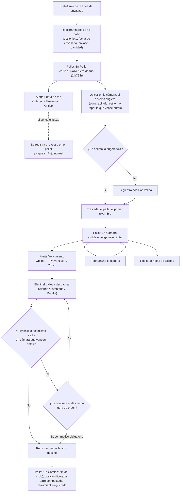

## 5.3 Eventos relevantes

| Evento | Descripción | Efecto en el sistema |
|---|---|---|
| Pallet ingresado | Hoy: se registra un pallet nuevo directo en la cámara. Esperado: queda en el patio (DPO-005) | Hoy se crean `lote`, `pallet` y `pallet_posicion`, sin `movimiento` (H-05). Esperado: se crea o reutiliza el `lote` (DPO-006), el pallet queda `PATIO` y se registra el `movimiento` de ingreso |
| Pallet ubicado en la cámara (esperado) | Un usuario pasa el pallet del patio a una posición | El pallet pasa a `EN_CAMARA`, se crea `pallet_posicion` en el primer nivel libre y se registra el `movimiento`. Se detiene el plazo fuera de frío |
| Plazo fuera de frío superado (esperado) | Un pallet sigue en el patio al cumplirse su plazo | Se registra el exceso en el pallet de forma permanente; el pallet sigue su flujo (DPO-003) |
| Ingreso editado o anulado (esperado) | Un usuario autorizado corrige o anula un ingreso | Se actualiza el pallet o se marca `ANULADO`, con motivo, y se registra el `movimiento` (DPO-022) |
| Pallet reubicado | Se guarda una reorganización | Se actualiza `pallet_posicion` y se crea un `movimiento` por cada pallet que cambió de lugar |
| Pallet despachado | Se registra la salida con destino | El estado pasa a `EN_CAMION`, se libera la posición, se compacta la torre y se registra el `movimiento` |
| Despacho fuera de orden | Se confirma un despacho habiendo pallets del mismo estilo que vencen antes | Hoy solo hay advertencia en pantalla y la decisión no se registra (H-28). Esperado: motivo obligatorio, guardado con el movimiento (DPO-024) |
| Pallet entra en estado crítico | Hoy: quedan menos de 6 horas para el límite del estilo. Esperado: alerta Fuera de frío (patio) o Vencimiento (cámara) en Crítico (DPO-002) | Se muestra en las alertas; no se persiste ni se notifica fuera de la aplicación |
| Nota de calidad registrada | Un usuario agrega una observación a un pallet | Se crea `nota_calidad` (hoy no hay un flujo de interfaz que la guarde, H-01 y H-02) |
| Usuario creado, editado o activado/desactivado | Operaciones de administración | Se actualiza `usuario`; no queda registro de auditoría |
| Configuración modificada | Cambio en catálogos o reglas de alerta | Se actualizan `tipo_envase`, `tipo_cerveza` o `parametro`; no queda registro de auditoría |
| Inicio y cierre de sesión | Autenticación | Se emite un JWT; el cierre de sesión solo borra el token en el navegador |

---

# 6. REGLAS DE NEGOCIO

En cada regla, **Implementación** indica dónde se aplica hoy: *front* (frontend), *back* (backend) o *BD* (base de datos). Si la descripción cambió por una decisión del PO (DPO-xxx), la implementación describe el código actual, que debe ajustarse.

## RN-001 — Límite de apilamiento de 4 niveles

**Descripción:** ninguna torre puede tener más de 4 pallets apilados. La única excepción es el Petainer, que puede ocupar un nivel extra en la cima (RN-028).
**Justificación:** seguridad laboral. El Project Charter la fundamenta en el D.S. N° 594, el Código del Trabajo y la Ley N° 16.744.
**Origen:** regulación, según la cita del Charter (falta verificar el artículo aplicable, PA-021).
**Aplica a:** RF-OPT-01, RF-ING-01, RF-CAM-01 · UC-003, UC-004, UC-014.
**Implementación:**
- front: `MAX_NIVELES = 4`;
- back: la reorganización acepta niveles del 1 al 4;
- BD: solo existen posiciones hasta el nivel permitido.

El ingreso no valida el límite en el backend (H-06).
**Excepciones:** el Petainer (RN-028). El parámetro del seed `MAX_NIVELES_PETAINER = 5` refleja esa excepción (DPO-012).

## RN-002 — Límites particulares por posición

**Descripción:** en la zona Barriles, B4 admite 3 niveles y C4 admite 2. En la zona Extra, D3 admite 2.
**Justificación:** restricciones físicas del layout de la cámara. En C4 el límite se debe al marco de la puerta (DPO-012).
**Origen:** cliente (layout físico).
**Aplica a:** RF-OPT-01, RF-CAM-01 · UC-004, UC-014.
**Implementación:** front (`MAX_NIVELES_POSICION`), back (reorganización) y BD (posiciones creadas por el seed).
**Excepciones:** el Petainer en B4 puede llegar al nivel 4 (RN-028). En C4 no hay excepción.

## RN-003 — Zonas por tipo de envase

**Descripción:**

| Zona | Posiciones | Envase permitido |
|---|---|---|
| Latas | A1–C3 | Caja de latas (cerveza) |
| Barriles | A4–C6 | Barril Euro, Barril Slim y Petainer (RN-028) |
| Extra | D2 | Solo latas: cerveza o Kombucha. Es la única posición de la Kombucha (RN-027) |
| Extra | D3 | Caja de latas o barril (no Petainer) |

**Justificación:** orden físico y compatibilidad de apilado.
**Origen:** cliente y PO (DPO-011, DPO-012).
**Aplica a:** RF-OPT-01, RF-ING-07, RF-CAM-01 · UC-004, UC-014, UC-025.
**Implementación:** front (`esPosicionValida`) y back (reorganización). El ingreso no la valida en el backend (H-06). Hoy la interfaz solo distingue Lata y Barril.
**Excepciones:** ninguna.

## RN-004 — Posiciones bloqueadas

**Descripción:** D1 (estante de lúpulos), D4, D5 y D6 no admiten pallets.
**Justificación:** son espacios ocupados o inexistentes en el layout.
**Origen:** cliente.
**Aplica a:** RF-GD-01, RF-OPT-01, RF-CAM-01.
**Implementación:** front (`POSICIONES_BLOQUEADAS`) y BD (esas posiciones no existen).
**Excepciones:** ninguna.

## RN-005 — La lata no se apila

**Descripción:** un pallet de lata (cerveza o Kombucha) solo ocupa una posición vacía (nivel 1) y no admite nada encima. Por eso el Petainer solo va en torres de barriles (RN-028).
**Justificación:** resistencia del envase y seguridad.
**Origen:** cliente.
**Aplica a:** RF-OPT-01, RF-ING-07, RF-CAM-01.
**Implementación:** front (`puedeApilar`) y back (reorganización).
**Excepciones:** ninguna.

## RN-006 — Capacidad de las bodegas

**Descripción:**

| Bodega | Capacidad | Detalle |
|---|---|---|
| Bodega 1 (cámara principal) | 45 posiciones-nivel | Zona Latas 9 + zona Barriles 33 + zona Extra 3 |
| Bodega 2 | 6 posiciones | — |
| Patio | Sin límite práctico | Valor de referencia: 9999 |

**Justificación:** refleja el espacio físico.
**Origen:** cliente y datos iniciales (seed).
**Aplica a:** RF-GD-01, RF-DSH-01, RF-CAM-04.
**Implementación:** BD (`bodega.capacidad`) y front (constante `CAMARA_CAPACIDAD = 45`, que no se lee de la BD).
**Excepciones:** con petainers en la cima, la cámara admite hasta 8 pallets más: el nivel 5 de las 7 torres de 4 niveles y el nivel 4 de B4 (RN-028). La capacidad de referencia sigue siendo 45.

## RN-007 — Plazo máximo fuera de frío por estilo

**Descripción:** cada estilo tiene un plazo máximo para pasar del patio a la cámara (DPO-001). Corre desde el registro del pallet en el patio y se detiene al ubicarlo en la cámara:
- Lager: 24 h.
- IPA: 24 h.
- Ámbar: 72 h.
- Stout: 72 h.
- Kombucha (Sprint 2): 12 h según el seed, por confirmar (PA-024).

Los valores se configuran por estilo (`horas_max_fuera_a_camara`).
**Justificación:** frescura del producto ("Delicada" o "Robusta" según la interfaz).
**Origen:** cliente; interpretación confirmada por el PO (DPO-001).
**Aplica a:** RF-FIFO-01, RF-FIFO-02, RF-FIFO-05, RF-CFG-02, RF-CFG-05.
**Implementación actual:** front (`FIFO_LIMITES_HORAS`, valores fijos), contando desde el envasado y también para los pallets en la cámara. El catálogo de cervezas tiene los mismos valores en `horas_max_fuera_a_camara`, pero el cálculo no los usa (H-07).
**Excepciones:** si el plazo se supera, aplica RN-029.

## RN-008 — Alertas Fuera de frío y Vencimiento

**Descripción:** hay dos alertas separadas, con nombres distintos (DPO-002).

| Nivel | Alerta **Fuera de frío** (pallets en el patio) | Alerta **Vencimiento** (pallets en la cámara) |
|---|---|---|
| Crítico | Menos de 6 horas restantes del plazo (RN-007) | 7 días o menos para vencer |
| Preventivo | Entre 6 y menos de 12 horas restantes | Entre 8 y 14 días para vencer |
| Óptimo | 12 horas o más | Más de 14 días |

Los umbrales son configurables (DPO-010).
**Justificación:** que el pallet entre a tiempo al frío y que salga antes de vencer.
**Origen:** cliente; separación definida por el PO (DPO-002).
**Aplica a:** RF-FIFO-01, RF-FIFO-02, RF-DSH-01, RF-INV-04, RF-ING-04.
**Implementación actual:** un solo criterio por pantalla. Alertas, Inventario y Detalle usan horas desde el envasado, con constantes fijas (el seed tiene `ALERTA_CRITICA_HORAS = 6` y `ALERTA_PREVENTIVA_HORAS = 12`, pero nada los lee). La Lista de ingresos usa días al vencimiento (H-08).
**Excepciones:** ninguna.

## RN-009 — Orden de salida por vencimiento dentro de cada estilo

**Descripción:** dentro de un mismo estilo, sale primero el pallet en cámara que vence antes. Como la vida útil es fija por estilo, coincide con el de fecha de envasado más antigua (FIFO). Despachar otro pallet exige confirmar y dar un motivo (RN-030).
**Justificación:** evitar mermas.
**Origen:** negocio (lógica FIFO del Charter) y PO (DPO-002, DPO-024).
**Aplica a:** RF-FIFO-03, RF-DES-01 · UC-012, UC-015.
**Implementación:** front (`RegistroDespachoForm`, `AlertaFIFODialog`).
**Excepciones:** el usuario puede despachar fuera de orden si indica el motivo (RN-030). Hoy basta con "Despachar de todos modos" y no queda registro (H-28).

## RN-010 — Cálculo del vencimiento

**Descripción:** vencimiento = fecha de envasado + vida útil del estilo (en días). La fecha de envasado es una fecha de calendario, sin hora, en la zona horaria de Chile (DPO-004). Si cambia la vida útil, los pallets ya registrados no se recalculan.
**Justificación:** control FEFO.
**Origen:** decisión interna.
**Aplica a:** RF-ING-01, RF-CFG-02, RF-ING-04.
**Implementación:** back (`crearPallet`).
**Excepciones:** ninguna.

## RN-011 — Cantidad por pallet según el envase

**Descripción:** la cantidad mínima es 1 y la máxima depende del envase, no del estilo (DPO-008, DPO-009):

| Envase | Unidad | Máximo por pallet |
|---|---|---|
| Caja de latas | Cajas | 72 |
| Barril Euro | Barriles | 16 |
| Barril Slim | Barriles | 15 |
| Petainer | Petainers | 9 |

El formulario propone el máximo (pallet completo), y el operario lo baja si el pallet viene incompleto. El Jefe o Calidad configuran los máximos (RF-CFG-01).
**Justificación:** capacidad física del pallet y prevención de errores de digitación.
**Origen:** cliente y PO (DPO-008, DPO-009).
**Aplica a:** RF-ING-01, RF-ING-05, RF-CFG-01.
**Implementación actual:** solo front, con un rango fijo de 1 a 60 "cajas" para todos los envases y un valor por defecto por estilo; el backend no valida el rango (H-06).
**Excepciones:** ninguna.

## RN-012 — Lotes

**Descripción:**
- El código de lote tiene el formato `AA-NNN`: AA son los dos últimos dígitos del año de producción y NNN el número de cocción o producción (DPO-007). Se escribe a mano o viene de Gestión Cervecera.
- El código es único por lote, y un lote puede repartirse en varios pallets (DPO-006).
- Si el código ya existe, el pallet se agrega a ese lote; su estilo y su fecha de envasado deben coincidir con los del lote.

**Justificación:** trazabilidad por lote.
**Origen:** modelo de datos y PO (DPO-006, DPO-007).
**Aplica a:** RF-ING-01, RF-ING-02, RF-ING-05.
**Implementación actual:** BD (`lote.codigo_lote UNIQUE`). Cada ingreso crea un lote nuevo con un número aleatorio, y un código repetido termina en "Error interno" (H-17).
**Excepciones:** ninguna.

## RN-013 — Despacho de pallets

**Descripción:**
- solo se despachan pallets `EN_CAMARA`;
- el destino es obligatorio (1–150 caracteres);
- sale el pallet completo, que pasa a `EN_CAMION` (DPO-023);
- se libera su posición y la torre se compacta;
- `EN_CAMION` es el estado final: no se usan Reservado ni Entregado (DPO-025);
- si hay pallets del mismo estilo que vencen antes, se exige un motivo (RN-030);
- pueden despachar el Jefe, Calidad y Reparto (DPO-016).

**Justificación:** refleja que el pallet ya no está físicamente en la cámara (HU-5.3).
**Origen:** HU-5.2 y HU-5.3; PO.
**Aplica a:** RF-DES-01 · UC-012.
**Implementación:** front y back. Hoy cualquier cargo puede despachar.
**Excepciones:** la HU usa el término "En Tránsito"; el sistema usa "En Camión". El despacho parcial (HU-5.4) queda para una versión posterior (DPO-023).

## RN-014 — Apilado al ubicar, inserción y compactación

**Descripción:**
- Al ubicar un pallet que viene del patio, solo se puede elegir el primer nivel libre de la torre (DPO-014).
- Al reorganizar, si se deja un pallet en un nivel ocupado, los pallets desde ese nivel hacia arriba suben uno, respetando el límite de la torre y que ningún pallet quede sobre un Petainer (RN-028).
- Al retirar un pallet, los que estaban encima bajan uno.
- Nunca quedan huecos ni niveles duplicados.

**Justificación:** coherencia física de la torre.
**Origen:** decisión interna y PO (DPO-014).
**Aplica a:** RF-ING-07, RF-CAM-01, RF-DES-01.
**Implementación:** front (`lib/apilado.ts`) y back (`palletOperation`).
**Excepciones:** hoy el ingreso permite elegir un nivel ocupado y no desplaza a nadie en el backend, así que pueden quedar dos pallets en el mismo nivel (H-18).

## RN-015 — Operaciones abiertas a todos los cargos

**Descripción:** cualquier cargo puede registrar ingresos en el patio, ubicar pallets en la cámara, cambiar la ubicación sugerida, reorganizar la cámara y registrar notas de calidad (DPO-016).
**Justificación:** todo el personal de planta mueve pallets.
**Origen:** PO (DPO-016), en línea con HU-6.1 ("cualquier usuario").
**Aplica a:** RF-ING-01, RF-ING-07, RF-OPT-02, RF-CAM-01, RF-CAL-01, RF-CAL-02.
**Implementación actual:** solo el Jefe reorganiza y elige otra ubicación: el frontend oculta los botones y el backend responde 403 al resto en la reorganización.
**Excepciones:** el Jefe puede cambiar esta matriz (RN-016).

## RN-016 — Administración, despacho y matriz de permisos

**Descripción:**
- Solo el Jefe de Planta administra usuarios, restablece contraseñas y edita la matriz de permisos (DPO-017, DPO-021).
- La configuración la administran el Jefe y el Encargado de Calidad (DPO-018).
- Despachan el Jefe, Calidad y Reparto; el Ayudante no (DPO-016).
- Editar y anular ingresos tiene un permiso propio, asignado por defecto solo al Jefe (DPO-022).
- El backend aplica la matriz vigente en cada operación (DPO-017).

**Justificación:** proteger la configuración crítica y separar funciones.
**Origen:** HU-1.2, HU-1.3 y HU-8.1; PO.
**Aplica a:** RF-USR-*, RF-CFG-*, RF-DES-01, RF-ING-05, RF-ING-06, RF-AUT-04.
**Implementación actual:** el frontend usa guardas de ruta y el backend verifica en la BD que el usuario sea un jefe activo en usuarios, configuración y reorganización. La matriz de la pantalla es fija (H-26) y Calidad se mapea a `OPERARIO` (H-27).
**Excepciones:** ninguna.

## RN-017 — Continuidad de la administración

**Descripción:** siempre debe existir al menos un Jefe de Planta activo, y ningún usuario puede desactivarse a sí mismo.
**Justificación:** evitar que el sistema quede sin administrador.
**Origen:** decisión interna.
**Aplica a:** RF-USR-03, RF-USR-04.
**Implementación:** back (transacción serializable con reintentos).
**Excepciones:** ninguna.

## RN-018 — Contraseña inicial

**Descripción:** la contraseña inicial son los últimos 5 dígitos numéricos del RUT. Solo sirve para el primer acceso: antes de operar, el sistema obliga a cambiarla por una que cumpla RN-019 (DPO-020). Lo mismo ocurre cuando el Jefe restablece una contraseña (DPO-021).
**Justificación:** facilitar el primer acceso sin dejar una contraseña predecible en uso.
**Origen:** cliente (mensaje en la pantalla de inicio de sesión) y PO (DPO-020).
**Aplica a:** RF-USR-02, RF-USR-06, RF-AUT-01, RF-AUT-06.
**Implementación actual:** back. El sistema no obliga a cambiarla (RSK-016, VAL-005).
**Excepciones:** es la única contraseña que no cumple RN-019, y solo mientras no se cambie.

## RN-019 — Política de contraseñas

**Descripción:** una sola política para todos (DPO-019): 12 a 72 caracteres, con al menos una mayúscula, una minúscula y un número, la defina el propio usuario o el Jefe.
**Justificación:** seguridad de las cuentas.
**Origen:** PO (DPO-019).
**Aplica a:** RF-PER-02, RF-USR-03, RF-AUT-06.
**Implementación actual:** front y back, con dos políticas: 12 caracteres con complejidad si la cambia el usuario, y 8 sin complejidad si la asigna el Jefe (H-15).
**Excepciones:** la contraseña inicial (RN-018).

## RN-020 — Usuarios inactivos

**Descripción:** un usuario inactivo no puede iniciar sesión ni operar. Los usuarios nunca se eliminan: se desactivan.
**Justificación:** conservar la trazabilidad histórica.
**Origen:** decisión interna.
**Aplica a:** RF-USR-04, RF-AUT-01.
**Implementación:** back (el login y la mayoría de las operaciones verifican `estado`).
**Excepciones:** un token emitido antes de la desactivación sigue sirviendo para consultar la grilla y el historial hasta que expira (RNF-SEG-002).

## RN-021 — Unicidad de RUT y correo

**Descripción:** no puede haber dos usuarios con el mismo RUT (comparado sin puntos ni guion) ni con el mismo correo.
**Justificación:** identidad única.
**Origen:** negocio.
**Aplica a:** RF-USR-02, RF-USR-03, RF-PER-02.
**Implementación:**
- correo: BD (`UNIQUE`);
- RUT: solo en la aplicación, porque la BD no lo exige (DT-009).

**Excepciones:** ninguna.

## RN-022 — Trazabilidad de operaciones logísticas

**Descripción:** cada ingreso, ubicación, despacho, reubicación, edición y anulación queda registrada con usuario, fecha y hora, posición de origen y destino (o destino del despacho), cantidad y, cuando corresponde, el motivo (RN-030, RN-031). Estos registros se conservan mientras dure el servicio (DPO-028).
**Justificación:** trazabilidad total por lote (OBJ-005).
**Origen:** HU-5.4, Charter y PO.
**Aplica a:** RF-MOV-01, RF-MOV-02, RF-AUD-01.
**Implementación:** back (tabla `movimiento`).
**Excepciones:** hoy los ingresos no generan movimiento (H-05) y las operaciones administrativas no se auditan.

## RN-023 — Desactivación lógica de catálogos

**Descripción:** los tipos de envase, los tipos de cerveza y las reglas de alerta se desactivan; no se eliminan.
**Justificación:** conservar las relaciones históricas con pallets y lotes.
**Origen:** decisión interna.
**Aplica a:** RF-CFG-01, RF-CFG-02, RF-CFG-03.
**Implementación:** back y BD (campo `activo`). El ingreso solo admite cervezas y envases activos.
**Excepciones:** ninguna.

## RN-024 — Reorganización atómica con control de concurrencia

**Descripción:** una reorganización se guarda completa o no se guarda. Además, solo se guarda si la cámara no cambió desde que se inició el modo Reorganizar.
**Justificación:** evitar estados físicos imposibles cuando varios usuarios operan a la vez.
**Origen:** decisión interna.
**Aplica a:** RF-CAM-01.
**Implementación:** back (transacción serializable, comparación con el estado `esperado`).
**Excepciones:** ninguna.

## RN-025 — Notas de calidad

**Descripción:** cualquier usuario activo puede registrar notas de calidad (DPO-016). Cada nota queda asociada a su autor y a la fecha, no se puede editar ni eliminar y se conserva mientras dure el servicio (DPO-028).
**Justificación:** trazabilidad de calidad.
**Origen:** HU-2.4, diagrama de actividad y PO.
**Aplica a:** RF-CAL-01, RF-CAL-02, RF-CAL-03.
**Implementación:** back (`PATCH /api/pallets/{id}`). Hoy ninguna pantalla la usa (H-01, H-02).
**Excepciones:** ninguna.

## RN-026 — Criterios de la sugerencia de ubicación

**Descripción:** entre las posiciones válidas para el envase y con espacio disponible, el sistema elige la de mayor puntaje. El nivel propuesto es siempre el primer nivel libre de la torre (DPO-014).

**Criterios actuales:**

| Criterio | Puntaje |
|---|---|
| Celda vacía | +20 |
| Por cada vecina (arriba, abajo, izquierda o derecha) con un pallet del mismo estilo | +10 |
| Cercanía a la fila A | +3 × (3 − fila) |
| Cercanía a la columna 3 | + (2 − \|columna − 2\|) |

En empate, gana la primera posición recorrida.

**Criterio agregado por el PO (DPO-015):** la sugerencia evita tapar pallets que vencen antes que el nuevo. Se propone descartar esas torres o penalizarlas por cada pallet que quedaría tapado, y mostrar en las razones y en "pallets a mover" los valores calculados.
**Justificación:** minimizar movimientos, agrupar por estilo y no bloquear lo que debe salir primero.
**Origen:** decisión interna, HU-2.3 (respetar el orden FIFO) y PO (DPO-015).
**Aplica a:** RF-OPT-01 · UC-004.
**Implementación actual:** solo front (`sugerirUbicacion`). El puntaje no considera el vencimiento, y las razones y "0 a mover" son texto fijo (H-22).
**Excepciones:** ninguna.

## RN-027 — Posición de la Kombucha (Sprint 2)

**Descripción:** la Kombucha viene en latas y solo puede ubicarse en D2. D2 también acepta cerveza en lata (DPO-011).
**Justificación:** es el único sitio disponible para ese producto dentro de la cámara.
**Origen:** PO (DPO-011).
**Aplica a:** RF-OPT-01, RF-ING-07, RF-CAM-01, RF-CFG-02.
**Implementación:** no implementada. El seed crea el estilo Kombucha, pero el ingreso no lo ofrece (H-07).
**Excepciones:** ninguna.

## RN-028 — Reglas del Petainer (Sprint 2)

**Descripción (DPO-012):**
- Un pallet lleva como máximo 9 petainers (RN-011).
- Solo va en torres de la zona de barriles (A4–C6), nunca sobre latas.
- Siempre queda en la cima: no admite ningún pallet encima.
- Puede ocupar un nivel sobre el límite de la torre: nivel 5 en A4, A5, A6, B5, B6, C5 y C6, y nivel 4 en B4.
- En C4 no pasa del nivel 2, porque choca con el marco de la puerta.

**Justificación:** el Petainer es liviano y cabe sobre una torre completa, salvo junto a la puerta.
**Origen:** PO (DPO-012).
**Aplica a:** RF-OPT-01, RF-ING-07, RF-CAM-01.
**Implementación:** no implementada. El seed tiene el envase Petainer y el parámetro `MAX_NIVELES_PETAINER = 5`, pero nada lo lee, y la BD no tiene posiciones de nivel 5.
**Excepciones:** ninguna.

## RN-029 — Exceso del plazo fuera de frío

**Descripción:** si un pallet sigue en el patio cuando se cumple su plazo (RN-007), el sistema registra el exceso en el pallet de forma permanente (cuándo se cumplió y cuántas horas estuvo fuera de frío). El pallet sigue su flujo normal: no se retiene ni se da de baja (DPO-003).
**Justificación:** trazabilidad de calidad sin detener la operación.
**Origen:** PO (DPO-003).
**Aplica a:** RF-FIFO-05, RF-GD-02, RF-ING-04.
**Implementación:** no implementada.
**Excepciones:** ninguna.

## RN-030 — Motivo de ruptura del orden de salida

**Descripción:** si se despacha un pallet habiendo otro del mismo estilo en cámara que vence antes, el motivo es obligatorio: se elige de una lista (por ejemplo, "Pedido de un lote específico", "Pallet más antiguo inaccesible" o "Problema de calidad") o se escribe (DPO-024). Queda registrado junto al movimiento del despacho.
**Justificación:** trazabilidad de las decisiones que se apartan del orden de salida.
**Origen:** PO (DPO-024).
**Aplica a:** RF-FIFO-03, RF-DES-01 · UC-012, UC-015.
**Implementación:** no implementada: hoy basta con confirmar (H-28).
**Excepciones:** ninguna.

## RN-031 — Edición y anulación de ingresos

**Descripción:** un ingreso se puede editar (lote, cantidad, envase y fecha de envasado) o anular por error de registro (DPO-022):
- la edición guarda en el historial los valores anteriores y los nuevos;
- la anulación exige un motivo y es lógica: el pallet pasa a `ANULADO`, libera su posición si la tenía y no se borra;
- cada acción tiene un permiso propio, asignado por defecto solo al Jefe.

**Justificación:** corregir errores sin perder la trazabilidad.
**Origen:** HU-3.2 y HU-3.3; PO (DPO-022).
**Aplica a:** RF-ING-05, RF-ING-06.
**Implementación:** no implementada: "Editar" y "Eliminar" de la lista de ingresos no hacen nada (H-04).
**Excepciones (propuesta):** no se anula un pallet ya despachado.

## RN-032 — Ingreso por el patio

**Descripción:** todo pallet se registra primero en el patio (estado `PATIO`) y después se ubica en la cámara (DPO-005). El plazo fuera de frío corre desde el registro en el patio (RN-007).
**Justificación:** refleja el recorrido físico del pallet (US-04, HU-3.1).
**Origen:** PO (DPO-005).
**Aplica a:** RF-ING-01, RF-ING-07, RF-FIFO-01.
**Implementación:** no implementada: hoy el ingreso ubica el pallet directo en la cámara.
**Excepciones:** ninguna.

---

# 7. CATÁLOGO GENERAL DE REQUISITOS

**Prioridad (MoSCoW).** La propuso este análisis, basada en el MVP del Charter, las HU, la PCU y la Carta Gantt. El Product Owner la aprobó con los ajustes de sus decisiones (DPO-033, §10).

**Responsable:**
- Para los requisitos que aparecen en la Carta Gantt, son las personas asignadas allí.
- Para el resto, se indica el área responsable.

## 7.1 Requisitos funcionales

| ID | Tipo | Nombre | Prioridad | Estado | Responsable | Origen |
|---|---|---|---|---|---|---|
| RF-AUT-01 | Funcional | Iniciar sesión con RUT o correo | Must | Implementado | Full-stack | HU-1.1 · CU-01 |
| RF-AUT-02 | Funcional | Cerrar sesión | Must | Implementado | Frontend | CU-21 |
| RF-AUT-03 | Funcional | Recuperar la contraseña con ayuda del Jefe | Should | Propuesto | Full-stack | CU-01 (el botón existe, sin acción) · DPO-021 |
| RF-AUT-04 | Funcional | Control de acceso por rol en la interfaz y la API | Must | Parcial | Full-stack | HU-1.1, HU-1.3 · DPO-016 |
| RF-AUT-05 | Funcional | Mantener la sesión al recargar la página | Should | Implementado | Frontend | Manual US-04 |
| RF-AUT-06 | Funcional | Obligar a cambiar la contraseña inicial en el primer acceso | Must | Propuesto | Full-stack | DPO-020 |
| RF-USR-01 | Funcional | Listar y buscar usuarios | Must | Implementado | Full-stack | HU-1.2 · CU-02 |
| RF-USR-02 | Funcional | Crear usuario | Must | Implementado | Full-stack | HU-1.2 · CU-02 |
| RF-USR-03 | Funcional | Editar usuario | Must | Implementado | Full-stack | HU-1.2 · CU-02 |
| RF-USR-04 | Funcional | Activar y desactivar usuario | Must | Implementado | Full-stack | HU-1.2 · CU-02 |
| RF-USR-05 | Funcional | Gestionar permisos por cargo | Must | Parcial | Full-stack | HU-1.3 · CU-02 · DPO-017 |
| RF-USR-06 | Funcional | Restablecer la contraseña de un usuario | Should | Propuesto | Full-stack | DPO-021 |
| RF-PER-01 | Funcional | Consultar mi perfil | Should | Implementado | Full-stack | CU-23 |
| RF-PER-02 | Funcional | Actualizar contacto y contraseña propios | Should | Implementado | Full-stack | CU-23 |
| RF-ING-01 | Funcional | Registrar el ingreso de un pallet en el patio | Must | Parcial | Full-stack | HU-2.1, HU-2.5 · CU-03 · US-04 · DPO-005 |
| RF-ING-02 | Funcional | Registrar varios pallets de un lote en una operación | Should | Propuesto | Full-stack | HU-2.2 · CU-03 · DPO-006 |
| RF-ING-03 | Funcional | Adjuntar fotos al pallet | Could | Parcial | Full-stack | CU-03 · DPO-026 (Sprint 2 o después) |
| RF-ING-04 | Funcional | Consultar la lista de ingresos | Must | Implementado | Full-stack | HU-3.1 · CU-06 |
| RF-ING-05 | Funcional | Editar un ingreso | Should | Propuesto | Full-stack | HU-3.2 · CU-06 · DPO-022 |
| RF-ING-06 | Funcional | Anular un ingreso registrado por error, con motivo | Should | Propuesto | Full-stack | HU-3.3 · CU-06 · DPO-022 |
| RF-ING-07 | Funcional | Ubicar en la cámara un pallet del patio | Must | Propuesto | Full-stack | HU-3.1 · US-04 · DPO-005 |
| RF-OPT-01 | Funcional | Sugerir la ubicación óptima al ubicar en la cámara | Must | Parcial | Javier M., Francisco H. | HU-2.3 · CU-04 · Gantt · DPO-015 |
| RF-OPT-02 | Funcional | Rechazar la sugerencia y elegir otra ubicación, con justificación | Should | Parcial | Javier M., Francisco H. | HU-7.2 · Gantt |
| RF-OPT-03 | Funcional | Organización diaria asistida al retirar stock | Should | Propuesto | Javier M., Ángel L. | HU-7.1 · CU-20 · Gantt |
| RF-GD-01 | Funcional | Visualizar el gemelo digital 2D de la cámara | Must | Implementado | Ángel L., Francisco H. | HU-4.3 · CU-09 · Gantt |
| RF-GD-02 | Funcional | Ver el detalle del pallet desde el mapa | Must | Implementado | Ángel L., Javier M. | HU-4.4 · CU-10 · Gantt |
| RF-GD-03 | Funcional | Operar en computador, tablet y celular | Must | Implementado (verificación pendiente) | Ángel L., Francisco H. | Gantt · Charter |
| RF-MB-01 | Funcional | Vista consolidada multi-bodega | Should | Parcial | Javier M., Francisco H. | Gantt · CU-24 |
| RF-MB-02 | Funcional | Tránsitos entre bodegas | Should | Propuesto | Javier M., Francisco H. | Gantt · HU-3.1 |
| RF-MB-03 | Funcional | Editor gráfico de planos (layout builder) | Could | Propuesto | Ángel L., Giorgio C. | Gantt · Charter |
| RF-CAM-01 | Funcional | Reorganizar la cámara | Must | Parcial | Full-stack | HU-6.1, HU-3.4 · CU-14 · US-R9 · DPO-016 |
| RF-CAM-02 | Funcional | Mover un pallet indicando la ubicación en texto | Could | Propuesto | Frontend | HU-3.4, HU-6.1 |
| RF-CAM-03 | Funcional | Editar los datos de un pallet | Should | Propuesto | Full-stack | HU-3.4 · CU-07 |
| RF-CAM-04 | Funcional | Mostrar la ocupación de la cámara | Should | Parcial | Frontend | HU-6.3 · CU-22 |
| RF-INV-01 | Funcional | Conteo físico de inventario (ciego, dirigido, cíclico) | Could | Propuesto | Francisco C., Giorgio C. | Gantt · Charter |
| RF-INV-02 | Funcional | Mapa de calor de discrepancias | Could | Propuesto | Francisco C., Javier M. | Gantt |
| RF-INV-03 | Funcional | Aprobación de reajustes de inventario | Could | Propuesto | Francisco C., Javier M. | Gantt |
| RF-INV-04 | Funcional | Consultar el inventario de la cámara con filtros | Must | Implementado | Frontend | HU-4.1, HU-4.2 · CU-08 · US-R2 |
| RF-INV-05 | Funcional | Consultar el inventario por ubicación (Patio, Bodega 2) | Should | Implementado | Full-stack | CU-24 |
| RF-FIFO-01 | Funcional | Calcular las alertas Fuera de frío y Vencimiento | Must | Parcial | Full-stack | HU-5.1 · DPO-001, DPO-002 |
| RF-FIFO-02 | Funcional | Consultar las alertas por criticidad | Must | Parcial | Frontend | HU-5.1 · CU-11 · DPO-002 |
| RF-FIFO-03 | Funcional | Advertir la ruptura del orden de salida al despachar y exigir el motivo | Must | Parcial | Full-stack | HU-6.2 · CU-15 · US-R11 · DPO-024 |
| RF-FIFO-04 | Funcional | Advertir la ruptura del orden FIFO al reorganizar | Should | Propuesto | Frontend | HU-6.2 |
| RF-FIFO-05 | Funcional | Registrar en el pallet el exceso del plazo fuera de frío | Should | Propuesto | Backend | DPO-003 |
| RF-DES-01 | Funcional | Registrar el despacho con destino | Must | Implementado | Full-stack | HU-5.2, HU-5.3 · CU-12 · US-R5/R7 |
| RF-DES-02 | Funcional | Registrar la cantidad de cajas despachadas (despacho parcial) | Won't (esta versión) | Propuesto | Full-stack | HU-5.4 · DPO-023 |
| RF-DES-03 | Funcional | Completar el ciclo de salida (despachado, entregado) | Won't | Descartado | Full-stack | Modelo de datos · DPO-025 |
| RF-CAL-01 | Funcional | Registrar una nota de calidad al ingresar | Should | Parcial | Full-stack | HU-2.4 · CU-05 |
| RF-CAL-02 | Funcional | Registrar una nota de calidad desde el detalle del lote | Should | Parcial | Full-stack | HU-2.4 · CU-05 |
| RF-CAL-03 | Funcional | Consultar el historial de notas | Should | Implementado | Full-stack | HU-4.4 · CU-10 |
| RF-MOV-01 | Funcional | Registrar automáticamente los movimientos | Must | Parcial | Backend | HU-5.4 |
| RF-MOV-02 | Funcional | Consultar el historial de ingresos, despachos y movimientos | Must | Implementado | Full-stack | HU-5.4 · CU-13 |
| RF-AUD-01 | Funcional | Bitácora inalterable de cambios | Should | Parcial | Francisco H., Javier M. | Gantt · Charter |
| RF-AUD-02 | Funcional | Reproducción histórica e informes consolidados | Should | Propuesto | Giorgio C., Francisco C. | HU-7.4 · CU-17 · Gantt |
| RF-AUD-03 | Funcional | Visualizar y filtrar los logs de usuarios | Should | Parcial | Full-stack | HU-7.5 · CU-18 |
| RF-INT-01 | Funcional | Sincronización bidireccional con Gestión Cervecera | Should | Propuesto | Javier M., Francisco H. | Charter · Gantt |
| RF-INT-02 | Funcional | Comparar el inventario con Gestión Cervecera | Should | Propuesto | Full-stack | HU-7.3 · CU-16 |
| RF-CFG-01 | Funcional | Administrar tipos de envase y su cantidad máxima por pallet | Should | Parcial | Full-stack | CU-19 · DPO-009 |
| RF-CFG-02 | Funcional | Administrar tipos de cerveza | Must | Implementado | Full-stack | HU-8.1 · CU-19 |
| RF-CFG-03 | Funcional | Administrar reglas y umbrales de alerta | Should | Parcial | Full-stack | CU-19 · DPO-002 |
| RF-CFG-04 | Funcional | Configurar los umbrales de temperatura de la cámara | Won't | Descartado | Full-stack | HU-8.1 · DPO-027 |
| RF-CFG-05 | Funcional | Aplicar la configuración vigente en los cálculos | Must | Propuesto | Full-stack | HU-8.1 · H-07 · DPO-010 |
| RF-DSH-01 | Funcional | Panel principal con indicadores | Should | Parcial | Frontend | HU-6.3 · CU-22 · DPO-025 |
| RF-NTF-01 | Funcional | Notificar el resultado de las operaciones | Should | Implementado | Frontend | US-R14 |
| RF-NTF-02 | Funcional | Generar alertas persistentes y avisos proactivos | Could | Propuesto | Backend | Tabla `alerta` · Charter |

**Resumen de estados:** 65 requisitos funcionales. 19 están implementados, 20 parciales, 24 propuestos y 2 descartados por decisión del PO. La versión 0.1 tenía 61 (27, 12 y 22): las decisiones del PO agregaron 4 requisitos, ampliaron el alcance de 8 que pasaron de implementados a parciales y descartaron 2.

## 7.2 Requisitos no funcionales

| ID | Tipo | Nombre | Prioridad | Estado | Responsable |
|---|---|---|---|---|---|
| RNF-PER-001 | Rendimiento | El mapa de la cámara carga en ≤ 500 ms (p95) | Must | Por verificar | Full-stack |
| RNF-PER-002 | Rendimiento | Operaciones de escritura en ≤ 2 s (p95) | Should | Por verificar | Backend |
| RNF-PER-003 | Rendimiento | Las vistas se actualizan tras cada operación sin recargar | Must | Implementado | Frontend |
| RNF-CAP-001 | Capacidad | Capacidad de bodegas según RN-006 | Must | Implementado | Backend |
| RNF-CAP-002 | Capacidad | ≥ 10 usuarios concurrentes | Should | Por verificar | Full-stack |
| RNF-CAP-003 | Capacidad | Historial completo consultable (paginado) | Should | Propuesto | Full-stack |
| RNF-ESC-001 | Escalabilidad | Bodegas y posiciones configurables sin cambiar código | Should | Parcial | Full-stack |
| RNF-DIS-001 | Disponibilidad | ≥ 90 % durante la fase de pruebas (Kickoff, DPO-030) | Must | Por verificar | DevOps |
| RNF-DIS-002 | Disponibilidad | Reinicio automático de servicios caídos | Must | Implementado | DevOps |
| RNF-CON-001 | Confiabilidad | Operaciones de cámara atómicas | Must | Implementado | Backend |
| RNF-CON-002 | Confiabilidad | Aviso claro y reintento ante cortes de conexión (sin modo sin conexión, DPO-029) | Could | Propuesto | Frontend |
| RNF-CON-003 | Confiabilidad | Verificación de salud de la API y la BD | Should | Implementado | Backend |
| RNF-SEG-001 | Seguridad | Contraseñas con hash bcrypt (costo ≥ 12) | Must | Implementado | Backend |
| RNF-SEG-002 | Seguridad | JWT obligatorio en todos los endpoints salvo login y salud | Must | Parcial | Backend |
| RNF-SEG-003 | Seguridad | Autorización por rol verificada en el backend | Must | Parcial | Backend |
| RNF-SEG-004 | Seguridad | HTTPS obligatorio en producción | Must | Parcial | DevOps |
| RNF-SEG-005 | Seguridad | Secretos solo por variables de entorno, sin valores por defecto | Must | Parcial | Backend / DevOps |
| RNF-SEG-006 | Seguridad | Validación de toda entrada en el servidor con esquemas | Must | Parcial | Backend |
| RNF-SEG-007 | Seguridad | Límite de intentos de inicio de sesión | Should | Propuesto | Backend |
| RNF-SEG-008 | Seguridad | CORS restringido a orígenes conocidos | Must | Implementado | Backend |
| RNF-SEG-009 | Seguridad | El rol no se puede alterar desde el cliente | Must | Propuesto | Frontend |
| RNF-SEG-010 | Seguridad | Contenedores sin privilegios de administrador (root) | Should | Parcial | DevOps |
| RNF-SEG-011 | Seguridad | El token no queda expuesto a scripts (XSS) | Should | Propuesto | Full-stack |
| RNF-PRI-001 | Privacidad | Tratamiento de datos personales conforme a la ley | Must | Parcial | PO / Backend |
| RNF-PRI-002 | Privacidad | La API nunca devuelve contraseñas ni hashes | Must | Implementado | Backend |
| RNF-PRI-003 | Privacidad | Política de retención de datos (mientras dure el servicio, DPO-028) | Should | Propuesto | PO |
| RNF-USA-001 | Usabilidad | Objetivos táctiles de ≥ 44 × 44 px, usables con guantes | Must | Implementado (verificar) | Frontend / UX |
| RNF-USA-002 | Usabilidad | Estado comunicado con texto, icono y color | Must | Implementado | Frontend / UX |
| RNF-USA-003 | Usabilidad | Prevención de errores en formularios | Must | Implementado | Frontend |
| RNF-USA-004 | Usabilidad | Confirmación o deshacer ante acciones irreversibles | Should | Parcial | Frontend |
| RNF-USA-005 | Usabilidad | Ayuda contextual | Could | Propuesto | Frontend / UX |
| RNF-USA-006 | Usabilidad | Interfaz en español de Chile con la terminología de la planta | Must | Implementado | Frontend |
| RNF-ACC-001 | Accesibilidad | Contraste mínimo 4,5:1 (WCAG 2.1 AA) | Should | Por verificar | Frontend / UX |
| RNF-ACC-002 | Accesibilidad | Controles con nombre accesible y diálogos con semántica ARIA | Should | Parcial | Frontend |
| RNF-COM-001 | Compatibilidad | Últimas 2 versiones de Chrome, Edge, Firefox y Safari | Must | Por verificar | QA |
| RNF-COM-002 | Compatibilidad | Pantallas desde 360 px de ancho | Must | Implementado (verificar) | Frontend |
| RNF-MAN-001 | Mantenibilidad | TypeScript en modo estricto | Must | Implementado | Full-stack |
| RNF-MAN-002 | Mantenibilidad | Pruebas automáticas de la lógica crítica, ejecutadas en CI | Must | Parcial | QA / DevOps |
| RNF-MAN-003 | Mantenibilidad | Documentación técnica actualizada en cada entrega | Must | Parcial | Todo el equipo |
| RNF-MAN-004 | Mantenibilidad | Reglas de negocio en el backend y parámetros configurables | Should | Propuesto | Backend |
| RNF-POR-001 | Portabilidad | Despliegue en contenedores configurados por variables de entorno | Must | Implementado | DevOps |
| RNF-POR-002 | Portabilidad | Instalable en la infraestructura del cliente | Must | Parcial | DevOps |
| RNF-OBS-001 | Observabilidad | Logs estructurados | Should | Propuesto | Backend |
| RNF-OBS-002 | Observabilidad | Monitoreo de disponibilidad y alertas técnicas | Should | Propuesto | DevOps |
| RNF-OBS-003 | Observabilidad | Endpoint de salud | Must | Implementado | Backend |

**Resumen de estados:** 45 requisitos no funcionales. 16 están implementados (2 de ellos con verificación pendiente), 12 parciales, 11 propuestos y 6 por verificar (los que aún no se han medido).

---

# 8. REQUISITOS FUNCIONALES

**Formato de las fichas:**
- Los requisitos **implementados o parciales** usan la ficha completa de la plantilla. Si un requisito es parcial, la ficha describe cómo debe quedar y la **Observación** indica qué falta.
- Los requisitos **propuestos** usan una ficha resumida con el alcance esperado.
- El detalle de cada pantalla (etiquetas, *placeholders* y mensajes) está en REF-08.
- Las validaciones se centralizan en §31, los errores en §32–§33 y los criterios de aceptación en §75.

## 8.1 Autenticación y sesión (AUT)

### RF-AUT-01 — Iniciar sesión con RUT o correo

**Descripción:** el sistema deberá autenticar a un usuario activo con su RUT (con o sin puntos y guion) o su correo, más su contraseña, y abrirle una sesión con el rol de su cargo.
**Objetivo relacionado:** OBJ-008
**Actor principal:** ACT-001, ACT-002, ACT-003, ACT-004
**Actores secundarios:** —
**Prioridad:** Must · **Estado:** Implementado

**Precondiciones:**
- La cuenta existe y está activa.
- El backend está disponible.

**Entradas:**

| Campo | Tipo | Obligatorio | Validación |
|---|---|---|---|
| RUT o correo (`identificador`) | Texto | Sí | No vacío. Se busca como RUT literal, como RUT sin `.` ni `-` y como correo en minúsculas (VAL-009) |
| Contraseña (`password`) | Texto oculto | Sí | No vacía. Se compara con el hash bcrypt |

**Proceso:**
1. El usuario escribe sus credenciales y pulsa **Ingresar**.
2. La ruta interna de Next.js `/api/auth/login` comprueba que vengan ambos datos y los reenvía a `POST /api/auth/login` (API-001).
3. El backend busca un usuario **activo** que coincida y compara la contraseña con bcrypt.
4. Traduce el tipo de usuario a un rol (§29.2) y emite un JWT con `idUsuario`, `rut`, `correo` y `rol`, válido por 8 h por defecto.
5. El frontend guarda el token en `localStorage`, fija el rol y el RUT en memoria y redirige al Panel principal. Recién entonces se consultan los datos que exigen sesión, como `GET /api/actividad`.

**Salidas:**
- Token de sesión, rol y datos básicos del usuario (nunca la contraseña).
- Menú lateral filtrado según el rol.
- Si hay error, el mensaje aparece bajo el formulario.

**Postcondiciones:** la sesión queda activa hasta que se cierra o expira el token.
**Reglas de negocio relacionadas:** RN-018, RN-020
**Dependencias:** —
**Errores posibles:** ERR-001, ERR-002, ERR-005, ERR-034, ERR-037
**Casos de uso relacionados:** UC-001
**Criterios de aceptación:** CA-RF-AUT-01-01, CA-RF-AUT-01-02, CA-RF-AUT-01-03

**Observaciones:**
- No hay límite de intentos (RNF-SEG-007).
- El token queda en `localStorage` (RNF-SEG-011).
- Un tipo de usuario no mapeado recibe `JEFE_PLANTA` por defecto (H-11). Debe quedar sin acceso.
- Al recargar la página, la sesión se restaura desde el token guardado (RF-AUT-05).
- Si el usuario entra con la contraseña inicial o con una restablecida, debe cambiarla antes de operar (RF-AUT-06).

### RF-AUT-02 — Cerrar sesión

**Descripción:** el sistema deberá permitir que el usuario cierre su sesión desde el menú lateral.
**Objetivo relacionado:** OBJ-008 · **Actor principal:** ACT-001…ACT-004
**Prioridad:** Must · **Estado:** Implementado
**Precondiciones:** hay una sesión iniciada.
**Entradas:** botón **Cerrar sesión** (sin datos).

**Proceso:**
1. Se borra el token de `localStorage`.
2. Se limpian el rol y el RUT en memoria.
3. Se redirige a `/login`.

**Salidas:** pantalla de inicio de sesión.
**Postcondiciones:** el navegador ya no tiene credenciales.
**Casos de uso relacionados:** UC-021 · **Criterios de aceptación:** CA-RF-AUT-02-01
**Observaciones:** el servidor no invalida el token, que sigue siendo válido hasta que expira (H-30). Se propone usar tokens de vida corta con renovación, o una lista de revocación (§30).

### RF-AUT-03 — Recuperar la contraseña con ayuda del Jefe

**Descripción:** cuando un usuario olvida su contraseña, el sistema deberá indicarle que la pida al Jefe de Planta, quien la restablece desde Usuarios (RF-USR-06). No se usa correo (DPO-021).
**Prioridad:** Should · **Estado:** Propuesto (el botón "¿Olvidaste tu contraseña?" existe, pero no hace nada, H-20)

**Alcance:**
- "¿Olvidaste tu contraseña?" muestra un mensaje del tipo: "Pide al Jefe de Planta que restablezca tu contraseña".
- El Jefe la restablece (RF-USR-06) y el usuario entra con la contraseña inicial.
- En el primer acceso, el sistema obliga a definir una nueva, con la política de RN-019 (RF-AUT-06).

**Dependencias:** RF-USR-06, RF-AUT-06 · **Criterios de aceptación:** CA-RF-AUT-03-01

### RF-AUT-04 — Control de acceso por rol en la interfaz y la API

**Descripción:** el sistema deberá mostrar a cada usuario solo las pantallas y acciones de su rol, y **verificar en el backend** cada operación restringida, tomando el rol únicamente del token o de la BD.
**Objetivo relacionado:** OBJ-008 · **Actor principal:** todos
**Prioridad:** Must · **Estado:** Parcial

**Entradas:** el rol, que proviene del JWT y del registro del usuario en la BD.

**Proceso:**
1. El menú y las rutas se filtran según la matriz vigente (§29.3), que el Jefe puede editar (RF-USR-05).
2. Cada endpoint aplica autenticación y autorización con esa misma matriz.

**Salidas:** si el rol no tiene permiso, la pantalla redirige y la API responde 403.
**Reglas de negocio relacionadas:** RN-015, RN-016 · **Errores posibles:** ERR-003, ERR-004, ERR-006, ERR-007
**Criterios de aceptación:** CA-RF-AUT-04-01, CA-RF-AUT-04-02, CA-RF-AUT-04-03

**Observaciones (qué falta):**
- El menú lateral tiene un selector "Perfil" que cambia el rol solo en el navegador (H-10).
- ~~Varias pantallas no tienen guarda de ruta: Cámara, Alertas, Inventario, Patio, Bodega 2 y Mi perfil.~~ Resuelto en la versión 0.3: `AppShell` exige sesión en todas las rutas salvo `/login` (RF-AUT-05). Esas pantallas están abiertas a todos los cargos, así que no requieren guarda por rol; las exclusivas del Jefe (Usuarios, Configuración, Lista de ingresos, Ingresos y despachos) mantienen `useRequireRole`.
- El backend no exige sesión para `GET /api/warehouses/main/grid`, `POST /api/pallets` ni `GET /api/pallets/lista`.

### RF-AUT-05 — Mantener la sesión al recargar la página

**Descripción:** al cargar la aplicación con un token vigente, el sistema deberá restaurar la sesión (rol, RUT y menú) sin pedir de nuevo las credenciales. Si no hay token o expiró, deberá llevar al usuario al login.
**Objetivo relacionado:** OBJ-008 · **Actor principal:** ACT-001…ACT-004
**Prioridad:** Should · **Estado:** Implementado (`frontend_corte@a7f46a0`)
**Motivo:** antes, al recargar (F5), se perdían el menú, el rol y las ventanas globales, y las pantallas sin guarda (por ejemplo, Inventario) quedaban abiertas sin sesión; así lo documentaba el manual US-04 (REF-09). En producción esto se veía como "después del login quedo en Inventario sin menú".

**Precondiciones:** el navegador tiene `corte_token` en `localStorage` (lo guarda RF-AUT-01).
**Entradas:** el JWT guardado. Su *payload* trae `rut`, `rol` y `exp`.

**Proceso:**
1. Al montar la aplicación, `AppProvider` lee `corte_token` y decodifica su *payload* (sin verificar la firma: la verifica el backend en cada solicitud).
2. Si el token expiró (`exp`) o el rol no es uno de los cuatro de la aplicación, borra el token y deja la sesión cerrada.
3. Si es válido, restaura el rol y el RUT en memoria y marca la sesión como iniciada.
4. Al terminar, activa `sessionReady`. Mientras es `false`, no se muestran pantallas protegidas ni se redirige, para no expulsar al usuario antes de restaurar la sesión.
5. Con `sessionReady` activo, la guardia central de `AppShell` decide:
   - sin sesión, en cualquier ruta distinta de `/login` → redirige a `/login`;
   - con sesión, en `/login` → redirige al Panel principal (`/dashboard`).
6. `useRequireRole` espera también a `sessionReady` antes de aplicar la guarda por rol (RF-AUT-04).
7. `GET /api/actividad`, que exige JWT, solo se consulta con la sesión iniciada. Así se evitan los 401 repetidos en la pantalla de login.

**Salidas:** la misma pantalla que el usuario tenía abierta, con su menú y su rol; o la pantalla de login.
**Postcondiciones:** la sesión dura lo mismo que el token (8 h por defecto, §30).
**Dependencias:** RF-AUT-01, RF-AUT-04
**Casos de uso relacionados:** UC-001
**Criterios de aceptación:** CA-RF-AUT-05-01, CA-RF-AUT-05-02, CA-RF-AUT-05-03

**Observaciones:**
- La especificación original proponía consultar `GET /api/auth/me` (API-002). Se optó por decodificar el JWT en el navegador porque ya trae el rol y no agrega una solicitud al cargar. En consecuencia, si el Jefe desactiva al usuario o le cambia el cargo, el cambio se ve recién cuando el token expira o cuando una solicitud responde 401 o 403. Usar API-002 al cargar sigue siendo la mejora recomendada (§30, RN-020).
- Si el token expira **durante** la sesión, la pantalla sigue mostrando el error de la API sin redirigir (§30; caso 7 de §15).

### RF-AUT-06 — Obligar a cambiar la contraseña inicial en el primer acceso

**Descripción:** si un usuario inicia sesión con la contraseña inicial (RN-018), ya sea en su primer acceso o después de un restablecimiento (RF-USR-06), el sistema deberá obligarlo a definir una nueva contraseña antes de mostrarle cualquier otra pantalla (DPO-020).
**Prioridad:** Must · **Estado:** Propuesto

**Alcance propuesto:**
- Una marca en la cuenta (por ejemplo, `debe_cambiar_password`) que se activa al crear el usuario y al restablecer su contraseña.
- Con la marca activa, el backend solo acepta el cambio de contraseña y el cierre de sesión (responde ERR-045 al resto).
- La nueva contraseña cumple RN-019 y no puede ser igual a la inicial. Al guardarla, la marca se desactiva.

**Reglas de negocio relacionadas:** RN-018, RN-019 · **Casos de uso relacionados:** UC-001 (flujo alternativo A)
**Criterios de aceptación:** CA-RF-AUT-06-01

## 8.2 Usuarios y permisos (USR)

### RF-USR-01 — Listar y buscar usuarios

**Descripción:** el sistema deberá listar todos los usuarios, con su cargo y estado, y permitir buscarlos y filtrarlos.
**Objetivo relacionado:** OBJ-008 · **Actor principal:** ACT-001
**Prioridad:** Must · **Estado:** Implementado
**Precondiciones:** sesión de un Jefe de Planta activo.

**Entradas:**

| Campo | Tipo | Obligatorio | Validación |
|---|---|---|---|
| Buscar | Texto | No | Busca texto contenido en nombre, apellido, cargo, RUT o correo, sin distinguir mayúsculas |
| Estado | Lista: Cualquiera / Activo / Inactivo | No | Valor por defecto: Cualquiera |

**Proceso:**
1. `GET /api/usuarios` (API-004) devuelve la lista ordenada por nombre.
2. La búsqueda y el filtro se aplican en el navegador.

**Salidas:** tabla con Nombre, Apellido, Cargo, RUT, Correo, Teléfono, un enlace para editar y el estado (interruptor + texto), y el contador de usuarios.
**Errores posibles:** ERR-003, ERR-004, ERR-006, ERR-034, ERR-036
**Casos de uso relacionados:** UC-002 · **Criterios de aceptación:** CA-RF-USR-01-01
**Observaciones:** la búsqueda por RUT no encuentra el dígito verificador "K", porque compara en minúsculas (H-16).

### RF-USR-02 — Crear usuario

**Descripción:** el sistema deberá permitir que el Jefe de Planta cree una cuenta con los datos personales y el cargo del trabajador, asignándole una contraseña inicial.
**Objetivo relacionado:** OBJ-008 · **Actor principal:** ACT-001
**Prioridad:** Must · **Estado:** Implementado
**Precondiciones:**
- Sesión de un Jefe activo.
- El tipo de usuario existe en `tipo_usuario`.

**Entradas:**

| Campo | Tipo | Obligatorio | Validación |
|---|---|---|---|
| RUT (`rut`) | Texto (máx. 20) | Sí | VAL-001: se normaliza y se valida el formato `^\d{7,8}[\dK]$`; debe ser único |
| Nombre (`nombre`) | Texto (1–100) | Sí | VAL-006 |
| Apellido paterno (`apellido`) | Texto (1–100) | Sí | VAL-006 |
| Apellido materno (`apellido_materno`) | Texto (máx. 100) | No | VAL-006 |
| Correo electrónico (`correo`) | Email (máx. 150) | Sí | VAL-002: formato email, se guarda en minúsculas, debe ser único |
| Teléfono (`telefono`) | Texto (máx. 30) | No | VAL-007 |
| Tipo de usuario (`id_tipo_usuario`) | Lista | Sí | VAL-008: Jefe de planta · Ayudante (por defecto) · Calidad · Personal de reparto |

**Proceso:**
1. `POST /api/usuarios` (API-005).
2. El backend valida los datos y verifica que el RUT y el correo sean únicos.
3. Genera la contraseña inicial (RN-018) y la guarda con bcrypt (costo 12).
4. Crea el usuario activo.

**Salidas:**
- El usuario creado (sin contraseña) y el aviso "Usuario creado correctamente".
- La lista de usuarios se recarga.

**Postcondiciones:** existe una cuenta activa que puede iniciar sesión con la contraseña inicial.
**Reglas de negocio relacionadas:** RN-018, RN-021 · **Dependencias:** RF-USR-01
**Errores posibles:** ERR-006, ERR-011, ERR-012, ERR-013, ERR-014, ERR-034
**Casos de uso relacionados:** UC-002 · **Criterios de aceptación:** CA-RF-USR-02-01, CA-RF-USR-02-02
**Observaciones:**
- La opción aparece como "Jefe de plata" en la interfaz (H-14).
- No se valida el dígito verificador del RUT (H-16).
- No se obliga a cambiar la contraseña inicial en el primer acceso (RSK-016). Debe hacerse con RF-AUT-06 (DPO-020).

### RF-USR-03 — Editar usuario

**Descripción:** el sistema deberá permitir que el Jefe de Planta modifique los datos, el cargo y el estado de un usuario, y que le asigne una nueva contraseña.
**Objetivo relacionado:** OBJ-008 · **Actor principal:** ACT-001
**Prioridad:** Must · **Estado:** Implementado
**Precondiciones:** sesión de un Jefe activo; el usuario existe.

**Entradas:** los campos de RF-USR-02, más estos dos:

| Campo | Tipo | Obligatorio | Validación |
|---|---|---|---|
| Estado (`estado`) | Booleano (Activo / Inactivo) | Sí | No se muestra al editar la propia cuenta. No se puede desactivar ni cambiar de cargo al último Jefe activo |
| Nueva contraseña (`password`) | Texto oculto (12–72) | No | VAL-003: la misma política que el perfil (DPO-019). Si se deja vacía, se conserva la contraseña actual |

**Proceso:**
1. `GET /api/usuarios/{id}` precarga el formulario (API-006).
2. `PUT /api/usuarios/{id}` (API-007) ejecuta una transacción serializable que:
   - verifica la regla del último jefe;
   - valida el tipo de usuario y que el RUT y el correo sean únicos;
   - actualiza los datos.

**Salidas:** el usuario actualizado; se redirige a `/usuarios`.
**Postcondiciones:** los datos, el cargo y el estado quedan actualizados; la contraseña cambia si se indicó una nueva.
**Reglas de negocio relacionadas:** RN-017, RN-019, RN-021
**Errores posibles:** ERR-008, ERR-009, ERR-011 a ERR-017, ERR-034
**Casos de uso relacionados:** UC-002 · **Criterios de aceptación:** CA-RF-USR-03-01, CA-RF-USR-03-02, CA-RF-USR-03-03
**Observaciones:** hoy la contraseña que asigna el Jefe solo exige 8 caracteres, sin complejidad (VAL-004, H-15). Debe exigir la política única de RN-019 (DPO-019).

### RF-USR-04 — Activar y desactivar usuario

**Descripción:** el sistema deberá permitir activar o desactivar una cuenta, previa confirmación, sin eliminarla.
**Objetivo relacionado:** OBJ-008 · **Actor principal:** ACT-001
**Prioridad:** Must · **Estado:** Implementado

**Entradas:**

| Campo | Tipo | Obligatorio | Validación |
|---|---|---|---|
| Estado (`estado`) | Booleano | Sí | VAL-022. No se puede aplicar sobre la propia cuenta; se aplica la regla del último jefe |
| Confirmación | Diálogo Aceptar / Cancelar | Sí | — |

**Proceso:**
1. El interruptor abre un diálogo de confirmación que explica el efecto.
2. `PATCH /api/usuarios/{id}/estado` (API-008) ejecuta una transacción serializable.

**Salidas:** el nuevo estado en la tabla y el aviso "Usuario activado" o "Usuario desactivado".
**Postcondiciones:** una cuenta inactiva no puede iniciar sesión ni operar (RN-020).
**Reglas de negocio relacionadas:** RN-017, RN-020
**Errores posibles:** ERR-009, ERR-015, ERR-016, ERR-017, ERR-018
**Casos de uso relacionados:** UC-002 · **Criterios de aceptación:** CA-RF-USR-04-01, CA-RF-USR-04-02, CA-RF-USR-04-03

### RF-USR-05 — Gestionar permisos por cargo

**Descripción:** el sistema deberá permitir que el Jefe de Planta defina qué puede hacer cada cargo, y aplicar esos permisos tanto en la interfaz como en la API (DPO-017).
**Objetivo relacionado:** OBJ-008 · **Actor principal:** ACT-001
**Prioridad:** Must · **Estado:** Parcial

**Entradas (propuestas):** cargo; permisos asignados, elegidos de un catálogo (por ejemplo: registrar ingresos, ubicar, reorganizar, despachar, registrar notas, editar ingresos, anular ingresos, administrar configuración y administrar usuarios).

**Proceso propuesto:**
1. Persistir los permisos en `permiso` y `tipo_usuario_permiso` (las tablas ya existen), con la matriz inicial de §29.3 (DPO-016) como datos de partida.
2. Consultarlos en cada solicitud (o incluirlos en el token, con vida corta), para que un cambio se aplique sin esperar a que expire la sesión.
3. Aplicarlos en el frontend y en el backend.
4. Impedir que el Jefe se quite a sí mismo la administración de usuarios y permisos (RN-017).
5. Exponer la consulta y la edición de la matriz (API-034).

**Salidas:** la matriz de permisos editable y un aviso de cambios guardados.
**Casos de uso relacionados:** UC-002 · **Criterios de aceptación:** CA-RF-USR-05-01
**Observaciones:** hoy la matriz de Configuración está fija en el código, es de solo lectura y no refleja el comportamiento real (H-26). Los botones "Nuevo cargo" y "Editar" están deshabilitados.

### RF-USR-06 — Restablecer la contraseña de un usuario

**Descripción:** el sistema deberá permitir que el Jefe de Planta restablezca la contraseña de un usuario a la contraseña inicial (RN-018), con cambio obligatorio en el siguiente acceso (DPO-021).
**Actor principal:** ACT-001 · **Prioridad:** Should · **Estado:** Propuesto

**Alcance propuesto:**
- Botón **Restablecer contraseña** en la edición del usuario, con confirmación.
- El backend vuelve a la contraseña inicial, activa la marca de cambio obligatorio (RF-AUT-06) y registra la acción en la auditoría (RF-AUD-01).
- Aviso: "Contraseña restablecida. El usuario deberá cambiarla al ingresar".

**Reglas de negocio relacionadas:** RN-016, RN-018 · **Casos de uso relacionados:** UC-002 · **API propuesta:** API-033
**Criterios de aceptación:** CA-RF-USR-06-01

## 8.3 Perfil (PER)

### RF-PER-01 — Consultar mi perfil

**Descripción:** el sistema deberá mostrar al usuario autenticado sus datos personales y de cuenta.
**Actor principal:** todos · **Prioridad:** Should · **Estado:** Implementado
**Entradas:** ninguna (el usuario se identifica por el JWT).
**Proceso:** `GET /api/profile` (API-009).
**Salidas:** RUT, nombre, apellido paterno y materno, tipo de usuario, estado, correo y teléfono. Los datos que no se pueden editar se marcan como de solo lectura.
**Errores posibles:** ERR-003, ERR-004, ERR-007, ERR-034, ERR-036 · **Casos de uso relacionados:** UC-023

### RF-PER-02 — Actualizar contacto y contraseña propios

**Descripción:** el sistema deberá permitir que el usuario actualice su correo y su teléfono y, de forma opcional, cambie su contraseña indicando la actual.
**Actor principal:** todos · **Prioridad:** Should · **Estado:** Implementado

**Entradas:**

| Campo | Tipo | Obligatorio | Validación |
|---|---|---|---|
| Correo electrónico | Email (máx. 150) | Sí | VAL-002, único |
| Teléfono | Texto (máx. 30) | No | VAL-007 |
| Contraseña actual | Texto oculto | Solo si se cambia la contraseña | Debe coincidir con la actual |
| Nueva contraseña | Texto oculto (12–72) | No | VAL-003 |
| Repetir contraseña | Texto oculto | Solo si se cambia la contraseña | Igual a la nueva (validado en el frontend) |

**Proceso:**
1. El usuario pulsa **Editar perfil**, modifica los datos y pulsa **Guardar cambios**.
2. `PUT /api/profile` (API-010), con cuerpo estricto.

**Salidas:** el perfil actualizado y el aviso "Perfil actualizado".
**Postcondiciones:** el correo y el teléfono quedan actualizados, y la contraseña cambia si se indicó una nueva.
**Reglas de negocio relacionadas:** RN-019, RN-021
**Errores posibles:** ERR-007, ERR-013, ERR-019, ERR-020, ERR-021, ERR-034
**Casos de uso relacionados:** UC-023 · **Criterios de aceptación:** CA-RF-PER-02-01, CA-RF-PER-02-02
**Observaciones:** cambiar la contraseña no invalida las sesiones abiertas (§30).

## 8.4 Ingresos de producción (ING)

### RF-ING-01 — Registrar el ingreso de un pallet en el patio

**Descripción:** el sistema deberá registrar un pallet nuevo en el patio (estado `PATIO`), con su estilo, lote, fecha de envasado, tipo de envase y cantidad. Desde ese momento corre su plazo fuera de frío (RN-007). La ubicación en la cámara es un paso posterior (RF-ING-07) (DPO-005).
**Objetivo relacionado:** OBJ-001, OBJ-003, OBJ-004
**Actor principal:** ACT-001 a ACT-004: todos los cargos (DPO-016)
**Actores secundarios:** ACT-005 (puede entregar el lote y la fecha de envasado), ACT-006
**Prioridad:** Must · **Estado:** Parcial (hoy el ingreso ubica el pallet directo en la cámara)

**Precondiciones:**
- Hay estilos y envases activos en Configuración (DPO-010).
- El usuario tiene el permiso "Registrar ingresos" (§29.3).

**Entradas (esperadas):**

| Campo | Tipo | Obligatorio | Validación |
|---|---|---|---|
| Estilo | Lista de los estilos activos en Configuración | Sí | VAL-012. Hoy la lista es fija: Lager, IPA, Ámbar y Stout (H-07) |
| Código de lote | Texto `AA-NNN` | Sí | VAL-010: formato `^\d{2}-\d{3}$` (año de producción y número de cocción, DPO-007). Si el lote existe, el pallet se agrega a él (RN-012); si no, se crea. Se escribe a mano o viene de Gestión Cervecera |
| Fecha de envasado | Fecha (sin hora) | Sí | VAL-023: no futura. Se escribe a mano o viene de Gestión Cervecera (DPO-004). Si el lote ya existe, se toma la del lote |
| Envase | Lista de los envases activos: Caja de latas, Barril Euro, Barril Slim, Petainer | Sí | VAL-012. Hoy la interfaz solo ofrece Lata y Barril |
| Cantidad | Entero, con botones − y + | Sí | VAL-011: de 1 al máximo del envase (72 cajas, 16 Euro, 15 Slim, 9 Petainer). Por defecto, el máximo (DPO-009) |
| Nota de calidad | Texto | No | VAL-015 (RF-CAL-01) |
| Fotos | Imágenes | No | Oculto hasta implementar RF-ING-03 (DPO-026) |

**Proceso (esperado):**
1. El usuario abre **Nuevo Ingreso** y completa los datos. El sistema propone la cantidad máxima del envase elegido.
2. Pulsa **Registrar en el patio**. Se envía `POST /api/pallets` (API-015), con sesión obligatoria.
3. El backend valida los datos (§31), busca o crea el `lote` (RN-012) y calcula el vencimiento (RN-010).
4. En una transacción, crea el `pallet` en estado `PATIO`, con la fecha y hora de registro en el patio; la `nota_calidad`, si viene, y el `movimiento` de ingreso con su autor.
5. El frontend muestra "Ingreso registrado — Lote {lote} en el patio" y actualiza el inventario del patio y la lista de ingresos.

**Salidas:** el pallet creado, con `idPallet`, `idLote`, `idEnvase`, cantidad, fechas y estado `PATIO`; el aviso de confirmación.
**Postcondiciones:** existe un pallet `PATIO` asociado a un lote, con vencimiento y con su plazo fuera de frío en curso.
**Reglas de negocio relacionadas:** RN-007, RN-010, RN-011, RN-012, RN-032
**Dependencias:** RF-CFG-01, RF-CFG-02, RF-CFG-05
**Errores posibles:** ERR-022, ERR-023, ERR-024, ERR-034, ERR-039, ERR-041, ERR-042
**Casos de uso relacionados:** UC-003
**Criterios de aceptación:** CA-RF-ING-01-01 a CA-RF-ING-01-06

**Situación actual y brechas:**

| Brecha | Hallazgo o decisión |
|---|---|
| El ingreso elige la posición y deja el pallet `EN_CAMARA`; no pasa por el patio | DPO-005 |
| El código de lote se genera con un número aleatorio, no se valida y un código repetido provoca un error 500 | H-17, DPO-007 |
| Cada ingreso crea un lote nuevo | DPO-006 |
| La fecha de envasado es la del dispositivo al confirmar, y se interpreta a las 00:00 UTC | H-13, DPO-004 |
| La cantidad va de 1 a 60 "cajas" para todos los envases, con un valor por defecto por estilo | DPO-008, DPO-009 |
| Estilos y envases fijos en el código | H-07, DPO-010 |
| El endpoint no exige sesión | H-06 |
| No registra el usuario que hizo el ingreso ni crea un movimiento | H-05 |
| No guarda la nota de calidad | H-01 |
| El formulario pide fotos que no se envían | H-03, DPO-026 |
| No valida en el servidor la zona, el apilado, el rango de cantidad ni que la posición esté libre | H-06, H-18 |

### RF-ING-02 — Registrar varios pallets de un lote en una operación

**Descripción:** el sistema deberá permitir ingresar N pallets de un mismo lote en una sola operación (DPO-006).
**Prioridad:** Should · **Estado:** Propuesto · **Origen:** HU-2.2

**Alcance propuesto:**
- Datos comunes: estilo, lote, fecha de envasado y envase.
- Cantidad por pallet: el máximo del envase por defecto, editable para el último pallet si viene incompleto.
- Todos los pallets quedan en el patio; cada uno se ubica después con RF-ING-07.
- Confirmación única y transacción atómica: se registran todos o ninguno.

**Dependencias:** RF-ING-01 · **Criterios de aceptación:** CA-RF-ING-02-01

### RF-ING-03 — Adjuntar fotos al pallet

**Descripción:** el sistema deberá permitir adjuntar hasta 5 imágenes del pallet al ingresarlo, y consultarlas después en su detalle.
**Prioridad:** Could · **Estado:** Parcial · **Planificación:** Sprint 2 o después (DPO-026)
**Entradas:** imágenes (`image/*`), máximo 5 (VAL-016).
**Proceso propuesto:** subida multipart a un endpoint dedicado, almacenamiento según §44 y vínculo con el pallet.
**Criterios de aceptación:** CA-RF-ING-03-01
**Observación:** hoy solo existe la vista previa en el formulario; las imágenes no se envían ni se guardan (H-03). Hasta implementarlo, el paso de fotos se oculta (DPO-026).

### RF-ING-04 — Consultar la lista de ingresos

**Descripción:** el sistema deberá listar los pallets ingresados que están en el patio o en la cámara, con búsqueda, orden y paginación, y con la alerta que corresponde a cada uno.
**Actor principal:** ACT-001 (hoy). Se propone abrirla a todos los cargos, porque la necesitan para ubicar los pallets del patio (§29.3) · **Prioridad:** Must · **Estado:** Implementado

**Entradas:**

| Campo | Tipo | Obligatorio | Validación |
|---|---|---|---|
| Buscar | Texto | No | Busca texto contenido en lote, estilo o posición |
| Estado (propuesto) | Lista: Todos, Patio, En cámara | No | Valor por defecto: Todos |
| Ordenar | Lista: Más reciente (por defecto), Más antiguo, Por estilo, Por prioridad | No | — |
| Página | Botones Anterior / Siguiente | No | 6 elementos por página |

**Proceso:** `GET /api/pallets/lista` (API-014). La búsqueda, el orden y la paginación se aplican en el navegador.
**Salidas (esperadas):** tarjetas con estilo, estado, alerta (Fuera de frío en el patio o Vencimiento en la cámara, RN-008), la marca de plazo superado si la tiene (RN-029), posición, lote, fecha de ingreso y cantidad con su unidad, más los totales.
**Errores posibles:** ERR-034, ERR-040 · **Casos de uso relacionados:** UC-006 · **Criterios de aceptación:** CA-RF-ING-04-01

**Observaciones:**
- Hoy la lista muestra solo la cámara y calcula la prioridad por días al vencimiento, distinto de las otras pantallas (H-08). Con DPO-002, ese criterio pasa a llamarse alerta Vencimiento.
- El endpoint no exige sesión (H-06).

### RF-ING-05 — Editar un ingreso

**Descripción:** el sistema deberá permitir corregir el lote, la cantidad, el envase y la fecha de envasado de un ingreso, y registrar el valor anterior y el nuevo (DPO-022).
**Prioridad:** Should · **Estado:** Propuesto (el botón "Editar" existe, sin acción, H-04) · **Origen:** HU-3.2
**Reglas:**
- Tiene un permiso propio; por defecto solo lo tiene el Jefe (RN-016).
- Si el pallet está en la cámara y se cambia el envase, hay que volver a validar la zona y el apilado.
- Cada cambio queda en el historial y en la auditoría (RN-031, RF-AUD-01).

**API propuesta:** API-031 · **Criterios de aceptación:** CA-RF-ING-05-01

### RF-ING-06 — Anular un ingreso registrado por error, con motivo

**Descripción:** el sistema deberá permitir anular un ingreso erróneo, con confirmación y motivo obligatorio, conservando la trazabilidad (DPO-022).
**Prioridad:** Should · **Estado:** Propuesto (el botón "Eliminar" existe, sin acción, H-04) · **Origen:** HU-3.3
**Alcance:**
- Anulación lógica: el pallet pasa a `ANULADO`; no se borra.
- Si estaba en la cámara, su posición se libera y la torre se compacta (RN-014).
- Tiene un permiso propio; por defecto solo lo tiene el Jefe (RN-016).
- Queda un movimiento de anulación con el motivo (RN-022, RN-031).
- No se anula un pallet ya despachado (propuesta).

**API propuesta:** API-032 · **Criterios de aceptación:** CA-RF-ING-06-01

### RF-ING-07 — Ubicar en la cámara un pallet del patio

**Descripción:** el sistema deberá permitir pasar un pallet del patio a una posición de la cámara, con la ubicación sugerida por RF-OPT-01 u otra válida (RF-OPT-02), siempre en el primer nivel libre de la torre (DPO-005, DPO-014).
**Objetivo relacionado:** OBJ-001, OBJ-002, OBJ-003, OBJ-007
**Actor principal:** ACT-001 a ACT-004: todos los cargos (DPO-016)
**Prioridad:** Must · **Estado:** Propuesto

**Entradas:**

| Campo | Tipo | Obligatorio | Validación |
|---|---|---|---|
| Pallet | Pallet en estado `PATIO`, elegido en la lista de ingresos o en el inventario del patio | Sí | Debe estar `PATIO` |
| Posición | Fila y columna (A1–D6) | Sí | VAL-013: la sugiere RF-OPT-01; se puede elegir otra válida. Cumple RN-001 a RN-005, RN-027 y RN-028 |
| Nivel | Entero | Automático | El primer nivel libre de la torre (DPO-014) |

**Proceso propuesto:**
1. El usuario elige un pallet del patio y pulsa **Ubicar en cámara**.
2. El sistema muestra la sugerencia (RF-OPT-01) y la mini-grilla; el usuario la acepta o elige otra celda.
3. Se envía `POST /api/pallets/{id}/ubicar` (API-030).
4. En una transacción serializable, el backend valida la posición, crea la `pallet_posicion` en el primer nivel libre, pasa el pallet a `EN_CAMARA`, guarda la fecha y hora de entrada a la cámara y registra el `movimiento` con su autor.
5. Si el plazo fuera de frío ya se había superado, deja constancia en el pallet (RN-029).

**Salidas:** el aviso "Pallet ubicado en {posición}" y la cámara actualizada.
**Postcondiciones:** el pallet está `EN_CAMARA`, su plazo fuera de frío se detuvo y empieza a regir la alerta Vencimiento.
**Reglas de negocio relacionadas:** RN-001 a RN-005, RN-014, RN-026 a RN-029, RN-032
**Dependencias:** RF-ING-01, RF-OPT-01 · **Casos de uso relacionados:** UC-025, UC-004
**Errores posibles:** ERR-024, ERR-025, ERR-029, ERR-038, ERR-043
**Criterios de aceptación:** CA-RF-ING-07-01, CA-RF-ING-07-02

## 8.5 Algoritmo de ubicación (OPT)

### RF-OPT-01 — Sugerir la ubicación óptima al ubicar en la cámara

**Descripción:** el sistema deberá proponer automáticamente la mejor posición para un pallet que pasa del patio a la cámara, según el envase, las zonas, los límites de apilado, la agrupación por estilo y el vencimiento de los pallets de cada torre.
**Objetivo relacionado:** OBJ-002, OBJ-003, OBJ-007 · **Actor principal:** ACT-006 (automático); lo usan todos los cargos
**Prioridad:** Must · **Estado:** Parcial (hoy se usa al ingresar y no considera el vencimiento)

**Entradas:**

| Campo | Tipo | Obligatorio | Validación |
|---|---|---|---|
| Estilo, envase y vencimiento del pallet | Datos del pallet | Sí | Vienen de RF-ING-01 |
| Estado de la cámara | Lista de pallets "En Cámara" | Sí | Viene de API-011 |

**Proceso:** el algoritmo de RN-026 (incluido el criterio de DPO-015), restringido por RN-001 a RN-005, RN-027 y RN-028.
**Salidas:**
- La posición propuesta, con su nombre oficial (por ejemplo, "C3 · Nivel 1", DPO-013).
- Una mini-grilla con la celda marcada como "AQUÍ".
- Las razones calculadas de la sugerencia y el número de pallets que quedarían tapados o habría que mover.
- Si no hay posición disponible: "Cámara llena — Registra un despacho primero" (ERR-038).

**Reglas de negocio relacionadas:** RN-001 a RN-005, RN-026 a RN-028
**Casos de uso relacionados:** UC-004
**Criterios de aceptación:** CA-RF-OPT-01-01 a CA-RF-OPT-01-06

**Observaciones:**
- El cálculo se hace solo en el navegador. Se recomienda moverlo a un servicio del backend (DT-001).
- Hoy las razones mostradas y la etiqueta "0 a mover" son texto fijo, y el puntaje no considera el vencimiento (H-22).
- Hoy la zona Extra aparece como "a" en el ingreso y como A1–A3 en la grilla (H-19). Debe usarse la nomenclatura A1–D6 (DPO-013).

### RF-OPT-02 — Rechazar la sugerencia y elegir otra ubicación, con justificación

**Descripción:** el sistema deberá permitir descartar la ubicación sugerida y elegir otra posición válida, registrando que fue una elección manual y su justificación.
**Prioridad:** Should · **Estado:** Parcial · **Origen:** HU-7.2, Gantt RF-OPT-02
**Actor principal:** todos los cargos (DPO-016)
**Entradas:**
- Celda elegida en la mini-grilla (solo celdas válidas y con espacio).
- Justificación: texto obligatorio, propuesto.

**Situación actual:** solo el Jefe puede elegir otra celda. No se pide justificación ni se registra que la ubicación fue manual.
**Criterios de aceptación:** CA-RF-OPT-02-01

### RF-OPT-03 — Organización diaria asistida al retirar stock

**Descripción:** el sistema deberá proponer un plan de movimientos que deje los lotes con prioridad de salida en posiciones accesibles, con el menor número de maniobras, y permitir aceptarlo o modificarlo.
**Prioridad:** Should · **Estado:** Propuesto · **Origen:** HU-7.1, HU-7.2, Gantt RF-OPT-03 (CU-20)
**Dependencias:** RF-CAM-01, RF-FIFO-01, RF-CFG-05 · **Criterios de aceptación:** CA-RF-OPT-03-01

## 8.6 Gemelo digital (GD)

### RF-GD-01 — Visualizar el gemelo digital 2D de la cámara

**Descripción:** el sistema deberá representar la cámara principal con sus zonas, posiciones, torres y pallets, e indicar la alerta Vencimiento de cada uno (RN-008).
**Objetivo relacionado:** OBJ-001 · **Actor principal:** todos
**Prioridad:** Must · **Estado:** Implementado
**Entradas:**
- Selección de una celda o de un nivel de la torre.
- Acceso desde "Ver en Cámara" (en Alertas o Inventario), que preselecciona el pallet.

**Proceso:** `GET /api/warehouses/main/grid` (API-011). Los datos se revalidan tras cada operación y cuando la ventana recupera el foco.

**Salidas:**
- Zonas Latas (A1–C3), Extra (D1–D3) y Barriles (A4–C6), rotuladas con la nomenclatura oficial A1–D6 (DPO-013).
- Posiciones bloqueadas.
- Cada torre con sus niveles N1 a N4 (N5 para un Petainer en la cima, RN-028), código de lote, imagen del envase e icono de alerta.
- Contador "n/45 pallets · m posiciones ocupadas".
- Leyendas de estilos, estados y zonas.

**Reglas de negocio relacionadas:** RN-002 a RN-006, RN-008
**Casos de uso relacionados:** UC-009 · **Criterios de aceptación:** CA-RF-GD-01-01, CA-RF-GD-01-02
**Observaciones:**
- La grilla solo dibuja los pallets "En Cámara". Los que tienen otro estado pero conservan posición (datos del seed) ocupan espacio en la BD sin verse (H-09). Solo un pallet `EN_CAMARA` debe ocupar una posición (§58).
- Hoy la grilla numera los barriles 1–3 y rotula la zona Extra como A1–A3, distinto de las tablas (H-19). Debe usar A1–D6 (DPO-013).

### RF-GD-02 — Ver el detalle del pallet desde el mapa

**Descripción:** al tocar un pallet, el sistema deberá mostrar su detalle y las acciones disponibles.
**Objetivo relacionado:** OBJ-001, OBJ-005 · **Actor principal:** todos
**Prioridad:** Must · **Estado:** Implementado
**Entradas:** selección del pallet (desde la grilla, la lista de lotes a despachar o "Ver en Cámara").

**Salidas:**
- Alerta Vencimiento: días para vencer y fecha de vencimiento (RN-008).
- Si superó su plazo fuera de frío en el patio, la marca con las horas que estuvo fuera de frío (RN-029).
- Posición (A1–D6 y nivel).
- Lote, estilo, cantidad con su unidad, estado y envase.
- Fecha de envasado (sin hora, DPO-004).
- Historial de notas y botón para guardar una nota nueva (RF-CAL-02).
- Acción **Registrar Despacho**, solo para los cargos que despachan (DPO-016).

**Casos de uso relacionados:** UC-010 · **Criterios de aceptación:** CA-RF-GD-02-01
**Observaciones:** hoy muestra el estado FIFO por horas desde el envasado, con barra de tiempo y límite del estilo; no muestra la posición (H-29), y la nota nueva no se puede guardar (H-02).

### RF-GD-03 — Operar en computador, tablet y celular

**Descripción:** todas las funciones deberán poder usarse en computador, tablet y celular, sin desbordes ni errores visuales.
**Prioridad:** Must · **Estado:** Implementado (verificación pendiente)

**Adaptaciones de la interfaz:**
- El menú lateral se contrae en pantallas de menos de 768 px.
- El detalle del lote es un panel lateral en escritorio y una hoja inferior en móvil.
- Las tablas se muestran como tarjetas en móvil.
- Las ventanas son hojas inferiores en móvil.

**Criterios de aceptación:** CA-RF-GD-03-01 (matriz de compatibilidad, §9.10)

## 8.7 Multi-bodega (MB)

### RF-MB-01 — Vista consolidada multi-bodega

**Descripción:** el sistema deberá mostrar el stock de todas las bodegas (Bodega 1, Bodega 2 y Patio), con totales por bodega y por tipo de envase.
**Prioridad:** Should · **Estado:** Parcial
**Situación actual:**
- La cámara principal se ve como grilla.
- Patio y Bodega 2 se consultan por separado, en tablas (RF-INV-05).
- No hay una vista consolidada ni una grilla para Bodega 2.

**Criterios de aceptación:** CA-RF-MB-01-01

### RF-MB-02 — Tránsitos entre bodegas

**Descripción:** el sistema deberá permitir mover pallets entre bodegas (por ejemplo, del Patio a la Bodega 1) y registrar el movimiento.
**Prioridad:** Should · **Estado:** Propuesto · **Origen:** Gantt RF-MB-02, HU-3.1
**Alcance:** el paso del patio a la cámara lo cubre RF-ING-07 (DPO-005). Este requisito queda para los demás tránsitos, por ejemplo entre la cámara y la Bodega 2 · **Criterios de aceptación:** CA-RF-MB-02-01

### RF-MB-03 — Editor gráfico de planos (layout builder)

**Descripción:** el sistema deberá permitir definir sin programar las filas, columnas, niveles máximos, zonas por envase y posiciones bloqueadas de cada bodega.
**Prioridad:** Could · **Estado:** Propuesto · **Origen:** Gantt RF-MB-03, Charter
**Impacto:** reemplaza las constantes del frontend (RN-002 a RN-004) por datos de la BD (RF-CFG-05).

## 8.8 Organización de la cámara (CAM)

### RF-CAM-01 — Reorganizar la cámara

**Descripción:** el sistema deberá permitir que cualquier cargo con el permiso Reorganizar (por defecto, todos, DPO-016) cambie la posición de uno o varios pallets (arrastrando o tocando), vea cómo quedaría la cámara antes de guardar y guarde todos los cambios como una sola operación.
**Objetivo relacionado:** OBJ-002, OBJ-007 · **Actor principal:** ACT-001 a ACT-004
**Prioridad:** Must · **Estado:** Parcial (hoy solo el Jefe)
**Precondiciones:** sesión activa con el permiso Reorganizar.

**Entradas:**

| Campo | Tipo | Obligatorio | Validación |
|---|---|---|---|
| Pallet a mover | Selección por arrastre o toque | Sí | Debe estar "En Cámara" |
| Celda destino (`row`, `col`) | Enteros 0–3 y 0–5 | Sí | VAL-013: zona válida para el envase y torre con espacio |
| Nivel destino (`nivel`) | Entero | Sí | Entre 1 y (pallets en la torre + 1), sin superar el máximo de la posición. Al arrastrar, lo define la altura del puntero; al tocar, es el tope. La lata siempre va al tope |
| Confirmación | Diálogo Guardar cambios / Descartar | Sí | Aparece al salir del modo o al intentar navegar a otra página |

**Proceso:**
1. El usuario entra en **Reorganizar**. El sistema toma una copia de la cámara (`esperado`).
2. Cada movimiento válido queda pendiente y la grilla muestra la proyección (RN-014).
3. Al guardar, se envía `POST /api/pallets/reorganizar` (API-017) con `movimientos` y `esperado`.
4. En una transacción serializable, el backend:
   - verifica que la cámara no haya cambiado (RN-024);
   - valida la zona, el apilado y que el nivel exista;
   - actualiza las posiciones y crea un movimiento por cada pallet que cambió de lugar.

**Salidas:** el aviso "Ubicación actualizada" (con texto defectuoso, H-25) y la grilla actualizada.
**Postcondiciones:** las posiciones quedan persistidas y cada cambio queda en el historial (RF-MOV-02).
**Reglas de negocio relacionadas:** RN-001 a RN-005, RN-014, RN-015, RN-022, RN-024, RN-027, RN-028
**Errores posibles:** ERR-006, ERR-007, ERR-017, ERR-027 a ERR-031, ERR-034
**Casos de uso relacionados:** UC-014, UC-007
**Criterios de aceptación:** CA-RF-CAM-01-01, CA-RF-CAM-01-02, CA-RF-CAM-01-03
**Observaciones:** hoy solo el Jefe ve el modo Reorganizar y el backend responde 403 al resto. No advierte si el movimiento rompe el orden FIFO (RF-FIFO-04) y no admite indicar la ubicación en texto (RF-CAM-02).

### RF-CAM-02 — Mover un pallet indicando la ubicación en texto

**Descripción:** el sistema deberá permitir mover un pallet escribiendo el destino (por ejemplo, "B5 nivel 2"), como alternativa al arrastre.
**Prioridad:** Could · **Estado:** Propuesto · **Origen:** HU-3.4, HU-6.1
**Nota de usabilidad:** la evaluación HCI desaconseja depender solo de la escritura cuando se usan guantes. Debe ser una alternativa, no el mecanismo principal.

### RF-CAM-03 — Editar los datos de un pallet

**Descripción:** el sistema deberá permitir corregir la cantidad, el envase y el lote de un pallet en cámara, con auditoría.
**Prioridad:** Should · **Estado:** Propuesto · **Origen:** HU-3.4 (CU-07) · **Relación:** comparte la lógica y el permiso de RF-ING-05 (DPO-022)

### RF-CAM-04 — Mostrar la ocupación de la cámara

**Descripción:** el sistema deberá mostrar la ocupación de la cámara (porcentaje y posiciones usadas y libres) a todos los roles, también durante la reorganización.
**Prioridad:** Should · **Estado:** Parcial · **Origen:** HU-6.3
**Situación actual:**
- La Vista de Cámara muestra "n/45 pallets · m posiciones ocupadas".
- El KPI de capacidad en porcentaje solo aparece a los roles distintos del Jefe.
- La capacidad es una constante del frontend y no se lee de la BD.

## 8.9 Inventario (INV)

### RF-INV-01 — Conteo físico de inventario

**Descripción:** el sistema deberá apoyar el conteo físico en tres modalidades: ciego, dirigido por el gemelo digital y cíclico. Deberá registrar lo contado frente a lo registrado.
**Prioridad:** Could · **Estado:** Propuesto · **Origen:** Gantt RF-INV-01, Charter (mitigación de RSK-003)

### RF-INV-02 — Mapa de calor de discrepancias

**Descripción:** el sistema deberá mostrar sobre el gemelo digital las posiciones con diferencias entre el conteo y el sistema.
**Prioridad:** Could · **Estado:** Propuesto · **Origen:** Gantt RF-INV-02 · **Dependencia:** RF-INV-01

### RF-INV-03 — Aprobación de reajustes de inventario

**Descripción:** el sistema deberá permitir proponer, aprobar o rechazar ajustes de inventario derivados de un conteo, con auditoría.
**Prioridad:** Could · **Estado:** Propuesto · **Origen:** Gantt RF-INV-03 · **Dependencias:** RF-INV-01, RF-AUD-01

### RF-INV-04 — Consultar el inventario de la cámara con filtros

**Descripción:** el sistema deberá mostrar todos los pallets de la cámara con búsqueda, filtros y orden, e indicadores de resumen.
**Objetivo relacionado:** OBJ-001 · **Actor principal:** todos
**Prioridad:** Must · **Estado:** Implementado

**Entradas:**

| Campo | Tipo | Obligatorio | Validación |
|---|---|---|---|
| Buscar por lote | Texto | No | Busca texto contenido en el código de lote |
| Estilo | Lista: Todos, Lager, IPA, Ámbar, Stout | No | — |
| Estado | Lista: Todos, En Cámara, Despachados hoy | No | Hoy: Todos, En Cámara, En Camión, Reservado, Entregado. Reservado y Entregado se quitan (DPO-025) |
| Ordenar | Lista: Por Vencimiento (por defecto), Por Fecha, Por Lote | No | — |
| Alerta Vencimiento (filtro avanzado) | Lista: Todos, Crítico, Preventivo, Óptimo | No | — |
| Envasado desde / hasta (filtro avanzado) | Fecha AAAA-MM-DD | No | VAL-020. "Hasta" incluye el día completo |

**Proceso:** usa los datos de API-011 y filtra en el navegador.
**Salidas:**
- Resumen: total de pallets en cámara, "En tránsito" (pallets despachados en el día, DPO-025) y cantidad total por unidad (cajas, barriles, petainers).
- Tabla (tarjetas en móvil) con lote, estilo, envase, posición, fecha de envasado, cantidad, alerta Vencimiento con días y estado.
- Acciones **Ver en Cámara** y **Despachar** (esta última, solo para los cargos que despachan).

**Casos de uso relacionados:** UC-008 · **Criterios de aceptación:** CA-RF-INV-04-01
**Observaciones:** hoy "En tránsito" y "Reservados" no reflejan los pallets despachados desde la aplicación (H-09). Con DPO-025, "Reservados" se quita y "En tránsito" cuenta los despachos del día, que la API debe entregar.

### RF-INV-05 — Consultar el inventario por ubicación (Patio, Bodega 2)

**Descripción:** el sistema deberá mostrar los pallets ubicados en el Patio y en la Bodega 2, con sus tipos de envase y cantidades.
**Actor principal:** todos · **Prioridad:** Should · **Estado:** Implementado

**Entradas:**

| Campo | Tipo | Obligatorio | Validación |
|---|---|---|---|
| Buscar | Texto | No | Busca texto contenido en lote, cerveza, envase o identificador |
| Envase | Lista con los envases presentes en los datos | No | — |
| Ordenar | Lista: Por lote (por defecto), Por fecha, Por cantidad | No | — |
| Actualizar | Botón | No | Recarga los datos |

**Proceso:** `GET /api/warehouses/locations/{patio|bodega-2}/inventory` (API-013). Se actualiza cada 30 segundos y al recuperar el foco.
**Salidas:**
- Indicadores: cantidad de pallets, tipos de envase y cantidad total.
- Tabla con pallet, lote, cerveza, envase (se marca "Tipo inactivo" si corresponde), cantidad, ubicación, estado, fecha de ingreso y vencimiento.
- Mensajes cuando la ubicación no está configurada o está vacía.

**Errores posibles:** ERR-003, ERR-004, ERR-007, ERR-008, ERR-034 · **Casos de uso relacionados:** UC-024, UC-025
**Observaciones:**
- Hoy es solo de consulta; no hay forma de registrar pallets en estas ubicaciones.
- Con el ingreso por el patio (DPO-005), el inventario del Patio debe mostrar la alerta Fuera de frío de cada pallet y la acción **Ubicar en cámara** (RF-ING-07).

## 8.10 Prioridad FIFO (FIFO)

### RF-FIFO-01 — Calcular las alertas Fuera de frío y Vencimiento

**Descripción:** el sistema deberá calcular dos alertas separadas (DPO-002): para cada pallet en el patio, las horas restantes de su plazo fuera de frío (RN-007); para cada pallet en la cámara, los días que le faltan para vencer. Con esos valores asigna el nivel Crítico, Preventivo u Óptimo según RN-008.
**Objetivo relacionado:** OBJ-003 · **Actor principal:** ACT-006
**Prioridad:** Must · **Estado:** Parcial (hoy hay un solo criterio, contado desde el envasado)

**Entradas:**

| Campo | Tipo | Obligatorio | Validación |
|---|---|---|---|
| Fecha y hora de registro en el patio | Fecha y hora | Sí, para la alerta Fuera de frío | La guarda RF-ING-01 |
| Plazo fuera de frío del estilo | Horas | Sí, para la alerta Fuera de frío | De Configuración (`horas_max_fuera_a_camara`) |
| Fecha de vencimiento | Fecha | Sí, para la alerta Vencimiento | La calcula RN-010 |
| Umbrales de cada alerta | Horas y días | Sí | De Configuración (RF-CFG-03) |
| Hora actual | Reloj del servidor (propuesto) | Sí | — |

**Proceso:**
- Fuera de frío: horas restantes = plazo del estilo − horas transcurridas desde el registro en el patio. Si llega a 0, aplica RN-029.
- Vencimiento: días para vencer = fecha de vencimiento − fecha actual, en la zona horaria de Chile.
- El nivel se asigna con los umbrales de RN-008.

**Salidas:** para cada pallet, el tipo de alerta, su valor (horas o días) y su nivel (CRÍTICO, PREVENTIVO u ÓPTIMO).
**Reglas de negocio relacionadas:** RN-007, RN-008, RN-010, RN-029
**Criterios de aceptación:** CA-RF-FIFO-01-01, CA-RF-FIFO-01-02, CA-RF-FIFO-01-03
**Situación actual:**
- Un solo cálculo, en el navegador: horas restantes = límite fijo del estilo − horas desde el envasado, también para los pallets en la cámara (H-07).
- Depende del reloj del dispositivo, y la fecha de envasado se interpreta a las 00:00 UTC (H-13).
- La Lista de ingresos usa días al vencimiento, así que un mismo pallet puede verse Crítico en una pantalla y Óptimo en otra (H-08).

### RF-FIFO-02 — Consultar las alertas por criticidad

**Descripción:** el sistema deberá listar los pallets ordenados por urgencia, separados en las alertas Fuera de frío (patio) y Vencimiento (cámara), con filtros por nivel y acceso directo a "Ubicar en cámara", "Ver en Cámara" y "Despachar".
**Objetivo relacionado:** OBJ-003 · **Actor principal:** todos
**Prioridad:** Must · **Estado:** Parcial

**Entradas:**

| Campo | Tipo | Obligatorio | Validación |
|---|---|---|---|
| Alerta (propuesto) | Pestañas: Fuera de frío, Vencimiento | No | Cada pestaña muestra su contador |
| Nivel | Pestañas: Todos, Crítico, Preventivo, Óptimo | No | Cada pestaña muestra su contador |

**Salidas:**
- Resumen por alerta: cantidad de pallets críticos, preventivos y óptimos.
- Una tarjeta por pallet: lote, estilo, nivel, tiempo restante (horas o días) con barra, posición o "Patio", fecha de envasado y estado del pallet.
- En el Panel principal, una lista resumida con los críticos y preventivos de ambas alertas.

**Casos de uso relacionados:** UC-011 · **Criterios de aceptación:** CA-RF-FIFO-02-01
**Situación actual:** una sola lista, por horas desde el envasado. Se excluyen los pallets "Entregado". La etiqueta dice "Tiempo consumido", pero el número corresponde a las horas restantes (H-24).

### RF-FIFO-03 — Advertir la ruptura del orden de salida al despachar y exigir el motivo

**Descripción:** si se va a despachar un pallet habiendo otros del mismo estilo en cámara que vencen antes, el sistema deberá advertirlo, listarlos, sugerir el que vence primero y, si el usuario sigue adelante, exigir un motivo que queda registrado (RN-009, RN-030).
**Objetivo relacionado:** OBJ-003, OBJ-005 · **Actor principal:** quien despacha
**Prioridad:** Must · **Estado:** Parcial (la advertencia existe; falta el motivo)

**Entradas:**

| Campo | Tipo | Obligatorio | Validación |
|---|---|---|---|
| Decisión | Botones Cancelar / Despachar de todos modos | Sí | — |
| Motivo | Lista (por ejemplo: "Pedido de un lote específico", "Pallet que vence antes inaccesible", "Problema de calidad", "Otro") y texto | Sí, para despachar fuera de orden | VAL-024: con "Otro", el texto es obligatorio (1–300 caracteres) |

**Proceso:** se buscan los pallets `EN_CAMARA` del mismo estilo con fecha de vencimiento anterior, y se ordenan del que vence primero al último. El motivo viaja con el despacho (API-018) y se guarda con el movimiento.
**Salidas:**
- Aviso previo dentro del formulario de despacho.
- Diálogo "Despacho fuera de orden", con la lista de pallets (lote, posición y vencimiento), la sugerencia y el campo de motivo.

**Reglas de negocio relacionadas:** RN-009, RN-030 · **Casos de uso relacionados:** UC-015 · **Criterios de aceptación:** CA-RF-FIFO-03-01, CA-RF-FIFO-03-02
**Observaciones:**
- Hoy la decisión y su motivo no se registran (H-28), y la comparación usa la fecha de envasado.
- Dos lotes del mismo estilo envasados el mismo día vencen el mismo día: ninguno rompe el orden respecto del otro.

### RF-FIFO-04 — Advertir la ruptura del orden FIFO al reorganizar

**Descripción:** el sistema deberá advertir cuando un movimiento deja un lote más nuevo en una posición más accesible que otro más antiguo del mismo estilo (por ejemplo, encima en la torre), antes de guardar.
**Prioridad:** Should · **Estado:** Propuesto · **Origen:** HU-6.2

### RF-FIFO-05 — Registrar en el pallet el exceso del plazo fuera de frío

**Descripción:** cuando un pallet en el patio cumple su plazo fuera de frío (RN-007), el sistema deberá dejar constancia permanente en el pallet: cuándo se cumplió el plazo y, al ubicarlo, cuántas horas estuvo fuera de frío en total. El pallet sigue su flujo normal (DPO-003, RN-029).
**Prioridad:** Should · **Estado:** Propuesto
**Alcance propuesto:**
- Campos en el pallet (por ejemplo, `plazo_frio_excedido_en` y `horas_fuera_de_frio`), o un registro en la tabla `alerta`.
- La marca se ve en el detalle del pallet, en la lista de ingresos y en el historial, y no se borra al ubicar ni al despachar.
- El cálculo debe hacerse en el servidor, para no depender de que alguien tenga la pantalla abierta (por ejemplo, al consultar o al ubicar, comparando con la fecha de registro).

**Dependencias:** RF-ING-01, RF-ING-07 · **Criterios de aceptación:** CA-RF-FIFO-05-01

## 8.11 Despacho (DES)

### RF-DES-01 — Registrar el despacho con destino

**Descripción:** el sistema deberá registrar la salida de un pallet completo de la cámara hacia un destino (camión, cliente o pedido). El pallet deberá pasar a "En Camión", que es su estado final (DPO-025); su posición deberá liberarse y el movimiento deberá quedar registrado.
**Objetivo relacionado:** OBJ-003, OBJ-005 · **Actor principal:** ACT-001, ACT-002 y ACT-004 (DPO-016). El Ayudante no despacha
**Prioridad:** Must · **Estado:** Implementado
**Precondiciones:** sesión activa con el permiso Despachar; el pallet está `EN_CAMARA`.

**Entradas:**

| Campo | Tipo | Obligatorio | Validación |
|---|---|---|---|
| Destino / Pedido (`destino`) | Texto (1–150) | Sí | VAL-014. Sin él, el botón de confirmar queda deshabilitado |
| Pallet (`id`) | Entero positivo (en la ruta) | Sí | Debe existir y estar en cámara |
| Motivo de ruptura (`motivoRuptura`) | Lista y texto | Solo si hay pallets del mismo estilo que vencen antes | RF-FIFO-03, VAL-024 |

**Proceso:**
1. El usuario abre el despacho desde Alertas, Inventario o el Detalle del lote.
2. Escribe el destino y pulsa **Confirmar Despacho**. Si corresponde, se aplica RF-FIFO-03.
3. Se envía `POST /api/pallets/{id}/despacho` (API-018).
4. En una transacción serializable, el backend:
   - verifica el permiso Despachar y, si hay ruptura del orden, que venga el motivo;
   - cambia el estado a `EN_CAMION`;
   - elimina la `pallet_posicion`;
   - crea el movimiento (origen, cantidad, destino y motivo, si lo hay);
   - compacta la torre, lo que registra un movimiento por cada pallet que baja de nivel.

**Salidas:** el aviso "Despacho registrado — Lote X marcado como En Camión · Destino: Y". El pallet desaparece de la grilla.
**Postcondiciones:** el pallet queda `EN_CAMION` y sin posición, y el historial registra el despacho.
**Reglas de negocio relacionadas:** RN-009, RN-013, RN-014, RN-022, RN-030
**Errores posibles:** ERR-003, ERR-004, ERR-007, ERR-009, ERR-017, ERR-026, ERR-027, ERR-034, ERR-044
**Casos de uso relacionados:** UC-012, UC-015
**Criterios de aceptación:** CA-RF-DES-01-01, CA-RF-DES-01-02, CA-RF-DES-01-03
**Observaciones:**
- Siempre sale el pallet completo; el despacho parcial queda para una versión posterior (RF-DES-02, DPO-023).
- No hay forma de deshacer un despacho (RNF-USA-004).
- Hoy cualquier cargo puede despachar, y el botón **Despachar** aparece también para pallets que no están en cámara (el backend los rechaza).

### RF-DES-02 — Registrar la cantidad de cajas despachadas (despacho parcial)

**Descripción:** el sistema deberá permitir despachar una parte de las cajas o barriles de un pallet y dejar el resto en cámara.
**Prioridad:** Won't (esta versión) · **Estado:** Propuesto · **Origen:** HU-5.4 · **Decisión:** en esta versión se despacha siempre el pallet completo (DPO-023)

### RF-DES-03 — Completar el ciclo de salida

**Descripción:** registrar las transiciones posteriores al despacho: `EN_CAMION` → `DESPACHADO` → `ENTREGADO` (§19).
**Prioridad:** Won't · **Estado:** Descartado · **Decisión:** el ciclo del pallet termina en `EN_CAMION`; no se usan los estados Despachado, Entregado ni Reservado (DPO-025)

## 8.12 Calidad (CAL)

### RF-CAL-01 — Registrar una nota de calidad al ingresar

**Descripción:** el sistema deberá guardar la nota de calidad escrita en el formulario de ingreso como una `nota_calidad` del pallet, con su autor y la fecha.
**Objetivo relacionado:** OBJ-005 · **Actor principal:** todos los cargos (DPO-016)
**Prioridad:** Should · **Estado:** Parcial

**Entradas:**

| Campo | Tipo | Obligatorio | Validación |
|---|---|---|---|
| Nota de calidad | Texto | No | VAL-015 (sin espacios al inicio ni al final; máximo 2000 caracteres, propuesto) |

**Situación actual:** el frontend envía `notaCalidad`, pero el backend no la guarda (H-01).
**Reglas de negocio relacionadas:** RN-025 · **Criterios de aceptación:** CA-RF-CAL-01-01

### RF-CAL-02 — Registrar una nota de calidad desde el detalle del lote

**Descripción:** el sistema deberá permitir agregar una nota de calidad a un pallet desde su detalle.
**Objetivo relacionado:** OBJ-005 · **Actor principal:** todos los cargos (DPO-016)
**Prioridad:** Should · **Estado:** Parcial

**Entradas:**

| Campo | Tipo | Obligatorio | Validación |
|---|---|---|---|
| Nueva nota de calidad | Texto | Sí (para guardar) | VAL-015: 1–2000 caracteres |

**Proceso propuesto:** un botón **Guardar nota** que envía `PATCH /api/pallets/{id}` (API-016) con la posición actual y la nota. El frontend ya tiene la función `actualizarPallet`, que muestra el aviso "Nota registrada".
**Situación actual:** el cuadro de texto existe, pero no hay botón para guardar (H-02).
**Errores posibles:** ERR-003, ERR-004, ERR-007, ERR-028 · **Criterios de aceptación:** CA-RF-CAL-02-01

### RF-CAL-03 — Consultar el historial de notas

**Descripción:** el sistema deberá mostrar en el detalle del pallet sus notas de calidad, de la más reciente a la más antigua.
**Prioridad:** Should · **Estado:** Implementado
**Salidas:** el contenido de cada nota. No se muestran el autor ni la fecha, aunque están en la BD (se propone mostrarlos).

## 8.13 Movimientos (MOV)

### RF-MOV-01 — Registrar automáticamente los movimientos

**Descripción:** el sistema deberá registrar cada ingreso en el patio, ubicación en la cámara, despacho, cambio de posición, edición y anulación con el usuario, la fecha y hora, el origen, el destino, la cantidad y el motivo cuando corresponda (RN-022). Los registros se conservan mientras dure el servicio (DPO-028).
**Objetivo relacionado:** OBJ-005 · **Actor principal:** ACT-006 (automático)
**Prioridad:** Must · **Estado:** Parcial
**Situación actual:** los despachos y las reubicaciones sí se registran. Los ingresos **no**, porque `POST /api/pallets` no crea un movimiento ni conoce al usuario (H-05, H-06). Las ubicaciones desde el patio, las ediciones y las anulaciones aún no existen.
**Reglas de negocio relacionadas:** RN-022 · **Criterios de aceptación:** CA-RF-MOV-01-01

### RF-MOV-02 — Consultar el historial de ingresos, despachos y movimientos

**Descripción:** el sistema deberá mostrar, para una fecha, los movimientos del día por tipo, con hora, usuario, lote, estilo, cantidad y descripción.
**Objetivo relacionado:** OBJ-005 · **Actor principal:** ACT-001
**Prioridad:** Must · **Estado:** Implementado

**Entradas:**

| Campo | Tipo | Obligatorio | Validación |
|---|---|---|---|
| Fecha | Fecha AAAA-MM-DD | No | Por defecto, hoy (hora local) |
| Tipo | Pestañas: Todos, Ingresos, Ubicaciones (propuesto), Despachos, Movimientos, Anulaciones (propuesto) | No | — |

**Proceso:**
1. `GET /api/actividad` (API-019) devuelve los últimos 100 movimientos.
2. El navegador filtra por día y tipo.
3. El tipo se deduce así: si hay destino, es un despacho; si no hay origen, es un ingreso; en otro caso, es un movimiento.

**Salidas:** resumen del día por tipo y una línea de tiempo con hora, tipo, usuario, lote, estilo, cajas y descripción.
**Errores posibles:** ERR-003, ERR-004, ERR-040 · **Casos de uso relacionados:** UC-013
**Criterios de aceptación:** CA-RF-MOV-02-01
**Observación:** una fecha antigua puede aparecer vacía porque solo se traen 100 registros (H-23, RNF-CAP-003).

## 8.14 Auditoría e informes (AUD)

### RF-AUD-01 — Bitácora inalterable de cambios

**Descripción:** el sistema deberá registrar, solo por inserción, toda acción relevante con usuario, fecha y hora, acción, entidad, detalle, motivo y valores anterior y nuevo.

**Acciones que deben registrarse:**
- inicio y cierre de sesión;
- cambios de usuarios y permisos;
- cambios de configuración;
- ingresos, ediciones y anulaciones;
- despachos fuera de orden FIFO, con su motivo;
- reorganizaciones;
- ajustes de inventario.

**Prioridad:** Should · **Estado:** Parcial · **Origen:** Gantt RF-AUD-01, Charter
**Situación actual:** la tabla `movimiento` cubre la logística. La tabla `auditoria` (con los campos `accion`, `entidad`, `detalle` y `motivo`) existe, pero no se usa (DT-016).

### RF-AUD-02 — Reproducción histórica e informes consolidados

**Descripción:** el sistema deberá permitir ver cómo estaba la cámara en una fecha pasada ("timeline replay") y generar informes de inventario, movimientos y cumplimiento FIFO en PDF y CSV.
**Prioridad:** Should · **Estado:** Propuesto · **Origen:** HU-7.4, Gantt RF-AUD-02 (CU-17) · **Dependencia:** RF-AUD-01

### RF-AUD-03 — Visualizar y filtrar los logs de usuarios

**Descripción:** el sistema deberá permitir filtrar la actividad por usuario, fecha o rango y tipo, y exportar el resultado.
**Prioridad:** Should · **Estado:** Parcial · **Origen:** HU-7.5 (CU-18)
**Situación actual:** hay filtros por fecha y tipo, pero no por usuario ni exportación.

## 8.15 Integración (INT)

### RF-INT-01 — Sincronización bidireccional con Gestión Cervecera

**Descripción:** el sistema deberá sincronizar los ingresos de producción, los despachos y los ajustes de stock con la plataforma Gestión Cervecera, mediante una API REST o webhooks, de forma idempotente y con reintentos.
**Prioridad:** Should · **Estado:** Propuesto · **Origen:** Charter (alcance e impactos), Gantt RF-INT-01
**Dependencias:** PA-008. Mientras no haya acceso al sistema real, se desarrolla contra un servidor simulado (*mock*), como mitigación del Charter (INT-001).

### RF-INT-02 — Comparar el inventario con Gestión Cervecera

**Descripción:** el sistema deberá comparar su inventario con el de Gestión Cervecera y listar las diferencias (por ejemplo, producto en tránsito que figura como disponible).
**Prioridad:** Should · **Estado:** Propuesto · **Origen:** HU-7.3 (CU-16)

## 8.16 Configuración (CFG)

### RF-CFG-01 — Administrar tipos de envase

**Descripción:** el sistema deberá permitir crear, editar, activar y desactivar tipos de envase, cada uno con su unidad y su cantidad máxima por pallet (DPO-009).
**Actor principal:** ACT-001, ACT-002 (DPO-018) · **Prioridad:** Should · **Estado:** Parcial (faltan la unidad y la cantidad máxima)

**Entradas:**

| Campo | Tipo | Obligatorio | Validación |
|---|---|---|---|
| Nombre (`nombreEnvase`) | Texto (1–100) | Sí | VAL-017, único |
| Unidad (propuesto) | Lista: cajas, barriles, petainers | Sí | — |
| Cantidad máxima por pallet (propuesto) | Entero | Sí | VAL-018. Valores iniciales: Caja de latas 72, Barril Euro 16, Barril Slim 15, Petainer 9 |
| Registro activo (`activo`) | Booleano | Sí | Activo por defecto |

**Proceso:** API-020, API-021 y API-022.
**Salidas:** tabla con envase y estado, y el aviso "Cambios guardados correctamente."
**Reglas de negocio relacionadas:** RN-023 · **Errores posibles:** ERR-006, ERR-009, ERR-032, ERR-033, ERR-034
**Casos de uso relacionados:** UC-019 · **Criterios de aceptación:** CA-RF-CFG-01-01, CA-RF-CFG-01-02
**Observación:** la interfaz de ingreso solo distingue "Lata" y "Barril"; un envase nuevo no aparece en el formulario (H-07). Debe ofrecer los envases activos, con su cantidad máxima (RF-CFG-05).

### RF-CFG-02 — Administrar tipos de cerveza

**Descripción:** el sistema deberá permitir crear y editar estilos (cerveza o Kombucha) con su vida útil (en días), su plazo máximo fuera de frío antes de entrar a la cámara (en horas, DPO-001) y su estado.
**Actor principal:** ACT-001, ACT-002 (DPO-018) · **Prioridad:** Must · **Estado:** Implementado

**Entradas:**

| Campo | Tipo | Obligatorio | Validación |
|---|---|---|---|
| Nombre (`nombreCerveza`) | Texto (1–100) | Sí | VAL-017, único |
| Vida útil (`vidaUtil`) | Entero (días) | Sí | VAL-018: 1–2147483647 |
| Máximo fuera de cámara (`horasMaxFueraACamara`) | Entero (horas) | Sí | VAL-018: 1–2147483647 |
| Registro activo (`activo`) | Booleano | Sí | Activo por defecto |

**Proceso:** API-023, API-024 y API-025.
**Salidas:** tabla con cerveza, vida útil, máximo fuera de cámara y estado. El formulario advierte que cambiar la vida útil no modifica los pallets ya registrados.
**Reglas de negocio relacionadas:** RN-007, RN-010, RN-023 · **Errores posibles:** ERR-006, ERR-009, ERR-032, ERR-033, ERR-034
**Casos de uso relacionados:** UC-019 · **Criterios de aceptación:** CA-RF-CFG-02-01
**Observación:** el cálculo FIFO no usa `horasMaxFueraACamara`, y un estilo nuevo no aparece en el formulario de ingreso (H-07, RF-CFG-05).

### RF-CFG-03 — Administrar reglas de alerta

**Descripción:** el sistema deberá permitir definir reglas de alerta de stock mínimo, stock máximo, vencimiento y orden de salida (FEFO o FIFO), y **aplicarlas** para generar alertas. También deberá permitir ajustar los umbrales de las alertas Fuera de frío (6 h y 12 h) y Vencimiento (7 y 14 días) (DPO-002).
**Actor principal:** ACT-001, ACT-002 (DPO-018) · **Prioridad:** Should · **Estado:** Parcial

**Entradas:**

| Campo | Tipo | Obligatorio | Validación |
|---|---|---|---|
| Nombre (`nombre`) | Texto (1–100) | Sí | VAL-017 |
| Tipo (`tipo`) | Lista: STOCK_MINIMO, STOCK_MAXIMO, VENCIMIENTO, ORDEN | Sí | — |
| Umbral (`valor`) | Entero | Sí, salvo en ORDEN | VAL-019: 0–2147483647. Es nulo si el tipo es ORDEN |
| Orden de salida (`orden`) | Lista: FEFO, FIFO | Sí (se usa en ORDEN) | FEFO por defecto |
| Registro activo (`activo`) | Booleano | Sí | — |

**Proceso:** API-026, API-027 y API-028. Las reglas se guardan como JSON en `parametro` con la clave `CONFIG_ALERTA_…`.
**Situación actual:** las reglas se guardan, pero nada las evalúa. La propia pantalla lo advierte: "Su aplicación automática está pendiente" (RF-NTF-02).
**Errores posibles:** ERR-008, ERR-032, ERR-034 · **Criterios de aceptación:** CA-RF-CFG-03-01

### RF-CFG-04 — Configurar los umbrales de temperatura de la cámara

**Descripción:** configurar el rango normal de temperatura y el umbral de alerta, y mostrar la temperatura con ese semáforo.
**Prioridad:** Won't · **Estado:** Descartado · **Origen:** HU-8.1
**Decisión:** la temperatura no se registra en el sistema (DPO-027). Se eliminan las constantes del código (1,0–4,0 °C normal y alerta sobre 5,0 °C) y el componente sin uso `TemperaturaIndicator`.

### RF-CFG-05 — Aplicar la configuración vigente en los cálculos

**Descripción:** los cálculos y validaciones del sistema deberán leer de la BD, y no de constantes del código (DPO-010):
- los plazos fuera de frío por estilo (`horas_max_fuera_a_camara`);
- los umbrales de las alertas Fuera de frío y Vencimiento;
- la cantidad máxima por pallet de cada envase;
- la capacidad de cada bodega;
- los niveles por posición, las zonas y las reglas de Kombucha y Petainer.

También deberán ofrecer en el ingreso los estilos y envases activos del catálogo.
**Prioridad:** Must · **Estado:** Propuesto · **Origen:** HU-8.1 ("sin cambiar el código"), H-07, DPO-010
**Criterios de aceptación:** CA-RF-CFG-05-01

## 8.17 Panel principal y notificaciones (DSH, NTF)

### RF-DSH-01 — Panel principal con indicadores

**Descripción:** el sistema deberá mostrar, al iniciar sesión, un resumen del estado de la cámara con indicadores, la grilla compacta y los lotes que deben despacharse.
**Objetivo relacionado:** OBJ-001, OBJ-003 · **Actor principal:** todos
**Prioridad:** Should · **Estado:** Parcial
**Entradas:** **Nuevo Ingreso** (hoy solo el Jefe; debe verlo todo cargo con el permiso, DPO-016), clic en un pallet o lote y el enlace "Ver vista completa de cámara".

**Salidas:**

| Indicador | Contenido |
|---|---|
| Distribución por estilo (solo el Jefe) | Gráfico de dona con el porcentaje de cada estilo |
| Capacidad de la cámara (otros roles) | Porcentaje de ocupación sobre 45; advertencia sobre el 85 % |
| Alertas críticas | Cantidad de pallets en Crítico, por alerta: Fuera de frío (patio) y Vencimiento (cámara) (DPO-002) |
| Pallets en el patio (propuesto) | Cantidad de pallets esperando ubicación |
| Stock en tránsito | Cantidad de pallets despachados en el día (DPO-025). Hoy cuenta los "En Camión" que conservan posición, con la limitación de H-09 |
| Grilla y lista | Grilla compacta de la cámara y lista de lotes críticos y preventivos |

**Casos de uso relacionados:** UC-022 · **Criterios de aceptación:** CA-RF-DSH-01-01

### RF-NTF-01 — Notificar el resultado de las operaciones

**Descripción:** el sistema deberá informar con avisos breves (*toasts*) el éxito o el error de cada operación.
**Prioridad:** Should · **Estado:** Implementado
**Salidas:** los avisos de §39 (NOT-001 a NOT-010).

### RF-NTF-02 — Generar alertas persistentes y avisos proactivos

**Descripción:** un proceso periódico deberá evaluar las reglas (RF-CFG-03) y las alertas Fuera de frío y Vencimiento, y generar registros en la tabla `alerta`, con prioridad y ciclo `PENDIENTE` → `REVISADA` → `RESUELTA`. El exceso del plazo fuera de frío, en cambio, se registra siempre en el pallet (RF-FIFO-05). Los avisos fuera de la aplicación (por ejemplo, por correo) son opcionales y requieren definir un servicio de correo (PA-023); la recuperación de contraseñas ya no lo necesita (DPO-021).
**Prioridad:** Could · **Estado:** Propuesto · **Dependencias:** RF-CFG-03, RF-CFG-05 · **Ver:** §40, JOB-001

---

# 9. REQUISITOS NO FUNCIONALES

**Columnas de las tablas:**
- **Métrica / verificación:** cómo se comprueba el requisito.
- **Estado actual:** lo que se observa en el código y la infraestructura analizados.

Los valores marcados "Propuesto" deben acordarse con el cliente.

# 9.1 Rendimiento

## RNF-PER-001 — Carga del mapa de la cámara

**Requisito:** el mapa de la cámara (respuesta de API-011 más el dibujo en pantalla) debe estar visible en ≤ 500 ms en el percentil 95, usando la red de la planta (Charter §H).
**Métrica:** medición con las herramientas del navegador y prueba de carga con 10 usuarios (TC-019).
**Estado actual:** por verificar. La grilla se obtiene con una sola consulta con relaciones, y el frontend la guarda en caché (SWR), revalidándola al recuperar el foco.
**Prioridad:** Must

## RNF-PER-002 — Operaciones de escritura

**Requisito:** el ingreso, el despacho, la reorganización y los cambios de usuario deben responder en ≤ 2 s en el percentil 95.
**Métrica:** prueba de carga (TC-019).
**Estado actual:** por verificar. Las transacciones de cámara son serializables, con un tiempo máximo de 15 s.
**Prioridad:** Should

## RNF-PER-003 — Actualización de vistas

**Requisito:** después de cada operación, las vistas afectadas deben reflejar el cambio sin recargar la página.
**Métrica:** prueba funcional.
**Estado actual:** implementado. Tras cada operación, el frontend revalida la cámara, el historial, la lista de ingresos y los inventarios por ubicación.
**Prioridad:** Must

# 9.2 Capacidad

| ID | Requisito | Métrica / verificación | Estado actual | Prioridad |
|---|---|---|---|---|
| RNF-CAP-001 | Soportar la capacidad física de RN-006: 45 posiciones-nivel en Bodega 1 (hasta 53 con petainers en la cima, RN-028), 6 en Bodega 2 y el patio sin límite práctico | Datos iniciales y pruebas de llenado | Implementado en los datos iniciales, sin los niveles extra del Petainer. El frontend asume 45 como constante | Must |
| RNF-CAP-002 | Soportar al menos 10 usuarios concurrentes (SUP-006) | Prueba de carga | Por verificar | Should |
| RNF-CAP-003 | El historial de movimientos debe ser consultable completo, con paginación en el servidor | Prueba funcional con más de 100 movimientos | Propuesto. Hoy solo se leen los últimos 100 (H-23) | Should |

**Límites técnicos vigentes:**
- Las solicitudes JSON admiten hasta 100 KB (valor por defecto de `express.json()`).
- Se pueden adjuntar hasta 5 fotos por ingreso, pero hoy no se suben (§44). El paso se oculta hasta el Sprint 2 o después (DPO-026).
- La reorganización admite hasta 500 movimientos por guardado y un estado esperado de hasta 200 pallets.

# 9.3 Escalabilidad

| ID | Requisito | Métrica / verificación | Estado actual | Prioridad |
|---|---|---|---|---|
| RNF-ESC-001 | Agregar bodegas, posiciones, estilos y envases solo mediante datos, sin cambiar el código | Alta de una bodega o de un estilo nuevo sin despliegue | Parcial. Las bodegas y posiciones están en la BD, pero el frontend asume una grilla fija de 4 × 6, zonas fijas y cuatro estilos (H-07, RF-CFG-05, RF-MB-03) | Should |

La arquitectura es monolítica: un contenedor por capa. Para una planta basta con escalar verticalmente. Operar varias plantas o empresas (*multi-tenant*) queda fuera de alcance (DPO-031).

# 9.4 Disponibilidad

| ID | Requisito | Métrica / verificación | Estado actual | Prioridad |
|---|---|---|---|---|
| RNF-DIS-001 | Disponibilidad ≥ 90 % durante la fase de pruebas (Kickoff, DPO-030; el Charter pedía 99 %) | Monitoreo externo de `/api/health` cada minuto (RNF-OBS-002) | Por verificar. No hay monitoreo, y el servidor del taller no tiene acuerdo de nivel de servicio | Must |
| RNF-DIS-002 | Los servicios deben reiniciarse solos si se caen | Prueba: detener el proceso y comprobar que se recupera | Implementado. Los contenedores usan `restart: unless-stopped`, y el backend espera a que la BD esté sana | Must |

La ventana de mantenimiento está por definir con el cliente (PA-019).

# 9.5 Confiabilidad

| ID | Requisito | Métrica / verificación | Estado actual | Prioridad |
|---|---|---|---|---|
| RNF-CON-001 | Las operaciones de cámara son todo o nada | Prueba de fallo a mitad de la operación (existe una prueba automática en el backend) | Implementado (§34) | Must |
| RNF-CON-002 | Ante un corte de conexión, informar con claridad y permitir reintentar sin duplicar la operación. No se requiere modo sin conexión (DPO-029) | Prueba cortando el Wi-Fi durante un ingreso o un despacho | Propuesto. Hoy la operación falla y el usuario debe reintentarla a mano (RSK-001) | Could |
| RNF-CON-003 | Verificar la salud de la API y de la BD | `GET /health` y `GET /api/health` | Implementado. Consulta la BD y responde 503 si no está disponible | Should |

# 9.6 Seguridad

| ID | Requisito | Métrica / verificación | Estado actual | Prioridad |
|---|---|---|---|---|
| RNF-SEG-001 | Contraseñas guardadas con hash bcrypt, costo ≥ 12 | Revisión de código | Implementado en usuarios y perfil. El seed usa costo 10 | Must |
| RNF-SEG-002 | Todos los endpoints, salvo login y salud, exigen un JWT válido | Prueba sin token → 401 | Parcial. No lo exigen `GET /api/warehouses/main/grid`, `GET /api/warehouses/{id}/grid`, `POST /api/pallets` ni `GET /api/pallets/lista` | Must |
| RNF-SEG-003 | El backend verifica el rol en toda operación restringida | Prueba con un rol sin permiso → 403 | Parcial. Se verifica en la BD para usuarios, configuración y reorganización. El ingreso, la lista de ingresos y el historial no tienen control por rol | Must |
| RNF-SEG-004 | En producción, el tráfico va solo por HTTPS (TLS 1.2 o superior) | Escaneo TLS y redirección de HTTP a HTTPS | Parcial. Producción usa `https://corte-cuellonegro.inf.uach.cl` con certificado de Let's Encrypt; acepta TLS 1.2 y 1.3, rechaza TLS 1.1 y redirige HTTP a HTTPS (308). Falta: (1) el dominio anterior `http://grupo2.146.83.216.166.nip.io` sigue respondiendo por HTTP sin cifrar; (2) no se envía la cabecera HSTS. Verificado el 29/09/2026 | Must |
| RNF-SEG-005 | Los secretos solo se leen de variables de entorno, sin valores por defecto en el código | Revisión de código y del `.env` del servidor | Parcial. `JWT_SECRET` no figura en ninguna plantilla `.env` ni en los compose, y el código usa un valor embebido si falta (el valor no se reproduce aquí) | Must |
| RNF-SEG-006 | Toda entrada se valida en el servidor con un esquema estricto | Pruebas con datos inválidos | Parcial. Hay esquemas Zod en autenticación, usuarios, perfil, configuración y operaciones de pallets. `POST /api/pallets` solo verifica que los campos vengan | Must |
| RNF-SEG-007 | Limitar los intentos de login: por ejemplo, 5 por minuto por IP y cuenta, con bloqueo temporal | Prueba de fuerza bruta | Propuesto. No hay límite | Should |
| RNF-SEG-008 | CORS restringido a orígenes conocidos | Solicitud desde un origen no permitido → rechazada | Implementado (`FRONTEND_URL`, más `localhost:3000` y `localhost:3001`). Se recomienda quitar `localhost` en producción | Must |
| RNF-SEG-009 | El rol no se puede alterar desde el navegador | Prueba manual | Propuesto. El selector "Perfil" del menú lateral cambia el rol en el cliente (H-10) y debe eliminarse | Must |
| RNF-SEG-010 | Los contenedores corren sin privilegios de administrador | Revisión de los Dockerfile | Parcial. El frontend corre como el usuario `nextjs`; el backend, como `root` | Should |
| RNF-SEG-011 | El token de sesión no es accesible desde scripts, como protección ante XSS | Revisión de código | Propuesto. El token se guarda en `localStorage`. Alternativa: cookie `HttpOnly` + `Secure` + `SameSite`, con protección CSRF | Should |

**Otros controles observados:**
- **Inyección SQL:** mitigada, porque Prisma usa consultas parametrizadas. La única consulta directa es `SELECT 1`, en el endpoint de salud.
- **XSS:** React escapa el contenido. La única inserción de HTML está en un componente de gráficos de la librería de UI, y no usa datos del usuario.
- **Cabeceras de seguridad:** no hay CSP, HSTS ni `X-Frame-Options`, y Express expone `X-Powered-By`. Se propone agregar `helmet` en la API y cabeceras en Next.js (§54).

# 9.7 Privacidad

| ID | Requisito | Métrica / verificación | Estado actual | Prioridad |
|---|---|---|---|---|
| RNF-PRI-001 | Tratar los datos personales conforme a la Ley N° 19.628 y a la Ley N° 21.719 cuando entre en vigencia: finalidad, seguridad y derechos del titular | Revisión legal y checklist | Parcial. Hay control de acceso y hash de contraseñas. No hay política de retención, registro de accesos ni procedimiento para atender derechos | Must |
| RNF-PRI-002 | La API nunca devuelve contraseñas ni hashes | Revisión de las respuestas | Implementado: las consultas excluyen `contrasena` | Must |
| RNF-PRI-003 | Conservar los movimientos, las notas de calidad y la auditoría mientras dure el servicio (DPO-028); los usuarios se desactivan, no se eliminan (RN-020) | Política aprobada | Propuesto: la política está definida, falta documentarla para el cliente. El convenio exige devolver o eliminar los datos al término (cláusula 11) | Should |

**Datos personales que maneja el sistema:**
- RUT, nombre, apellidos, correo y teléfono de los trabajadores;
- identidad del autor en movimientos y notas de calidad;
- hash de la contraseña.

El seed carga personas y contraseñas **ficticias** de prueba, que no deben usarse en producción (RSK-012).

# 9.8 Usabilidad

El contexto de uso crítico, según la evaluación HCI (REF-12): operario con guantes gruesos, pantalla húmeda, baja visibilidad, cerca de 2 °C y con urgencia operativa.

| ID | Requisito | Métrica / verificación | Estado actual | Prioridad |
|---|---|---|---|---|
| RNF-USA-001 | Las acciones operativas tienen objetivos táctiles de ≥ 44 × 44 px | Revisión visual y prueba con guantes | Implementado en su mayoría: botones de cantidad de 56 px y campos de 50 px de alto. Falta verificar las pestañas y los iconos del menú | Must |
| RNF-USA-002 | Las alertas se comunican con texto en mayúsculas, un icono distintivo y color (no solo con color), y la alerta Fuera de frío se distingue de la de Vencimiento por su nombre (DPO-002) | Revisión (heurística H1) | Implementado para la alerta actual | Must |
| RNF-USA-003 | Los formularios previenen errores: límites duros, mensajes bajo el campo y botón deshabilitado si hay datos inválidos | Revisión (heurística H5) | Implementado en el ingreso y el despacho | Must |
| RNF-USA-004 | Las acciones irreversibles piden confirmación u ofrecen deshacer | Revisión (heurística H9) | Parcial. Hay confirmación en la reorganización, en el cambio de estado de usuarios y en la ruptura FIFO. El despacho no tiene confirmación final ni forma de deshacerse. La anulación de ingresos (RF-ING-06) debe pedir confirmación | Should |
| RNF-USA-005 | Ayuda contextual en las pantallas operativas | Revisión (heurística H10) | Propuesto | Could |
| RNF-USA-006 | Interfaz en español de Chile, con la terminología de la planta | Revisión | Implementado. Hay mezcla de formatos regionales `es-ES` y `es-CL` (§60) | Must |

# 9.9 Accesibilidad

| ID | Requisito | Métrica / verificación | Estado actual | Prioridad |
|---|---|---|---|---|
| RNF-ACC-001 | Contraste de texto ≥ 4,5:1 (WCAG 2.1 AA) con el tema oscuro | Herramienta de contraste | Por verificar. Hay textos grises pequeños (`text-gray-500/600`) sobre fondos oscuros | Should |
| RNF-ACC-002 | Todos los controles tienen un nombre accesible, y las ventanas tienen semántica de diálogo (`role="dialog"`, `aria-modal` y foco controlado) | Auditoría con lector de pantalla | Parcial. Usuarios y Configuración cumplen. Las ventanas de ingreso, despacho y detalle, la grilla y el menú lateral no tienen atributos ARIA, y hay botones con solo icono sin etiqueta | Should |

# 9.10 Compatibilidad

| ID | Requisito | Métrica / verificación | Estado actual | Prioridad |
|---|---|---|---|---|
| RNF-COM-001 | Funciona en las últimas 2 versiones de Chrome, Edge, Firefox y Safari, también en móviles | Matriz de pruebas | Por verificar | Must |
| RNF-COM-002 | Funciona en pantallas desde 360 px de ancho hasta escritorio: al menos el 95 % de los procesos sin problemas visuales (Kickoff, DPO-030) | Matriz de pruebas | Implementado (diseño responsivo), con verificación pendiente | Must |

**Matriz objetivo (Charter §H: computador, tablet y celular):**

| Dispositivo | Ancho de referencia | Navegadores | Estado |
|---|---|---|---|
| Computador | ≥ 1280 px | Chrome, Edge, Firefox | Por verificar |
| Tablet | 768–1024 px | Chrome (Android), Safari (iPadOS) | Por verificar |
| Celular | 360–430 px | Chrome (Android), Safari (iOS) | Por verificar |

# 9.11 Mantenibilidad

| ID | Requisito | Métrica / verificación | Estado actual | Prioridad |
|---|---|---|---|---|
| RNF-MAN-001 | TypeScript en modo estricto en el frontend y el backend | `tsconfig.json` | Implementado | Must |
| RNF-MAN-002 | Pruebas automáticas de la lógica crítica (FIFO, apilado, despacho, reorganización, usuarios), ejecutadas en CI en cada cambio | Pipeline en verde | Parcial. El backend tiene 6 archivos de prueba (`node:test`) y el frontend 1 script válido. La CI no ejecuta pruebas (§74) | Must |
| RNF-MAN-003 | La documentación técnica se actualiza en cada entrega | Revisión en cada sprint | Parcial. El README y la arquitectura del frontend, los endpoints de `INSTALACION.md` y el diagrama de BD están desactualizados (DT-012) | Must |
| RNF-MAN-004 | Las reglas de negocio viven en el backend y los parámetros son configurables | Revisión de arquitectura | Propuesto. Hoy la lógica FIFO y la de apilado están en el frontend (DT-001, DT-002) | Should |

# 9.12 Portabilidad

| ID | Requisito | Métrica / verificación | Estado actual | Prioridad |
|---|---|---|---|---|
| RNF-POR-001 | El sistema se despliega en contenedores Docker y se configura con variables de entorno | Levantar un entorno limpio | Implementado: imágenes `node:20-alpine`, Next.js en modo *standalone* y MySQL 8.0 | Must |
| RNF-POR-002 | Se puede instalar en la infraestructura del cliente (Convenio, cláusula 4) | Instalación de prueba fuera del servidor del taller | Parcial. Los compose dependen de la red `red_taller_software`, de los nombres de contenedor `grupo2_*` y del proxy Caddy del curso, que no está en el repositorio. Falta una guía para usar un proxy propio con TLS | Must |

# 9.13 Observabilidad

| ID | Requisito | Métrica / verificación | Estado actual | Prioridad |
|---|---|---|---|---|
| RNF-OBS-001 | Logs estructurados (JSON) con nivel, marca de tiempo, identificador de solicitud y usuario, sin datos sensibles | Revisión de los logs | Propuesto. Hoy son `console.log` y `console.error`; Prisma registra errores en producción (§37) | Should |
| RNF-OBS-002 | Monitoreo de disponibilidad y alertas técnicas (API caída, BD caída, disco lleno) | Panel y alertas configurados | Propuesto | Should |
| RNF-OBS-003 | Endpoint de salud que verifica la BD | `GET /api/health` | Implementado | Must |

---

# 10. PRIORIZACIÓN DE REQUISITOS

Metodología MoSCoW. La propuso este análisis, alineada con el MVP del Charter y con los sprints de la Carta Gantt. El Product Owner la **aprobó el 29/09/2026** con los ajustes de sus decisiones (DPO-033):
- **Suben:** RF-USR-05 (permisos editables, DPO-017) a Must. Entran como Must RF-ING-07 (ubicar desde el patio) y RF-AUT-06 (cambio de la contraseña inicial), y como Should RF-FIFO-05 (exceso del plazo fuera de frío) y RF-USR-06 (restablecer contraseña).
- **Bajan:** RF-DES-02 (despacho parcial, DPO-023), RF-DES-03 (ciclo de entrega, DPO-025) y RF-CFG-04 (temperatura, DPO-027) a Won't; RNF-CON-002 (conectividad, DPO-029) a Could.
- **Se mantienen, con nuevo alcance:** RF-ING-01 (ingreso al patio), RF-FIFO-01 a 03 (dos alertas y motivo de ruptura) y RF-OPT-01 (vencimiento en la sugerencia).

## Must Have

**Funcionales:**
- RF-AUT-01, RF-AUT-02, RF-AUT-04, RF-AUT-06;
- RF-USR-01 a RF-USR-05;
- RF-ING-01, RF-ING-04, RF-ING-07;
- RF-OPT-01;
- RF-GD-01 a RF-GD-03;
- RF-CAM-01;
- RF-INV-04;
- RF-FIFO-01 a RF-FIFO-03;
- RF-DES-01;
- RF-MOV-01, RF-MOV-02;
- RF-CFG-02, RF-CFG-05.

**No funcionales:** RNF-PER-001, RNF-PER-003, RNF-CAP-001, RNF-DIS-001, RNF-DIS-002, RNF-CON-001, RNF-SEG-001 a 006, RNF-SEG-008, RNF-SEG-009, RNF-PRI-001, RNF-PRI-002, RNF-USA-001 a 003, RNF-USA-006, RNF-COM-001, RNF-COM-002, RNF-MAN-001 a 003, RNF-POR-001, RNF-POR-002, RNF-OBS-003.

## Should Have

**Funcionales:**
- RF-AUT-03, RF-AUT-05;
- RF-USR-06;
- RF-PER-01, RF-PER-02;
- RF-ING-02, RF-ING-05, RF-ING-06;
- RF-OPT-02, RF-OPT-03;
- RF-MB-01, RF-MB-02;
- RF-CAM-03, RF-CAM-04;
- RF-INV-05;
- RF-FIFO-04, RF-FIFO-05;
- RF-CAL-01 a RF-CAL-03;
- RF-AUD-01 a RF-AUD-03;
- RF-INT-01, RF-INT-02;
- RF-CFG-01, RF-CFG-03;
- RF-DSH-01;
- RF-NTF-01.

**No funcionales:** RNF-PER-002, RNF-CAP-002, RNF-CAP-003, RNF-ESC-001, RNF-CON-003, RNF-SEG-007, RNF-SEG-010, RNF-SEG-011, RNF-PRI-003, RNF-USA-004, RNF-ACC-001, RNF-ACC-002, RNF-MAN-004, RNF-OBS-001, RNF-OBS-002.

## Could Have

**Funcionales:** RF-ING-03 (Sprint 2 o después, DPO-026), RF-MB-03, RF-CAM-02, RF-INV-01 a RF-INV-03, RF-NTF-02.
**No funcionales:** RNF-CON-002, RNF-USA-005.

## Won't Have (en esta versión)

**Excluido por el Charter:**
- Hardware y sensores IoT (peso y temperatura).
- Robótica y automatización física.
- Gestión financiera, contabilidad, nómina y facturación.

**Excluido por el PO (DPO-023, DPO-025, DPO-027, DPO-029, DPO-031):**
- RF-DES-02: despacho parcial (queda para una versión posterior).
- RF-DES-03: estados Despachado, Entregado y Reservado.
- RF-CFG-04: temperatura de la cámara.
- Modo sin conexión.
- Aplicación móvil nativa.
- Interfaz en otros idiomas.
- Clientes, ventas, pedidos y rutas de reparto.
- Operación de varias plantas o empresas (*multi-tenant*).

---

# 11. DEPENDENCIAS ENTRE REQUISITOS

| Requisito | Depende de | Motivo |
|---|---|---|
| Todos los RF operativos | RF-AUT-01, RF-AUT-04 | Requieren un usuario autenticado y autorizado |
| RF-ING-01 | RF-CFG-01, RF-CFG-02, RF-CFG-05 | Necesita los catálogos activos, las cantidades por envase y los plazos |
| RF-ING-07 | RF-ING-01, RF-OPT-01, RF-GD-01 | Ubica un pallet ya registrado en el patio, con la sugerencia y el estado de la cámara |
| RF-ING-02 | RF-ING-01 | Extiende el ingreso a varios pallets de un lote (DPO-006) |
| RF-ING-05, RF-ING-06, RF-CAM-03 | RF-AUD-01 | Los cambios y anulaciones deben quedar auditados |
| RF-OPT-02 | RF-OPT-01, RF-AUD-01 | Parte de la sugerencia y registra la justificación |
| RF-OPT-03 | RF-CAM-01, RF-FIFO-01, RF-CFG-05 | Propone movimientos según la frescura y las reglas configuradas |
| RF-GD-02 | RF-GD-01 | El detalle se abre desde el mapa |
| RF-FIFO-01 | RF-CFG-03, RF-CFG-05, RF-ING-01 | Los plazos y umbrales se leen de la configuración, y la alerta Fuera de frío parte del registro en el patio |
| RF-FIFO-05 | RF-FIFO-01, RF-ING-07 | Registra el exceso detectado por la alerta Fuera de frío |
| RF-AUT-06, RF-AUT-03 | RF-USR-06 | El restablecimiento activa el cambio obligatorio |
| RF-FIFO-02, RF-DSH-01 | RF-FIFO-01 | Muestran el estado calculado |
| RF-FIFO-03 | RF-DES-01, RF-FIFO-01 | Forma parte del flujo de despacho |
| RF-FIFO-04 | RF-CAM-01 | Forma parte del flujo de reorganización |
| RF-DES-02 | RF-DES-01 | Extiende el despacho (fuera de esta versión) |
| RF-CAL-01 | RF-ING-01 | La nota se escribe en el ingreso |
| RF-CAL-02, RF-CAL-03 | RF-GD-02 | Se usan desde el detalle del lote |
| RF-MOV-01 | RF-ING-01, RF-ING-05 a RF-ING-07, RF-DES-01, RF-CAM-01 | Registra lo que producen esas operaciones |
| RF-MOV-02 | RF-MOV-01 | Consulta los movimientos registrados |
| RF-AUD-02, RF-AUD-03 | RF-AUD-01, RF-MOV-01 | Los informes y logs se construyen sobre la bitácora |
| RF-INV-02 | RF-INV-01 | Las discrepancias se detectan en el conteo |
| RF-INV-03 | RF-INV-01, RF-AUD-01 | Los reajustes se basan en el conteo y se auditan |
| RF-INT-02 | RF-INT-01 | La comparación requiere acceso a los datos del ERP |
| RF-MB-02 | RF-MB-01 | Los tránsitos requieren un modelo multi-bodega (el paso del patio a la cámara es RF-ING-07) |
| RF-MB-03 | RF-CFG-05 | El editor de planos reemplaza las constantes |
| RF-NTF-02 | RF-CFG-03, RF-CFG-05 | Las alertas se generan a partir de las reglas configuradas |
| RF-USR-05 | RF-AUT-04 | Los permisos deben aplicarse en la interfaz y la API |
| RF-ING-05, RF-ING-06 | RF-USR-05 | Usan permisos propios (DPO-022) |

---

# 12. CASOS DE USO

**Convenciones:**
- UC-0nn equivale a CU-nn del levantamiento (REF-08). En REF-08 están el detalle de cada pantalla, los *placeholders* y los mensajes. UC-025 es nuevo: surge del paso por el patio (DPO-005).
- Desde la versión 0.2, los casos afectados por las decisiones del PO describen el comportamiento **esperado**, con una nota de **Situación actual** cuando el código difiere. Los demás describen el comportamiento actual, con notas de **Brecha**.

## UC-001 — Iniciar sesión

**Objetivo:** acceder al sistema con las funciones del propio rol.
**Actor principal:** cualquier usuario (ACT-001 a ACT-004) · **Actores secundarios:** —
**Precondiciones:** cuenta activa.
**Disparador:** el usuario abre la aplicación (la raíz redirige a `/login`).

### Flujo principal

1. El usuario escribe su RUT o correo y su contraseña.
2. Pulsa **Ingresar**. El botón muestra "Ingresando…".
3. El sistema valida las credenciales (RF-AUT-01).
4. El sistema abre el Panel principal con el menú filtrado según el rol.

### Flujo alternativo A — Primer acceso o contraseña restablecida

1. El usuario ingresa con la contraseña inicial: los últimos 5 dígitos de su RUT.
2. El sistema le pide definir una nueva contraseña (12 a 72 caracteres, con mayúscula, minúscula y número) antes de mostrar cualquier otra pantalla (RF-AUT-06, DPO-020).
3. El usuario la escribe dos veces y confirma. El sistema la guarda y abre el Panel principal.

**Situación actual:** el sistema no exige el cambio; el usuario puede hacerlo cuando quiera en Mi perfil (UC-023).

### Flujo alternativo B — Olvidó su contraseña

1. Pulsa "¿Olvidaste tu contraseña?". El sistema le indica que pida al Jefe de Planta que la restablezca (RF-AUT-03, DPO-021).
2. El Jefe la restablece (UC-002, flujo D) y el usuario sigue el flujo alternativo A.

**Situación actual:** el enlace no hace nada (H-20).

### Excepciones

- Datos incompletos → ERR-001.
- Credenciales incorrectas o usuario inactivo → ERR-002.
- Servidor no disponible → ERR-005.
- Error de red → ERR-037.

### Postcondiciones

La sesión queda iniciada y el token guardado en el navegador.

### Requisitos relacionados

RF-AUT-01, RF-AUT-03, RF-AUT-04, RF-AUT-05, RF-AUT-06

### Reglas relacionadas

RN-018, RN-019, RN-020

## UC-002 — Gestionar usuarios y permisos

**Objetivo:** controlar quién opera la plataforma y con qué cargo.
**Actor principal:** ACT-001 · **Actores secundarios:** —
**Precondiciones:** sesión de un Jefe activo.
**Disparador:** el Jefe entra a **Usuarios**.

### Flujo principal (crear)

1. El sistema lista los usuarios (RF-USR-01).
2. El Jefe pulsa **Crear usuario** y completa los datos y el tipo de usuario.
3. Pulsa **Crear usuario**. El sistema valida, crea la cuenta con la contraseña inicial y muestra un aviso.

### Flujo alternativo A — Editar

1. El Jefe pulsa el lápiz de un usuario. El sistema abre `/usuarios/{id}/editar` con los datos precargados.
2. El Jefe modifica los datos, el cargo o el estado, o asigna una nueva contraseña.
3. Pulsa **Aceptar**. El sistema guarda y vuelve a la lista.

### Flujo alternativo B — Activar o desactivar

1. El Jefe pulsa el interruptor de estado.
2. El sistema pide confirmación y explica el efecto.
3. El Jefe acepta. El sistema cambia el estado y muestra un aviso.

### Flujo alternativo C — Editar los permisos por cargo

1. En Configuración, el Jefe abre la matriz de permisos por cargo (RF-USR-05, DPO-017).
2. Marca o desmarca permisos de un cargo y guarda. El sistema aplica la matriz en la interfaz y en la API.

**Situación actual:** la matriz es fija, de solo lectura y no refleja lo que el sistema permite (H-26).

### Flujo alternativo D — Restablecer una contraseña

1. En la edición de un usuario, el Jefe pulsa **Restablecer contraseña** y confirma (RF-USR-06, DPO-021).
2. El sistema vuelve a la contraseña inicial, activa el cambio obligatorio y muestra un aviso.

### Excepciones

- RUT o correo duplicados → ERR-012, ERR-013.
- Tipo de usuario inválido → ERR-014.
- Intento de desactivarse a sí mismo → ERR-015.
- Último jefe de planta activo → ERR-016.
- Otro administrador modificando al mismo tiempo → ERR-017.
- Rol sin permiso → ERR-006.

### Postcondiciones

La cuenta queda creada o actualizada. Los usuarios desactivados no pueden ingresar.

### Requisitos relacionados

RF-USR-01 a RF-USR-06

### Reglas relacionadas

RN-016, RN-017, RN-018, RN-019, RN-020, RN-021

## UC-003 — Ingresar producción al patio

**Objetivo:** incorporar al inventario un pallet recién envasado, que queda en el patio hasta ubicarlo en la cámara (DPO-005).
**Actor principal:** cualquier cargo (DPO-016).
**Actores secundarios:** ACT-005 (puede entregar el lote y la fecha de envasado), ACT-006
**Precondiciones:** estilos y envases activos en Configuración.
**Disparador:** llega un pallet desde la línea de envasado y el usuario pulsa **Nuevo Ingreso**.

### Flujo principal

1. El sistema abre "Registrar Ingreso".
2. El usuario elige el estilo y escribe el código de lote (`AA-NNN`). Si el lote ya existe, el sistema lo reconoce y toma su fecha de envasado; si no, el usuario escribe la fecha de envasado.
3. Elige el envase. El sistema propone la cantidad máxima del envase (pallet completo) y el usuario la baja si viene incompleto.
4. (Opcional) Escribe una nota de calidad.
5. Pulsa **Registrar en el patio**. El sistema registra el pallet en estado Patio y muestra "Ingreso registrado".
6. Desde ese momento corre su plazo fuera de frío; el pallet aparece en el inventario del patio y en las alertas Fuera de frío.

### Flujo alternativo A — Lote desde Gestión Cervecera (cuando exista la integración)

1. En el paso 2, el sistema completa el lote y la fecha de envasado con los datos de Gestión Cervecera (RF-INT-01).

### Flujo alternativo B — Cancelar

1. Pulsa **Cancelar**, cierra la ventana o toca fuera de ella. No se registra nada.

### Excepciones

- Cantidad fuera de rango para el envase → ERR-039.
- Faltan datos → ERR-022.
- Estilo o envase inactivo → ERR-023.
- Código de lote con formato inválido → ERR-041.
- El lote existe con otro estilo o fecha de envasado → ERR-042.

### Postcondiciones

Existe un pallet `PATIO` asociado a un lote, con su vencimiento, su plazo fuera de frío en curso y el movimiento de ingreso con su autor.

**Situación actual:** el ingreso ubica el pallet directo en la cámara, con la sugerencia de UC-004 y el nivel elegido; crea siempre un lote nuevo con un código aleatorio; la cantidad va de 1 a 60 "cajas"; la fecha de envasado es la del dispositivo; no registra el movimiento ni el autor, y no guarda la nota ni las fotos (H-01, H-03, H-05, H-17, H-18).

### Requisitos relacionados

RF-ING-01, RF-ING-02, RF-ING-03, RF-CAL-01

### Reglas relacionadas

RN-007, RN-010 a RN-012, RN-032

## UC-004 — Sugerir ubicación óptima (*include* de UC-025)

**Objetivo:** ubicar el pallet sin depender de la memoria del operario, con el mínimo de movimientos y sin tapar lo que vence antes.
**Actor principal:** ACT-006 (automático)
**Precondiciones:** el pallet elegido en UC-025 tiene estilo, envase y vencimiento.
**Disparador:** se inicia UC-025 o cambia el estado de la cámara.

### Flujo principal

1. El sistema evalúa las celdas válidas y con espacio (RN-001 a RN-005, RN-027, RN-028).
2. Calcula el puntaje de cada una (RN-026), incluido el criterio de no tapar pallets que vencen antes (DPO-015), y elige la mejor.
3. Muestra la mini-grilla, la celda "AQUÍ", su nombre oficial (A1–D6), el primer nivel libre y las razones calculadas.

### Excepciones

- Sin candidatos → "Cámara llena" (ERR-038).

### Postcondiciones

UC-025 tiene una posición propuesta.

**Situación actual:** se usa dentro del ingreso (UC-003), las razones y "0 a mover" son texto fijo y no considera el vencimiento (H-22).

### Requisitos relacionados

RF-OPT-01, RF-OPT-02

### Reglas relacionadas

RN-001 a RN-005, RN-026 a RN-028

## UC-005 — Ingresar nota de calidad

**Objetivo:** dejar registrada una observación de calidad sobre un pallet.
**Actor principal:** cualquier cargo (DPO-016)
**Precondiciones:** el pallet existe.
**Disparador:** durante el ingreso (UC-003) o desde el detalle del lote (UC-010).

### Flujo esperado

1. El usuario escribe la nota.
2. La guarda. El sistema la asocia al pallet, a su autor y a la fecha.
3. El sistema muestra "Nota registrada" y la nota aparece en el historial.

### Estado actual

- En el ingreso, la nota se envía pero no se guarda.
- En el detalle, no hay botón para guardarla.

**Brecha** (RF-CAL-01, RF-CAL-02).

### Requisitos relacionados

RF-CAL-01, RF-CAL-02, RF-CAL-03

### Reglas relacionadas

RN-025

## UC-006 — Administrar la lista de ingresos

**Objetivo:** revisar los ingresos y corregir o anular los que tengan errores.
**Actor principal:** ACT-001 (se propone abrir la consulta a todos los cargos, §29.3). Editar y anular requieren sus permisos propios (por defecto, el Jefe, DPO-022)
**Precondiciones:** sesión con el permiso correspondiente.
**Disparador:** el usuario entra a **Lista de Ingresos**.

### Flujo principal

1. El sistema lista los pallets en el patio y en la cámara, del más reciente al más antiguo, 6 por página, con su alerta (Fuera de frío o Vencimiento) y la marca de plazo superado, si la tienen.
2. El usuario busca por lote, estilo o posición, filtra por estado y ordena por fecha, estilo o prioridad.
3. Desde un pallet del patio puede pulsar **Ubicar en cámara** (UC-025).

### Flujo alternativo A — Editar un ingreso

1. Pulsa **Editar**, corrige el lote, la cantidad, el envase o la fecha de envasado y guarda (RF-ING-05).
2. El sistema registra en el historial los valores anteriores y los nuevos.

### Flujo alternativo B — Anular un ingreso

1. Pulsa **Anular**, indica el motivo y confirma (RF-ING-06).
2. El pallet pasa a `ANULADO`; si estaba en la cámara, libera su posición.

**Situación actual:** la lista muestra solo la cámara, con la prioridad por días al vencimiento (H-08), y los botones **Editar** y **Eliminar** no hacen nada (H-04).

### Excepciones

- Error de carga → ERR-040.

### Postcondiciones

Ninguna (consulta).

### Requisitos relacionados

RF-ING-04, RF-ING-05, RF-ING-06, RF-ING-07

### Reglas relacionadas

RN-008, RN-029, RN-031

## UC-007 — Administrar la distribución de la cámara

**Objetivo:** cambiar la posición de un pallet y corregir sus datos.
**Actor principal:** ACT-001

### Flujo principal

El cambio de posición se hace con UC-014.
**Brecha:** no se pueden editar los datos del pallet (RF-CAM-03) ni indicar la posición escribiéndola (RF-CAM-02).

### Requisitos relacionados

RF-CAM-01, RF-CAM-02, RF-CAM-03

## UC-008 — Ver el inventario y los pallets a retirar

**Objetivo:** saber qué hay en la cámara y encontrar rápido lo que se necesita.
**Actor principal:** todos
**Precondiciones:** sesión iniciada.
**Disparador:** el usuario entra a **Inventario**.

### Flujo principal

1. El sistema muestra el resumen y la lista de pallets ordenada por vencimiento.
2. El usuario busca por lote y filtra por estilo, estado (En Cámara o Despachados hoy), nivel de la alerta Vencimiento o rango de fechas de envasado.
3. Pulsa **Ver en Cámara** (UC-009) o **Despachar** (UC-012), si su cargo despacha.

### Flujo alternativo A — Filtros avanzados

1. Abre **Filtros avanzados**, fija el vencimiento y las fechas, y pulsa **Limpiar** para reiniciarlos.

### Excepciones

- Sin resultados → mensaje "Sin resultados".

### Postcondiciones

Ninguna.

### Requisitos relacionados

RF-INV-04

### Reglas relacionadas

RN-008

## UC-009 — Localizar un pallet en la vista de cámara

**Objetivo:** encontrar un pallet en el mapa sin recorrer la cámara.
**Actor principal:** todos
**Disparador:** el usuario entra a **Vista de Cámara** o usa **Ver en Cámara**.

### Flujo principal

1. El sistema muestra la grilla por zonas, rotulada A1–D6 (DPO-013), con torres, lotes e iconos de la alerta Vencimiento.
2. El usuario toca una celda o uno de sus niveles.
3. El sistema abre el detalle del pallet (UC-010).

### Postcondiciones

Ninguna.

### Requisitos relacionados

RF-GD-01, RF-GD-02

### Reglas relacionadas

RN-002 a RN-006

## UC-010 — Ver el detalle de un lote

**Objetivo:** conocer el estado, el vencimiento y las notas de un pallet antes de decidir qué hacer con él.
**Actor principal:** todos
**Disparador:** el usuario toca un pallet (UC-009, UC-022).

### Flujo principal

1. El sistema muestra la alerta Vencimiento (días y fecha), la marca de plazo fuera de frío superado si la tiene, la posición, los datos del lote, la fecha de envasado y las notas.
2. El usuario puede agregar una nota (UC-005), registrar el despacho (UC-012) si su cargo despacha, o cerrar el panel.

**Situación actual:** muestra el estado FIFO por horas desde el envasado, no muestra la posición (H-29) y la nota nueva no se puede guardar (H-02).

### Postcondiciones

Ninguna.

### Requisitos relacionados

RF-GD-02, RF-CAL-03, RF-CAL-02

### Reglas relacionadas

RN-008, RN-010, RN-029

## UC-011 — Revisar las alertas

**Objetivo:** saber qué pallets del patio deben entrar primero a la cámara y qué pallets de la cámara deben salir primero.
**Actor principal:** todos
**Disparador:** el usuario entra a **Alertas**, o revisa "Lotes Para Despachar" en el Panel principal.

### Flujo principal

1. El sistema muestra dos alertas (DPO-002): **Fuera de frío**, con los pallets del patio y sus horas restantes, y **Vencimiento**, con los pallets de la cámara y sus días para vencer. Cada una se agrupa en Crítico, Preventivo y Óptimo.
2. El usuario elige la alerta y filtra por nivel.
3. Pulsa **Ubicar en cámara** (UC-025), **Ver en Cámara** o **Despachar**.

**Situación actual:** hay una sola lista, por horas desde el envasado, también para los pallets en la cámara (H-08).

### Postcondiciones

Ninguna.

### Requisitos relacionados

RF-FIFO-01, RF-FIFO-02, RF-FIFO-05

### Reglas relacionadas

RN-007, RN-008, RN-029

## UC-012 — Despachar pallets

**Objetivo:** registrar la salida de un pallet completo hacia un camión, cliente o pedido.
**Actor principal:** ACT-004; también ACT-001 y ACT-002. El Ayudante no despacha (DPO-016)
**Precondiciones:** el pallet está en cámara.
**Disparador:** el usuario pulsa **Despachar** o **Registrar Despacho**.

### Flujo principal

1. El sistema muestra el resumen del pallet.
2. El usuario escribe el destino y pulsa **Confirmar Despacho**.
3. Si no hay pallets del mismo estilo que venzan antes, el sistema registra el despacho y muestra "Despacho registrado".

### Flujo alternativo A — Ruptura del orden de salida (*extend* UC-015)

1. El sistema muestra el diálogo de advertencia.
2. El usuario elige **Cancelar** (vuelve al formulario) o indica el motivo y pulsa **Despachar de todos modos** (continúa el paso 3, y el motivo queda registrado).

### Flujo alternativo B — Cancelar

1. Pulsa **Cancelar** o toca fuera de la ventana. No se registra nada.

### Excepciones

- Destino vacío → el botón queda deshabilitado.
- El pallet ya salió → ERR-027.
- Ruptura del orden sin motivo → ERR-044.
- Cambio concurrente → ERR-017.
- Sesión inválida → ERR-003, ERR-004.
- Cargo sin permiso para despachar → ERR-006.

### Postcondiciones

El pallet queda `EN_CAMION` (estado final, DPO-025), sin posición; la torre se compacta y el movimiento queda registrado, con el motivo si hubo ruptura.

### Requisitos relacionados

RF-DES-01, RF-FIFO-03, RF-MOV-01

### Reglas relacionadas

RN-009, RN-013, RN-014, RN-022, RN-030

## UC-013 — Registrar movimientos (Ingresos y Despachos)

**Objetivo:** revisar la trazabilidad de las operaciones de un día.
**Actor principal:** ACT-001
**Disparador:** el Jefe entra a **Ingresos y Despachos**.

### Flujo principal

1. El sistema muestra los movimientos del día actual.
2. El Jefe cambia la fecha y filtra por tipo.
3. Revisa la hora, el usuario, el lote, la cantidad y la descripción de cada movimiento.

### Excepciones

- Error de carga → ERR-040.
- Fecha sin datos → mensaje "Sin movimientos…".

### Postcondiciones

Ninguna.
**Brecha:** los ingresos no generan movimiento (H-05). Con las decisiones del PO, el historial también debe mostrar las ubicaciones desde el patio, las ediciones y las anulaciones, con su motivo.

### Requisitos relacionados

RF-MOV-01, RF-MOV-02

### Reglas relacionadas

RN-022

## UC-014 — Ordenar la cámara y mover pallets

**Objetivo:** dejar la cámara ordenada después de retirar o recibir producto.
**Actor principal:** cualquier cargo con el permiso Reorganizar (por defecto, todos, DPO-016)
**Precondiciones:** sesión con el permiso Reorganizar.
**Disparador:** el usuario pulsa **Reorganizar**.

### Flujo principal

1. El sistema entra en modo Reorganizar.
2. El usuario arrastra o toca un pallet y lo suelta en una celda válida.
3. El sistema muestra la proyección y el contador de cambios pendientes.
4. El usuario repite los pasos 2 y 3.
5. Pulsa **Salir de Reorganizar** y elige **Guardar cambios**.
6. El sistema guarda todo de forma atómica y muestra "Ubicación actualizada".

### Flujo alternativo A — Descartar

1. En el paso 5, elige **Descartar**. Se pierden los cambios pendientes.

### Flujo alternativo B — Navegar con cambios pendientes

1. Al hacer clic en otra sección, el sistema pregunta si desea guardar.

### Excepciones

- Destino inválido → la operación se ignora en el cliente.
- La cámara cambió mientras tanto → ERR-017.
- Zona, apilado o nivel inválidos en el servidor → ERR-029, ERR-030, ERR-031.
- Rol sin permiso → ERR-006.

### Postcondiciones

Las posiciones quedan actualizadas y los movimientos registrados.

**Situación actual:** solo el Jefe puede reorganizar (el botón se oculta al resto y el backend responde 403).

### Requisitos relacionados

RF-CAM-01, RF-CAM-04, RF-FIFO-04

### Reglas relacionadas

RN-001 a RN-005, RN-014, RN-015, RN-024, RN-027, RN-028

## UC-015 — Advertir ruptura FIFO (*extend* de UC-012)

**Objetivo:** corregir antes de confirmar un despacho que rompe el orden de salida, o dejar registrado por qué se rompe.
**Actor principal:** ACT-006 (automático), frente a quien despacha
**Disparador:** en UC-012 hay pallets del mismo estilo en cámara que vencen antes.

### Flujo principal

1. El sistema lista esos pallets (lote, posición y vencimiento) y sugiere el que vence primero.
2. El usuario cancela, o elige el motivo (y lo escribe si es "Otro") y confirma (DPO-024).

### Postcondiciones

Si confirma, continúa UC-012 y el motivo queda guardado con el movimiento del despacho.
**Situación actual:** basta con confirmar; la decisión no se registra (H-28). Además, la advertencia no existe al reorganizar (RF-FIFO-04).

### Requisitos relacionados

RF-FIFO-03, RF-FIFO-04

### Reglas relacionadas

RN-009, RN-030

## UC-016 — Comparar el inventario con Gestión Cervecera (no implementado)

**Objetivo:** detectar diferencias con el ERP.
**Actores:** ACT-002 (principal), ACT-005 (secundario).

### Flujo esperado

1. El usuario solicita la comparación.
2. El sistema obtiene el stock del ERP y lo compara por lote y estado.
3. Lista las diferencias (por ejemplo, producto en tránsito que figura como disponible) y permite exportarlas.

### Requisitos relacionados

RF-INT-01, RF-INT-02

## UC-017 — Generar informes (no implementado)

**Objetivo:** documentar el estado de la cámara y del inventario.
**Actor principal:** ACT-002

### Flujo esperado

1. El usuario elige el tipo de informe (inventario, movimientos o cumplimiento FIFO), el rango y el formato (PDF o CSV).
2. El sistema lo genera y lo descarga.

### Requisitos relacionados

RF-AUD-02

## UC-018 — Visualizar los logs de usuarios

**Objetivo:** auditar quién hizo qué.
**Actor principal:** ACT-001

### Flujo actual

Igual que UC-013: filtra por fecha y tipo.
**Brecha:** no filtra por usuario, no genera informes y no registra las acciones administrativas.

### Requisitos relacionados

RF-AUD-01, RF-AUD-03

## UC-019 — Configurar los parámetros del sistema

**Objetivo:** adaptar los catálogos, los plazos, los umbrales y las cantidades sin cambiar el código (DPO-010).
**Actor principal:** ACT-001 y ACT-002 (DPO-018). Solo el Jefe edita los permisos (UC-002)
**Precondiciones:** sesión con el permiso Administrar configuración.
**Disparador:** el usuario entra a **Configuración**.

### Flujo principal

1. El sistema muestra los permisos, los envases (con su cantidad máxima por pallet), los estilos (con su vida útil y su plazo fuera de frío) y las reglas y umbrales de alerta.
2. El usuario pulsa **Nuevo …** o **Editar** en un registro.
3. Completa los campos y pulsa **Guardar cambios**.
4. El sistema guarda, cierra el diálogo, muestra el aviso y recarga la tabla. Los cambios se aplican al ingreso, las alertas y la sugerencia (RF-CFG-05).

### Excepciones

- Datos inválidos → ERR-032.
- Nombre duplicado → ERR-033.
- El registro ya no existe → ERR-009.
- Rol sin permiso → ERR-006.

### Postcondiciones

El catálogo queda actualizado.
**Situación actual:** solo el Jefe entra a Configuración; los cálculos no usan la configuración (H-07, RF-CFG-05); los envases no tienen cantidad máxima y no se pueden editar los umbrales. La temperatura no se configura: queda fuera de alcance (DPO-027).

### Requisitos relacionados

RF-CFG-01 a RF-CFG-05, RF-USR-05

### Reglas relacionadas

RN-007, RN-010, RN-023

## UC-020 — Planificar y organizar la cámara (no implementado)

**Objetivo:** reorganizar con la menor cantidad de pasos, a partir de una propuesta del sistema.
**Actor principal:** ACT-002

### Flujo esperado

1. El usuario solicita una distribución sugerida.
2. El sistema propone los movimientos y los muestra en el mapa.
3. El usuario acepta, modifica o descarta la propuesta.
4. Si acepta, los movimientos se ejecutan como en UC-014.

### Requisitos relacionados

RF-OPT-03, RF-OPT-02

## UC-021 — Cerrar sesión

**Actor principal:** todos.

### Flujo principal

1. El usuario pulsa el icono **Cerrar sesión**.
2. El sistema borra el token y vuelve al inicio de sesión.

### Requisitos relacionados

RF-AUT-02

## UC-022 — Ver el panel principal

**Actor principal:** todos
**Disparador:** el usuario inicia sesión o elige "Panel principal".

### Flujo principal

1. El sistema muestra los indicadores (incluidos los críticos de cada alerta, los pallets en el patio y los despachados del día), la grilla compacta y los lotes para despachar.
2. El usuario toca un pallet (UC-010), abre **Nuevo Ingreso** (UC-003) o va a la vista completa (UC-009).

**Situación actual:** **Nuevo Ingreso** solo aparece al Jefe en el panel, y "Stock en tránsito" no cuenta los despachos hechos en la aplicación (H-09, H-21).

### Requisitos relacionados

RF-DSH-01, RF-CAM-04

## UC-023 — Gestionar mi perfil

**Actor principal:** todos
**Disparador:** el usuario entra a **Mi perfil**.

### Flujo principal

1. El sistema muestra los datos personales (solo lectura) y el correo y el teléfono.
2. El usuario pulsa **Editar perfil**, modifica los datos de contacto y, si quiere, cambia su contraseña.
3. Pulsa **Guardar cambios**. El sistema guarda y muestra "Perfil actualizado".

### Excepciones

- Las contraseñas no coinciden → ERR-021.
- La contraseña actual es incorrecta → ERR-020.
- El correo ya está en uso → ERR-013.
- Datos inválidos → ERR-019.

### Requisitos relacionados

RF-PER-01, RF-PER-02

### Reglas relacionadas

RN-019, RN-021

## UC-024 — Consultar el inventario por ubicación (Patio / Bodega 2)

**Actor principal:** todos
**Disparador:** el usuario entra a **Patio** o **Bodega 2**.

### Flujo principal

1. El sistema muestra los indicadores y la tabla de la ubicación. En el Patio, cada pallet muestra su alerta Fuera de frío.
2. El usuario busca, filtra por envase y ordena.
3. Pulsa **Actualizar** si quiere forzar la recarga (se actualiza sola cada 30 s).
4. En el Patio, puede pulsar **Ubicar en cámara** en un pallet (UC-025).

### Excepciones

- Ubicación no configurada o vacía → mensaje en pantalla.
- Error → ERR-034, más la indicación de reintentar.

**Situación actual:** es solo de consulta, sin alerta ni acción de ubicar.

### Requisitos relacionados

RF-INV-05, RF-MB-01, RF-ING-07

## UC-025 — Ubicar en la cámara un pallet del patio

**Objetivo:** pasar un pallet del patio a la cámara, en la mejor posición y antes de que se cumpla su plazo fuera de frío (DPO-005).
**Actor principal:** cualquier cargo (DPO-016) · **Actores secundarios:** ACT-006
**Precondiciones:** el pallet está en estado Patio.
**Disparador:** el usuario pulsa **Ubicar en cámara** en la lista de ingresos, el inventario del Patio o las alertas Fuera de frío.

### Flujo principal

1. El sistema sugiere la ubicación (*include* UC-004): celda y primer nivel libre.
2. El usuario acepta la sugerencia y pulsa **Confirmar ubicación**.
3. El sistema registra la posición, deja el pallet `EN_CAMARA`, detiene su plazo fuera de frío y registra el movimiento.
4. El usuario traslada el pallet a la posición indicada.

### Flujo alternativo A — Elegir otra ubicación

1. En el paso 1, pulsa **Elegir otra ubicación**, toca una celda válida e indica la justificación (RF-OPT-02).
2. El pallet queda en el primer nivel libre de esa torre (DPO-014).

### Flujo alternativo B — Plazo superado

1. Si el plazo fuera de frío ya se cumplió, el sistema lo advierte y deja la marca en el pallet (RN-029). La ubicación sigue normalmente (DPO-003).

### Excepciones

- No hay posición compatible → ERR-038.
- El pallet ya no está en el patio → ERR-043.
- La posición dejó de ser válida o se llenó mientras tanto → ERR-029, ERR-030.

### Postcondiciones

El pallet está `EN_CAMARA` en el primer nivel libre de la torre, y empieza a regir su alerta Vencimiento.

### Requisitos relacionados

RF-ING-07, RF-OPT-01, RF-OPT-02, RF-FIFO-05, RF-MOV-01

### Reglas relacionadas

RN-001 a RN-005, RN-014, RN-026 a RN-029, RN-032

---

# 13. DIAGRAMA GENERAL DE CASOS DE USO

Mermaid no tiene diagramas UML de casos de uso, así que se representa con un diagrama de flujo:
- los óvalos son casos de uso;
- las líneas punteadas indican especialización del actor ("es un");
- los casos con borde discontinuo no están implementados.

Las asociaciones siguen la matriz inicial de permisos del PO (DPO-016): todos ingresan, ubican, reorganizan y registran notas; despachan el Jefe, Calidad y Reparto; configuran el Jefe y Calidad.

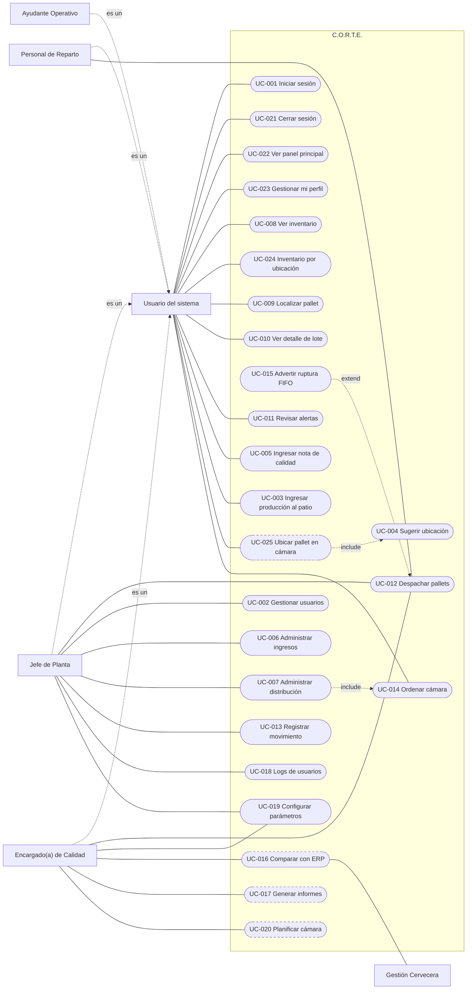

---

# 14. FLUJOS DE ACTIVIDAD

El diagrama de actividad original del equipo está en `Diagramas/Actividad.jpeg` (REF-07). Los siguientes diagramas detallan las decisiones, las validaciones y los errores. ACT-DIAG-001, ACT-DIAG-002 y ACT-DIAG-005 describen el flujo esperado según las decisiones del PO; ACT-DIAG-003 y ACT-DIAG-004, la implementación actual.

## ACT-DIAG-001 — Registrar ingreso en el patio (esperado)

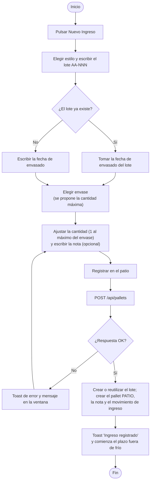

## ACT-DIAG-005 — Ubicar en la cámara un pallet del patio (esperado)

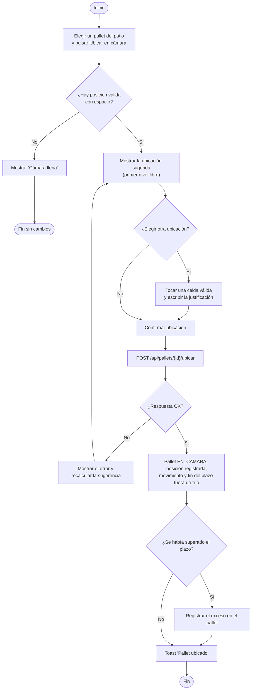

## ACT-DIAG-002 — Despachar pallet (esperado)

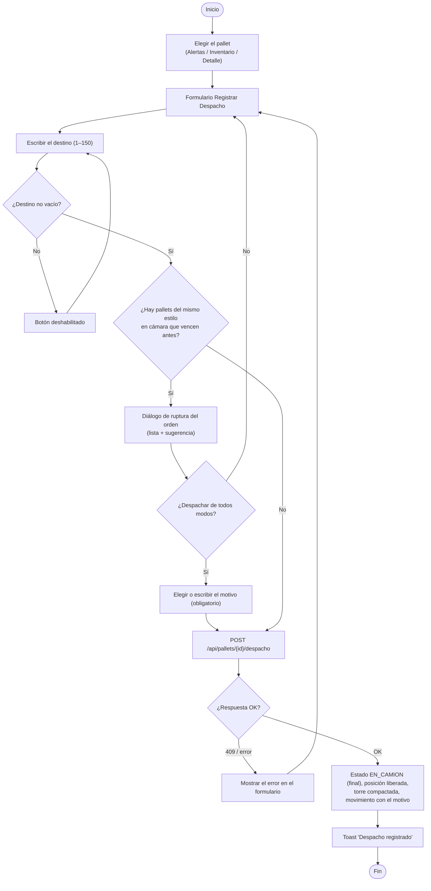

## ACT-DIAG-003 — Reorganizar la cámara

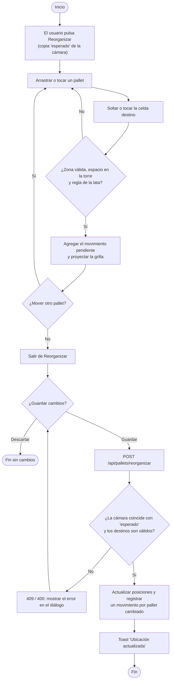

## ACT-DIAG-004 — Iniciar sesión

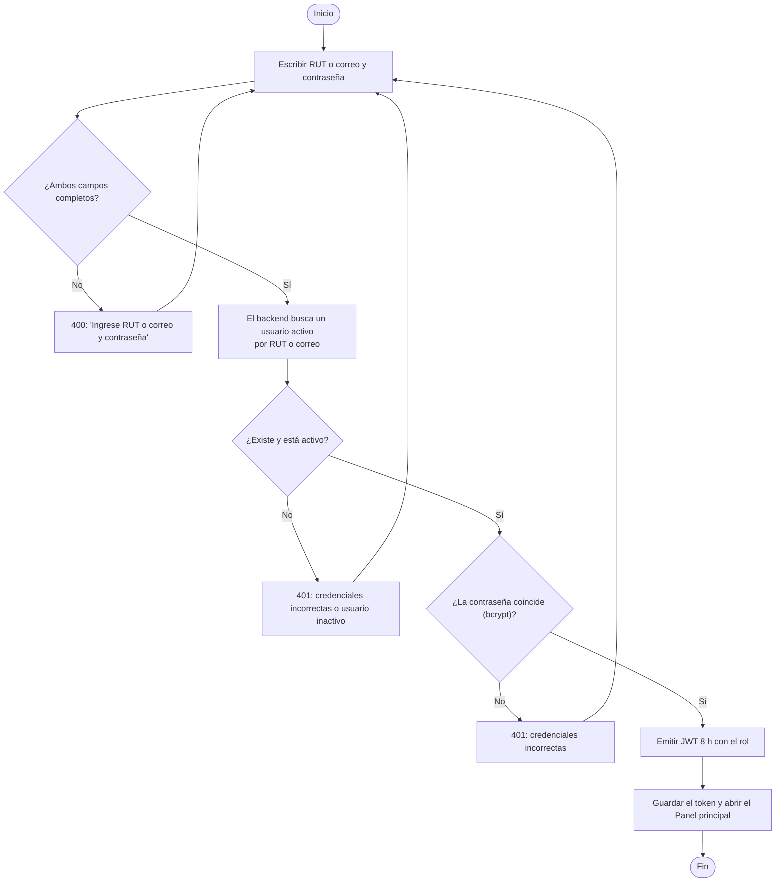

---

# 15. ESCENARIOS LÍMITE

| # | Escenario | Comportamiento actual | Comportamiento esperado | Referencias |
|---|---|---|---|---|
| 1 | Doble clic en Confirmar (ingreso, despacho, guardar) | Los botones se deshabilitan mientras se guarda | Además, idempotencia en el servidor | §36, RNF-USA-003 |
| 2 | Operación duplicada: mismo código de lote | La BD la rechaza por unicidad, pero la API responde 500 "Error interno" | El pallet se agrega al lote existente (DPO-006). Si el estilo o la fecha de envasado no coinciden: 409 con un mensaje claro | ERR-042, H-17 |
| 3 | Reintento después de un timeout en un despacho | El segundo intento responde 409 porque el pallet ya salió (es seguro) | Igual, y mostrar el resultado del primer intento | ERR-027 |
| 4 | Datos parcialmente enviados | El esquema responde 400. En `POST /api/pallets` solo se verifica que los campos vengan | Esquema estricto en todos los endpoints | RNF-SEG-006 |
| 5 | Gestión Cervecera no disponible | No aplica (no hay integración) | Cola con reintentos y aviso de desincronización | INT-001 |
| 6 | Backend caído o lento | Login: 503 con mensaje. Otras pantallas: mensaje de error. Sin tiempo máximo en las solicitudes | Tiempo máximo de 15 s, mensaje claro y opción de reintentar | ERR-005, ERR-034 |
| 7 | Sesión expirada | La API responde 401 y la pantalla muestra el error, sin redirigir | Redirigir al login conservando la ruta | ERR-004, RF-AUT-05 |
| 8 | El registro cambió o desapareció durante la operación | Despacho de un pallet ya despachado → 409. Usuario inexistente → 404. Registro de configuración eliminado → 404 | Igual | ERR-009, ERR-027 |
| 9 | Dos usuarios editando a la vez | Usuarios: transacción serializable con 3 reintentos. Cámara: control con `esperado`. Configuración: gana el último en guardar | Control de versión también en la configuración | §35 |
| 10 | BD no disponible | `/api/health` responde 503; las operaciones responden 500; los contenedores se reinician | Alertas técnicas (RNF-OBS-002) | ERR-035 |
| 11 | Archivo corrupto o que no es imagen | El navegador filtra por tipo `image/*`. No se sube nada | Validar el tipo real y el tamaño en el servidor | §44, VAL-016 |
| 12 | Valores inesperados, como la cantidad enviada como texto | Zod estricto los rechaza en la mayoría de los endpoints. `POST /api/pallets` los acepta | Esquema estricto | RNF-SEG-006 |
| 13 | Grandes volúmenes de información | El historial está limitado a 100. Usuarios e ingresos no tienen paginación en el servidor | Paginación en el servidor (§26) | RNF-CAP-003 |
| 14 | Reloj del dispositivo desfasado | El estado FIFO usa la hora del dispositivo | Usar la hora del servidor para ambas alertas | RF-FIFO-01 |
| 15 | Cámara llena | Aparece "Cámara llena" y **Confirmar** se deshabilita | Igual | ERR-038 |
| 16 | Pallet con otro estado que conserva su posición (datos del seed) | La grilla muestra la posición libre, pero el backend la considera ocupada: puede haber errores de apilado o duplicados | Una sola fuente de verdad sobre la ocupación | H-09, DT-010 |
| 17 | Se pierde el Wi-Fi dentro de la cámara | La operación falla y no se reintenta | Avisar y permitir reintentar sin duplicar. El PO confirmó que hay buena señal, así que no se requiere modo sin conexión (DPO-029) | RNF-CON-002, RSK-001 |
| 18 | Recarga de la página | La sesión se restaura desde el JWT guardado; si expiró, se va al login | Igual | RF-AUT-05 |
| 19 | Salir con cambios de reorganización pendientes | Hay aviso al navegar por enlaces internos, pero no al cerrar la pestaña ni al recargar | Advertir también en ese caso (`beforeunload`) | RF-CAM-01 |
| 20 | Desactivar al último Jefe activo | Se bloquea con 409 | Igual | ERR-016 |
| 21 | Se ejecuta el seed contra producción | Se **borran todos los datos** | Bloquearlo en producción | RSK-012 |
| 22 | Un pallet supera su plazo fuera de frío en el patio | No aplica (no hay patio) | Se registra el exceso en el pallet y sigue su flujo normal | RN-029, DPO-003 |
| 23 | Dos usuarios ubican pallets en la misma torre a la vez | No aplica | Transacción serializable: el segundo recibe el error y una nueva sugerencia | RF-ING-07, ERR-030 |
| 24 | Se intenta dejar un pallet sobre un Petainer, o un Petainer en C4 sobre el nivel 2 | No aplica (no hay Petainer en la interfaz) | Se rechaza (RN-028) | ERR-030 |
| 25 | Se ingresa un lote existente con otro estilo | La API responde 500 (lote duplicado) | 409 con un mensaje claro | ERR-042 |

---

# 16. MODELO DE DOMINIO

Estas son las entidades conceptuales del negocio. Su implementación física está en §17 y se definen en `backend_corte/prisma/schema.prisma`.

## ENT-001 — Usuario

Trabajador que opera el sistema. Se identifica con su RUT y su correo, tiene un cargo (tipo de usuario) y un estado (activo o inactivo). Registra movimientos, notas de calidad y, en el futuro, entradas de auditoría. Debe llevar una marca de cambio obligatorio de contraseña (RF-AUT-06).

## ENT-002 — Tipo de usuario (cargo)

Cargo del trabajador: Jefe de planta, Calidad, Ayudante o Personal de reparto. Determina el rol dentro de la aplicación (§29.2) y los permisos que tiene (ENT-003).

## ENT-003 — Permiso

Capacidad que se asigna a los cargos mediante la relación tipo de usuario–permiso, editable por el Jefe (DPO-017). La tabla existe, pero todavía no se usa (RF-USR-05).

## ENT-004 — Bodega

Espacio físico de almacenamiento: cámara de frío 1, cámara de frío 2, patio o área de despacho. Tiene nombre, tipo y capacidad.

## ENT-005 — Posición

Lugar concreto de una bodega, identificado por fila, columna y nivel. Cada nivel de una torre es una posición distinta. Tiene además una etiqueta física (`espacio_fisico`, por ejemplo "A4-N2").

## ENT-006 — Tipo de cerveza (estilo)

Estilo de producto: Lager, IPA, Ámbar, Stout y, desde el Sprint 2, Kombucha. Define la vida útil (en días), el plazo máximo fuera de frío antes de entrar a la cámara (en horas, DPO-001) y si está activo.

## ENT-007 — Tipo de envase

Contenedor del producto: Caja de latas, Barril Euro, Barril Slim o Petainer. Define la unidad en que se cuenta (cajas, barriles o petainers) y la cantidad máxima por pallet (DPO-008, DPO-009). Puede estar activo o inactivo.

## ENT-008 — Lote

Producción de un estilo en una cocción, con su fecha de envasado. Se identifica con un código único `AA-NNN` (DPO-007) y puede repartirse en varios pallets (DPO-006). Hoy cada ingreso crea un lote con un único pallet.

## ENT-009 — Pallet

Unidad física que se almacena y despacha. Pertenece a un lote, tiene un envase, una cantidad, fechas (creación, ingreso y vencimiento), un estado, y opcionalmente una imagen (el campo existe, pero no se usa). Con las decisiones del PO debe guardar además la fecha y hora de registro en el patio, la de entrada a la cámara, el exceso del plazo fuera de frío si lo hubo (RN-029) y, si se anula, el motivo (RN-031).

## ENT-010 — Ubicación del pallet

Relación 1:1 entre un pallet y la posición que ocupa **hoy**, con la cantidad y la fecha de ingreso. Si un pallet no tiene ubicación, no está en ninguna bodega (por ejemplo, porque ya fue despachado).

## ENT-011 — Movimiento

Registro histórico e inmutable de un ingreso, una ubicación, una reubicación, un despacho, una edición o una anulación. Guarda el usuario, el pallet, la posición de origen o destino (según corresponda), la fecha y hora, la cantidad y, en el caso de los despachos, el destino. Debe guardar también el motivo de una ruptura del orden de salida o de una anulación (RN-030, RN-031).

## ENT-012 — Nota de calidad

Observación sobre un pallet, con su autor y su fecha.

## ENT-013 — Parámetro

Par clave–valor con tipo y descripción. Almacena parámetros operativos y las reglas de alerta configurables (claves `CONFIG_ALERTA_…`).

## ENT-014 — Alerta

Aviso persistente asociado a un pallet o a una regla, con estado y prioridad. La tabla existe, pero todavía no se usa (RF-NTF-02).

## ENT-015 — Auditoría

Bitácora de acciones: usuario, entidad, acción, detalle, motivo y fecha. La tabla existe, pero todavía no se usa (RF-AUD-01).

---

# 17. MODELO DE DATOS

- **Motor:** MySQL 8.0, con InnoDB.
- **Fuente de verdad:** `backend_corte/prisma/schema.prisma`, gestionado con Prisma 5.22.
- **Sincronización del esquema:** con `prisma db push`, sin migraciones versionadas (§73).
- **Nombres:** las tablas y columnas de la BD usan `snake_case`; los modelos de Prisma, `camelCase` (mediante `@map`).

> Los diagramas `Diagramas/Base_de_datos.png` y `Diagramas/Entidad-Relacion.png` corresponden a una versión anterior del modelo. No tienen bodega, ubicación del pallet, auditoría ni alerta, usan el RUT como clave primaria del usuario e incluyen un `tipo_movimiento` que el modelo actual deduce. Este capítulo refleja el **esquema vigente**. Se recomienda regenerar esos diagramas (DT-012).

## 17.1 Diagrama entidad-relación

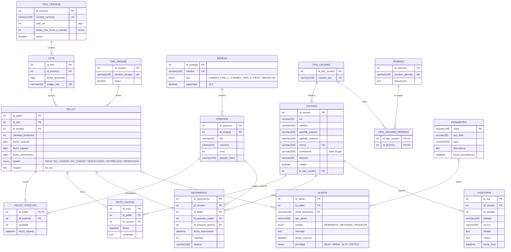

## 17.2 Entidades

Abreviaturas: AI = autoincremental, PK = clave primaria, FK = clave foránea, UK = única.

### ENT-008 — `lote`

| Campo | Tipo | Null | Restricción | Descripción |
|---|---|---|---|---|
| id_lote | INT | No | PK, AI | Identificador |
| id_cerveza | INT | No | FK → `tipo_cerveza` | Estilo del lote |
| fecha_producida | DATE | No | — | Fecha de producción o envasado (sin hora) |
| codigo_lote | VARCHAR(50) | No | UNIQUE | Código visible del lote, formato `AA-NNN` (p. ej. `26-001`, DPO-007) |

### ENT-006 — `tipo_cerveza`

| Campo | Tipo | Null | Restricción | Descripción |
|---|---|---|---|---|
| id_cerveza | INT | No | PK, AI | Identificador |
| nombre_cerveza | VARCHAR(100) | No | UNIQUE | Nombre del estilo |
| vida_util | INT | No | — | Días desde la producción hasta el vencimiento |
| horas_max_fuera_a_camara | INT | No | — | Plazo máximo fuera de frío antes de entrar a la cámara (RN-007) |
| activo | BOOLEAN | No | DEFAULT TRUE | Disponible para nuevos ingresos |

### ENT-007 — `tipo_envase`

| Campo | Tipo | Null | Restricción | Descripción |
|---|---|---|---|---|
| id_envase | INT | No | PK, AI | Identificador |
| nombre_envase | VARCHAR(100) | No | UNIQUE | Nombre (Barril Euro, Caja Latas, etc.) |
| activo | BOOLEAN | No | DEFAULT TRUE | Disponible para nuevos ingresos |

### ENT-009 — `pallet`

| Campo | Tipo | Null | Restricción | Descripción |
|---|---|---|---|---|
| id_pallet | INT | No | PK, AI | Identificador |
| id_lote | INT | No | FK → `lote` | Lote al que pertenece |
| id_envase | INT | No | FK → `tipo_envase` | Tipo de envase |
| cantidad_productos | INT | No | — (se recomienda validar entre 1 y el máximo del envase) | Cantidad de cajas, barriles o petainers (RN-011) |
| fecha_creacion | DATE | No | — | Fecha de creación del registro |
| fecha_ingreso | DATE | No | — | Fecha de ingreso a la bodega |
| fecha_vencimiento | DATE | No | — | Fecha de producción + vida útil |
| estado | ENUM | No | DEFAULT `PATIO` | Ver §19. Hoy el ingreso crea el pallet en `EN_CAMARA`; debe crearlo en `PATIO` (DPO-005) |
| imagen | TEXT | Sí | — | Reservado para fotos (sin uso) |

### ENT-010 — `pallet_posicion`

| Campo | Tipo | Null | Restricción | Descripción |
|---|---|---|---|---|
| id_pallet | INT | No | PK, FK → `pallet` (ON DELETE CASCADE) | Un pallet tiene como máximo una ubicación |
| id_posicion | INT | No | FK → `posicion` (se recomienda UNIQUE, DT-010) | Posición ocupada |
| cantidad | INT | No | — | Cantidad en la posición |
| fecha_ingreso | DATETIME(0) | No | — | Momento en que se ubicó |

### ENT-004 — `bodega`

| Campo | Tipo | Null | Restricción | Descripción |
|---|---|---|---|---|
| id_bodega | INT | No | PK, AI | Identificador |
| nombre | VARCHAR(100) | No | UNIQUE | "Bodega 1", "Bodega 2", "El Patio" |
| tipo | ENUM | No | `CAMARA_FRIO_1`, `CAMARA_FRIO_2`, `PATIO`, `DESPACHO` | Tipo de bodega. La cámara principal se busca por el tipo `CAMARA_FRIO_1` |
| capacidad | DECIMAL(12,2) | No | — | Capacidad declarada |

### ENT-005 — `posicion`

| Campo | Tipo | Null | Restricción | Descripción |
|---|---|---|---|---|
| id_posicion | INT | No | PK, AI | Identificador |
| id_bodega | INT | No | FK → `bodega` | Bodega |
| fila | VARCHAR(20) | No | UNIQUE (id_bodega, fila, columna, nivel) | "A"–"D" |
| columna | VARCHAR(20) | No | (ídem) | "1"–"6" |
| nivel | INT | No | (ídem) | 1–4; el nivel 5 (y el 4 de B4) debe crearse para el Petainer (RN-028) |
| espacio_fisico | VARCHAR(100) | Sí | — | Etiqueta física ("A4-N2", "B2-3") |

### ENT-011 — `movimiento`

| Campo | Tipo | Null | Restricción | Descripción |
|---|---|---|---|---|
| id_movimiento | INT | No | PK, AI | Identificador |
| id_usuario | INT | No | FK → `usuario` | Quién realizó la operación |
| id_pallet | INT | No | FK → `pallet` | Pallet afectado |
| id_posicion_origen | INT | Sí | FK → `posicion` | Nulo en los ingresos |
| id_posicion_destino | INT | Sí | FK → `posicion` | Nulo en los despachos |
| fecha_movimiento | DATETIME(0) | No | — | Momento de la operación |
| cantidad | INT | No | — | Cantidad movida |
| destino | VARCHAR(150) | Sí | — | Destino del despacho. Si tiene valor, el movimiento es un despacho |

### ENT-012 — `nota_calidad`

| Campo | Tipo | Null | Restricción | Descripción |
|---|---|---|---|---|
| id_nota | INT | No | PK, AI | Identificador |
| id_pallet | INT | No | FK → `pallet` (ON DELETE CASCADE) | Pallet |
| id_usuario | INT | No | FK → `usuario` | Autor |
| fecha | DATETIME(0) | No | — | Momento del registro |
| contenido | TEXT | No | — | Texto de la nota (la API admite hasta 2000 caracteres) |

### ENT-001 — `usuario`

| Campo | Tipo | Null | Restricción | Descripción |
|---|---|---|---|---|
| id_usuario | INT | No | PK, AI | Identificador |
| rut | VARCHAR(20) | Sí | — (la unicidad se exige en la aplicación; se recomienda UNIQUE, DT-009) | RUT sin puntos ni guion, en mayúsculas |
| nombre | VARCHAR(100) | No | — | Nombre |
| apellido_paterno | VARCHAR(100) | No | — | Apellido paterno |
| apellido_materno | VARCHAR(100) | Sí | — | Apellido materno |
| correo | VARCHAR(150) | No | UNIQUE | Correo en minúsculas |
| contrasena | VARCHAR(255) | No | — | Hash bcrypt, nunca en texto plano |
| telefono | VARCHAR(30) | Sí | — | Teléfono |
| estado | BOOLEAN | No | DEFAULT TRUE | Activo o inactivo |
| id_tipo_usuario | INT | No | FK → `tipo_usuario` | Cargo |

### ENT-002 — `tipo_usuario`

| Campo | Tipo | Null | Restricción | Descripción |
|---|---|---|---|---|
| id_tipo_usuario | INT | No | PK, AI | Identificador |
| nombre_tipo | VARCHAR(100) | No | UNIQUE | "Jefe de Planta", "Calidad", "Ayudante", "Personal de reparto" |

### ENT-003 — `permiso` y `tipo_usuario_permiso`

| Campo | Tipo | Null | Restricción | Descripción |
|---|---|---|---|---|
| permiso.id_permiso | INT | No | PK, AI | Identificador |
| permiso.nombre_permiso | VARCHAR(100) | No | UNIQUE | Nombre del permiso |
| permiso.descripcion | TEXT | Sí | — | Descripción |
| tipo_usuario_permiso.id_tipo_usuario | INT | No | PK compuesta, FK (ON DELETE CASCADE) | Cargo |
| tipo_usuario_permiso.id_permiso | INT | No | PK compuesta, FK (ON DELETE CASCADE) | Permiso |

### ENT-015 — `auditoria`

| Campo | Tipo | Null | Restricción | Descripción |
|---|---|---|---|---|
| id_log | INT | No | PK, AI | Identificador |
| id_usuario | INT | No | FK → `usuario` | Autor |
| id_entidad | INT | Sí | — | Identificador del registro afectado |
| entidad | VARCHAR(100) | No | — | Tabla o entidad afectada |
| accion | VARCHAR(50) | No | — | Acción (crear, editar, anular, etc.) |
| detalle | TEXT | Sí | — | Detalle (se propone JSON con los valores anterior y nuevo) |
| motivo | TEXT | Sí | — | Justificación |
| fecha_hora | DATETIME(0) | No | — | Momento |

### ENT-013 — `parametro`

| Campo | Tipo | Null | Restricción | Descripción |
|---|---|---|---|---|
| clave | VARCHAR(100) | No | PK | Nombre del parámetro (p. ej. `ALERTA_CRITICA_HORAS`, `CONFIG_ALERTA_…`) |
| tipo_dato | VARCHAR(30) | No | — | integer, decimal, json… |
| valor | VARCHAR(255) | No | — | Valor serializado |
| descripcion | TEXT | Sí | — | Descripción |
| fecha_actualizacion | DATETIME(0) | No | — | Última modificación |

### ENT-014 — `alerta`

| Campo | Tipo | Null | Restricción | Descripción |
|---|---|---|---|---|
| id_alerta | INT | No | PK, AI | Identificador |
| id_pallet | INT | Sí | FK → `pallet` | Pallet que la origina |
| clave_parametro | VARCHAR(100) | Sí | FK → `parametro.clave` | Regla que la origina |
| tipo_alerta | VARCHAR(50) | No | — | Tipo |
| estado | ENUM | No | DEFAULT `PENDIENTE` | `PENDIENTE`, `REVISADA` o `RESUELTA` |
| mensaje | TEXT | No | — | Texto de la alerta |
| fecha_creacion | DATETIME(0) | No | — | Momento de creación |
| prioridad | ENUM | No | DEFAULT `MEDIA` | `BAJA`, `MEDIA`, `ALTA` o `CRITICA` |

## 17.3 Relaciones

| Relación | Cardinalidad | FK | Al eliminar el padre |
|---|---|---|---|
| tipo_cerveza → lote | 1 : N | `lote.id_cerveza` | Se impide (Restrict) |
| lote → pallet | 1 : N (hoy 1 : 1 en la práctica, RN-012) | `pallet.id_lote` | Se impide |
| tipo_envase → pallet | 1 : N | `pallet.id_envase` | Se impide |
| pallet → pallet_posicion | 1 : 0..1 | `pallet_posicion.id_pallet` (PK) | Se elimina en cascada |
| posicion → pallet_posicion | 1 : N (debería ser 1 : 0..1, DT-010) | `pallet_posicion.id_posicion` | Se impide |
| bodega → posicion | 1 : N | `posicion.id_bodega` | Se impide |
| pallet → nota_calidad | 1 : N | `nota_calidad.id_pallet` | Se elimina en cascada |
| usuario → nota_calidad | 1 : N | `nota_calidad.id_usuario` | Se impide |
| pallet → movimiento | 1 : N | `movimiento.id_pallet` | Se impide |
| usuario → movimiento | 1 : N | `movimiento.id_usuario` | Se impide |
| posicion → movimiento (origen y destino) | 1 : N, opcional | `id_posicion_origen`, `id_posicion_destino` | Se impide |
| tipo_usuario → usuario | 1 : N | `usuario.id_tipo_usuario` | Se impide |
| tipo_usuario ↔ permiso | N : M | `tipo_usuario_permiso` | Se elimina en cascada |
| usuario → auditoria | 1 : N | `auditoria.id_usuario` | Se impide |
| pallet → alerta | 1 : N, opcional | `alerta.id_pallet` | Se impide |
| parametro → alerta | 1 : N, opcional | `alerta.clave_parametro` | Se impide |

## 17.4 Claves primarias

- Todas las tablas usan una clave entera autoincremental (`id_*`), con tres excepciones:
  - `parametro`: clave natural `clave`, de tipo VARCHAR.
  - `pallet_posicion`: `id_pallet`, que es a la vez clave foránea (relación 1:1).
  - `tipo_usuario_permiso`: clave compuesta (`id_tipo_usuario`, `id_permiso`).

## 17.5 Claves foráneas

Están listadas en §17.3. InnoDB crea un índice para cada clave foránea.

## 17.6 Índices

**Índices únicos existentes:**
- `lote.codigo_lote`;
- `tipo_cerveza.nombre_cerveza`;
- `tipo_envase.nombre_envase`;
- `tipo_usuario.nombre_tipo`;
- `usuario.correo`;
- `permiso.nombre_permiso`;
- `bodega.nombre`;
- `posicion (id_bodega, fila, columna, nivel)`.

**Índices recomendados:**

| Índice | Motivo |
|---|---|
| UNIQUE `usuario.rut` | Garantizar la unicidad del RUT en la BD (DT-009) |
| UNIQUE `pallet_posicion.id_posicion` | Impedir que dos pallets ocupen la misma posición (DT-010) |
| `movimiento.fecha_movimiento` | Historial por fecha |
| `pallet.estado` | Filtros por estado |

## 17.7 Restricciones de integridad

**Existentes:**
- Unicidades (§17.6).
- Claves foráneas con `Restrict` y `Cascade` según §17.3.
- Enumeraciones para el estado del pallet, el tipo de bodega y el estado y la prioridad de las alertas.
- Valores `DEFAULT` en `estado` y `activo`.

**Aplicadas solo en la aplicación** (se recomienda también una restricción en la BD):
- unicidad del RUT;
- cantidad entre 1 y 60 (debe pasar a 1 y el máximo del envase, RN-011);
- nivel entre 1 y 4 (5 para el Petainer, RN-028);
- una posición no puede estar ocupada por dos pallets;
- la zona que corresponde a cada envase;
- existencia de al menos un Jefe de Planta activo.

**Recomendadas:**
- `CHECK (cantidad_productos >= 1)`, más la validación del máximo por envase en la aplicación (el máximo es configurable);
- `CHECK (nivel BETWEEN 1 AND 5)`;
- `CHECK (fecha_vencimiento >= fecha_creacion)`.

## 17.8 Cambios al esquema por las decisiones del PO (propuestos)

El diagrama de §17.1 refleja el esquema vigente. Las decisiones de §0.5 requieren estos cambios:

| Tabla | Cambio | Motivo |
|---|---|---|
| `pallet` | Nuevos campos: `fecha_registro_patio` DATETIME, `fecha_entrada_camara` DATETIME, `plazo_frio_excedido_en` DATETIME NULL, `horas_fuera_de_frio` DECIMAL NULL, `motivo_anulacion` VARCHAR(300) NULL | DPO-001, DPO-003, DPO-022 |
| `pallet` (enum `estado`) | Agregar `ANULADO`. Dejar de usar `DESPACHADO`, `ENTREGADO` y `RESERVADO` | DPO-022, DPO-025 |
| `tipo_envase` | Nuevos campos: `unidad` (cajas, barriles o petainers) y `cantidad_maxima` INT | DPO-008, DPO-009 |
| `parametro` | Umbrales de las alertas Fuera de frío (6 y 12 h) y Vencimiento (7 y 14 días) | DPO-002 |
| `movimiento` | Nuevo campo `motivo` VARCHAR(300) NULL y un tipo explícito (`INGRESO`, `UBICACION`, `REUBICACION`, `DESPACHO`, `EDICION`, `ANULACION`) en vez de deducirlo | DPO-022, DPO-024 |
| `usuario` | Nuevo campo `debe_cambiar_password` BOOLEAN | DPO-020, DPO-021 |
| `permiso`, `tipo_usuario_permiso` | Cargar el catálogo de permisos y la matriz inicial de §29.3 | DPO-016, DPO-017 |
| `tipo_usuario` | El tipo `Calidad` se mapea a un rol propio `CALIDAD` | DPO-018 |
| `posicion` | Crear el nivel 5 en A4–A6, B5, B6, C5 y C6, y el nivel 4 en B4, solo para Petainer | DPO-012 |
| `pallet_posicion` | UNIQUE en `id_posicion`, y solo pallets `EN_CAMARA` con posición | DT-010, DPO-025 |

---

# 18. DICCIONARIO DE DATOS

Datos de negocio tal como se capturan y exponen (en la interfaz y en la API).

| Campo | Tipo | Longitud | Obligatorio | Regla | Descripción |
|---|---|---|---|---|---|
| rut | String | 20 (se guardan 8–9) | Sí | VAL-001; único | RUT del trabajador, sin puntos ni guion |
| nombre | String | 100 | Sí | VAL-006 | Nombre del trabajador |
| apellido / apellido_paterno | String | 100 | Sí | VAL-006 | Apellido paterno |
| apellido_materno | String | 100 | No | VAL-006 | Apellido materno |
| correo | String | 150 | Sí | VAL-002; único; en minúsculas | Correo del trabajador; también sirve para iniciar sesión |
| telefono | String | 30 | No | VAL-007 | Teléfono |
| contraseña | String | 12–72 | Sí | VAL-003 (política única, DPO-019). Hoy el Jefe puede asignar 8–72 (VAL-004) | Se guarda como hash bcrypt |
| id_tipo_usuario | String (nombre del tipo) | 100 | Sí | VAL-008 | Cargo |
| estado (usuario) | Boolean | — | Sí | VAL-022 | Activo o inactivo |
| codigo_lote | String | 50 | Sí | VAL-010: formato `AA-NNN`; único por lote | Año de producción y número de cocción (DPO-007). Un lote puede tener varios pallets |
| estilo | String | 100 | Sí | VAL-012; catálogo activo | Tipo de cerveza o Kombucha |
| envase | String | 100 | Sí | VAL-012; catálogo activo (Caja de latas, Barril Euro, Barril Slim, Petainer) | Tipo de envase. Hoy la interfaz ofrece Lata o Barril |
| cantidad | Integer | — | Sí | VAL-011: 1 al máximo del envase (72, 16, 15 o 9) | Contenido del pallet, en la unidad del envase |
| fechaEnvasado / fecha_producida | Date (sin hora) | — | Sí | VAL-023. Se escribe a mano o viene de Gestión Cervecera (DPO-004). Hoy es automática: la fecha del dispositivo | Base del vencimiento |
| fecha_registro_patio (propuesto) | DateTime | — | Sí (automática) | Hora del servidor | Inicio del plazo fuera de frío (DPO-001) |
| fecha_entrada_camara (propuesto) | DateTime | — | Al ubicar | Hora del servidor | Fin del plazo fuera de frío |
| plazo_frio_excedido_en (propuesto) | DateTime | — | No | RN-029 | Cuándo se cumplió el plazo sin entrar a la cámara |
| motivo (ruptura o anulación, propuesto) | String | 300 | Condicional | VAL-024 | Motivo de un despacho fuera de orden o de una anulación |
| fecha_ingreso | Date | — | Sí (automática) | Fecha del servidor | Ingreso a la bodega |
| fecha_vencimiento | Date | — | Sí (calculada) | RN-010 | Vencimiento |
| estado (pallet) | Enum | — | Sí | §19 | Estado logístico |
| posicion.row / fila | Integer 0–3 / "A"–"D" | — | Sí | VAL-013 | Fila |
| posicion.col / columna | Integer 0–5 / "1"–"6" | — | Sí | VAL-013 | Columna |
| posicion.nivel / nivel | Integer | 1–4 (5 para el Petainer) | Sí | VAL-013 | Nivel en la torre (1 = base). Al ubicar, siempre el primer nivel libre (DPO-014) |
| destino | String | 150 | Sí (despacho) | VAL-014 | Camión, cliente o pedido |
| nota (calidad) | String | 2000 | No | VAL-015 | Observación de calidad |
| fechaHora (movimiento) | DateTime ISO | — | Sí | Automática | Momento del movimiento |
| tipo (movimiento) | Enum derivado | — | — | Hoy: si hay destino, es un despacho; si no hay origen, es un ingreso; en otro caso, un movimiento. Se propone guardarlo explícito (§17.8) | Tipo mostrado en el historial |
| nombreEnvase / nombreCerveza / nombre (alerta) | String | 100 | Sí | VAL-017; único | Nombre del catálogo |
| vidaUtil | Integer | — | Sí | VAL-018 | Días |
| horasMaxFueraACamara | Integer | — | Sí | VAL-018 | Plazo fuera de frío, en horas (DPO-001) |
| cantidad_maxima (envase, propuesto) | Integer | — | Sí | VAL-018 | Máximo por pallet (DPO-009) |
| activo | Boolean | — | Sí | — | Registro activo |
| tipo (alerta) | Enum | — | Sí | STOCK_MINIMO, STOCK_MAXIMO, VENCIMIENTO u ORDEN | Tipo de regla |
| valor (alerta) | Integer o null | — | Condicional | VAL-019 | Umbral (en unidades o días) |
| orden (alerta) | Enum | — | Sí | FEFO o FIFO | Orden de salida |
| alerta Fuera de frío | Enum derivado | — | — | RN-008 | Crítico, Preventivo u Óptimo, para pallets en el patio (hoy, "estado FIFO") |
| horas restantes | Number derivado | — | — | RN-007 | Plazo menos las horas desde el registro en el patio |
| alerta Vencimiento | Enum derivado | — | — | RN-008 | Crítico, Preventivo u Óptimo, para pallets en la cámara |
| días para vencer | Number derivado | — | — | RN-010 | Fecha de vencimiento menos la fecha actual |

---

# 19. CICLO DE VIDA DE ENTIDADES

## 19.1 Estados

| Entidad | Estados | Estado de implementación |
|---|---|---|
| Pallet | `PATIO`, `EN_CAMARA`, `EN_CAMION`, `ANULADO` (propuesto). `DESPACHADO`, `ENTREGADO` y `RESERVADO` existen en la BD, pero no se usarán (DPO-025) | Hoy solo se usan `EN_CAMARA` y `EN_CAMION` |
| Usuario | Activo, Inactivo | Implementado |
| Registro de catálogo o regla | Activo, Inactivo | Implementado |
| Alerta | `PENDIENTE`, `REVISADA`, `RESUELTA` | Definido en la BD, sin uso |
| Sesión | Sin sesión, Activa, Expirada | Implementado (JWT de 8 h); no se restaura al recargar |

## 19.2 Transiciones del pallet

| Estado actual | Evento | Estado siguiente | Estado |
|---|---|---|---|
| (nuevo) | Registrar ingreso en el patio (RF-ING-01) | `PATIO` | Propuesto (DPO-005). Hoy el ingreso crea el pallet `EN_CAMARA` |
| `PATIO` | Ubicar en cámara (RF-ING-07) | `EN_CAMARA` | Propuesto |
| `PATIO` | Se cumple el plazo fuera de frío | `PATIO` (con la marca de exceso, RN-029) | Propuesto |
| `EN_CAMARA` | Reorganizar (RF-CAM-01) | `EN_CAMARA` (cambia de posición) | Implementado |
| `EN_CAMARA` | Despachar (RF-DES-01) | `EN_CAMION` (estado final) | Implementado |
| `PATIO` o `EN_CAMARA` | Anular el ingreso (RF-ING-06) | `ANULADO` | Propuesto (DPO-022) |
| `EN_CAMARA` → `RESERVADO` → `EN_CAMION` → `DESPACHADO` → `ENTREGADO` | Reservar, confirmar salida y entrega | — | Descartado (DPO-025) |

## 19.3 Reglas de transición

- Solo un pallet `EN_CAMARA` puede despacharse o reubicarse. En cualquier otro caso, el sistema responde con ERR-027.
- Solo un pallet `PATIO` puede ubicarse en la cámara (ERR-043).
- Solo un pallet `EN_CAMARA` ocupa una posición.
- Un pallet `EN_CAMION` o `ANULADO` no cambia más de estado.
- Despachar libera la posición (se elimina `pallet_posicion`) y compacta la torre (RN-014).
- Ninguna transición elimina el pallet: el historial se conserva (RN-022).
- Un usuario no puede desactivarse a sí mismo, y no se puede desactivar al último Jefe activo (RN-017).
- Una alerta solo avanza en el sentido `PENDIENTE` → `REVISADA` → `RESUELTA` (propuesto).

## 19.4 Diagramas de estado

**Pallet (esperado, según las decisiones del PO)**

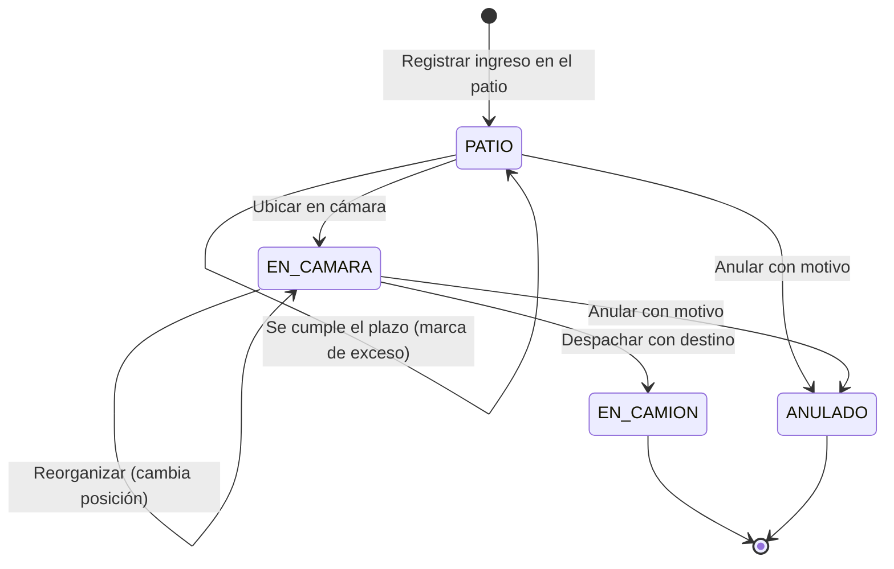

**Usuario**

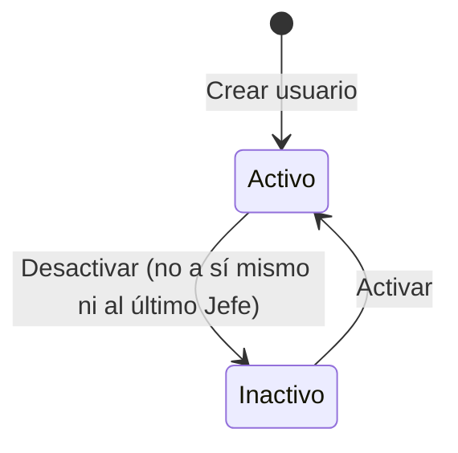

**Alerta (propuesto)**

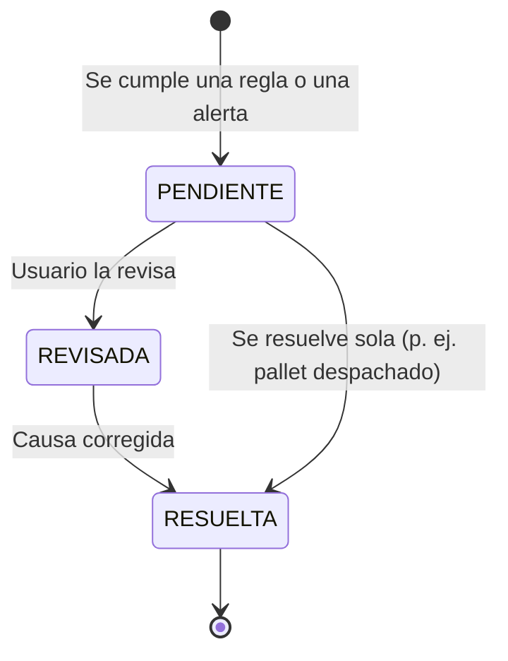

---

# 20. ARQUITECTURA GENERAL

## 20.1 Vista general

**Estilo:** cliente–servidor en tres niveles, con un monolito modular en cada nivel.

1. **Presentación:** aplicación Next.js 14 (App Router, React 18). Casi todo se renderiza en el navegador (componentes `'use client'`). Una ruta interna de Next.js actúa como BFF solo para el login.
2. **Servicios:** API REST con Express 5 y TypeScript. Autenticación sin estado con JWT, validación con Zod y acceso a datos con Prisma ORM.
3. **Datos:** MySQL 8.0.

**Despliegue:** tres contenedores Docker (frontend, backend y BD) detrás del proxy inverso Caddy del servidor del taller.

**Código:** está repartido en cuatro repositorios coordinados desde el repositorio orquestador NEXO (DEC-008).

**Diseño del equipo:** el diagrama de paquetes del equipo (`Diagramas/Componentes.png`) define cuatro capas: Presentación, Lógica y Estado del cliente, Servicios y Datos. La implementación sigue esa estructura, con las diferencias de §20.3.

## 20.2 Diagrama de arquitectura

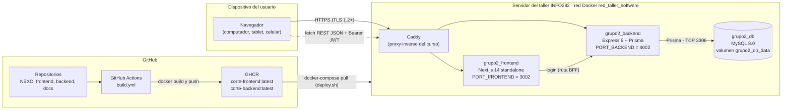

## 20.3 Capas

| Capa (diagrama del equipo) | Implementación | Ubicación en el código | Diferencias con el diseño |
|---|---|---|---|
| Presentación | Páginas del App Router y componentes por dominio (auth, dashboard, camara, pallets, alertas, inventario, ingresos, registro, bodegas, usuarios, perfil, config) | `frontend_corte/src/app`, `src/components` | No existe "UI Planificación e Informes" |
| Lógica y estado del cliente | Control de roles (`AppProvider`, `useRequireRole`, `Sidebar`); motor FIFO (`lib/fifo.ts`); apilado y zonas (`lib/apilado.ts`, `lib/constants.ts`); sugerencia de ubicación (`NuevoIngresoModal`); validador de ruptura FIFO (`RegistroDespachoForm`, `AlertaFIFODialog`); estado en tiempo real con SWR (`hooks/`) | `frontend_corte/src/lib`, `src/hooks`, `src/components/layout` | Las reglas de negocio críticas viven aquí y no en el backend (DT-001) |
| Servicios (API) | Autenticación (`routes/auth`), usuarios (`routes/usuarios`), perfil (`routes/profile`), ingresos (`controllers/pallet.controller`), inventario y cámara (`controllers/warehouse*`), movimientos y despachos (`routes/pallet-operations`, `lib/pallet-operations`, `routes/actividad`), configuración (`routes/config`), salud (`routes/health`) | `backend_corte/src` | No existe "API Planificación e Informes" ni la integración con Gestión Cervecera |
| Datos | Prisma ORM + MySQL 8 | `backend_corte/prisma`, `Base de datos/` | — |

---

# 21. COMPONENTES DEL SISTEMA

## CMP-001 — Frontend

**Responsabilidades:**
- interfaz de usuario y navegación por rol;
- gemelo digital;
- cálculo FIFO y sugerencia de ubicación;
- formularios y validaciones de presentación;
- caché y revalidación de datos (SWR);
- avisos (*toasts*).

**Tecnología:**
- Next.js 14.2 y React 18.3, en TypeScript 5.6;
- Tailwind CSS 4 y componentes shadcn/ui (Radix);
- SWR 2.3, Recharts, lucide-react y sonner.

**Repositorio:** `frontend_corte`.
**Imagen:** `ghcr.io/serruchosdevteam/corte-frontend:latest`. Es un build *standalone* que corre como el usuario `nextjs`.
**Puerto:** 3000 en desarrollo y 3002 en producción (`PORT_FRONTEND`).
**Configuración:** `NEXT_PUBLIC_API_URL`, que se fija en el build (§48).

## CMP-002 — Backend

**Responsabilidades:**
- API REST;
- autenticación (JWT) y autorización (parcial);
- validación de entradas;
- reglas transaccionales de la cámara (despacho, reorganización, apilado y zonas en el servidor);
- administración de usuarios, perfil y configuración;
- consultas de inventario e historial;
- verificación de salud.

**Tecnología:** Express 5.2, Prisma 5.22, Zod 4, bcryptjs, jsonwebtoken y cors, sobre Node.js 20.
**Repositorio:** `backend_corte`.
**Imagen:** `ghcr.io/serruchosdevteam/corte-backend:latest`. Al arrancar ejecuta `prisma db push` y luego inicia el servidor.
**Puerto:** 3001 en desarrollo y 4002 en producción (`PORT_BACKEND`).

## CMP-003 — Base de datos

**Responsabilidades:** persistencia de todas las entidades (§17).
**Tecnología:** MySQL 8.0 (imagen oficial `mysql:8.0`), con verificación de salud mediante `mysqladmin ping`.
**Volúmenes:** `grupo2_db_data` en producción y `corte_mysql_data` en desarrollo.
**Inicialización:** `Base de datos/init/01_init.sql` (hoy vacío). El esquema lo crea Prisma y los datos de prueba, el seed.

## CMP-004 — Worker

**No existe.** Se propone un proceso programado dentro del backend, o un contenedor aparte, para tres tareas:
- evaluar alertas (JOB-001);
- sincronizar con Gestión Cervecera (JOB-002);
- hacer respaldos (JOB-003).

Ver §40.

## CMP-005 — Proxy inverso

**Caddy**, administrado por el curso INFO282. Enruta el tráfico a los contenedores por su nombre dentro de la red externa `red_taller_software`, sin publicar puertos en el host. Su configuración no está en los repositorios (PA-009, RSK-017).

## CMP-006 — CI/CD

**GitHub Actions** (`NEXO-C.O.R.T.E/.github/workflows/build.yml`). Se ejecuta con cada push a `main` del repositorio NEXO, o de forma manual:
1. sincroniza los subrepositorios con `actualizar_repos_local.sh`, usando el secreto `GH_PAT`;
2. construye las imágenes con Docker Buildx y caché de GitHub Actions;
3. las publica en GHCR con la etiqueta `latest`.

El despliegue se hace con `deploy.sh` (§50).

## CMP-007 — Repositorio orquestador NEXO

Reúne los compose de producción (`docker-compose.yml`, que construye en el servidor, y `docker-compose.server.yml`, que usa las imágenes de GHCR), las plantillas `.env`, la carpeta `Base de datos/` y los scripts `deploy.sh` y `actualizar_repos_local.sh`.

---

# 22. MÓDULOS DEL SISTEMA

## MOD-001 — Autenticación

**Responsabilidad:** iniciar y cerrar sesión, emitir y verificar el JWT y traducir el tipo de usuario a rol.
**Entradas:** identificador y contraseña; cabecera `Authorization`.
**Salidas:** token, rol y datos básicos del usuario; `req.user` en el backend.
**Dependencias:** tabla `usuario`, `JWT_SECRET`.
**Código:**
- front: `components/auth/LoginView.tsx`, `app/api/auth/login/route.ts`, `components/layout/AppProvider.tsx`;
- back: `routes/auth.ts`, `middlewares/auth.middleware.ts`.

## MOD-002 — Usuarios

**Responsabilidad:** listar, crear, editar y activar o desactivar usuarios; proteger al último Jefe.
**Entradas:** los formularios de RF-USR.
**Salidas:** `Usuario` serializado (sin contraseña).
**Dependencias:** MOD-001, `tipo_usuario`.
**Código:**
- front: `components/usuarios/*`, `lib/usuarios-api.ts`;
- back: `routes/usuarios.ts`, `lib/user-state.ts`.

## MOD-003 — Perfil

**Responsabilidad:** consultar y actualizar la cuenta propia.
**Entradas:** correo, teléfono y contraseñas.
**Salidas:** `Profile`.
**Dependencias:** MOD-001.
**Código:**
- front: `components/perfil/MiPerfilView.tsx`, `lib/account-inventory-api.ts`;
- back: `routes/profile.ts`.

## MOD-004 — Bodegas y gemelo digital

**Responsabilidad:** entregar la grilla de la cámara y el inventario por ubicación.
**Entradas:** identificador o tipo de bodega.
**Salidas:** la grilla con los pallets y los datos de inventario de cada fila.
**Dependencias:** `bodega`, `posicion`, `pallet_posicion`, `pallet`, `lote` y los catálogos.
**Código:**
- front: `components/camara/*`, `components/bodegas/*`, `hooks/usePallets.ts`;
- back: `routes/warehouses.ts`, `controllers/warehouse*.ts`, `lib/mappers.ts`.

## MOD-005 — Ingresos

**Responsabilidad:** registrar pallets y listar los ingresos.
**Entradas:** el formulario de RF-ING-01.
**Salidas:** el pallet creado y la lista de ingresos.
**Dependencias:** MOD-004 y los catálogos.
**Código:**
- front: `components/pallets/NuevoIngresoModal.tsx`, `components/ingresos/*`;
- back: `routes/pallets.ts`, `controllers/pallet.controller.ts`.

## MOD-006 — Operaciones de cámara

**Responsabilidad:** despachar, reorganizar y registrar notas, en transacciones serializables.
**Entradas:** destino, movimientos y estado esperado, nota.
**Salidas:** `{ guardado: true }`, más los movimientos registrados.
**Dependencias:** MOD-001 y MOD-004.
**Código:**
- front: `components/pallets/RegistroDespachoForm.tsx`, `AlertaFIFODialog.tsx`, `components/camara/CamaraView.tsx`;
- back: `routes/pallet-operations.ts`, `lib/pallet-operations.ts`.

## MOD-007 — Motor FIFO y reglas de apilado (cliente)

**Responsabilidad:** calcular el estado FIFO, validar zonas y apilado, insertar y compactar torres, y sugerir la ubicación.
**Entradas:** los pallets, el estilo y el envase.
**Salidas:** el estado FIFO, la validez de una posición y la posición sugerida.
**Dependencias:** constantes (`lib/constants.ts`).
**Código:** `frontend_corte/src/lib/fifo.ts`, `apilado.ts`, `constants.ts`.
**Cambios esperados:** calcular las dos alertas (Fuera de frío y Vencimiento, DPO-002) con plazos y umbrales de la configuración; aplicar las reglas de Kombucha y Petainer (RN-027, RN-028) y el criterio de vencimiento en la sugerencia (DPO-015). Se recomienda mover estas reglas al backend (DT-001).

## MOD-008 — Actividad

**Responsabilidad:** exponer el historial de movimientos.
**Entradas:** ninguna (trae los últimos 100).
**Salidas:** `ActivityEntry[]`.
**Dependencias:** `movimiento`, `usuario`, `pallet`, `lote`, `posicion`.
**Código:**
- front: `components/registro/RegistroActividad.tsx`, `hooks/useActividad.ts`;
- back: `routes/actividad.ts`.

## MOD-009 — Configuración

**Responsabilidad:** administrar los catálogos de envases y cervezas, las reglas y umbrales de alerta, las cantidades por envase y la matriz de permisos.
**Entradas:** los formularios de RF-CFG y RF-USR-05.
**Salidas:** `Envase`, `Cerveza`, `AlertaConfig`.
**Dependencias:** MOD-001 (hoy, solo el Jefe; se espera el Jefe y Calidad en la configuración, y solo el Jefe en los permisos, DPO-017, DPO-018).
**Código:**
- front: `components/config/ConfigView.tsx`, `lib/config-api.ts`;
- back: `routes/config.ts`.

## MOD-010 — Notificaciones (cliente)

**Responsabilidad:** mostrar avisos de dominio.
**Entradas:** los eventos de operación.
**Salidas:** *toasts* (§39).
**Código:** `frontend_corte/src/lib/notifications.ts`.

## MOD-011 — Salud

**Responsabilidad:** verificar la API y la conexión con la BD.
**Salidas:** 200 si todo está bien; 503 con el detalle si falla.
**Código:** `backend_corte/src/routes/health.ts`, `controllers/health.controller.ts`.

---

# 23. INTERFACES INTERNAS

| Origen → destino | Mecanismo | Formato | Autenticación | Detalle |
|---|---|---|---|---|
| Navegador → frontend | HTTP | HTML, JS y CSS | — | Entrega de la aplicación Next.js |
| Navegador → API | `fetch` REST | JSON | Bearer JWT (`localStorage["corte_token"]`) | Base `NEXT_PUBLIC_API_URL` + ruta del recurso (§24) |
| Ruta BFF de Next.js → API | `fetch` desde el servidor Next | JSON | — | Solo para el login: `POST {NEXT_PUBLIC_API_URL}/auth/login` |
| API → BD | Prisma Client | SQL por TCP 3306 | Usuario y contraseña de la BD (`DATABASE_URL`) | Transacciones serializables en las operaciones críticas |
| Componentes ↔ estado global | React Context (`AppProvider`) | Objetos TS | — | Rol, sesión, pallet seleccionado, ventanas globales y acciones (ingresar, despachar, reorganizar) |
| Componentes ↔ caché | SWR | Objetos TS | — | Revalidación después de cada mutación y al recuperar el foco |
| GitHub Actions → GHCR | Docker Registry API | Imágenes OCI | `GH_PAT` | Etiqueta `latest` |
| Servidor → GHCR | `docker-compose pull` | Imágenes OCI | Credenciales del servidor | Ejecutado por `deploy.sh` |

**Claves de caché SWR:**

| Clave | Contenido | Revalidación |
|---|---|---|
| `/warehouses/main/grid` | Pallets de la cámara | Después de ingreso, despacho, reorganización o nota; al recuperar el foco |
| `/actividad` | Historial (100) | Después de cada operación |
| `/pallets/lista` | Lista de ingresos | Después de cada operación |
| `['inventario-ubicacion', 'patio' \| 'bodega-2']` | Inventario por ubicación | Cada 30 s y después de cada operación |
| `mi-perfil` | Perfil del usuario | Al cargar Usuarios o Editar usuario |
| `config/envases`, `config/cervezas`, `config/alertas` | Catálogos | Después de guardar |

---

# 24. API

## 24.1 Convenciones generales

| Aspecto | Situación actual | Recomendación |
|---|---|---|
| Protocolo | HTTP/1.1 y HTTP/2. En producción, HTTPS con TLS 1.2 o 1.3 | HTTPS obligatorio, sin acceso por HTTP (RNF-SEG-004) |
| Formato | JSON (`Content-Type: application/json`). Cuerpo máximo de 100 KB | Igual |
| Prefijo | `/api` para todos los recursos. `/health` también responde sin el prefijo | Igual |
| Versionado | No hay | `/api/v1` en la próxima versión que rompa compatibilidad (§72) |
| Autenticación | Bearer JWT en la cabecera `Authorization`, salvo en los endpoints marcados "Ninguna" | En todos los endpoints, salvo login y salud |
| Nombres de recursos | Mezcla de español (`usuarios`, `pallets`, `actividad`) e inglés (`warehouses`, `profile`, `config`) | Unificar el idioma en la v1 (DT-006) |
| Códigos HTTP | 200, 201, 400, 401, 403, 404, 409, 500, 503 | Igual. Agregar 429 cuando exista límite de solicitudes (§55) |
| CORS | Orígenes: `FRONTEND_URL`, `http://localhost:3000` y `http://localhost:3001`. Métodos: GET, POST, PUT, PATCH, DELETE y OPTIONS | Quitar `localhost` en producción |

**URL base:**
- El frontend construye cada URL como `NEXT_PUBLIC_API_URL` + ruta del recurso (sin `/api`).
- Por lo tanto, `NEXT_PUBLIC_API_URL` **debe incluir** `/api`, por ejemplo `http://localhost:3001/api`.
- Los valores versionados hoy no lo incluyen: `INSTALACION.md`, el `Dockerfile`, `.env.production` y la CI (RSK-017, PA-009).

## 24.2 Endpoints

**Cómo leer este catálogo:**
- En la columna **Errores**, los códigos remiten a §33.
- En todos los endpoints puede ocurrir además ERR-034 (error interno, 500).
- Los endpoints con autenticación pueden devolver también ERR-003 y ERR-004 (401).

### API-001 — Iniciar sesión

| Atributo | Valor |
|---|---|
| Método y ruta | `POST /api/auth/login` |
| Autenticación | Ninguna |
| Permisos | — |
| Requisitos | RF-AUT-01 |
| Validación | Zod: `identificador` y `password`, ambos de al menos 1 carácter |
| Errores | ERR-001 (400: arreglo de errores de validación), ERR-002 (401) |

**Request:**

```json
{ "identificador": "12345678-9", "password": "********" }
```

**Response 200:**

```json
{
  "success": true,
  "data": {
    "token": "<JWT>",
    "role": "JEFE_PLANTA",
    "rut": "123456789",
    "user": { "id": 1, "nombre": "Nombre", "apellido": "Apellido", "correo": "usuario@cuellonegro.cl", "rut": "123456789", "rol": "JEFE_PLANTA" }
  },
  "timestamp": "2026-09-28T15:00:00.000Z"
}
```

### API-002 — Datos de la sesión actual

| Atributo | Valor |
|---|---|
| Método y ruta | `GET /api/auth/me` |
| Autenticación | Bearer JWT |
| Requisitos | RF-AUT-05. El frontend aún no lo usa: restaura la sesión decodificando el JWT (ver observaciones de RF-AUT-05) |

**Response 200:**

```json
{ "success": true, "data": { "user": { "idUsuario": 1, "rut": "123456789", "correo": "usuario@cuellonegro.cl", "rol": "JEFE_PLANTA", "iat": 1790000000, "exp": 1790028800 } }, "timestamp": "..." }
```

### API-003 — Estado de salud

| Atributo | Valor |
|---|---|
| Método y ruta | `GET /health` y `GET /api/health` |
| Autenticación | Ninguna |
| Requisitos | RNF-CON-003, RNF-OBS-003 |
| Errores | ERR-035 (503) |

**Response 200:**

```json
{ "success": true, "data": { "status": "OK", "database": "Connected" }, "timestamp": "..." }
```

**Response 503:**

```json
{ "success": false, "error": { "status": "ERROR", "database": "Disconnected", "message": "<detalle técnico>" }, "timestamp": "..." }
```

**Observación:** la respuesta 503 expone el mensaje técnico del error. Se recomienda omitirlo en producción.

### API-004 — Listar usuarios

| Atributo | Valor |
|---|---|
| Método y ruta | `GET /api/usuarios` |
| Autenticación | Bearer JWT |
| Permisos | Jefe de planta activo (verificado en la BD) |
| Requisitos | RF-USR-01 |
| Errores | ERR-006 (403) |

**Response 200:** los usuarios, ordenados por nombre y, en empate, por id.

```json
{ "success": true, "data": [
  { "id": 3, "rut": "111111111", "nombre": "Nombre", "apellido": "Paterno Materno", "apellido_paterno": "Paterno", "apellido_materno": "Materno", "correo": "nombre@cuellonegro.cl", "telefono": "912345678", "estado": true, "id_tipo_usuario": "Ayudante" }
], "timestamp": "..." }
```

### API-005 — Crear usuario

| Atributo | Valor |
|---|---|
| Método y ruta | `POST /api/usuarios` |
| Autenticación | Bearer JWT |
| Permisos | Jefe de planta activo |
| Requisitos | RF-USR-02 |
| Validación | VAL-001, VAL-002, VAL-006, VAL-007, VAL-008 |
| Errores | ERR-006, ERR-011 (400), ERR-012 (409), ERR-013 (409), ERR-014 (400) |

**Request:**

```json
{ "rut": "11.111.111-1", "nombre": "Nombre", "apellido": "Paterno", "apellido_materno": "Materno", "correo": "Nombre@CuelloNegro.cl", "telefono": "912345678", "id_tipo_usuario": "Ayudante" }
```

**Response 201:** el `Usuario` creado, con el mismo formato que en API-004. El RUT se guarda normalizado (`111111111`) y el correo, en minúsculas.

### API-006 — Obtener usuario

| Atributo | Valor |
|---|---|
| Método y ruta | `GET /api/usuarios/{id}` |
| Autenticación | Bearer JWT |
| Permisos | Jefe de planta activo |
| Requisitos | RF-USR-03 |
| Errores | ERR-008 (400), ERR-009 (404) |

**Response 200:** un `Usuario`.

### API-007 — Actualizar usuario

| Atributo | Valor |
|---|---|
| Método y ruta | `PUT /api/usuarios/{id}` |
| Autenticación | Bearer JWT |
| Permisos | Jefe de planta activo |
| Requisitos | RF-USR-03 |
| Validación | La de API-005, más `estado` (booleano) y `password` opcional de 8 a 72 caracteres. Cuerpo estricto: se rechazan campos adicionales. **Esperado:** `password` con la política única de 12 a 72 caracteres con mayúscula, minúscula y número (VAL-003, DPO-019) |
| Transacción | Serializable, con 3 reintentos ante conflicto |
| Errores | ERR-008, ERR-009, ERR-011 a ERR-017 |

**Request:**

```json
{ "rut": "111111111", "nombre": "Nombre", "apellido": "Paterno", "apellido_materno": "Materno", "correo": "nombre@cuellonegro.cl", "telefono": "912345678", "id_tipo_usuario": "Calidad", "estado": true, "password": "********" }
```

**Response 200:** el `Usuario` actualizado.

### API-008 — Cambiar el estado de un usuario

| Atributo | Valor |
|---|---|
| Método y ruta | `PATCH /api/usuarios/{id}/estado` |
| Autenticación | Bearer JWT |
| Permisos | Jefe de planta activo |
| Requisitos | RF-USR-04 |
| Errores | ERR-008, ERR-009, ERR-015 (403), ERR-016 (409), ERR-017 (409), ERR-018 (400) |

**Request:**

```json
{ "estado": false }
```

**Response 200:** el `Usuario` actualizado.

### API-009 — Obtener mi perfil

| Atributo | Valor |
|---|---|
| Método y ruta | `GET /api/profile` |
| Autenticación | Bearer JWT (el usuario se toma del token) |
| Permisos | Cuenta activa |
| Requisitos | RF-PER-01 |
| Errores | ERR-007 (403) |

**Response 200:**

```json
{ "success": true, "data": { "idUsuario": 1, "rut": "123456789", "nombre": "Nombre", "apellidoPaterno": "Paterno", "apellidoMaterno": null, "correo": "usuario@cuellonegro.cl", "telefono": "912345678", "estado": true, "tipoUsuario": { "nombreTipo": "Jefe de Planta" } }, "timestamp": "..." }
```

### API-010 — Actualizar mi perfil

| Atributo | Valor |
|---|---|
| Método y ruta | `PUT /api/profile` |
| Autenticación | Bearer JWT |
| Permisos | Cuenta activa |
| Requisitos | RF-PER-02 |
| Validación | VAL-002, VAL-007 y VAL-003. Si se envía `password`, `currentPassword` es obligatoria. Cuerpo estricto |
| Cambio obligatorio (esperado) | Si la cuenta tiene la marca `debe_cambiar_password`, este es el único endpoint que acepta, junto con `GET /api/auth/me`. La nueva contraseña no puede ser igual a la inicial; al guardarla, la marca se desactiva (RF-AUT-06) |
| Errores | ERR-007, ERR-013 (409), ERR-019 (400), ERR-020 (400) |

**Request:**

```json
{ "correo": "usuario@cuellonegro.cl", "telefono": "912345678", "currentPassword": "********", "password": "********" }
```

**Response 200:** el `Profile` actualizado.

### API-011 — Grilla de la cámara principal

| Atributo | Valor |
|---|---|
| Método y ruta | `GET /api/warehouses/main/grid` |
| Autenticación | **Ninguna** (RNF-SEG-002) |
| Requisitos | RF-GD-01, RF-GD-02, RF-INV-04, RF-FIFO-01, RF-FIFO-02, RF-DSH-01, RF-OPT-01 |
| Lógica | Busca la bodega de tipo `CAMARA_FRIO_1` y devuelve **todos** los pallets con ubicación en ella, sea cual sea su estado. Traduce los valores a los que usa el frontend (§5.1 de REF-08) |
| Errores | ERR-009 (404: cámara principal no encontrada) |

**Response 200:**

```json
{
  "success": true,
  "data": {
    "warehouse": { "id": 1, "nombre": "Bodega 1", "tipo": "CAMARA_FRIO_1", "capacidad": 45 },
    "grid": { "rows": 4, "cols": 6 },
    "pallets": [
      { "id": "12", "lote": "26-001", "estilo": "Lager", "fechaEnvasado": "2026-09-27T00:00:00.000Z",
        "posicion": { "row": 0, "col": 3, "nivel": 1 }, "estado": "En Cámara", "cantidad": 48,
        "envase": "Barril", "notasCalidad": ["Control temp. OK — 2.1°C al ingreso"] }
    ],
    "stats": { "totalPallets": 21, "capacidad": 45, "ocupacion": 0.47 }
  },
  "timestamp": "..."
}
```

### API-012 — Grilla de una bodega por id

| Atributo | Valor |
|---|---|
| Método y ruta | `GET /api/warehouses/{id}/grid` |
| Autenticación | **Ninguna** |
| Requisitos | RF-MB-01 (futuro). El frontend no lo usa |
| Errores | ERR-008 (400), ERR-009 (404) |

**Response:** con el mismo formato que API-011.

### API-013 — Inventario por ubicación

| Atributo | Valor |
|---|---|
| Método y ruta | `GET /api/warehouses/locations/{location}/inventory`, donde `location` es `patio` o `bodega-2` |
| Autenticación | Bearer JWT |
| Permisos | Cuenta activa |
| Requisitos | RF-INV-05 |
| Errores | ERR-007 (403), ERR-008 (400: "Ubicación inválida.") |

**Response 200:**

```json
{ "success": true, "data": { "configured": true, "rows": [
  { "id": 30, "lote": "26-030", "cerveza": "Ambar", "envase": "Barril Euro", "envaseActivo": true, "cantidad": 40,
    "estado": "PATIO", "bodega": "El Patio", "posicion": "A1 · Nivel 1",
    "fechaIngreso": "2026-09-28T00:00:00.000Z", "vencimiento": "2027-01-26T00:00:00.000Z" }
] }, "timestamp": "..." }
```

### API-014 — Lista de ingresos

| Atributo | Valor |
|---|---|
| Método y ruta | `GET /api/pallets/lista` |
| Autenticación | **Ninguna** (RNF-SEG-002) |
| Requisitos | RF-ING-04 |
| Lógica | Pallets con estado `EN_CAMARA`, ordenados por fecha de ingreso descendente. La prioridad FIFO se calcula por días al vencimiento: ≤ 7 días es Crítico y ≤ 14 días es Preventivo |
| Esperado | Exigir sesión; incluir los pallets `PATIO` y `EN_CAMARA`, con el tipo de alerta (Fuera de frío o Vencimiento), su nivel, la marca de exceso del plazo y la unidad de la cantidad (RF-ING-04) |
| Errores | ERR-034 |

**Response 200** (sin `timestamp`):

```json
{ "success": true, "data": [
  { "id": 12, "lote": "26-001", "estilo": "Lager", "fechaIngreso": "2026-09-28", "cajas": 48, "fifo": "Óptimo", "posicion": "A4" }
] }
```

### API-015 — Registrar el ingreso de un pallet

| Atributo | Valor |
|---|---|
| Método y ruta | `POST /api/pallets` |
| Autenticación | **Ninguna** (RNF-SEG-002). Debería exigir un JWT y registrar al autor |
| Requisitos | RF-ING-01 |
| Validación | Solo que vengan los campos. Se busca el estilo y el envase activos (sin tildes ni mayúsculas) y que la posición exista en `CAMARA_FRIO_1`. **No valida** la zona, el apilado, el rango de cantidad, que la posición esté libre ni el largo del lote |
| Transacción | Crea `lote`, `pallet` y `pallet_posicion` |
| Errores | ERR-022 (400), ERR-023 (400), ERR-024 (400), ERR-025 (hoy 500) |

**Request:**

```json
{
  "cantidadCajas": 48,
  "codigoLoteNuevo": "26-417",
  "fechaProducida": "2026-09-28T15:03:11.000Z",
  "estilo": "Lager",
  "envase": "Barril",
  "posicion": { "row": 0, "col": 3, "nivel": 1 },
  "notaCalidad": "Ingresa a 3,5 °C"
}
```

**Response 201** (sin `timestamp`):

```json
{ "success": true, "data": { "idPallet": 57, "idLote": 57, "idEnvase": 1, "cantidadProductos": 48,
  "fechaCreacion": "2026-09-28T00:00:00.000Z", "fechaIngreso": "2026-09-28T00:00:00.000Z",
  "fechaVencimiento": "2026-12-27T00:00:00.000Z", "estado": "EN_CAMARA", "imagen": null } }
```

**Observación:** la API ignora el campo `notaCalidad` (H-01).

**Contrato esperado (DPO-004 a DPO-009):**

| Atributo | Valor |
|---|---|
| Autenticación | Bearer JWT, con el permiso Registrar ingresos |
| Validación | `codigoLote` con formato `AA-NNN` (VAL-010); `fechaEnvasado` como fecha sin hora, no futura (VAL-023); `cantidad` de 1 al máximo del envase (VAL-011); estilo y envase activos (VAL-012); nota opcional (VAL-015). Sin `posicion`: la ubicación es API-030 |
| Transacción | Busca o crea el `lote` (RN-012), crea el `pallet` en `PATIO` con `fecha_registro_patio`, la `nota_calidad` y el `movimiento` de ingreso con su autor |
| Errores | ERR-022 (400), ERR-023 (400), ERR-039 (400), ERR-041 (400), ERR-042 (409) |

```json
{
  "estilo": "Lager",
  "codigoLote": "26-001",
  "fechaEnvasado": "2026-09-28",
  "envase": "Barril Euro",
  "cantidad": 16,
  "notaCalidad": "Sin observaciones"
}
```

### API-016 — Registrar una nota o mover un pallet

| Atributo | Valor |
|---|---|
| Método y ruta | `PATCH /api/pallets/{id}` |
| Autenticación | Bearer JWT |
| Permisos | Cualquier cuenta activa para registrar una nota (con la posición actual). Solo el Jefe para cambiar la posición (hoy); se espera el permiso Reorganizar (DPO-016) |
| Requisitos | RF-CAL-02 (el frontend aún no lo usa) |
| Validación | `posicion` (fila 0–3, columna 0–5, nivel 1–4) y `nota` opcional, sin espacios al inicio ni al final, de hasta 2000 caracteres. Cuerpo estricto |
| Errores | ERR-006, ERR-007, ERR-017, ERR-027 a ERR-031 |

**Request:**

```json
{ "posicion": { "row": 0, "col": 3, "nivel": 1 }, "nota": "Etiquetado revisado, sin daños" }
```

**Response 200:**

```json
{ "success": true, "data": { "guardado": true }, "timestamp": "..." }
```

### API-017 — Reorganizar la cámara

| Atributo | Valor |
|---|---|
| Método y ruta | `POST /api/pallets/reorganizar` |
| Autenticación | Bearer JWT |
| Permisos | Jefe de planta activo (hoy). Esperado: el permiso Reorganizar, que por defecto tienen todos los cargos (DPO-016) |
| Requisitos | RF-CAM-01 |
| Validación | `movimientos`: entre 1 y 500 elementos `{id, posicion}`. `esperado`: hasta 200 elementos con ids únicos. Cuerpo estricto |
| Transacción | Serializable, con un tiempo máximo de 15 s. Control optimista: la cámara actual debe ser **idéntica** a `esperado` |
| Errores | ERR-006, ERR-007, ERR-017 (409), ERR-027 (409), ERR-028 (400), ERR-029 (400), ERR-030 (400), ERR-031 (400), ERR-009 (404) |

**Request:**

```json
{
  "movimientos": [ { "id": 12, "posicion": { "row": 0, "col": 4, "nivel": 2 } } ],
  "esperado": [
    { "id": 12, "posicion": { "row": 0, "col": 3, "nivel": 1 } },
    { "id": 13, "posicion": { "row": 0, "col": 4, "nivel": 1 } }
  ]
}
```

**Response 200:** `{ "success": true, "data": { "guardado": true }, "timestamp": "..." }`

### API-018 — Despachar un pallet

| Atributo | Valor |
|---|---|
| Método y ruta | `POST /api/pallets/{id}/despacho` |
| Autenticación | Bearer JWT |
| Permisos | Cualquier cuenta activa (hoy). Esperado: el permiso Despachar (Jefe, Calidad y Reparto, DPO-016) |
| Requisitos | RF-DES-01, RF-FIFO-03 |
| Validación | `id` entero positivo; `destino` de 1 a 150 caracteres (sin espacios al inicio ni al final). Cuerpo estricto. **Esperado:** `motivoRuptura` obligatorio si hay pallets del mismo estilo en cámara que vencen antes (VAL-024, DPO-024); el backend lo verifica |
| Transacción | Serializable. Cambia el estado a `EN_CAMION`, elimina la ubicación del pallet, crea el movimiento de despacho (con el motivo, si lo hay), compacta la torre y registra un movimiento por cada pallet que baja de nivel |
| Errores | ERR-006, ERR-007, ERR-009 (404), ERR-017 (409), ERR-026 (400), ERR-027 (409), ERR-044 (400) |

**Request (esperado):**

```json
{ "destino": "Camión Norte · Pedido 1234", "motivoRuptura": { "tipo": "PEDIDO_LOTE_ESPECIFICO", "detalle": "" } }
```

**Response 200:** `{ "success": true, "data": { "guardado": true }, "timestamp": "..." }`

### API-035 — Despachar varios pallets

| Atributo | Valor |
|---|---|
| Método y ruta | `POST /api/pallets/despachar-varios` |
| Autenticación | Bearer JWT |
| Permisos | Cualquier cuenta activa (hoy). Esperado: el permiso Despachar (DPO-016) |
| Requisitos | RF-DES-01 (US-18, despacho de uno o varios pallets) |
| Validación | `ids`: de 1 a 200 enteros positivos, sin repetir; `destino` de 1 a 150 caracteres. Cuerpo estricto. **Esperado:** `motivoRuptura` como en API-018 (DPO-024) |
| Transacción | Todo o nada: si algún pallet ya no está `EN_CAMARA`, responde 409 y no despacha ninguno. Para cada pallet, igual que API-018 |
| Errores | ERR-006, ERR-007, ERR-017 (409), ERR-026 (400), ERR-027 (409) |

**Request:**

```json
{ "ids": [25, 26], "destino": "Bar Centro" }
```

**Response 200:** `{ "success": true, "data": { "guardado": true }, "timestamp": "..." }`

*Implementado en `backend_corte@ed54147` y usado por el frontend desde US-18. No figuraba en el levantamiento de casos de uso (REF-08).*

### API-019 — Historial de actividad

| Atributo | Valor |
|---|---|
| Método y ruta | `GET /api/actividad` |
| Autenticación | Bearer JWT (no se verifica el rol ni el estado de la cuenta) |
| Requisitos | RF-MOV-02, RF-AUD-03 |
| Lógica | Últimos 100 movimientos, del más reciente al más antiguo. Tipo: si hay `destino`, es Despacho; si no hay origen, es Ingreso; en otro caso, es Movimiento |
| Errores | ERR-034 |

**Response 200:**

```json
{ "success": true, "data": [
  { "id": "105", "tipo": "Despacho", "lote": "26-010", "estilo": "Lager", "fechaHora": "2026-09-28T13:20:00.000Z",
    "descripcion": "Despacho hacia Camión Norte", "usuario": "Nombre Apellido", "cantidad": 48 }
], "timestamp": "..." }
```

### API-020 a API-022 — Tipos de envase

| API | Método y ruta | Request | Response |
|---|---|---|---|
| API-020 | `GET /api/config/envases` | — | `Envase[]` en orden alfabético |
| API-021 | `POST /api/config/envases` | `{ "nombreEnvase": "Barril 30L", "activo": true }` | 201 `Envase` |
| API-022 | `PUT /api/config/envases/{id}` | `{ "nombreEnvase": "Barril 30L", "activo": false }` | 200 `Envase` |

- **Autenticación y permisos:** Bearer JWT; Jefe de planta activo.
- **Requisitos:** RF-CFG-01.
- **Validación:** VAL-017 y cuerpo estricto.
- **Errores:** ERR-006, ERR-008, ERR-009 (404), ERR-032 (400), ERR-033 (409).
- **Formato de `Envase`:** `{ "idEnvase": 1, "nombreEnvase": "Barril Euro", "activo": true }`.

### API-023 a API-025 — Tipos de cerveza

| API | Método y ruta | Request | Response |
|---|---|---|---|
| API-023 | `GET /api/config/cervezas` | — | `Cerveza[]` en orden alfabético |
| API-024 | `POST /api/config/cervezas` | `{ "nombreCerveza": "Porter", "vidaUtil": 120, "horasMaxFueraACamara": 72, "activo": true }` | 201 `Cerveza` |
| API-025 | `PUT /api/config/cervezas/{id}` | (mismo formato) | 200 `Cerveza` |

- **Autenticación y permisos:** Bearer JWT; Jefe de planta activo.
- **Requisitos:** RF-CFG-02.
- **Validación:** VAL-017, VAL-018 y cuerpo estricto.
- **Errores:** ERR-006, ERR-008, ERR-009, ERR-032, ERR-033.
- **Formato de `Cerveza`:** `{ "idCerveza": 1, "nombreCerveza": "Lager", "vidaUtil": 90, "horasMaxFueraACamara": 24, "activo": true }`.

### API-026 a API-028 — Reglas de alerta

| API | Método y ruta | Request | Response |
|---|---|---|---|
| API-026 | `GET /api/config/alertas` | — | `AlertaConfig[]`: las 4 reglas predefinidas que aún no se han guardado, más las guardadas |
| API-027 | `POST /api/config/alertas` | `{ "nombre": "Stock mínimo Lager", "tipo": "STOCK_MINIMO", "valor": 5, "orden": "FEFO", "activo": true }` | 201 `AlertaConfig` con la clave `CONFIG_ALERTA_{UUID}` |
| API-028 | `PUT /api/config/alertas/{clave}` | (mismo formato) | 200 `AlertaConfig` |

- **Autenticación y permisos:** Bearer JWT; Jefe de planta activo.
- **Requisitos:** RF-CFG-03.
- **Validación:** VAL-019; el JSON completo no puede superar 255 caracteres; la clave debe empezar por `CONFIG_ALERTA_` y tener como máximo 100 caracteres.
- **Errores:** ERR-006, ERR-008 (400: clave inválida), ERR-009, ERR-032.
- **Formato de `AlertaConfig`:** `{ "clave": "CONFIG_ALERTA_ORDEN", "nombre": "FEFO / Orden", "tipo": "ORDEN", "valor": null, "orden": "FEFO", "activo": false }`.

### API-029 — Login a través del frontend (ruta BFF de Next.js)

| Atributo | Valor |
|---|---|
| Método y ruta | `POST /api/auth/login`, **en el servidor del frontend** (no en el de la API) |
| Autenticación | Ninguna |
| Requisitos | RF-AUT-01 |
| Lógica | Valida que vengan `identificador` (o `rut`) y `password`. Llama a `POST {NEXT_PUBLIC_API_URL}/auth/login` y transforma la respuesta |
| Errores | ERR-001 (400), ERR-002 (401), ERR-005 (503) |

**Response 200:**

```json
{ "success": true, "role": "JEFE_PLANTA", "rut": "123456789", "token": "<JWT>", "user": { "id": 1, "nombre": "Nombre", "apellido": "Apellido", "correo": "usuario@cuellonegro.cl", "rut": "123456789", "rol": "JEFE_PLANTA" } }
```

## 24.3 Endpoints propuestos por las decisiones del PO

No existen aún. Siguen las convenciones de §24.1 y el estándar de §25.

### API-030 — Ubicar en la cámara un pallet del patio

| Atributo | Valor |
|---|---|
| Método y ruta | `POST /api/pallets/{id}/ubicar` |
| Autenticación | Bearer JWT, con el permiso Ubicar (por defecto, todos, DPO-016) |
| Requisitos | RF-ING-07, RF-OPT-02, RF-FIFO-05 |
| Validación | El pallet está `PATIO` (ERR-043). La posición (fila y columna) existe, es válida para el envase y tiene espacio (RN-001 a RN-005, RN-027, RN-028). El nivel no se envía: es el primer nivel libre (DPO-014). `justificacion` obligatoria si la posición no es la sugerida (propuesto) |
| Transacción | Serializable. Crea `pallet_posicion`, pasa el pallet a `EN_CAMARA`, guarda `fecha_entrada_camara`, registra el exceso del plazo si lo hubo (RN-029) y crea el `movimiento` con su autor |
| Errores | ERR-017 (409), ERR-024 (400), ERR-029 (400), ERR-030 (400), ERR-038 (409), ERR-043 (409) |

```json
{ "posicion": { "fila": "A", "columna": 4 }, "sugerida": true }
```

### API-031 — Editar un ingreso

| Atributo | Valor |
|---|---|
| Método y ruta | `PATCH /api/pallets/{id}/ingreso` |
| Autenticación | Bearer JWT, con el permiso Editar ingresos (por defecto, el Jefe, DPO-022) |
| Requisitos | RF-ING-05, RF-CAM-03 |
| Validación | Los campos editables (`codigoLote`, `cantidad`, `envase`, `fechaEnvasado`) con VAL-010, VAL-011, VAL-012 y VAL-023. Si el pallet está en la cámara y cambia el envase, se vuelven a validar la zona y el apilado |
| Transacción | Actualiza el pallet (y el lote, si corresponde) y registra un `movimiento` de edición con los valores anteriores y nuevos |
| Errores | ERR-006, ERR-009, ERR-027, ERR-039, ERR-041, ERR-042 |

### API-032 — Anular un ingreso

| Atributo | Valor |
|---|---|
| Método y ruta | `POST /api/pallets/{id}/anular` |
| Autenticación | Bearer JWT, con el permiso Anular ingresos (por defecto, el Jefe, DPO-022) |
| Requisitos | RF-ING-06 |
| Validación | `motivo` de 1 a 300 caracteres (VAL-024). El pallet está `PATIO` o `EN_CAMARA` (no despachado) |
| Transacción | Serializable. Pasa el pallet a `ANULADO`, guarda el motivo, libera su posición y compacta la torre si estaba en la cámara, y crea el `movimiento` de anulación |
| Errores | ERR-006, ERR-009, ERR-027, ERR-044 |

### API-033 — Restablecer la contraseña de un usuario

| Atributo | Valor |
|---|---|
| Método y ruta | `POST /api/usuarios/{id}/restablecer-password` |
| Autenticación | Bearer JWT, Jefe de planta activo (DPO-021) |
| Requisitos | RF-USR-06, RF-AUT-03 |
| Lógica | Vuelve a la contraseña inicial (RN-018), activa `debe_cambiar_password` y registra la acción en la auditoría. Responde sin la contraseña |
| Errores | ERR-006, ERR-009 |

### API-034 — Consultar y editar la matriz de permisos

| Atributo | Valor |
|---|---|
| Método y ruta | `GET /api/permisos` y `PUT /api/permisos/{idTipoUsuario}` |
| Autenticación | Bearer JWT. Consultar: cualquier cuenta activa (para armar el menú). Editar: Jefe de planta activo (DPO-017) |
| Requisitos | RF-USR-05, RF-AUT-04 |
| Validación | Lista de códigos de permiso del catálogo. No se puede quitar al cargo Jefe de planta la administración de usuarios ni de permisos |
| Errores | ERR-006, ERR-008, ERR-009 |

---

# 25. ESTÁNDAR DE RESPUESTAS DE API

**Formato actual** (`backend_corte/src/lib/apiResponse.ts`):

```json
{ "success": true, "data": {}, "timestamp": "2026-09-28T15:00:00.000Z" }
```

```json
{ "success": false, "error": "Mensaje para el usuario", "timestamp": "2026-09-28T15:00:00.000Z" }
```

**Excepciones que hay que normalizar:**

| Caso | Desviación |
|---|---|
| `GET /api/pallets/lista` y `POST /api/pallets` | Responden con `res.json` directo, sin `timestamp` |
| Rutas inexistentes | Responden `{ "error": "Ruta no encontrada" }`, sin el campo `success` |
| Validación del login | `error` es un **arreglo** de errores de Zod, no un texto |
| Salud con error | `error` es un **objeto** con detalle técnico |

**Cómo lo lee el frontend:** si `success === false` o el código HTTP no es 2xx, toma `error` cuando es texto y, si no, usa un mensaje genérico.

**Estándar propuesto** (compatible con el frontend actual):

```json
{ "success": true, "data": {}, "meta": { "page": 1, "size": 20, "total": 134 }, "timestamp": "..." }
```

```json
{ "success": false, "error": "El pallet ya salió o no está en la cámara. Actualiza la lista.", "code": "PALLET_NOT_AVAILABLE", "details": [], "timestamp": "..." }
```

- `error` sigue siendo el mensaje legible para el usuario.
- `code` es el identificador estable del catálogo de §33.
- `details` es opcional: lista los campos inválidos, sin exponer información técnica.

---

# 26. PAGINACIÓN

**Situación actual:**
- Ningún endpoint pagina.
- `GET /api/actividad` devuelve los últimos 100 registros.
- La lista de ingresos pagina en el navegador, 6 elementos por página.
- Las listas de usuarios e inventario se cargan completas.

**Propuesta:**

```text
GET /api/actividad?page=1&size=50&desde=2026-09-01&hasta=2026-09-28
GET /api/pallets/lista?page=1&size=20
GET /api/usuarios?page=1&size=50
```

- `page` empieza en 1; `size` vale 20 por defecto y como máximo 100.
- La respuesta incluye `meta: { page, size, total, totalPages }`.
- El orden es estable: la clave de orden más el `id`.

---

# 27. FILTROS Y ORDENAMIENTO

**Situación actual:** todos los filtros y ordenamientos se aplican en el navegador.

| Pantalla | Filtros | Orden |
|---|---|---|
| Inventario | Lote (texto), estilo, estado, vencimiento FIFO, fecha de envasado desde y hasta | Vencimiento, fecha o lote |
| Lista de ingresos | Texto: lote, estilo o posición | Más reciente, más antiguo, estilo o prioridad FIFO |
| Alertas FIFO | Criticidad | Horas restantes, de menor a mayor |
| Historial | Fecha y tipo | Fecha, de más reciente a más antigua |
| Usuarios | Texto: nombre, apellido, cargo, RUT o correo; estado | Nombre |
| Patio / Bodega 2 | Texto, envase | Lote, fecha o cantidad |

**Formato propuesto** para filtrar en el servidor cuando crezca el volumen:

```text
?estado=EN_CAMARA&estilo=Lager&q=26-0&desde=2026-09-01&hasta=2026-09-28&sort=fechaIngreso,desc
```

- Las fechas van en formato `AAAA-MM-DD` y se interpretan en la zona horaria `America/Santiago` (§59).
- Las búsquedas de texto no deben distinguir mayúsculas ni tildes (§61).

---

# 28. AUTENTICACIÓN

| Aspecto | Situación actual | Recomendación |
|---|---|---|
| Método | JWT firmado con HS256 (secreto `JWT_SECRET`) y enviado como Bearer | Mantener. Exigir `JWT_SECRET` fuerte, sin valor por defecto |
| Login | RUT (literal o sin puntos ni guion) o correo, más contraseña. Solo usuarios activos | Igual |
| Contenido del token | `idUsuario`, `rut`, `correo`, `rol`, `iat`, `exp` | Agregar `tokenVersion` para poder revocar tokens |
| Expiración | `JWT_EXPIRES_IN`, 8 h por defecto | Token de acceso de 15 a 30 min, más un *refresh token* rotativo |
| Renovación | No existe | *Refresh token* en una cookie `HttpOnly` |
| Cierre de sesión | Solo en el navegador (borra el token) | Invalidar el token también en el servidor (§30) |
| Recuperación de contraseña | No existe (RF-AUT-03) | El Jefe la restablece desde Usuarios, con cambio obligatorio en el siguiente acceso. No se usa correo (DPO-021, RF-USR-06) |
| Bloqueo de cuenta | No existe | Bloqueo temporal tras 5 a 10 intentos fallidos (RNF-SEG-007) |
| Almacenamiento del token | `localStorage["corte_token"]` | Cookie `HttpOnly` + `Secure` + `SameSite=Strict` (RNF-SEG-011) |
| Contraseña inicial | Últimos 5 dígitos del RUT (RN-018) | Obligar a cambiarla en el primer acceso (DPO-020, RF-AUT-06, VAL-005) |

---

# 29. AUTORIZACIÓN

## 29.1 Modelo de permisos

El modelo es RBAC: el rol se deduce del cargo (`tipo_usuario`). Con las decisiones del PO, cada cargo tiene un conjunto de permisos editable por el Jefe (DPO-017), que el backend aplica en cada operación.

**Hoy la autorización se aplica en dos lugares:**
1. **Frontend:** filtra el menú y aplica guardas en algunas rutas (`useRequireRole`). No es un control de seguridad, porque el rol se puede cambiar en el cliente (H-10).
2. **Backend:** verifica en la BD que el usuario sea un jefe de planta activo en usuarios, configuración y reorganización. Para despachar, registrar notas, ver el inventario por ubicación y ver el perfil, verifica que la cuenta esté activa.

Las tablas `permiso` y `tipo_usuario_permiso` todavía no se usan (RF-USR-05).

## 29.2 Roles

| Tipo de usuario (BD) | Rol de la aplicación | Actor |
|---|---|---|
| Jefe de planta | `JEFE_PLANTA` | ACT-001 |
| Calidad | `OPERARIO` hoy (H-27); debe ser un rol propio, `CALIDAD` (DPO-018) | ACT-002 |
| Ayudante | `OPERARIO` | ACT-003 |
| Personal de reparto | `PERSONAL_REPARTO` | ACT-004 |
| Operario | `OPERARIO` | No se crea desde la UI |
| Encargado | `ENCARGADO` | No se crea desde la UI |
| *(cualquier otro)* | `JEFE_PLANTA`, por defecto (H-11) | **Debe corregirse:** sin acceso |

## 29.3 Matriz de permisos (actual)

**Leyenda:**
- ✓ permitido; ✗ no permitido.
- "UI" = solo lo impide o permite la interfaz; "BD" = el backend lo verifica consultando la base de datos.
- La última columna indica diferencias con las HU. La matriz esperada está en §29.4.

| Acción | Jefe | Calidad | Ayudante | Reparto | Control en el backend | Diferencia con las HU |
|---|---:|---:|---:|---:|---|---|
| Iniciar y cerrar sesión; Mi perfil | ✓ | ✓ | ✓ | ✓ | JWT y cuenta activa | — |
| Panel principal | ✓ | ✓ | ✓ | ✓ | Sin autenticación (grilla) | — |
| Vista de cámara, detalle y alertas FIFO | ✓ | ✓ | ✓ | ✓ | Sin autenticación (grilla) | — |
| Inventario de la cámara | ✓ | ✓ | ✓ | ✓ | Sin autenticación (grilla) | — |
| Inventario de Patio y Bodega 2 | ✓ | ✓ | ✓ | ✓ | JWT y cuenta activa | — |
| Registrar ingreso | ✓ | ✓ (solo desde Cámara, UI) | ✓ (solo desde Cámara, UI) | ✓ (solo desde Cámara, UI) | **Sin autenticación** | Según las HU, ingresa el Ayudante; Calidad "no administra ingresos" |
| Elegir otra ubicación al ingresar | ✓ | ✗ (UI) | ✗ (UI) | ✗ (UI) | Sin control | HU-7.2 se lo asigna a Calidad |
| Despachar | ✓ | ✓ | ✓ | ✓ | JWT y cuenta activa, sin control de rol | Según las HU despachan Reparto y Calidad; el Ayudante no |
| Reorganizar la cámara | ✓ | ✗ (UI y BD) | ✗ (UI y BD) | ✗ (UI y BD) | Solo el Jefe (BD) | HU-6.1: cualquier usuario del sistema |
| Registrar nota de calidad | — (sin UI) | — | — | — | JWT y cuenta activa | Según las HU, el Ayudante (HU-2.4) y Calidad (diagrama de actividad) |
| Lista de ingresos | ✓ | ✗ (UI) | ✗ (UI) | ✗ (UI) | **Sin autenticación** | — |
| Historial de ingresos y despachos | ✓ | ✗ (UI) | ✗ (UI) | ✗ (UI) | Solo JWT, sin control de rol | — |
| Usuarios | ✓ | ✗ | ✗ | ✗ | Solo el Jefe (BD) | — |
| Configuración | ✓ | ✗ | ✗ | ✗ | Solo el Jefe (BD) | — |
| Planificación, informes y comparación con el ERP | — | — | — | — | No implementado | Según las HU, Calidad |

## 29.4 Matriz objetivo inicial (DPO-016)

La definió el PO el 29/09/2026 y es la configuración de partida de RF-USR-05: el Jefe puede cambiarla desde la aplicación (DPO-017). Toda acción exige un JWT válido y una cuenta activa, y el backend verifica el permiso.

| Acción | Jefe | Calidad | Ayudante | Reparto | Origen |
|---|---:|---:|---:|---:|---|
| Iniciar y cerrar sesión; Mi perfil | ✓ | ✓ | ✓ | ✓ | — |
| Panel principal, Vista de cámara, detalle, alertas e inventarios | ✓ | ✓ | ✓ | ✓ | — |
| Registrar ingresos en el patio | ✓ | ✓ | ✓ | ✓ | DPO-016 |
| Ubicar en la cámara (con la sugerencia) | ✓ | ✓ | ✓ | ✓ | DPO-016 |
| Cambiar la ubicación sugerida | ✓ | ✓ | ✓ | ✓ | DPO-016 |
| Reorganizar la cámara | ✓ | ✓ | ✓ | ✓ | DPO-016 (HU-6.1) |
| Registrar notas de calidad | ✓ | ✓ | ✓ | ✓ | DPO-016 |
| Despachar | ✓ | ✓ | ✗ | ✓ | DPO-016 (coincide con las HU) |
| Consultar la lista de ingresos | ✓ | ✓ | ✓ | ✓ | Propuesta del análisis: todos la necesitan para ubicar desde el patio |
| Editar ingresos | ✓ | ✗ | ✗ | ✗ | DPO-022 (permiso propio) |
| Anular ingresos | ✓ | ✗ | ✗ | ✗ | DPO-022 (permiso propio) |
| Historial de ingresos y despachos | ✓ | ✗ | ✗ | ✗ | Sin cambios respecto de hoy |
| Configuración (estilos, envases, plazos, umbrales, cantidades) | ✓ | ✓ | ✗ | ✗ | DPO-018 |
| Usuarios y restablecimiento de contraseñas | ✓ | ✗ | ✗ | ✗ | DPO-018, DPO-021 |
| Editar la matriz de permisos | ✓ | ✗ | ✗ | ✗ | DPO-017 |
| Planificación, informes y comparación con el ERP (no implementados) | ✓ | ✓ | ✗ | ✗ | HU |

El Jefe no puede quitarse a sí mismo (ni al cargo Jefe de planta) la administración de usuarios y de permisos, para no dejar el sistema sin administrador (RN-017).

---

# 30. MANEJO DE SESIONES

| Aspecto | Situación actual | Recomendación |
|---|---|---|
| Duración | 8 h (`JWT_EXPIRES_IN`) | Token de acceso de 15 a 30 min, con renovación mientras el usuario esté activo |
| Expiración | El token deja de servir (401) y la pantalla muestra el error sin redirigir | Redirigir al login conservando la ruta, y avisar antes de que expire |
| Renovación | No existe | *Refresh token* rotativo |
| Sesiones simultáneas | Ilimitadas (autenticación sin estado) | Permitidas, pero visibles y revocables por el usuario o el Jefe |
| Cierre remoto | No existe | Revocación por `tokenVersion` o lista de revocación |
| Cambio de contraseña | Los tokens anteriores siguen siendo válidos | Invalidar los tokens anteriores |
| Usuario desactivado | Su token sigue sirviendo en los endpoints que no verifican el estado: grilla, lista de ingresos, alta de pallets e historial | Verificar el estado en todos los endpoints, o revocar el token al desactivar |
| Contraseña inicial o restablecida | No se exige cambiarla | Mientras no la cambie, el backend solo acepta el cambio de contraseña y responde ERR-045 al resto (RF-AUT-06) |
| Cambio de permisos de un cargo | No aplica (la matriz es fija) | Aplicarlo en la siguiente solicitud, sin esperar a que expire el token (RF-USR-05) |
| Sesión en el frontend | Se restaura al recargar decodificando el JWT de `localStorage`; una guardia central exige sesión en todas las rutas (RF-AUT-05). H-12 resuelto en la versión 0.3 | Validar el token con API-002 al cargar, para reflejar desactivaciones y cambios de cargo sin esperar a que expire |

---

# 31. VALIDACIONES

| ID | Dato | Frontend | Backend | Recomendación |
|---|---|---|---|---|
| VAL-001 | RUT | Obligatorio, `maxLength=20` | Quita espacios, puntos y guion; pasa a mayúsculas; formato `^\d{7,8}[\dK]$`; único | Validar el dígito verificador (módulo 11) y agregar UNIQUE en la BD |
| VAL-002 | Correo | `type=email`, obligatorio, `maxLength=150` | Quita espacios, pasa a minúsculas, valida el formato de email, máximo 150 caracteres, único | Igual |
| VAL-003 | Contraseña (política única, DPO-019) | `minLength=12`, `maxLength=72`, patrón con mayúscula, minúscula y número; confirmación igual | 12–72 caracteres, con mayúscula, minúscula y número; exige la contraseña actual | Aplicarla en todos los casos: perfil, edición por el Jefe y cambio obligatorio |
| VAL-004 | Contraseña (la asigna el Jefe) | `minLength=8`, `maxLength=72` | 8–72 caracteres, sin requisitos de complejidad | Se reemplaza por VAL-003 (DPO-019) |
| VAL-005 | Contraseña inicial | — | Últimos 5 dígitos numéricos del RUT | Obligar a cambiarla en el primer acceso y tras un restablecimiento, y no aceptarla como nueva (DPO-020, DPO-021) |
| VAL-006 | Nombre y apellidos | Nombre y apellido paterno obligatorios; máximo 100 | Quita espacios; 1–100 caracteres (materno opcional, hasta 100) | Igual |
| VAL-007 | Teléfono | `type=tel`, `maxLength=30` | Quita espacios; máximo 30; vacío se guarda como `NULL` | Formato chileno (+56 9 XXXX XXXX) |
| VAL-008 | Tipo de usuario | Lista de 4 opciones | Mismas 4 opciones al crear; al editar, una de las 4 o el tipo actual; debe existir en la BD | Corregir la etiqueta "Jefe de plata" |
| VAL-009 | Identificador de login | Sin validación en el formulario; la ruta BFF exige que venga | Al menos 1 carácter | Límite de intentos (RNF-SEG-007) |
| VAL-010 | Código de lote | Se propone con el formato `AA-NNN` y un número aleatorio; editable; **sin validación** | Solo que venga; único en la BD (si se repite, responde 500) | Obligatorio, con formato `^\d{2}-\d{3}$`: año de producción y número de cocción (DPO-007). Si el lote existe, el pallet se le agrega; si su estilo o fecha de envasado no coinciden, ERR-042 |
| VAL-011 | Cantidad | 1–60 "cajas", con botones que se deshabilitan en los límites | Solo que venga | De 1 al máximo del envase: 72 cajas, 16 barriles Euro, 15 barriles Slim o 9 petainers (configurable, DPO-009). Validar también en el backend |
| VAL-012 | Estilo y envase | Listas fijas (4 estilos; Lata o Barril) | Deben existir activos en el catálogo | Cargar las listas desde el catálogo (RF-CFG-05): estilos activos y los 4 envases |
| VAL-013 | Posición y nivel | Zona según el envase; espacio en la torre; la lata no se apila; nivel entre 1 y (torre + 1) | Reorganización: fila 0–3, columna 0–5, nivel 1–4; zona, apilado y nivel configurado. Ingreso: solo que exista | Al ubicar desde el patio, el nivel es siempre el primer nivel libre (DPO-014). Aplicar en el servidor las zonas, el apilado y las reglas de Kombucha y Petainer (RN-027, RN-028) |
| VAL-014 | Destino del despacho | Obligatorio (sin contar espacios); `maxLength=150` | Quita espacios; 1–150 caracteres | Igual |
| VAL-015 | Nota de calidad | Quita espacios al inicio y al final; sin largo máximo | En `PATCH`: máximo 2000 caracteres. En el alta: se ignora | Máximo 2000 en todos los casos |
| VAL-016 | Fotos | Tipo `image/*`; máximo 5 | No se reciben | JPG, PNG o WebP; máximo 5 MB por imagen; validar el tipo real (§44). Se implementa en el Sprint 2 o después (DPO-026) |
| VAL-017 | Nombre de catálogo o alerta | Obligatorio, `maxLength=100` | Quita espacios; 1–100 caracteres; único (envase y cerveza) | Igual |
| VAL-018 | Vida útil y horas máximas | `type=number`, 1–2147483647, `step=1` | Enteros de 1 a 2147483647 | Definir rangos de negocio (p. ej. vida útil ≤ 3650 días, horas ≤ 720) |
| VAL-019 | Umbral de alerta | `type=number`, desde 0, `step=1`; no se pide si el tipo es ORDEN | Entero de 0 a 2147483647, o `null` si el tipo es ORDEN | Igual |
| VAL-020 | Fechas de los filtros | `input type=date`; se interpretan en UTC | — | Interpretarlas en la zona horaria local (`America/Santiago`) |
| VAL-021 | Reorganización | Solo destinos válidos | 1–500 movimientos; estado esperado de hasta 200 ids únicos | Igual |
| VAL-022 | Estado del usuario | Interruptor o botones | Booleano; cuerpo estricto | Igual |
| VAL-023 | Fecha de envasado (propuesto) | `input type=date`, obligatoria salvo que venga del lote | — (hoy la fecha es automática) | Fecha válida `AAAA-MM-DD`, no futura, sin hora (DPO-004). Se interpreta como fecha de calendario en Chile (§59) |
| VAL-024 | Motivo o justificación (propuesto) | Lista de motivos y texto | — | Ruptura del orden de salida: motivo de la lista; con "Otro", texto de 1 a 300 caracteres (DPO-024). Anulación de ingreso y ubicación manual: texto de 1 a 300 caracteres |

---

# 32. MANEJO DE ERRORES

**Situación actual:**
- El backend responde `success: false` con un mensaje en español, pensado para mostrarlo al usuario.
- No envía un código de error estable ni un identificador de correlación.
- Los errores inesperados se registran con `console.error` y se devuelven como 500, con un mensaje genérico.

**Propuesta:** agregar el `code` de §33 a cada respuesta y registrar cada error con su nivel, la ruta, el usuario y un identificador de solicitud (§37).

**Cómo leer la tabla:**
- La columna **Código** es un identificador *propuesto*: hoy el backend no lo envía.
- **Mensaje al usuario** es el texto actual.
- **Log técnico** es lo que se recomienda registrar.

| ID | Código | HTTP | Condición | Mensaje al usuario (actual) | Log técnico recomendado |
|---|---|---|---|---|---|
| ERR-001 | AUTH_MISSING_CREDENTIALS | 400 | Falta el identificador o la contraseña | "Ingrese RUT o correo y contraseña" | WARN, sin datos |
| ERR-002 | AUTH_INVALID_CREDENTIALS | 401 | El usuario no existe, está inactivo o la contraseña no coincide | "Credenciales incorrectas" / "Credenciales incorrectas o usuario inactivo" | WARN: identificador enmascarado e IP |
| ERR-003 | AUTH_TOKEN_REQUIRED | 401 | Falta la cabecera Bearer | "Token de autenticación requerido" | INFO: ruta |
| ERR-004 | AUTH_TOKEN_INVALID | 401 | Token con firma inválida o expirado | "Token inválido o expirado" | INFO: ruta |
| ERR-005 | AUTH_BACKEND_UNAVAILABLE | 503 | La ruta BFF no logra conectar con la API | "No se pudo conectar con el servidor backend" | ERROR: URL y causa |
| ERR-006 | ACCESS_DENIED | 403 | El rol no está autorizado | "Solo el jefe de planta puede administrar usuarios." / "…administrar la configuración." / "…reorganizar la cámara." Con la matriz editable, se propone un mensaje general: "Tu cargo no tiene permiso para …" | WARN: usuario, ruta y rol |
| ERR-007 | ACCOUNT_INACTIVE | 403 | La cuenta está inactiva o no existe | "La cuenta no está activa." / "La cuenta no está disponible." | WARN: usuario |
| ERR-008 | INVALID_IDENTIFIER | 400 | Identificador en la ruta mal formado | "Identificador inválido." / "ID de bodega inválido" / "Ubicación inválida." / "Identificador de alerta inválido." | INFO |
| ERR-009 | RESOURCE_NOT_FOUND | 404 | El recurso no existe | "Usuario no encontrado." / "Bodega no encontrada" / "No se encontró la cámara principal." / "El registro ya no existe. Actualice la página." | INFO |
| ERR-010 | ROUTE_NOT_FOUND | 404 | La ruta no existe | "Ruta no encontrada" | INFO |
| ERR-011 | USER_INVALID_DATA | 400 | Datos de usuario inválidos | "Ingrese un RUT válido." y otros mensajes de validación (algunos en inglés, H-31) | INFO: campos |
| ERR-012 | USER_RUT_EXISTS | 409 | El RUT ya está registrado | "Ya existe un usuario con ese RUT." | INFO |
| ERR-013 | USER_EMAIL_EXISTS | 409 | El correo ya está registrado | "Ya existe un usuario con ese correo." / "Ese correo ya pertenece a otra cuenta." | INFO |
| ERR-014 | USER_TYPE_INVALID | 400 | El cargo no existe o no se permite | "El tipo de usuario no está configurado en la base de datos." / "Tipo de usuario inválido." | WARN |
| ERR-015 | USER_SELF_DEACTIVATION | 403 | El usuario intenta desactivarse a sí mismo | "No puedes desactivar tu propia cuenta." | INFO |
| ERR-016 | LAST_PLANT_CHIEF | 409 | Se intenta desactivar o cambiar el cargo del último Jefe activo | "No se puede desactivar ni cambiar el cargo del último jefe de planta activo…" | INFO |
| ERR-017 | CONCURRENT_MODIFICATION | 409 | Conflicto de concurrencia | "Otro administrador está modificando usuarios. Vuelva a intentarlo." / "La cámara cambió mientras reorganizabas…" / "La cámara cambió durante la operación…" | WARN: operación |
| ERR-018 | USER_STATE_INVALID | 400 | El estado no es booleano | "El estado debe ser verdadero o falso." | INFO |
| ERR-019 | PROFILE_INVALID | 400 | Correo, teléfono o contraseña no cumplen las reglas | "Revise el correo, el teléfono y los requisitos de contraseña." | INFO |
| ERR-020 | PROFILE_WRONG_PASSWORD | 400 | La contraseña actual no coincide | "La contraseña actual es incorrecta." | WARN: usuario |
| ERR-021 | PASSWORD_MISMATCH | — (frontend) | La nueva contraseña y su confirmación no coinciden | "Las contraseñas no coinciden." | — |
| ERR-022 | PALLET_MISSING_FIELDS | 400 | Faltan campos del ingreso | "Faltan campos para crear el pallet y el lote" | INFO |
| ERR-023 | CATALOG_ITEM_NOT_FOUND | 400 | El estilo o el envase no existen o están inactivos | "Estilo o tipo de envase no encontrado" | INFO |
| ERR-024 | POSITION_NOT_FOUND | 400 | La combinación de fila, columna y nivel no existe | "La posición seleccionada no existe" | INFO |
| ERR-025 | LOT_DUPLICATED | Hoy 500 | El código de lote ya existe | Hoy: "Error interno". Con DPO-006 deja de ser un error: el pallet se agrega al lote existente. Si no coinciden el estilo o la fecha, aplica ERR-042 | INFO |
| ERR-026 | DISPATCH_INVALID | 400 | Identificador o destino inválidos | "Indica un pallet válido y un destino de hasta 150 caracteres." | INFO |
| ERR-027 | PALLET_NOT_AVAILABLE | 409 | El pallet ya no está en la cámara | "El pallet ya salió o no está en la cámara. Actualiza la lista." / "Uno de los pallets ya no está disponible en la cámara." / (frontend) "El pallet ya no está disponible. Actualiza la página." | INFO |
| ERR-028 | MOVE_INVALID | 400 | Movimientos o posición mal formados | "Movimientos o posiciones inválidos." / "Posición o nota inválida." | INFO |
| ERR-029 | ZONE_INVALID | 400 | El envase no corresponde a la zona | "El envase no corresponde a esa zona." | INFO |
| ERR-030 | STACK_INVALID | 400 | Torre llena, lata apilada o nivel inválido | "La posición está llena o no permite ese apilado." | INFO |
| ERR-031 | LEVEL_NOT_CONFIGURED | 400 | La posición y el nivel no existen en la BD | "El nivel de destino no está configurado en la cámara." | WARN |
| ERR-032 | CONFIG_INVALID | 400 | Datos de catálogo o de alerta inválidos | "Ingrese un nombre de envase válido…" / "Ingrese un nombre válido, vida útil y horas…" / "Revise el nombre, tipo y umbral…" | INFO |
| ERR-033 | CONFIG_DUPLICATE | 409 | Nombre de catálogo repetido | "Ya existe un registro con ese nombre." | INFO |
| ERR-034 | INTERNAL_ERROR | 500 | Error no controlado | "No se pudo …" (mensaje específico de cada operación) / "Error interno" / "Error interno del servidor" | ERROR: traza, ruta y usuario |
| ERR-035 | DB_UNAVAILABLE | 503 | La BD no responde a la verificación de salud | `status: ERROR`, `database: Disconnected` | ERROR |
| ERR-036 | SESSION_MISSING | — (frontend) | No hay token en el navegador | "Inicie sesión nuevamente para administrar usuarios." / "…la configuración." / "Inicie sesión para consultar sus datos." | — |
| ERR-037 | NETWORK_ERROR | — (frontend) | Falla de red en el login | "Error de conexión. Intente nuevamente." | — |
| ERR-038 | CAMERA_FULL | — (frontend) | No hay una posición compatible | "Cámara llena — Registra un despacho primero." | — |
| ERR-039 | QUANTITY_OUT_OF_RANGE | Hoy solo frontend; propuesto 400 | La cantidad está fuera de 1–60 (hoy) o del máximo del envase (esperado, DPO-009) | Hoy: "La cantidad debe estar entre 1 y 60 cajas por pallet." Propuesto: "La cantidad debe estar entre 1 y {máximo} {unidad} por pallet." | INFO |
| ERR-040 | LOAD_ERROR | — (frontend) | Falla la carga de una vista | "Error al cargar los ingresos" / "No se pudo cargar el historial de movimientos." / "No se pudieron cargar los usuarios." / "No se pudieron cargar los datos." | — |
| ERR-041 | LOT_CODE_INVALID | 400 (propuesto) | El código de lote no tiene el formato `AA-NNN` | "El código de lote debe tener el formato AA-NNN (por ejemplo, 26-001)." | INFO |
| ERR-042 | LOT_MISMATCH | 409 (propuesto) | El lote existe con otro estilo o fecha de envasado | "El lote {código} ya existe con otro estilo o fecha de envasado." | INFO |
| ERR-043 | PALLET_NOT_IN_YARD | 409 (propuesto) | Se intenta ubicar un pallet que ya no está en el patio | "El pallet ya no está en el patio. Actualiza la lista." | INFO |
| ERR-044 | REASON_REQUIRED | 400 (propuesto) | Falta el motivo de una ruptura del orden de salida o de una anulación | "Indica el motivo para continuar." | INFO |
| ERR-045 | PASSWORD_CHANGE_REQUIRED | 403 (propuesto) | La cuenta debe cambiar la contraseña inicial antes de operar | "Debes cambiar tu contraseña antes de continuar." | INFO: usuario |

---

# 33. CATÁLOGO DE ERRORES

| Código | HTTP | Descripción |
|---|---|---|
| AUTH_MISSING_CREDENTIALS | 400 | Faltan credenciales |
| AUTH_INVALID_CREDENTIALS | 401 | Credenciales inválidas o usuario inactivo |
| AUTH_TOKEN_REQUIRED | 401 | Falta el token |
| AUTH_TOKEN_INVALID | 401 | Token inválido o expirado |
| AUTH_BACKEND_UNAVAILABLE | 503 | La API no está disponible (login) |
| ACCESS_DENIED | 403 | Sin permisos para la operación |
| ACCOUNT_INACTIVE | 403 | Cuenta inactiva o no disponible |
| INVALID_IDENTIFIER | 400 | Identificador de recurso inválido |
| RESOURCE_NOT_FOUND | 404 | Recurso inexistente |
| ROUTE_NOT_FOUND | 404 | Ruta inexistente |
| USER_INVALID_DATA | 400 | Datos de usuario inválidos |
| USER_RUT_EXISTS | 409 | RUT duplicado |
| USER_EMAIL_EXISTS | 409 | Correo duplicado |
| USER_TYPE_INVALID | 400 | Cargo inválido o no configurado |
| USER_SELF_DEACTIVATION | 403 | Intento de desactivar la propia cuenta |
| LAST_PLANT_CHIEF | 409 | Afectaría al último Jefe de Planta activo |
| CONCURRENT_MODIFICATION | 409 | Conflicto de concurrencia |
| USER_STATE_INVALID | 400 | Estado de usuario inválido |
| PROFILE_INVALID | 400 | Datos de perfil inválidos |
| PROFILE_WRONG_PASSWORD | 400 | La contraseña actual es incorrecta |
| PALLET_MISSING_FIELDS | 400 | Faltan datos del ingreso |
| CATALOG_ITEM_NOT_FOUND | 400 | Estilo o envase inexistente o inactivo |
| POSITION_NOT_FOUND | 400 | Posición inexistente |
| LOT_DUPLICATED | 500 | Código de lote duplicado (hoy). Deja de aplicar con DPO-006 |
| DISPATCH_INVALID | 400 | Datos de despacho inválidos |
| PALLET_NOT_AVAILABLE | 409 | El pallet ya no está en la cámara |
| MOVE_INVALID | 400 | Movimiento mal formado |
| ZONE_INVALID | 400 | El envase no corresponde a la zona |
| STACK_INVALID | 400 | Apilado no permitido |
| LEVEL_NOT_CONFIGURED | 400 | Nivel de destino no configurado |
| CONFIG_INVALID | 400 | Datos de configuración inválidos |
| CONFIG_DUPLICATE | 409 | Nombre de catálogo duplicado |
| INTERNAL_ERROR | 500 | Error interno |
| DB_UNAVAILABLE | 503 | Base de datos no disponible |
| LOT_CODE_INVALID | 400 | Formato de lote inválido (propuesto) |
| LOT_MISMATCH | 409 | El lote existe con otro estilo o fecha (propuesto) |
| PALLET_NOT_IN_YARD | 409 | El pallet no está en el patio (propuesto) |
| REASON_REQUIRED | 400 | Falta el motivo (propuesto) |
| PASSWORD_CHANGE_REQUIRED | 403 | Debe cambiar la contraseña inicial (propuesto) |
| QUANTITY_OUT_OF_RANGE | 400 | Cantidad fuera del rango del envase (propuesto; hoy solo en el frontend) |

Los errores exclusivos del frontend (ERR-021, ERR-036 a ERR-038 y ERR-040) no tienen código HTTP. ERR-039 pasa a validarse también en el backend.

---

# 34. TRANSACCIONES

Si falla cualquier paso de una transacción, Prisma revierte todos los anteriores (*rollback*).

| ID | Operación | Pasos atómicos | Aislamiento | Estado |
|---|---|---|---|---|
| TX-001 | Registrar ingreso (API-015) | Hoy: 1) Crear `lote`. 2) Crear `pallet` con estado `EN_CAMARA` y su vencimiento. 3) Crear `pallet_posicion`. **Esperado (DPO-005, DPO-006):** 1) Buscar o crear el `lote`. 2) Crear el `pallet` en `PATIO`, con su vencimiento y la fecha de registro. 3) Crear la `nota_calidad`, si viene. 4) Crear el `movimiento` de ingreso con su autor | Transacción interactiva de Prisma (aislamiento por defecto de MySQL: REPEATABLE READ) | Implementado con el flujo actual; falta el esperado |
| TX-002 | Despachar (API-018) | 1) Verificar que el actor esté activo. 2) Verificar que el pallet esté `EN_CAMARA`. 3) Cambiar el estado a `EN_CAMION`. 4) Eliminar `pallet_posicion`. 5) Crear el `movimiento` con el destino. 6) Compactar la torre. 7) Actualizar las posiciones que cambiaron y registrar sus movimientos | SERIALIZABLE, tiempo máximo de 15 s | Implementado |
| TX-003 | Reorganizar (API-017) | 1) Verificar que el actor sea el Jefe. 2) Comparar la cámara con `esperado`. 3) Aplicar cada movimiento, validando zona, apilado y nivel. 4) Actualizar las posiciones. 5) Crear los movimientos | SERIALIZABLE, tiempo máximo de 15 s | Implementado |
| TX-004 | Nota o movimiento individual (API-016) | Igual que TX-003 con un solo movimiento, más la creación de la `nota_calidad` | SERIALIZABLE | Implementado (sin interfaz) |
| TX-005 | Editar usuario o cambiar su estado (API-007, API-008) | 1) Leer el usuario actual. 2) Aplicar la regla del último Jefe. 3) Validar el cargo y el RUT. 4) Actualizar | SERIALIZABLE, con hasta 3 reintentos si hay conflicto (P2034) | Implementado |
| TX-006 | Ubicar un pallet del patio (API-030) | 1) Verificar que el pallet esté `PATIO`. 2) Validar la posición y calcular el primer nivel libre. 3) Crear `pallet_posicion`. 4) Pasar a `EN_CAMARA` y guardar la fecha de entrada. 5) Registrar el exceso del plazo, si lo hubo. 6) Crear el `movimiento` | SERIALIZABLE, tiempo máximo de 15 s | Propuesto |
| TX-007 | Anular un ingreso (API-032) | 1) Verificar el estado. 2) Pasar a `ANULADO` con el motivo. 3) Si estaba en la cámara, liberar la posición y compactar la torre. 4) Crear los movimientos | SERIALIZABLE | Propuesto |
| TX-006 | Crear usuario (API-005) | Validar el cargo → verificar que el RUT no exista → crear | **Sin transacción**: dos altas simultáneas con el mismo RUT podrían pasar la verificación | Parcial. Se recomienda UNIQUE en `usuario.rut` (DT-009) |
| TX-007 | Guardar configuración (API-021 a 028) | Una sola sentencia (`create`, `update` o `upsert`) | Atómica por sentencia | Implementado |

---

# 35. CONCURRENCIA

| Situación | Mecanismo actual | Resultado | Recomendación |
|---|---|---|---|
| Dos administradores cambian usuarios a la vez | Transacción SERIALIZABLE con reintento | Uno gana; si el conflicto persiste, responde 409 (ERR-017) | Igual |
| Reorganización mientras otro usuario despacha o ingresa | Control optimista: compara la foto completa (`esperado`) con la cámara actual | Si cambió **cualquier** pallet, responde 409 y no aplica nada | Agregar una columna `version` por bodega, para detectar conflictos más rápido y con mensajes más precisos |
| Dos despachos del mismo pallet | SERIALIZABLE y verificación del estado | El segundo responde 409 (ERR-027) | Igual |
| Dos ingresos a la misma posición | **Ninguno** | Ambos se guardan y quedan dos pallets en la misma posición | UNIQUE en `pallet_posicion.id_posicion` más un reintento, o 409 (DT-010) |
| Edición simultánea de la configuración | Ninguno: gana el último en guardar | Se pierde un cambio sin aviso | Control de versión (`updatedAt` o ETag con `If-Match`) |
| Visibilidad de los cambios de otros usuarios | SWR revalida al recuperar el foco y después de las operaciones propias. No hay actualización en tiempo real | Los cambios ajenos aparecen con retraso | Refrescar la Vista de Cámara cada 15–30 s, o usar *Server-Sent Events* |

---

# 36. IDEMPOTENCIA

| Operación | ¿Qué pasa si se repite? | Protección actual | Recomendación |
|---|---|---|---|
| Registrar ingreso | Con el **mismo** lote, la BD rechaza el duplicado (hoy responde 500). Con **otro** lote, se crea un segundo pallet | Los botones se deshabilitan mientras se guarda | Como un lote puede tener varios pallets (DPO-006), repetir el lote ya no protege contra duplicados: usar la cabecera `Idempotency-Key` (UUID por intento, guardado 24 h) |
| Ubicar un pallet del patio | El segundo intento responde 409, porque el pallet ya no está en el patio (ERR-043) | Verificación del estado (propuesta) | Igual |
| Despachar | El segundo intento responde 409 porque el pallet ya salió | Verificación del estado | Igual |
| Reorganizar | El segundo intento responde 409 porque la cámara ya no coincide con `esperado` | Control optimista | Igual |
| Crear usuario | Se rechaza por RUT o correo duplicado | Unicidad | UNIQUE en el RUT |
| Sincronización con el ERP y webhooks (futuro) | Se duplicarían movimientos | — | Clave de idempotencia por evento externo (id del evento) y registro de los eventos procesados |

---

# 37. LOGGING

**Situación actual:**
- `console.log` al arrancar y `console.error` en los errores (login, lista de ingresos, alta de pallet, actividad, salud, grilla).
- Prisma registra `query`, `warn` y `error` en desarrollo, y solo `error` en producción.
- Docker captura la salida estándar (`docker logs`).
- No hay nivel configurable, registro de solicitudes, identificador de correlación, rotación ni centralización.

**Estándar propuesto:**

| Aspecto | Definición |
|---|---|
| Biblioteca | `pino` o `winston`, con salida JSON por la salida estándar |
| Niveles | DEBUG (solo desarrollo), INFO, WARN, ERROR, FATAL |
| Formato | `{ time, level, msg, requestId, userId, method, route, status, durationMs }` |
| Contenido | Solicitudes (método, ruta, estado y duración), errores con su traza, eventos de negocio relevantes (ingreso, despacho, reorganización) y fallos de autenticación |
| Almacenamiento | Salida estándar, con rotación de Docker (`max-size: 10m`, `max-file: 5`). Opcionalmente, centralizarlos (Loki o ELK) |
| Retención | 30 días (propuesta, a confirmar) |

**No registrar nunca:** contraseñas, tokens JWT, hashes, el cuerpo completo de las solicitudes de login o perfil, ni el RUT completo (enmascararlo).

---

# 38. AUDITORÍA

**Situación actual:**
- La trazabilidad **logística** existe en `movimiento` (despachos y reubicaciones, con usuario y fecha) y en `nota_calidad` (autor y fecha).
- Las operaciones **administrativas** no se registran.
- La tabla `auditoria` existe, pero no se usa (RF-AUD-01).

**Operaciones que deben auditarse:**

| Operación | Qué registrar | Estado |
|---|---|---|
| Inicio de sesión, exitoso o fallido | Usuario o identificador enmascarado, IP y resultado | Propuesto |
| Crear, editar, activar o desactivar un usuario | Valores anterior y nuevo (sin contraseña) y quién lo hizo | Propuesto |
| Cambio de permisos por cargo | Cargo, permisos antes y después | Propuesto |
| Cambios de configuración (catálogos y reglas) | Registro, valores anterior y nuevo | Propuesto |
| Registrar ingreso | Autor, pallet y lote | Propuesto (hoy no se sabe quién ingresó) |
| Ubicar un pallet del patio | Autor, posición y horas fuera de frío | Propuesto |
| Editar o anular un ingreso | Valores anterior y nuevo, y motivo | Propuesto (DPO-022) |
| Elegir manualmente la ubicación | Posición sugerida, posición elegida y justificación | Propuesto |
| Restablecer una contraseña | Quién la restableció y a qué usuario (sin la contraseña) | Propuesto (DPO-021) |
| Despachar | Autor, destino y cantidad | Implementado en `movimiento` |
| Despachar fuera del orden de salida | Pallets que vencían antes y motivo | Propuesto (DPO-024) |
| Reorganizar | Cada cambio de posición | Implementado en `movimiento` |
| Ajustes de inventario | Diferencia, aprobador y motivo | Propuesto |
| Exportar informes | Usuario, tipo de informe y filtros | Propuesto |

- **Campos sugeridos** (tabla `auditoria`): usuario, fecha y hora (UTC), acción, entidad, id de la entidad, valor anterior y valor nuevo (en `detalle`, como JSON), motivo, IP y agente de usuario.
- **Inmutabilidad:** solo se permiten inserciones. El usuario de la aplicación no debe tener permiso de `UPDATE` ni `DELETE` sobre `auditoria`.
- **Retención:** mientras dure el servicio (DPO-028).

---

# 39. NOTIFICACIONES

**Canal actual:** solo avisos dentro de la aplicación (*toasts* de la biblioteca sonner). Aparecen en la esquina superior derecha, con tema oscuro, y duran unos 3–4 s. No hay correo, SMS ni notificaciones push.

| ID | Evento | Destinatario | Canal | Mensaje | Estado |
|---|---|---|---|---|---|
| NOT-001 | Ingreso registrado | Quien registra | Toast de éxito | Hoy: "Ingreso registrado — Lote {lote} ingresado a la cámara". Esperado: "Ingreso registrado — Lote {lote} en el patio" (DPO-005) | Implementado |
| NOT-002 | Despacho registrado | Quien despacha | Toast de éxito | "Despacho registrado — Lote {lote} marcado como En Camión · Destino: {destino}" | Implementado |
| NOT-003 | Reorganización guardada | Quien reorganiza | Toast de éxito | "Ubicación actualizada — Lote Reorganización de cámara movido" (texto defectuoso, H-25) | Implementado |
| NOT-004 | Nota registrada | Autor | Toast de éxito | "Nota registrada — Lote {lote}" | Existe, pero ningún flujo la usa |
| NOT-005 | Usuario creado | El Jefe | Toast de éxito | "Usuario creado correctamente" | Implementado |
| NOT-006 | Usuario activado o desactivado | El Jefe | Toast de éxito | "Usuario activado / desactivado — {nombre}" | Implementado |
| NOT-007 | Perfil actualizado | El usuario | Toast de éxito | "Perfil actualizado" | Implementado |
| NOT-008 | Configuración guardada | El Jefe | Aviso en la página | "Cambios guardados correctamente." | Implementado |
| NOT-009 | Error de operación | Quien opera | Toast de error | "No se pudo registrar el ingreso" / "…el despacho" / "No se pudo actualizar el pallet" | Implementado |
| NOT-010 | Advertencia genérica | Quien opera | Toast de advertencia | Texto libre (solo se usa en la página de prueba `/demo-toasts`) | Sin uso real |
| NOT-011 | Un pallet entra en Crítico en alguna de las dos alertas | Todos los cargos (Fuera de frío) y los que despachan (Vencimiento) | Indicador en la aplicación; correo o push opcional, si se define un servicio (PA-023) | "Lote {lote} ({estilo}) en el patio: quedan {h} h para entrar a la cámara" / "Lote {lote} vence en {d} días" | Propuesto (RF-NTF-02) |
| NOT-012 | Pallet ubicado en la cámara | Quien ubica | Toast de éxito | "Pallet ubicado — Lote {lote} en {posición}" | Propuesto (RF-ING-07) |
| NOT-013 | Ingreso editado o anulado | Quien lo hace | Toast de éxito | "Ingreso actualizado" / "Ingreso anulado — Lote {lote}" | Propuesto (DPO-022) |
| NOT-014 | Contraseña restablecida | El Jefe | Toast de éxito | "Contraseña restablecida. El usuario deberá cambiarla al ingresar" | Propuesto (DPO-021) |

---

# 40. TAREAS ASÍNCRONAS

**Situación actual:** no hay procesos en segundo plano, colas ni tareas programadas. La única actividad periódica es la revalidación de SWR en el navegador: el inventario por ubicación se refresca cada 30 s.

**Propuesta:**

| ID | Tarea | Frecuencia | Descripción |
|---|---|---|---|
| JOB-001 | Evaluación de alertas | Cada 5 min | Evalúa las alertas Fuera de frío y Vencimiento y las reglas de §47 (stock mínimo y máximo, vencimiento); registra el exceso del plazo fuera de frío en los pallets del patio (RF-FIFO-05), y crea o resuelve registros en `alerta` (RF-NTF-02) |
| JOB-002 | Sincronización con Gestión Cervecera | Continua (cola) | Envía y recibe eventos, con reintentos exponenciales y registro de fallos (INT-001) |
| JOB-003 | Respaldo de la BD | Diario, más antes de cada despliegue | `mysqldump` cifrado y copiado fuera del servidor (§52) |
| JOB-004 | Retención | Semanal | Aplica la política de retención de los logs técnicos (§37). Los movimientos, las notas y la auditoría no se borran (DPO-028) |

**Implementación sugerida:**
- `node-cron` dentro del backend, que basta con una sola instancia, o un contenedor *worker* separado (CMP-004).
- Cada tarea debe ejecutarse una sola vez a la vez, con un bloqueo en la BD.

---

# 41. EVENTOS DEL SISTEMA

**Situación actual:** no hay un bus ni un registro de eventos. Los "eventos" solo existen como registros en `movimiento`.

**Propuesta:** eventos de dominio para alimentar la auditoría, las notificaciones y la integración con el ERP.

| ID | Evento | Se emite cuando |
|---|---|---|
| EVT-001 | PalletIngresado | Se confirma TX-001 |
| EVT-002 | PalletDespachado | Se confirma TX-002 |
| EVT-003 | PalletReubicado | Un pallet cambia de posición (TX-003) |
| EVT-004 | NotaCalidadRegistrada | Se crea una nota |
| EVT-005 | UsuarioCreado | Alta de un usuario |
| EVT-006 | UsuarioEstadoCambiado | Activación o desactivación |
| EVT-007 | ConfiguracionActualizada | Cambio de catálogo o de regla |
| EVT-008 | AlertaCritica | Un pallet entra en Crítico en la alerta Fuera de frío o Vencimiento |
| EVT-009 | PalletUbicado (propuesto) | Se confirma TX-006: un pallet pasa del patio a la cámara |
| EVT-010 | PlazoFrioExcedido (propuesto) | Un pallet sigue en el patio al cumplirse su plazo (RN-029) |
| EVT-011 | IngresoAnulado (propuesto) | Se confirma TX-007 |

## EVT-001 — PalletIngresado

```json
{
  "eventId": "uuid",
  "type": "PalletIngresado",
  "occurredAt": "2026-09-28T15:03:11Z",
  "userId": 1,
  "data": { "palletId": 57, "codigoLote": "26-417", "estilo": "Lager", "envase": "Barril Euro",
            "cantidad": 48, "bodega": "Bodega 1", "posicion": { "fila": "A", "columna": "4", "nivel": 1 } }
}
```

## EVT-002 — PalletDespachado

```json
{
  "eventId": "uuid",
  "type": "PalletDespachado",
  "occurredAt": "2026-09-28T18:10:00Z",
  "userId": 3,
  "data": { "palletId": 57, "codigoLote": "26-417", "cantidad": 48, "destino": "Camión Norte",
            "posicionOrigen": { "fila": "A", "columna": "4", "nivel": 1 }, "fueraDeOrdenFifo": false }
}
```

---

# 42. INTEGRACIONES EXTERNAS

## INT-001 — Gestión Cervecera (ERP del cliente)

**Proveedor:** plataforma que usa actualmente Cervecería Cuello Negro (falta identificar la versión y la documentación, PA-008).
**Objetivo:**
- entregar el código de lote (`AA-NNN`) y la fecha de envasado de cada ingreso, que hoy también pueden escribirse a mano (DPO-004, DPO-007);
- sincronizar los ingresos de producción, los despachos y los ajustes de stock;
- comparar los inventarios (RF-INT-01, RF-INT-02).

**Pendiente:** el PO no conoce qué ofrece la plataforma; hay que consultarlo con TI del cliente (PA-008).

**Protocolo:** API REST y/o webhooks (según `Diagramas.md` y la Carta Gantt).
**Autenticación:** por definir (clave de API u OAuth2 con credenciales de cliente).
**Timeout:** 10 s por llamada (propuesta).
**Reintentos:** 5, con espera exponencial (1 s, 2 s, 4 s, 8 s, 16 s) y luego envío a una cola de errores.
**Fallback:** registrar la operación localmente, marcarla como "pendiente de sincronizar" y avisar. Mientras no haya acceso, desarrollar contra un servidor simulado con el contrato acordado (mitigación del Charter).
**Estado:** no implementado.

## INT-002 — GitHub Actions y GitHub Container Registry

**Proveedor:** GitHub.
**Objetivo:** construir y publicar las imágenes Docker.
**Protocolo:** HTTPS y la API de registro de Docker.
**Autenticación:** secreto `GH_PAT` (token personal con acceso a los repositorios privados y a GHCR).
**Timeout y reintentos:** los que usa GitHub por defecto.
**Fallback:** construir directamente en el servidor con el `docker-compose.yml` raíz.
**Estado:** operativo.

## INT-003 — Caddy (proxy del servidor del taller)

**Proveedor:** el curso INFO282.
**Objetivo:** enrutar el tráfico HTTP a los contenedores `grupo2_*`.
**Protocolo:** HTTPS en `https://corte-cuellonegro.inf.uach.cl` (certificado automático de Let's Encrypt; HTTP redirige con 308). El dominio anterior `http://grupo2.146.83.216.166.nip.io` sigue sirviendo por HTTP.
**Autenticación:** no aplica.
**Fallback:** ninguno.
**Estado:** operativo. Su configuración no está en los repositorios.

## INT-004 — Google Fonts

**Proveedor:** Google.
**Objetivo:** cargar las fuentes Oswald y Playfair Display (`src/styles/fonts.css`).
**Protocolo:** HTTPS.
**Autenticación:** no aplica.
**Fallback:** fuentes del sistema (Georgia, serif).
**Observación:** si no hay Internet, la aplicación se ve con las fuentes alternativas. Se recomienda alojar las fuentes con el propio frontend (`next/font`), por privacidad y para funcionar sin conexión.

## INT-005 — Sensor o lectura de temperatura de la cámara

**Proveedor:** no definido.
**Objetivo:** mostrar la temperatura con un semáforo de estado (RF-CFG-04).
**Estado:** descartado. La temperatura no se registra en el sistema (DPO-027).

## INT-006 — Servicio de correo (SMTP)

**Proveedor:** por definir (el servidor de correo del cliente o un servicio transaccional).
**Objetivo:** enviar alertas críticas fuera de la aplicación (NOT-011), si se decide hacerlo. Ya no se necesita para recuperar contraseñas: las restablece el Jefe (DPO-021).
**Estado:** opcional (PA-023, resuelta en parte).

---

# 43. WEBHOOKS

**Situación actual:** no hay.

**Propuesta para INT-001:**

| Aspecto | Definición |
|---|---|
| Origen | Gestión Cervecera |
| Endpoint | `POST /api/integraciones/gestion-cervecera/webhook` |
| Firma | HMAC-SHA256 del cuerpo, con un secreto compartido, en la cabecera `X-Signature`. La marca de tiempo va en `X-Timestamp` (se aceptan hasta ±5 min, para evitar repeticiones) |
| Reintentos | Los hace el emisor si no recibe una respuesta 2xx |
| Idempotencia | Por el `eventId` del emisor, que se guarda en una tabla de eventos procesados |
| Eventos | Producción envasada, pedido confirmado, ajuste de stock |

---

# 44. ARCHIVOS

**Planificación:** las fotos se implementan en el Sprint 2 o después. Mientras tanto, se oculta el paso de fotos del ingreso (DPO-026).

**Situación actual:**
- En el ingreso se pueden adjuntar hasta 5 imágenes (`image/*`), pero solo se muestran en el navegador: no se suben.
- La columna `pallet.imagen` (TEXT) no se usa.
- Los recursos estáticos (logo, fondo de login e iconos de barril y lata) están en `frontend_corte/public/`.

**Propuesta:**

| Aspecto | Definición |
|---|---|
| Formatos permitidos | JPG, PNG y WebP. Se valida el tipo real del archivo en el servidor, no solo la extensión |
| Tamaño máximo | 5 MB por imagen y 5 imágenes por pallet, comprimidas en el cliente (lado mayor de 1600 px como máximo) |
| Almacenamiento | Volumen Docker dedicado o almacenamiento de objetos compatible con S3. En la BD se guarda solo la ruta, en una tabla `pallet_foto` (id, id_pallet, ruta, mime, tamaño, fecha, id_usuario). No se guardan en base64 en `pallet.imagen` |
| Nombres | UUID, sin usar el nombre original del archivo |
| Privacidad | Eliminar los metadatos EXIF (por ejemplo, la ubicación) |
| Antivirus | Opcional (ClamAV) si en el futuro se aceptan archivos de terceros |
| Eliminación | Según la retención del pallet (§56); falta definir si las fotos se conservan mientras dure el servicio, como el resto del historial (DPO-028) |

---

# 45. IMPORTACIÓN DE DATOS

**Situación actual:** no existe. El seed es solo para desarrollo y borra todos los datos.

**Propuesta:** carga inicial del inventario desde un archivo CSV.

| Aspecto | Definición |
|---|---|
| Columnas | `codigo_lote, estilo, envase, cantidad, fecha_producida, bodega, fila, columna, nivel` |
| Validaciones | Las de §31, más la ocupación, la zona y el apilado de cada fila |
| Modo de prueba | Una simulación (*dry-run*) previa con un reporte de errores por fila |
| Errores | Se rechaza todo el archivo si hay errores (recomendado) o se aceptan las filas válidas (configurable) |
| Duplicados | Un `codigo_lote` existente cuenta como error |

La importación periódica desde el ERP se hará mediante INT-001.

---

# 46. EXPORTACIÓN DE DATOS

**Situación actual:** no existe.

**Propuesta (RF-AUD-02):**

| Aspecto | Definición |
|---|---|
| Formatos | CSV y Excel para el inventario, el historial y las alertas; PDF para los informes consolidados |
| Permisos | Jefe de Planta y Encargado(a) de Calidad |
| Límites | 10.000 filas por archivo. Los informes muy grandes se generan en segundo plano |
| Datos personales | Las exportaciones de usuarios excluyen la contraseña y enmascaran el RUT si no es necesario |
| Auditoría | Cada exportación queda registrada (§38) |

---

# 47. CONFIGURACIÓN DEL SISTEMA

## 47.1 Configurable desde la interfaz (se guarda en la BD)

| Configuración | Dónde | Efecto actual |
|---|---|---|
| Tipos de envase | Configuración → Tipos de envase | Define qué envases acepta el ingreso (se buscan por "lata" o "barril"). **Esperado:** con su unidad y su cantidad máxima por pallet (DPO-009) |
| Tipos de cerveza (vida útil y horas máximas) | Configuración → Tipos de cerveza | La vida útil se usa para calcular el vencimiento. Las horas máximas **no se usan**. **Esperado:** son el plazo fuera de frío de la alerta del patio (DPO-001) |
| Reglas de alerta (`CONFIG_ALERTA_*`) | Configuración → Tipos de alertas | Se guardan, pero **no se evalúan** |
| Umbrales de alerta (propuesto) | Configuración → Tipos de alertas | **Esperado:** Fuera de frío 6 h y 12 h; Vencimiento 7 y 14 días (DPO-002) |
| Matriz de permisos (propuesto) | Configuración → Permisos | **Esperado:** editable por el Jefe (DPO-017) |

Desde la versión 0.2, la configuración la administran el Jefe y el Encargado de Calidad; los permisos, solo el Jefe (DPO-017, DPO-018).

## 47.2 Parámetros en la BD que la aplicación no lee

Los carga el seed en la tabla `parametro`:

| Variable | Descripción | Valor por defecto |
|---|---|---|
| `MAX_NIVELES_BARRIL` | Máximo de niveles de apilado para barriles | 4 |
| `MAX_NIVELES_LATA` | Máximo de niveles de apilado para latas | 1 |
| `MAX_NIVELES_PETAINER` | Petainer puede llegar al nivel 5 (excepción de RN-001 confirmada por el PO, RN-028) | 5 |
| `CAPACIDAD_BODEGA_1_LATAS` | Máximo de pallets de latas en Bodega 1 | 11 |
| `CAPACIDAD_BODEGA_2` | Máximo de pallets en Bodega 2 | 6 |
| `UMBRAL_DERRAME_BODEGA_2` | Fracción de la capacidad de latas que dispara una alerta de derrame | 0.33 |
| `ALERTA_CRITICA_HORAS` | Horas restantes para la alerta crítica | 6 |
| `ALERTA_PREVENTIVA_HORAS` | Horas restantes para la alerta preventiva | 12 |

## 47.3 Constantes fijas en el código (deberían pasar a configuración, RF-CFG-05)

| Variable | Ubicación | Descripción | Valor |
|---|---|---|---|
| `CAMARA_CAPACIDAD` | `frontend/src/lib/constants.ts` | Capacidad que se muestra | 45 |
| `GRID_ROWS` × `GRID_COLS` | ídem | Tamaño de la grilla | 4 × 6 |
| `MAX_NIVELES` / `MAX_NIVELES_POSICION` | ídem (y `backend/src/lib/pallet-operations.ts`) | Niveles máximos y excepciones (B4 = 3, C4 = 2, D3 = 2) | 4 |
| Zonas y posiciones bloqueadas | ídem (y backend) | Latas, barriles, extra; D1, D4, D5 y D6 | RN-003 y RN-004 |
| `FIFO_LIMITES_HORAS` | `frontend/src/lib/constants.ts` | Límite por estilo | Lager 24, IPA 24, Ámbar 72, Stout 72 |
| `ALERTA_CRITICA_HORAS` / `ALERTA_PREVENTIVA_HORAS` | ídem | Umbrales FIFO | 6 / 12 |
| `TEMP_MIN` / `TEMP_MAX` / `TEMP_ALERTA` | ídem | Umbrales de temperatura (sin uso). Se eliminan (DPO-027) | 1,0 / 4,0 / 5,0 °C |
| `CANTIDAD_MIN` / `CANTIDAD_MAX` | `NuevoIngresoModal.tsx` | Rango de cajas por pallet. Pasa a ser el máximo de cada envase (DPO-009) | 1 / 60 |
| Cantidad por defecto por estilo | ídem | Valor inicial. Pasa a ser el máximo del envase (DPO-009) | 48 / 36 / 40 / 32 |
| `FOTOS_MAX` | ídem | Fotos por ingreso | 5 |
| `PAGE_SIZE` | `ListaIngresosView.tsx` | Tamaño de página | 6 |
| `refreshInterval` | `InventarioUbicacion.tsx` | Refresco del inventario por ubicación | 30 s |
| Umbrales FIFO de la lista de ingresos | `backend/src/controllers/pallet.controller.ts` | Días al vencimiento | ≤ 7 / ≤ 14 |
| `JWT_EXPIRES_IN` | Backend (variable de entorno) | Duración de la sesión | 8h |

---

# 48. VARIABLES DE ENTORNO

**Reglas:**
- No incluir secretos reales en el SRS ni en los repositorios.
- El `.env` real vive solo en el servidor, con permisos restringidos.

```text
# Backend
PORT
DATABASE_URL
FRONTEND_URL
JWT_SECRET
JWT_EXPIRES_IN
NODE_ENV

# Frontend (se fija en el build)
NEXT_PUBLIC_API_URL
PORT
HOSTNAME
NEXT_TELEMETRY_DISABLED

# Base de datos y compose
MYSQL_ROOT_PASSWORD
MYSQL_DATABASE
MYSQL_USER
MYSQL_PASSWORD
MYSQL_PORT

# Producción (servidor del taller)
PORT_BACKEND
PORT_FRONTEND
DOMAIN

# CI/CD y despliegue
GH_PAT
SERVER
REMOTE_DIR

# Pruebas
RUN_DB_TESTS
```

| Variable | Componente | Descripción | Ejemplo o valor por defecto | Obligatoria | Sensible |
|---|---|---|---|---|---|
| `PORT` | Backend | Puerto de Express | 3001 (en producción, `PORT_BACKEND` = 4002) | No | No |
| `DATABASE_URL` | Backend | Conexión de Prisma | `mysql://<usuario>:<clave>@<host>:3306/corte_db` | Sí | **Sí** |
| `FRONTEND_URL` | Backend | Origen permitido por CORS | `http://localhost:3000` (en producción, `DOMAIN`) | Sí | No |
| `JWT_SECRET` | Backend | Secreto para firmar los tokens. **Hoy no aparece en ninguna plantilla ni en los compose: si falta, el código usa un valor embebido** | Valor aleatorio de ≥ 32 bytes | **Sí** | **Sí** |
| `JWT_EXPIRES_IN` | Backend | Duración del token | `8h` | No | No |
| `NODE_ENV` | Ambos | Modo de ejecución | `production` en las imágenes | No | No |
| `NEXT_PUBLIC_API_URL` | Frontend (build) | URL base de la API. **Debe terminar en `/api`** | `http://localhost:3001/api` | Sí | No |
| `PORT` / `HOSTNAME` | Frontend | Puerto e interfaz del servidor Next.js | 3000 (en producción, `PORT_FRONTEND` = 3002) / `0.0.0.0` | No | No |
| `NEXT_TELEMETRY_DISABLED` | Frontend | Desactiva la telemetría de Next.js | 1 | No | No |
| `MYSQL_ROOT_PASSWORD` | BD | Clave del usuario root | — | Sí | **Sí** |
| `MYSQL_DATABASE` | BD | Nombre de la base | `corte_db` | Sí | No |
| `MYSQL_USER` / `MYSQL_PASSWORD` | BD | Usuario de la aplicación | `corte_user` / — | Sí | **Sí** (clave) |
| `MYSQL_PORT` | BD (desarrollo) | Puerto publicado | 3306 | No | No |
| `PORT_BACKEND` / `PORT_FRONTEND` | Producción | Puertos internos que usa Caddy | 4002 / 3002 | Sí | No |
| `DOMAIN` | Producción | URL pública (CORS). El build del frontend usa `NEXT_PUBLIC_API_URL` = `DOMAIN` + `/api`, definido en `build.yml` | `https://corte-cuellonegro.inf.uach.cl` | Sí | No |
| `GH_PAT` | CI (secreto de GitHub) | Token para clonar los subrepositorios y publicar en GHCR | — | Sí (en CI) | **Sí** |
| `SERVER` / `REMOTE_DIR` | `deploy.sh` | Destino del despliegue por SSH | `grupo2@146.83.216.166` / `nexo_corte` | No | No |
| `RUN_DB_TESTS` | Pruebas | Activa la prueba contra MySQL | 1 | No | No |

**Observación:** el `.env.example` de la raíz del NEXO es una plantilla genérica del curso: menciona Vite, `grupo0` y el puerto 4000, y no corresponde a este stack. Las plantillas válidas son `.env.server.example`, `Base de datos/.env.example` y `backend_corte/.env.example` (DT-012).

---

# 49. ENTORNOS

| Entorno | Propósito | Cómo se levanta | URL | Datos | Estado |
|---|---|---|---|---|---|
| Desarrollo local (híbrido) | Programar con recarga en caliente | MySQL en Docker (`Base de datos/`). Backend: `npm run dev`. Frontend: `pnpm dev` (ver `INSTALACION.md`) | `http://localhost:3000` y `http://localhost:3001` | Seed | Operativo |
| Prueba local del build | Verificar la imagen del backend | `docker compose up -d --build` en `backend_corte/` | `http://localhost:3001` | Seed | Operativo |
| Pruebas automáticas | Pruebas unitarias y de integración | `node --import tsx --test tests/*.test.ts`. La prueba contra MySQL se activa con `RUN_DB_TESTS=1` | — | Temporales | Operativo (sin CI) |
| Staging | Validación previa a producción y UAT | No existe | — | — | Propuesto: mismo stack, datos anonimizados |
| Producción (taller) | Servicio del proyecto | `deploy.sh` + `docker-compose.server.yml` | `https://corte-cuellonegro.inf.uach.cl` | Reales | Operativo hasta enero de 2027 |
| Producción definitiva (cliente) | Operación después del convenio | Por definir (PA-009) | Por definir (con HTTPS) | Reales | Pendiente |

---

# 50. DESPLIEGUE

## 50.1 Diagrama de despliegue

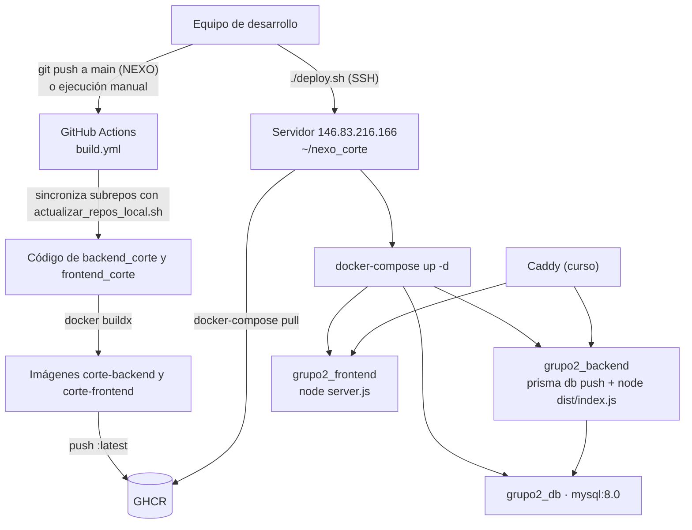

## 50.2 Componentes

```text
Internet
   |
Caddy (proxy inverso del servidor del taller, red red_taller_software, HTTP)
   |-- grupo2_frontend  (Next.js standalone, :3002, usuario sin privilegios)
   |-- grupo2_backend   (Express + Prisma, :4002)
             |
        grupo2_db       (MySQL 8.0, :3306, volumen grupo2_db_data)
```

## 50.3 Procedimiento vigente

**Opción A — con CI/CD:**
1. Hacer push a `main` del repositorio NEXO, o ejecutar el *workflow* a mano.
2. GitHub Actions:
   1. sincroniza la rama principal de los subrepositorios;
   2. construye las dos imágenes, inyectando `NEXT_PUBLIC_API_URL`;
   3. las publica en GHCR con la etiqueta `latest`.
3. Ejecutar `./deploy.sh`. El script:
   1. verifica que exista `~/nexo_corte/.env` en el servidor;
   2. copia `docker-compose.server.yml` como `docker-compose.yml`;
   3. ejecuta `docker-compose pull` y `docker-compose up -d`;
   4. muestra el estado de los contenedores.
4. Al arrancar, el backend ejecuta `prisma db push`, que sincroniza el esquema sin migraciones.
5. Verificar con `docker-compose ps` y `GET /api/health`.

**Opción B — construir en el servidor:** ejecutar `docker compose up -d --build` con el `docker-compose.yml` raíz, en el directorio donde están clonados los subrepositorios.

**Consideraciones:**
- Un push a `frontend_corte` o `backend_corte` **no** dispara la CI: hay que hacer un push al NEXO o ejecutar el *workflow* a mano.
- `NEXT_PUBLIC_API_URL` queda fija en la imagen: cambiarla requiere reconstruirla.
- Como solo existe la etiqueta `latest`, volver a una versión anterior exige re-etiquetar a mano. Se proponen etiquetas por versión y por commit (§71).
- `prisma db push` puede fallar, o **perder datos** si se fuerza, ante cambios destructivos del esquema. Se recomienda usar migraciones (§73) y respaldar antes de cada despliegue (§52).
- El seed **no** debe ejecutarse en producción (RSK-012).

---

# 51. INFRAESTRUCTURA

| Elemento | Actual (servidor del taller INFO282) | Recomendado para el cliente (propuesta; validar con carga real) |
|---|---|---|
| Servidor | Máquina compartida del curso (`146.83.216.166`), disponible hasta enero de 2027. Especificaciones no documentadas | Máquina virtual Linux dedicada (Ubuntu LTS o Debian) |
| CPU | No documentada | 2 vCPU |
| RAM | No documentada | 4 GB (MySQL cerca de 1 GB y cada proceso Node cerca de 512 MB) |
| Almacenamiento | Volumen Docker `grupo2_db_data` | 40 GB SSD, más respaldo externo (§52) |
| Red | Red Docker externa `red_taller_software`, sin puertos publicados | Red Docker interna; solo el puerto 443 expuesto, con firewall |
| Contenedores | Docker, con la CLI `docker-compose` (v1) en `deploy.sh` | Docker Engine 24+ con Compose v2 |
| Proxy y TLS | Caddy del curso, HTTPS con Let's Encrypt (dominio `corte-cuellonegro.inf.uach.cl`) | Caddy o Nginx propio, con certificado automático (Let's Encrypt) y el dominio del cliente |
| Nube | No | Opcional |

---

# 52. BACKUPS

**Situación actual:** los repositorios no definen ningún respaldo. Los datos solo están en el volumen Docker del servidor. El Charter reconoce la necesidad de hacer "respaldos periódicos de la base de datos".

**Propuesta:**

| Aspecto | Definición |
|---|---|
| Frecuencia | Diaria, fuera del horario operativo, y antes de cada despliegue o migración |
| Método | `mysqldump --single-transaction --routines` ejecutado desde el contenedor (JOB-003) |
| Retención | 7 diarios, 4 semanales y 6 mensuales |
| Ubicación | Fuera del servidor: almacenamiento del cliente o de la nube. Nunca solo en el mismo volumen |
| Cifrado | En reposo, con AES-256 (`age` o `gpg`), y con la clave custodiada por TI del cliente |
| Restauración | Prueba de restauración mensual, documentada (tiempo y resultado) |
| Responsable | DevOps durante el proyecto; TI del cliente después de la entrega |

Ejemplo del comando (sin secretos; las credenciales se leen del `.env`):

```text
docker exec grupo2_db sh -c 'mysqldump --single-transaction -u"$MYSQL_USER" -p"$MYSQL_PASSWORD" "$MYSQL_DATABASE"' | gzip > corte_$(date +%F).sql.gz
```

---

# 53. RECUPERACIÓN ANTE DESASTRES

Los valores son una propuesta y deben acordarse con el cliente.

**RPO (pérdida máxima de datos):** 24 h con el respaldo diario. Puede bajar a 1 h si se activan los *binary logs* de MySQL.
**RTO (tiempo máximo de recuperación):** 4 h hábiles.

**Procedimiento de recuperación:**
1. Declarar el incidente y avisar a la planta: se activa el registro en papel de contingencia.
2. Preparar un servidor con Docker (§51).
3. Recuperar el `.env` desde el gestor de secretos del cliente.
4. Desplegar las imágenes de la **última versión conocida como estable** (§71).
5. Restaurar el último respaldo válido (§52) y verificar que las tablas y la cantidad de registros estén íntegras.
6. Verificar `GET /api/health`, iniciar sesión y revisar la grilla de la cámara.
7. Apuntar el DNS o el proxy al nuevo servidor.
8. Cargar las operaciones registradas en papel durante la caída (§45) y cerrar el incidente, dejando un registro.

---

# 54. SEGURIDAD TÉCNICA

## 54.1 Contraseñas

- **Actual:** se guardan con bcrypt (costo 12; el seed usa 10). La contraseña inicial son los últimos 5 dígitos del RUT. Hay dos políticas distintas (RN-019). No hay bloqueo ni cambio obligatorio.
- **Requisito:**
  - una política única de 12 a 72 caracteres, con mayúscula, minúscula y número;
  - cambio obligatorio en el primer acceso;
  - bloqueo temporal tras varios intentos fallidos;
  - las contraseñas nunca se registran ni se devuelven.

## 54.2 Cifrado

- **En tránsito:** TLS 1.2 o 1.3 entre el navegador y el proxy en `https://corte-cuellonegro.inf.uach.cl`. Falta cerrar el acceso HTTP por el dominio anterior (RNF-SEG-004).
- **En reposo:** MySQL no cifra los datos (configuración por defecto). Se requiere cifrado del disco o del volumen, y respaldos cifrados (§52).
- **Hash:** bcrypt para las contraseñas.

## 54.3 HTTPS

- **Actual (29/09/2026):** `https://corte-cuellonegro.inf.uach.cl`, con certificado automático de Let's Encrypt (vence el 28/12/2026 y lo renueva Caddy).
- **Requisito en producción:**
  - dominio con certificado automático — **cumplido** (en la producción definitiva, el dominio del cliente);
  - redirección de 80 a 443 — **cumplido** (308);
  - HSTS con `max-age` de al menos 6 meses — **pendiente** (no se envía la cabecera);
  - `FRONTEND_URL` y `NEXT_PUBLIC_API_URL` con `https://` — **cumplido** (`NEXT_PUBLIC_API_URL` = `https://corte-cuellonegro.inf.uach.cl/api` en `build.yml`; `DOMAIN` del `.env` del servidor);
  - dar de baja el dominio anterior `http://grupo2.146.83.216.166.nip.io`, que sigue sirviendo la aplicación por HTTP — **pendiente** (lo configura el Caddy del curso).
- **Antecedente:** mientras el build usó `NEXT_PUBLIC_API_URL` = `http://grupo2.146.83.216.166.nip.io`, el navegador bloqueaba las llamadas a la API desde la página HTTPS (*Mixed Content*). Se corrigió en `NEXO-C.O.R.T.E@c8ff859`.

## 54.4 Protección contra ataques

| Amenaza (OWASP) | Situación actual | Acción requerida |
|---|---|---|
| Control de acceso roto (A01) | El rol se puede cambiar en el navegador, y hay endpoints sin autenticación | RNF-SEG-002, RNF-SEG-003, RNF-SEG-009 |
| Fallas criptográficas (A02) | TLS en el dominio actual, pero el dominio anterior sigue por HTTP y no hay HSTS; secreto JWT con valor por defecto | RNF-SEG-004, RNF-SEG-005 |
| Inyección SQL (A03) | Mitigada: Prisma usa consultas parametrizadas | Mantener. No concatenar SQL |
| XSS (A03) | React escapa el contenido, pero el token está en `localStorage` y no hay CSP | CSP, cookie `HttpOnly` (RNF-SEG-011) |
| CSRF | Riesgo bajo, porque el token va en una cabecera | Si se pasa a cookies: `SameSite=Strict` y token CSRF |
| SSRF (A10) | No hay llamadas a URLs que ingrese el usuario; la ruta BFF usa una URL fija de configuración | Mantener |
| Fuerza bruta en el login (A07) | Sin límites | RNF-SEG-007, §55 |
| Exposición de información (A05) | El endpoint de salud expone el mensaje técnico, y Express envía `X-Powered-By` | Ocultar el detalle técnico; `helmet` / `app.disable('x-powered-by')` |
| Componentes vulnerables (A06) | Sin escaneo automático de dependencias | Dependabot o `pnpm audit` en la CI |
| Registro y monitoreo insuficientes (A09) | Sin auditoría administrativa ni alertas | §37, §38, RNF-OBS-002 |

## 54.5 Gestión de secretos

- **Actual:**
  - `.env` fuera de git (según `.gitignore`);
  - plantillas con valores de ejemplo de desarrollo;
  - `JWT_SECRET` ausente de las plantillas;
  - `GH_PAT` en los secretos de GitHub;
  - el seed crea usuarios con contraseñas de prueba débiles.
- **Requisito:**
  - secretos aleatorios de al menos 32 bytes, distintos en cada entorno;
  - `.env` con permisos `600`, solo para el usuario de despliegue;
  - rotación semestral y ante la salida de un integrante del equipo;
  - `GH_PAT` con los permisos mínimos y fecha de expiración;
  - traspaso formal de las credenciales al cliente (Convenio, cláusula 4).

---

# 55. RATE LIMITING

**Situación actual:** no hay límites.

**Propuesta:**

| Alcance | Límite | Respuesta |
|---|---|---|
| `POST /api/auth/login`, por IP | 10 solicitudes por minuto | 429 con `Retry-After` |
| `POST /api/auth/login`, por cuenta | 5 fallos seguidos → bloqueo de 15 min | 423 o 429, con un mensaje genérico |
| API autenticada, por usuario | 300 solicitudes por minuto | 429 |
| Endpoints de escritura, por usuario | 60 solicitudes por minuto | 429 |
| `/api/health`, por IP | 60 solicitudes por minuto | 429 |

**Implementación:** `express-rate-limit`, que guarda los contadores en memoria y basta con una sola instancia. También puede configurarse en el proxy.

---

# 56. GESTIÓN DE DATOS

| Dato | Creación | Modificación | Eliminación | Retención |
|---|---|---|---|---|
| Usuarios | El Jefe | El Jefe; el propio usuario (solo contacto y contraseña) | No se eliminan: se desactivan | Mientras dure el servicio (DPO-028) |
| Lotes y pallets | Ingreso en el patio | Ubicación, reorganización (posición), despacho (estado) y edición (DPO-022) | No hay eliminación: anulación lógica con motivo (RF-ING-06) | Mientras dure el servicio (DPO-028) |
| Movimientos | Automática | Inmutables | No | Mientras dure el servicio (DPO-028) |
| Notas de calidad | Usuarios activos | Inmutables | Solo en cascada si se elimina el pallet (no hay API para eso) | Mientras dure el servicio (DPO-028) |
| Catálogos | El Jefe o Calidad | El Jefe o Calidad (DPO-018) | Se desactivan | Indefinida |
| Reglas y parámetros | El Jefe, Calidad o el seed | El Jefe o Calidad | No | Indefinida |
| Auditoría (propuesta) | Automática | Inmutable | No | Mientras dure el servicio (DPO-028) |
| Datos del seed | Solo en desarrollo | — | El seed **borra toda la BD** antes de cargar | Nunca en producción |

**Anonimización:** al término del convenio, los datos personales que el equipo conserve con fines académicos deben anonimizarse o eliminarse (Convenio, cláusula 11).

---

# 57. SOFT DELETE

| Entidad | Mecanismo | Campo |
|---|---|---|
| Usuario | Desactivación | `usuario.estado = false` |
| Tipo de envase | Desactivación | `tipo_envase.activo = false` |
| Tipo de cerveza | Desactivación | `tipo_cerveza.activo = false` |
| Regla de alerta | Desactivación | `activo = false` (dentro del JSON en `parametro.valor`) |
| Pallet | Nunca se elimina; su ciclo se expresa con el `estado` | `pallet.estado` |
| Ingreso erróneo (propuesto) | Anulación con motivo | Nuevo estado o marca de anulación (RF-ING-06) |

No se usa un campo `deleted_at`.

---

# 58. CONSISTENCIA E INTEGRIDAD

**Mecanismos vigentes:**
- restricciones de la BD (§17.7);
- validaciones de la aplicación (§31);
- transacciones (§34);
- control de concurrencia (§35).

**Inconsistencias posibles con el diseño actual**, y su corrección:

| # | Inconsistencia | Causa | Corrección |
|---|---|---|---|
| 1 | Dos pallets en la misma posición | Falta UNIQUE en `pallet_posicion.id_posicion`, y el ingreso no verifica ni desplaza | Restricción UNIQUE y validación en TX-001 (DT-010) |
| 2 | Posiciones ocupadas que la grilla muestra libres | Pallets con estado distinto de `EN_CAMARA` que conservan su ubicación (datos del seed) | Regla: solo `EN_CAMARA` ocupa una posición; corregir el seed |
| 3 | RUT duplicado | La unicidad se verifica solo en la aplicación, sin transacción | UNIQUE en `usuario.rut` (DT-009) |
| 4 | Un mismo lote registrado como varios lotes | Cada ingreso crea un lote nuevo, aunque el lote tenga varios pallets | Buscar o crear el lote al ingresar (RN-012, DPO-006) |
| 5 | Reglas que divergen entre frontend y backend | Zonas y niveles duplicados en ambas capas | Una sola fuente en el backend (DT-001) |
| 6 | Parámetros de la BD distintos de las constantes | Existen `parametro` y catálogos que no se leen | RF-CFG-05 |
| 7 | Prioridad FIFO distinta según la pantalla | Dos criterios con el mismo nombre (H-08) | Dos alertas separadas y con nombres distintos: Fuera de frío y Vencimiento (DPO-002) |
| 8 | Pallets `EN_CAMION` que conservan su posición | Datos del seed | El ciclo termina en `EN_CAMION` sin posición (DPO-025); corregir el seed |

---

# 59. FECHA, HORA Y ZONA HORARIA

**Situación actual:**
- **Columnas `DATE` (sin hora):** `lote.fecha_producida`, `pallet.fecha_creacion`, `pallet.fecha_ingreso` y `pallet.fecha_vencimiento`.
- **Columnas `DATETIME(0)`:** `pallet_posicion.fecha_ingreso`, `movimiento.fecha_movimiento`, `nota_calidad.fecha`, `auditoria.fecha_hora`, `parametro.fecha_actualizacion` y `alerta.fecha_creacion`. Prisma las escribe en UTC.
- **API:** entrega fechas ISO 8601 en UTC (`…Z`).
- **Presentación:** en la zona horaria del navegador (en Chile, `America/Santiago`, UTC−4 en invierno y UTC−3 en verano), con formatos `es-ES` y `es-CL`.
- **Filtros:** los del inventario interpretan las fechas en UTC; los del historial, en hora local.

**Problema:** como la fecha de envasado no tiene hora, el cálculo FIFO parte de las 00:00 UTC.
- La validación del manual US-04 lo confirma: un ingreso del 28-09-2026 se mostró como "27-09-2026, 21:00".
- En el caso de un Lager ingresado al mediodía (UTC−3), aparece de inmediato con unas 9 h restantes, en estado Preventivo.

**Decisión del PO (DPO-001, DPO-004):** de la fecha de envasado solo importa la fecha, y el plazo fuera de frío corre desde el registro en el patio, que sí tiene hora. Por lo tanto:
- la fecha de envasado sigue como `DATE`, pero se interpreta como fecha de calendario en Chile (no como 00:00 UTC) y se muestra sin hora;
- el registro en el patio y la entrada a la cámara se guardan como instantes con hora (§17.8);
- el problema anterior desaparece, porque el plazo ya no se calcula desde la fecha de envasado.

**Estándar requerido:**

| Aspecto | Definición |
|---|---|
| Persistencia de instantes | En UTC y con hora: `DATETIME(3)` o `TIMESTAMP`. Incluye el registro en el patio y la entrada a la cámara |
| Fechas de calendario | Tipo `DATE` (la fecha de envasado y el vencimiento), interpretadas en `America/Santiago` |
| Presentación | Zona `America/Santiago` y formato `es-CL`: `dd-mm-aaaa` y 24 h |
| API | ISO 8601 con zona (`Z`) |
| Cálculos | Alertas Fuera de frío y Vencimiento con la hora del **servidor**, no la del dispositivo |
| Filtros por fecha | Interpretados en `America/Santiago` |

---

# 60. LOCALIZACIÓN

| Aspecto | Situación actual | Estándar |
|---|---|---|
| Idioma | Español | Español de Chile. Otros idiomas, fuera de alcance |
| Formato regional | Mezcla de `es-ES` (detalle, alertas, inventario, lista de ingresos) y `es-CL` (historial, patio y bodega 2) | `es-CL` en toda la aplicación |
| Fechas | Varios formatos (`dd/mm`, `dd/mm/aaaa`, fecha larga, `dd mmm aaaa`) | `dd-mm-aaaa`, y fecha larga solo en títulos |
| Hora | 24 h | 24 h |
| Números | La temperatura usa punto decimal (`toFixed`) | Coma decimal con `Intl.NumberFormat('es-CL')` |
| Unidades | Cajas, horas, días y °C. "Cajas" también para barriles | Unidad según el envase: cajas, barriles o petainers (DPO-008). Sin °C (DPO-027) |
| Moneda | No aplica | — |

---

# 61. BÚSQUEDAS

| Pantalla | Campos | Coincidencia | ¿Distingue mayúsculas? | ¿Normaliza tildes? | Dónde se ejecuta |
|---|---|---|---|---|---|
| Inventario | Lote | Contiene | No | No | Navegador |
| Lista de ingresos | Lote, estilo, posición | Contiene | No | No ("ambar" no encuentra "Ámbar") | Navegador |
| Usuarios | Nombre, apellido, cargo, RUT, correo | Contiene | No, salvo el RUT: no encuentra la "K" (H-16) | No | Navegador |
| Patio y Bodega 2 | Lote, envase, cerveza, id | Contiene | No | No | Navegador |
| Alta de pallet (backend) | Estilo y envase contra el catálogo | Igualdad o "contiene" | No | Sí (NFD) | Servidor |

**Estándar:**
- Normalizar en el cliente y en el servidor: quitar los diacríticos (NFD) y pasar a minúsculas.
- Buscar el RUT sin puntos ni guion y en mayúsculas.
- Cuando se pagine en el servidor (§26), buscar con `q` y usar índices.

---

# 62. CACHÉ

| Capa | Qué se cachea | TTL / refresco | Invalidación |
|---|---|---|---|
| Frontend (SWR) | Claves de §23 | Sin TTL fijo. Deduplicación de 2 s, revalidación al recuperar el foco y al reconectar, y refresco cada 30 s en Patio y Bodega 2 | Revalidación explícita después de cada operación. Actualización optimista en el despacho (se quita el pallet) y en la reorganización (se aplica la proyección) |
| Frontend (estáticos) | JS, CSS e imágenes | Build con *hash* de contenido | Cada nuevo build |
| Backend | No hay caché de aplicación | — | — |
| HTTP (API) | Express envía un ETag débil por defecto | — | — |

**Recomendaciones:**
- Enviar `Cache-Control: no-store` en las respuestas autenticadas.
- Refrescar la Vista de Cámara cada 15–30 s cuando operen varios usuarios (§35).
- No cachear la grilla en el servidor mientras la escritura concurrente sea frecuente.

---

# 63. DIAGRAMAS DE SECUENCIA

Estos diagramas describen la **implementación actual**. Con las decisiones del PO cambian así:
- **DS-001:** si la cuenta usa la contraseña inicial, el login termina en la pantalla de cambio obligatorio (RF-AUT-06).
- **DS-002:** el ingreso ya no elige la posición: crea el pallet en el patio, y la ubicación es una operación aparte (ACT-DIAG-001, ACT-DIAG-005, API-030).
- **DS-003:** el diálogo de ruptura pide el motivo, que viaja en la solicitud y se guarda con el movimiento (RN-030).
- **DS-004:** cualquier cargo con el permiso Reorganizar puede guardar (DPO-016).

## DS-001 — Inicio de sesión

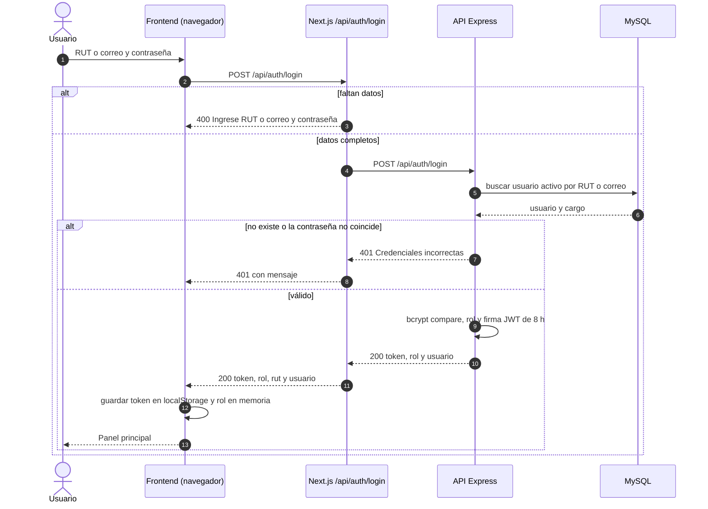

## DS-002 — Registrar ingreso

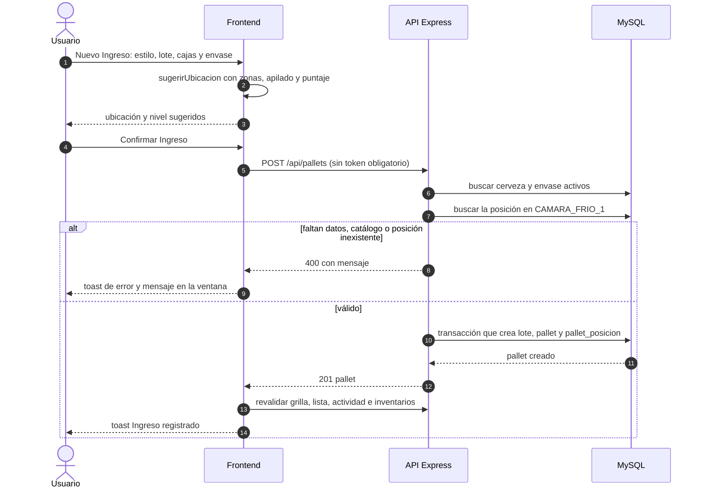

## DS-003 — Despachar pallet con advertencia FIFO

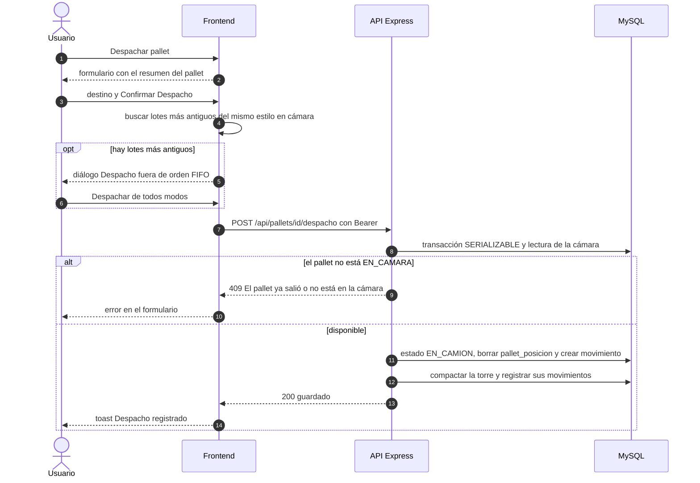

## DS-004 — Reorganizar la cámara

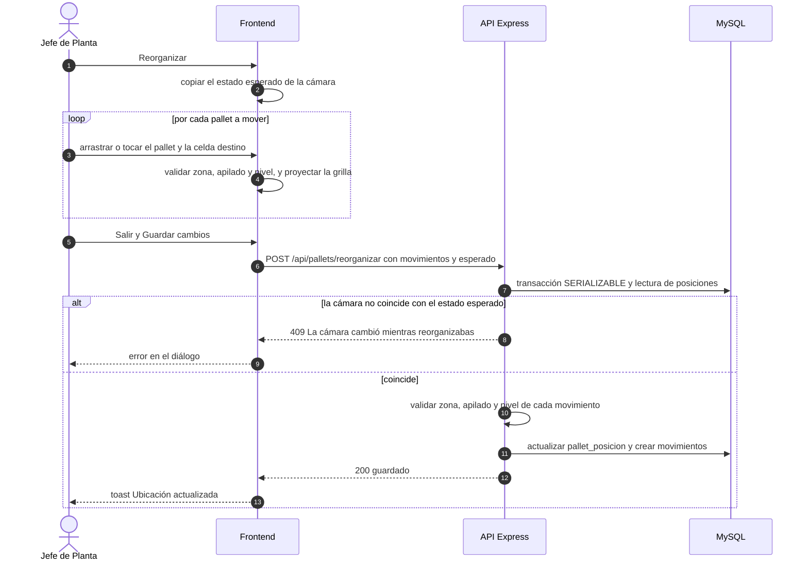

---

# 64. DIAGRAMAS DE ACTIVIDAD

Ver §14:
- ACT-DIAG-001: registrar ingreso;
- ACT-DIAG-002: despachar;
- ACT-DIAG-003: reorganizar;
- ACT-DIAG-004: iniciar sesión.

El diagrama de actividad original del equipo está en `documentacion_corte/Diagramas/Actividad.jpeg`. Es coherente con el flujo actual, salvo la "sincronización en la nube" (no implementada) y el estado "En Tránsito", que en el sistema se llama "En Camión".

---

# 65. DIAGRAMAS DE ESTADO

Ver §19.4 (pallet, usuario y alerta).

---

# 66. DIAGRAMAS DE COMPONENTES

**Ver:**
- §21 (componentes) y §22 (módulos);
- el diagrama de paquetes del equipo, `documentacion_corte/Diagramas/Componentes.png`, que muestra la arquitectura en 4 capas.

**Diferencias entre el diagrama del equipo y el código:**
- "UI Planificación e Informes", "API Planificación e Informes" y la conexión con Gestión Cervecera no están implementadas.
- El "Motor FIFO" y el "Validador de Ruptura FIFO" están en el cliente, como indica el diagrama, pero el backend repite parte de las reglas de apilado y zonas.

---

# 67. DIAGRAMA DE ARQUITECTURA

Ver §20.2.

---

# 68. DIAGRAMA DE DESPLIEGUE

Ver §50.1 y §50.2.

---

# 69. DECISIONES TÉCNICAS

Las decisiones se reconstruyeron a partir del código y de la documentación. Cuando el motivo no está escrito en ningún documento, se marca como *(inferido)*.

## DEC-001 — Frontend con Next.js 14 (App Router), React 18 y TypeScript

**Contexto:** se necesitaba una interfaz táctil para tablet y celular (Kickoff). El prototipo nació en Figma y en una primera versión con Vite.
**Decisión:** Next.js 14 con App Router y componentes de cliente, Tailwind CSS 4 y shadcn/ui (Radix). Salida *standalone* para Docker.
**Motivo:** "interfaz táctil reactiva y optimizada para móviles" (Kickoff); ecosistema React; migración desde el prototipo (README del frontend).
**Alternativas consideradas:** Vite con React como SPA (la versión previa del prototipo); Angular o Vue *(inferido)*.
**Consecuencias:**
- Casi todo se renderiza en el navegador.
- Las variables `NEXT_PUBLIC_*` quedan fijas en el build.
- Una ruta BFF para el login.

## DEC-002 — Backend con Express 5, TypeScript, Prisma 5 y MySQL 8

**Contexto:** una API para el gemelo digital y el inventario, desplegada en contenedores.
**Decisión:** Express 5 con TypeScript estricto; Prisma ORM; MySQL 8.0 en Docker.
**Motivo:** Prisma genera tipos de TypeScript automáticamente, y MySQL se puede dockerizar sin dependencias externas (Kickoff).
**Alternativas consideradas:** NestJS; PostgreSQL *(inferido)*.
**Consecuencias:**
- Los tipos del frontend (`types.ts`) y las conversiones del backend (`mappers.ts`) se mantienen a mano, con riesgo de que diverjan.
- La API se genera desde el esquema de Prisma.

## DEC-003 — Autenticación sin estado con JWT Bearer

**Contexto:** hay pocos usuarios y un solo backend.
**Decisión:** JWT HS256 de 8 h, enviado en la cabecera `Authorization`.
**Motivo:** es simple y no requiere un almacén de sesiones *(inferido)*.
**Alternativas consideradas:** sesiones con cookie en el servidor.
**Consecuencias:** no se pueden revocar tokens; el token queda en `localStorage`; no hay renovación (§28, §30).

## DEC-004 — Estado del cliente con SWR y React Context

**Contexto:** varias vistas comparten los mismos datos de la cámara.
**Decisión:** SWR para los datos del servidor y `AppProvider` (Context) para la sesión, el rol y las ventanas globales.
**Motivo:** tener caché y revalidación con poco código *(inferido)*.
**Alternativas consideradas:** Redux o React Query *(inferido)*.
**Consecuencias:** las vistas se sincronizan automáticamente. La sesión vive en memoria, pero se restaura desde el JWT al recargar (RF-AUT-05).

## DEC-005 — Reglas FIFO, zonas y sugerencia de ubicación en el cliente

**Contexto:** el frontend se construyó primero, contra un backend simulado en memoria (REF-13).
**Decisión:** la lógica quedó en `frontend/src/lib`. El backend repite las zonas y el apilado solo para la reorganización.
**Motivo:** permitir hacer demostraciones sin backend.
**Alternativas consideradas:** un servicio de reglas en el backend.
**Consecuencias:**
- Hay lógica duplicada.
- El backend no valida el ingreso.
- Los parámetros no se pueden configurar (DT-001, DT-002).
- **Se recomienda revisar esta decisión.** Las decisiones del PO la vuelven más urgente: las dos alertas, la ubicación desde el patio, las cantidades por envase y las reglas de Kombucha y Petainer deben validarse en el servidor (DPO-002, DPO-005, DPO-009 a DPO-012).

## DEC-006 — Esquema sincronizado con `prisma db push`

**Contexto:** el modelo de datos cambió mucho en las primeras etapas.
**Decisión:** `db push`, tanto en desarrollo como al arrancar el contenedor.
**Motivo:** agilidad *(inferido)*.
**Alternativas consideradas:** `prisma migrate`.
**Consecuencias:** no queda historial de cambios, y en producción puede fallar o perder datos (§73). **Se recomienda revisar esta decisión.**

## DEC-007 — Despliegue con Docker, GHCR y el proxy del curso

**Contexto:** la universidad provee un servidor de pruebas hasta enero de 2027 (Charter).
**Decisión:** imágenes construidas en GitHub Actions y publicadas en GHCR; despliegue con `deploy.sh` y Docker Compose, detrás del Caddy del curso.
**Motivo:** son las restricciones del curso (nombres `grupo2_*`, red compartida).
**Alternativas consideradas:** construir las imágenes en el servidor (compose raíz).
**Consecuencias:** el sistema depende de la infraestructura del curso, y hay que migrarlo antes de 2027 (RSK-010).

## DEC-008 — Varios repositorios coordinados por el repositorio NEXO

**Contexto:** hay tres áreas de trabajo (documentación, backend y frontend).
**Decisión:** un repositorio por área, más el NEXO, que coordina la CI, los compose y los scripts.
**Motivo:** separar responsabilidades y permisos *(inferido)*.
**Alternativas consideradas:** un monorepositorio.
**Consecuencias:** un push a los subrepositorios no dispara la CI, y las versiones de cada parte quedan desacopladas.

## DEC-009 — Transacciones SERIALIZABLE y control optimista en la cámara

**Contexto:** varios usuarios pueden mover o despachar pallets al mismo tiempo.
**Decisión:** transacciones con aislamiento SERIALIZABLE y comparación del estado `esperado` en la reorganización.
**Motivo:** evitar estados físicos imposibles (RN-024).
**Alternativas consideradas:** bloqueos por fila; versión por bodega.
**Consecuencias:** hay consistencia fuerte, pero cualquier cambio concurrente rechaza toda la reorganización.

## DEC-010 — Validación con Zod en el backend

**Decisión:** esquemas estrictos (`.strict()`) en autenticación, usuarios, perfil, configuración y operaciones de cámara.
**Consecuencias:**
- Hay contratos claros.
- Si no se personalizan, los mensajes salen en inglés (H-31).
- Falta un esquema en `POST /api/pallets`.

## DEC-011 — Interfaz oscura y táctil, pensada para usarse con guantes

**Contexto:** la evaluación heurística de Nielsen (REF-12) describe el uso con guantes, pantalla húmeda y frío.
**Decisión:** tema oscuro, objetivos táctiles grandes, estados expresados con texto, icono y color, controles −/+ en lugar de teclado, y selección de ubicación en un mini-mapa.
**Consecuencias:** es más usable en la cámara. El tema oscuro es fijo y el contraste de los textos secundarios debe verificarse (RNF-ACC-001).

## DEC-012 — Desactivación lógica en vez de eliminación

**Decisión:** los usuarios y los catálogos se desactivan; los pallets nunca se eliminan.
**Consecuencias:** se conserva la trazabilidad histórica (RN-020, RN-023).

## DEC-013 — Reglas de alerta guardadas como JSON en `parametro`

**Decisión:** guardarlas bajo las claves `CONFIG_ALERTA_…`, con el valor en JSON.
**Motivo:** no cambiar el esquema de la BD (README del backend).
**Consecuencias:**
- No se pueden consultar por campo.
- El JSON completo no puede superar 255 caracteres.
- Hace falta un evaluador (RF-NTF-02).

---

# 70. CONVENCIONES DE DESARROLLO

| Aspecto | Convención observada | Estándar propuesto |
|---|---|---|
| Idioma del dominio | Español (pallet, lote, bodega, despacho) | Igual |
| Nombres en TypeScript | `camelCase` para variables y funciones; `PascalCase` para componentes y tipos; `UPPER_SNAKE` para constantes; hooks `useXxx` | Igual |
| Nombres en la BD | `snake_case` mediante `@map` de Prisma | Igual |
| Estructura del frontend | `src/app/<ruta>/page.tsx`, `src/components/<dominio>/`, `src/components/ui/` (shadcn), `src/hooks/`, `src/lib/`, `src/styles/` | Igual |
| Estructura del backend | `src/routes/`, `src/controllers/`, `src/lib/`, `src/middlewares/`, `prisma/`, `tests/` | Separar servicios de dominio (`src/services/`) de las rutas |
| Endpoints | `/api/<recurso>`, con mezcla de español e inglés | Un solo idioma, recursos en plural y en minúsculas (se decide en la v1, §72) |
| Rutas de la interfaz | Español en *kebab-case* (`/mi-perfil`, `/bodega-2`) | Igual |
| Variables de entorno | `UPPER_SNAKE`; `NEXT_PUBLIC_` para las que usa el navegador | Igual |
| Commits | Conventional Commits en uso parcial (`feat:`, `fix:`, `chore:`, `ci:`, `docs:`), en español | `tipo(alcance): descripción` en español, siempre |
| Ramas | `main`, más `feature/*`, `fix/*` y `docs/*` (por ejemplo, `feature/backend-setup-express-prisma-mysql`) | En los repositorios de código, integrar a `main` mediante PR con revisión |
| Gestor de paquetes | pnpm 9.15.9 (`packageManager`). `INSTALACION.md` usa npm para el backend | pnpm en todos los repositorios |
| Versionado | Ver §71 | SemVer |

---

# 71. VERSIONADO

**Situación actual:**
- El frontend declara la versión `0.1.0` y el backend, `1.0.0`, en su `package.json`.
- No hay etiquetas de git ni CHANGELOG.
- Las imágenes solo se publican como `latest`.

**Política propuesta:**
- SemVer (`MAJOR.MINOR.PATCH`) para cada componente:
  - `MAJOR`: cambios que rompen la API o requieren una migración con pérdida de datos;
  - `MINOR`: funcionalidades nuevas compatibles;
  - `PATCH`: correcciones.
- Una etiqueta `vX.Y.Z` en cada repositorio.
- Las imágenes se etiquetan con `X.Y.Z`, `sha-<commit>` y `latest`.
- `CHANGELOG.md` por repositorio.
- La versión se muestra en la interfaz (pie del menú) y en `/api/health` (campo `version`).
- Primera versión etiquetada propuesta: `v1.0.0`, en la entrega para UAT.

```text
MAJOR.MINOR.PATCH
```

---

# 72. COMPATIBILIDAD HACIA ATRÁS

**Hoy:** el frontend y el backend se despliegan juntos, así que el contrato de la API es interno. Sin embargo, la integración con el ERP (INT-001) y los futuros clientes necesitarán un contrato estable.

**Se considera que un cambio rompe la compatibilidad si:**
- elimina o renombra un endpoint o un campo;
- cambia el tipo o el significado de un campo;
- vuelve más estricta una validación que antes aceptaba el dato;
- cambia un código de error.

**Política:**
- Prefijo `/api/v1` a partir de la próxima versión que rompa compatibilidad.
- Los endpoints obsoletos se mantienen durante una versión `MINOR` y avisan con la cabecera `Deprecation`.
- Los cambios de la BD se hacen en dos fases: primero se amplía el esquema y, más adelante, se retira lo antiguo.
- `lib/mappers.ts` ya acepta formatos antiguos de fila y columna ("F1", "C1"). Esas compatibilidades deben documentarse y retirarse de forma planificada.

---

# 73. MIGRACIONES DE BASE DE DATOS

**Situación actual:**
- En desarrollo se usa `prisma db push`. El contenedor del backend también lo ejecuta en cada arranque.
- El script `db:migrate` existe, pero no hay una carpeta `prisma/migrations`.
- `Base de datos/init/01_init.sql` está vacío.

**Propuesta:**

| Aspecto | Definición |
|---|---|
| Herramienta | Prisma Migrate: `prisma migrate dev` en desarrollo y `prisma migrate deploy` en los despliegues |
| Nombres | Los de Prisma: `AAAAMMDDHHMMSS_descripcion_en_snake_case` |
| Versionado | La carpeta `prisma/migrations/` se versiona en git y se revisa en un PR |
| Línea base | Para la BD que ya existe: `prisma migrate diff` para generar la migración inicial y `prisma migrate resolve --applied` para marcarla como aplicada |
| Ejecución | Un paso explícito del despliegue (en `deploy.sh` o en un contenedor de una sola ejecución), con bloqueo. **Nunca** `db push` en producción |
| Vuelta atrás | Prisma no genera migraciones de reversa: se escribe una migración inversa o se restaura el respaldo previo, que es **obligatorio** antes de migrar (§52) |
| Seed | Solo en desarrollo y pruebas, con un bloqueo cuando `NODE_ENV=production` |

---

# 74. PRUEBAS

## 74.1 Pruebas unitarias

| Archivo | Herramienta | Qué cubre | Requisitos |
|---|---|---|---|
| `frontend_corte/src/lib/apilado.test.ts` | `node:assert` (script) | Apilado (la lata no se apila, torre llena), zonas por envase, D1 bloqueada, inserción y compactación de torres | RN-001 a RN-005, RN-014, RF-OPT-01 |
| `frontend_corte/src/lib/mock-store.test.ts` | `node:assert` | **Roto**: importa `mock-store`, que ya no existe | — (eliminar) |
| `backend_corte/tests/pallet-operations.test.ts` | `node:test`, con una BD simulada | El despacho libera y compacta la torre; la reorganización inserta y compacta; se revierte ante movimientos inválidos; rechaza la concurrencia y los permisos | RF-DES-01, RF-CAM-01, RN-014, RN-024 |
| `backend_corte/tests/usuarios.test.ts` | `node:test`, con Prisma simulado | Alta y edición: normalización del RUT, contraseñas y errores | RF-USR-02, RF-USR-03 |
| `backend_corte/tests/last-chief.test.ts` | `node:test` | Protección del último jefe | RF-USR-03, RF-USR-04, RN-017 |
| `backend_corte/tests/profile-inventory.test.ts` | `node:test` | Perfil autenticado; inventario separado por ubicación | RF-PER-01, RF-PER-02, RF-INV-05 |
| `backend_corte/tests/config.test.ts` | `node:test` | Catálogos, validaciones, errores y acceso | RF-CFG-01 a RF-CFG-03 |

**Cómo se ejecutan:** en el backend, `node --import tsx --test tests/*.test.ts`. Hay cerca de 90 aserciones.
**Falta:** pruebas de `lib/fifo.ts` (cálculo FIFO), de la sugerencia de ubicación (puntaje) y de `crearPallet`. Con las decisiones del PO se agregan: las dos alertas (RN-008), la ubicación desde el patio (RF-ING-07), las reglas de Kombucha y Petainer (RN-027, RN-028), el motivo de ruptura (RN-030), la anulación (RN-031) y el cambio obligatorio de contraseña (RF-AUT-06).

## 74.2 Pruebas de integración

- `backend_corte/tests/pallet-operations-db.test.ts` reorganiza y despacha contra un MySQL real, sin dejar datos de prueba. Se activa con `RUN_DB_TESTS=1`.
- Las demás pruebas del backend llaman a los controladores con solicitudes simuladas.
- **Propuesta:**
  - pruebas HTTP de la API completa (supertest) contra una BD temporal, en la CI;
  - pruebas de contrato del frontend contra la API (formatos de §24).

## 74.3 Pruebas E2E

**No existen.**
**Propuesta:** Playwright en escritorio y en una resolución móvil, para UC-001, UC-003, UC-008, UC-009, UC-012, UC-014 y UC-023. Se ejecutan en la CI contra un entorno de pruebas (TC-022).

## 74.4 Pruebas de rendimiento

**No existen.**
**Propuesta:** k6 con 10 usuarios virtuales durante 5 minutos, que consulten la grilla, despachen e ingresen, verificando RNF-PER-001 y RNF-PER-002 (TC-019).

## 74.5 Pruebas de seguridad

**No existen.**
**Propuesta:**
- una batería de pruebas de autorización por rol y endpoint, según la matriz de §29.3 (TC-020);
- un escaneo automático con OWASP ZAP (*baseline*) sobre el entorno de pruebas;
- `pnpm audit` o Dependabot;
- verificación de TLS y de los secretos en producción (TC-021).

**CI:** hoy la CI solo construye imágenes. Se propone agregar, en cada PR y en `main` de cada repositorio, un trabajo que ejecute la verificación de tipos, las pruebas y el linter.

---

# 75. CRITERIOS DE ACEPTACIÓN

**Columnas:**
- **Dado / Cuando / Entonces:** el criterio en formato Gherkin, en forma compacta.
- **¿Cumple hoy?:** el resultado esperado según el código analizado. No reemplaza la verificación de QA.

| ID | Dado | Cuando | Entonces | ¿Cumple hoy? |
|---|---|---|---|---|
| CA-RF-AUT-01-01 | Un usuario activo con credenciales válidas | Ingresa su RUT (con o sin puntos y guion) o su correo, y su contraseña | Accede al Panel principal y ve solo el menú de su rol | Sí |
| CA-RF-AUT-01-02 | Una cuenta existente | Ingresa una contraseña incorrecta | Ve "Credenciales incorrectas" y no se guarda ningún token | Sí |
| CA-RF-AUT-01-03 | Una cuenta desactivada | Intenta ingresar con credenciales correctas | Se rechaza el acceso (401) | Sí |
| CA-RF-AUT-02-01 | Una sesión iniciada | Pulsa **Cerrar sesión** | Vuelve al login, el token desaparece del navegador y la API lo rechaza si se vuelve a usar | Parcial: el token sigue siendo válido en el servidor |
| CA-RF-AUT-03-01 | Un usuario que olvidó su contraseña | Pulsa "¿Olvidaste tu contraseña?" | Ve la indicación de pedírsela al Jefe de Planta (DPO-021) | No (el enlace no hace nada) |
| CA-RF-AUT-04-01 | Un usuario Ayudante | Intenta abrir `/usuarios` o `/config`, o llamar a sus APIs | La pantalla lo redirige y la API responde 403 | Sí |
| CA-RF-AUT-04-02 | Un usuario que no es Jefe | Cambia su rol en el navegador o llama sin token a `POST /api/pallets` | No obtiene permisos adicionales y la API responde 401 o 403 | No |
| CA-RF-AUT-04-03 | Un Ayudante Operativo | Intenta despachar un pallet | La interfaz no muestra **Despachar** y la API responde 403 (DPO-016) | No (hoy puede despachar) |
| CA-RF-AUT-05-01 | Una sesión con token vigente | Recarga la página | Sigue autenticado, con el mismo rol y el mismo menú | Sí |
| CA-RF-AUT-05-02 | Un navegador sin token o con token expirado | Abre directamente una ruta interna, como `/inventario` | Es redirigido a `/login` sin ver la pantalla | Sí |
| CA-RF-AUT-05-03 | Una sesión con token vigente | Abre `/login` | Es redirigido al Panel principal | Sí |
| CA-RF-AUT-06-01 | Un usuario recién creado o con la contraseña restablecida | Ingresa con los últimos 5 dígitos de su RUT | Solo ve la pantalla de cambio de contraseña; la API responde ERR-045 a otras operaciones hasta que define una que cumple RN-019 | No |
| CA-RF-USR-01-01 | Existen usuarios activos e inactivos | El Jefe filtra por "Inactivo" y busca por apellido | Ve solo los inactivos que coinciden | Sí |
| CA-RF-USR-02-01 | Un RUT válido no registrado y los datos obligatorios completos | El Jefe pulsa **Crear usuario** | La cuenta queda activa, aparece en la lista y puede ingresar con los últimos 5 dígitos del RUT | Sí |
| CA-RF-USR-02-02 | Existe un usuario con RUT 11.111.111-1 | El Jefe crea otro con "111111111" | Recibe "Ya existe un usuario con ese RUT." (409) | Sí |
| CA-RF-USR-03-01 | Un usuario Ayudante | El Jefe cambia su cargo a Calidad y guarda | El cambio se ve en la lista y aplica en el próximo inicio de sesión | Sí |
| CA-RF-USR-03-02 | El Jefe asigna una contraseña nueva | Guarda | El usuario ingresa con la nueva contraseña y ya no con la anterior | Sí |
| CA-RF-USR-03-03 | El Jefe asigna una contraseña de 8 letras minúsculas | Guarda | Se rechaza por no cumplir la política única (DPO-019) | No (hoy se acepta) |
| CA-RF-USR-04-01 | El Jefe en su propia fila | Intenta desactivarse | No ve el interruptor, y la API responde 403 si se intenta igual | Sí |
| CA-RF-USR-04-02 | Hay un único Jefe activo | Se intenta desactivarlo o cambiar su cargo | Se rechaza con 409 | Sí |
| CA-RF-USR-04-03 | Un usuario activo | El Jefe lo desactiva y confirma | El usuario ya no puede iniciar sesión | Sí |
| CA-RF-USR-05-01 | Un cargo con permisos definidos | El Jefe le quita un permiso | La interfaz y la API dejan de permitir esa acción a ese cargo desde la siguiente solicitud | No |
| CA-RF-USR-06-01 | Un usuario que olvidó su contraseña | El Jefe pulsa **Restablecer contraseña** y confirma | El usuario entra con los últimos 5 dígitos de su RUT y debe cambiarla (RF-AUT-06); la acción queda auditada | No |
| CA-RF-PER-02-01 | Un usuario en Mi perfil | Cambia su contraseña con la actual correcta y una nueva que cumple la política | Puede ingresar con la nueva | Sí |
| CA-RF-PER-02-02 | Un usuario en Mi perfil | Indica una contraseña actual incorrecta | Ve "La contraseña actual es incorrecta." y no cambia nada | Sí |
| CA-RF-ING-01-01 | Lager activo y Barril Euro con máximo 16 | Se registra el lote nuevo 26-001, envasado hoy, con la cantidad propuesta | El pallet queda "En Patio" con 16 barriles, vencimiento = fecha de envasado + 90 días y el plazo fuera de frío de 24 h en curso | No (hoy queda en la cámara) |
| CA-RF-ING-01-02 | El formulario de ingreso con Caja de latas | Se intenta bajar de 1 o subir de 72 cajas | Los botones se deshabilitan en los límites y la API rechaza valores fuera de rango (ERR-039) | No (hoy el límite es 60 para todo) |
| CA-RF-ING-01-03 | El formulario de ingreso | Se escribe el lote "2026-1" | Aparece ERR-041 y no se registra nada | No |
| CA-RF-ING-01-04 | El lote 26-001 existe como Lager | Se registra otro pallet Lager con el lote 26-001 | El pallet se agrega a ese lote, que queda con 2 pallets. Si el estilo fuera otro, se rechaza con ERR-042 | No (hoy responde 500) |
| CA-RF-ING-01-05 | Un usuario autenticado | Registra un ingreso | El historial muestra un movimiento "Ingreso" con su nombre | No |
| CA-RF-ING-01-06 | Una solicitud sin token | Llega a `POST /api/pallets` | Se rechaza con 401 | No |
| CA-RF-ING-02-01 | Tres pallets del mismo lote | Se indica cantidad 3 y se confirma | Se crean 3 pallets en el patio, del mismo lote, o ninguno si alguno falla | No |
| CA-RF-ING-03-01 | Un ingreso con 2 fotos (Sprint 2 o después, DPO-026) | Se confirma | Las fotos se ven en el detalle del pallet | No |
| CA-RF-ING-04-01 | Hay 7 pallets en cámara | El Jefe abre Lista de Ingresos | Ve 6 en la primera página y 1 en la segunda, del más reciente al más antiguo | Sí |
| CA-RF-ING-05-01 | Un ingreso con una cantidad errónea | El Jefe edita la cantidad y guarda | El valor cambia y queda auditado, con el valor anterior y el nuevo | No |
| CA-RF-ING-06-01 | Un ingreso creado por error | El Jefe lo anula indicando el motivo | Queda `ANULADO`, desaparece del inventario, libera su posición y el historial muestra la anulación con el motivo | No |
| CA-RF-ING-07-01 | Un pallet en el patio y una posición sugerida | Un Ayudante confirma la ubicación | El pallet queda `EN_CAMARA` en el primer nivel libre de la torre, con su movimiento, y se detiene su plazo fuera de frío | No |
| CA-RF-ING-07-02 | Dos usuarios ubican pallets en la misma torre al mismo tiempo | Ambos confirman | Uno se guarda; el otro recibe un error y una nueva sugerencia, sin que queden dos pallets en el mismo nivel | No |
| CA-RF-OPT-01-01 | Envase Lata | Se calcula la sugerencia | La posición está en la zona Latas o en D2 o D3, en el nivel 1 de una celda vacía | Sí |
| CA-RF-OPT-01-02 | Envase Barril, con torres con espacio | Se calcula la sugerencia | Nunca propone un nivel mayor al máximo de la posición ni encima de una lata | Sí |
| CA-RF-OPT-01-03 | Hay celdas vacías y ocupadas válidas | Se calcula la sugerencia | Prefiere una celda vacía junto a pallets del mismo estilo | Sí |
| CA-RF-OPT-01-04 | Dos torres válidas: una con un pallet que vence antes que el nuevo y otra sin ese problema | Se calcula la sugerencia | Propone la que no tapa al pallet que vence antes y lo explica en las razones (DPO-015) | No |
| CA-RF-OPT-01-05 | Un pallet de Kombucha (Sprint 2) | Se calcula la sugerencia | Solo propone D2; si D2 está ocupada, muestra "Cámara llena" (RN-027) | No |
| CA-RF-OPT-01-06 | Un pallet de Petainer (Sprint 2) y torres de barriles de 4 niveles | Se calcula la sugerencia y se intenta apilar encima | Puede proponer el nivel 5, nunca en C4 sobre el nivel 2, y ningún pallet puede quedar sobre el Petainer (RN-028) | No |
| CA-RF-OPT-02-01 | Un usuario elige una ubicación distinta de la sugerida | Confirma la ubicación | Se le exige una justificación, que queda registrada | No |
| CA-RF-OPT-03-01 | Hay lotes críticos en niveles inferiores | Se solicita la organización diaria | Se propone un plan con el mínimo de movimientos que deja esos lotes accesibles | No |
| CA-RF-GD-01-01 | La cámara con datos | Se abre Vista de Cámara | Se ven las zonas Latas, Extra y Barriles, rotuladas A1–D6 (DPO-013), D1 como Estante de Lúpulos y el contador n/45 | Parcial: hoy los barriles se rotulan 1–3 y la zona Extra A1–A3 (H-19) |
| CA-RF-GD-01-02 | Una torre con 3 pallets | Se observa la celda | Se ven los niveles N1–N3, con su lote y el icono FIFO de cada uno | Sí |
| CA-RF-GD-02-01 | Un pallet en la grilla | El usuario lo toca | Se abre el detalle con la alerta Vencimiento, la posición, el lote, el estilo, la cantidad, el estado, el envase, la fecha de envasado y las notas | Parcial: hoy muestra el estado FIFO por horas y no la posición (H-29) |
| CA-RF-GD-03-01 | La matriz de compatibilidad (§9.10) | Se ejecutan UC-001, 003, 008, 009, 012 y 014 | No hay desbordes ni controles inaccesibles | Por verificar |
| CA-RF-MB-01-01 | Hay pallets en Bodega 1, Bodega 2 y Patio | Se abre la vista consolidada | Se ven los totales por bodega y por envase | No |
| CA-RF-MB-02-01 | Un pallet en la cámara | Se traslada a la Bodega 2 | Queda en la Bodega 2, con el movimiento entre bodegas (el paso del patio a la cámara es CA-RF-ING-07-01) | No |
| CA-RF-CAM-01-01 | El Jefe en modo Reorganizar | Mueve un barril a una torre con espacio y guarda | La posición se guarda y el historial registra el movimiento | Sí |
| CA-RF-CAM-01-02 | Otro usuario despachó un pallet durante la reorganización | El Jefe guarda | Recibe 409 y no se aplica ningún cambio | Sí |
| CA-RF-CAM-01-03 | Un Ayudante con el permiso Reorganizar (por defecto, DPO-016) | Reorganiza y guarda | Se guarda. Un cargo al que el Jefe le quitó el permiso recibe 403 | No (hoy solo el Jefe) |
| CA-RF-INV-04-01 | Pallets de varios estilos y fechas | Se filtra por IPA, vencimiento Crítico y un rango de envasado | Solo se ven los pallets que cumplen todos los filtros | Sí |
| CA-RF-FIFO-01-01 | Un Lager registrado en el patio hace 19 h | Se muestra | Alerta Fuera de frío CRÍTICO, con 5 h restantes | Parcial: hoy el cálculo parte del envasado |
| CA-RF-FIFO-01-02 | Un Stout registrado en el patio hace 62 h | Se muestra | Alerta Fuera de frío PREVENTIVO, con 10 h restantes | Parcial: hoy el cálculo parte del envasado |
| CA-RF-FIFO-01-03 | Un pallet en la cámara que vence en 5 días | Se muestra en Alertas, Inventario, Detalle y Lista de ingresos | Alerta Vencimiento CRÍTICO en todas las pantallas | No (hoy cada pantalla usa un criterio distinto, H-08) |
| CA-RF-FIFO-02-01 | Hay pallets en los 3 estados | Se elige la pestaña Crítico | Solo se ven los críticos, de menos a más horas restantes | Sí |
| CA-RF-FIFO-03-01 | Hay en cámara un IPA que vence antes que el que se despacha | Se confirma el despacho | Aparece el diálogo con ese lote y su posición. Con **Cancelar**, no se despacha | Sí |
| CA-RF-FIFO-03-02 | El diálogo de ruptura del orden | Se intenta despachar de todos modos sin motivo | No se puede continuar (ERR-044); con motivo, el despacho se registra junto con él | No |
| CA-RF-FIFO-05-01 | Un Lager que sigue en el patio 26 h después de su registro | Se consulta y luego se ubica | El pallet queda con la marca de plazo superado, visible en el detalle y el historial, y la ubicación se completa normalmente (DPO-003) | No |
| CA-RF-DES-01-01 | Un pallet en el nivel 1 de una torre de 3 | Se despacha con destino "Camión Norte" | Queda `EN_CAMION`, los pallets de arriba bajan un nivel y el historial registra el despacho con el destino y el usuario | Sí |
| CA-RF-DES-01-02 | El formulario de despacho | El destino está vacío o solo tiene espacios | **Confirmar** queda deshabilitado | Sí |
| CA-RF-DES-01-03 | Un pallet ya despachado | Se intenta despacharlo de nuevo | Se rechaza con 409 | Sí |
| CA-RF-DES-01-04 | Varios pallets en cámara, uno de ellos ya despachado | Se despachan juntos (API-035) | Se rechaza con 409 y no se despacha ninguno; sin el pallet ya despachado, todos quedan `EN_CAMION` y sin posición | Sí |
| CA-RF-CAL-01-01 | Un ingreso con nota de calidad | Se confirma | La nota aparece en el historial del pallet, con autor y fecha | No |
| CA-RF-CAL-02-01 | El detalle de un pallet | Se escribe una nota y se pulsa **Guardar** | La nota aparece en el historial y se muestra "Nota registrada" | No |
| CA-RF-MOV-01-01 | Un día con 1 ingreso, 1 despacho y 1 reorganización | Se consulta el historial de ese día | Aparecen los 3 tipos, con hora y usuario | No (falta el ingreso) |
| CA-RF-MOV-02-01 | Hay movimientos en dos fechas | El Jefe elige una fecha y la pestaña Despachos | Ve solo los despachos de esa fecha y su resumen | Sí (dentro de los últimos 100) |
| CA-RF-CFG-01-01 | Existe el envase "Barril 30L" | Se crea otro con el mismo nombre | Se rechaza con "Ya existe un registro con ese nombre." (409) | Sí |
| CA-RF-CFG-01-02 | El Encargado de Calidad en Configuración | Cambia el máximo de Barril Euro de 16 a 14 | El ingreso de Barril Euro propone 14 y no permite más | No |
| CA-RF-CFG-02-01 | — | El Jefe crea "Porter" con vida útil 120 y 72 horas | Aparece en la tabla con esos valores | Sí |
| CA-RF-CFG-03-01 | Una regla activa de stock mínimo 5 para Lager | El stock de Lager baja a 4 | Se genera una alerta pendiente | No |
| CA-RF-CFG-05-01 | El Jefe cambia el plazo fuera de frío de IPA de 24 a 36 h | Se consulta un IPA registrado en el patio hace 20 h | Muestra 16 h restantes (Óptimo) | No |
| CA-RF-DSH-01-01 | Hay 2 pallets críticos | Se abre el Panel principal | El KPI de alertas críticas muestra 2 y ambos aparecen en "Lotes Para Despachar" | Sí |

**Resumen:** 74 criterios. 31 se cumplen hoy, 5 se cumplen en parte, 37 no se cumplen y 1 está por verificar. La versión 0.1 tenía 61; las decisiones del PO agregaron 13 criterios y cambiaron el escenario o el resultado esperado de otros 15.

**Ejemplo en formato Gherkin extendido:**

## CA-RF-DES-01-01

**Dado:** un pallet `EN_CAMARA` en el nivel 1 de una torre de 3 pallets, y un usuario autenticado y activo.
**Cuando:** registra su despacho con el destino "Camión Norte" y no hay lotes más antiguos del mismo estilo.
**Entonces:**
- el pallet queda en estado `EN_CAMION` y sin posición;
- los pallets de los niveles 2 y 3 pasan a los niveles 1 y 2;
- se crea un movimiento de despacho con el usuario, la cantidad y el destino;
- la interfaz muestra "Despacho registrado".

---

# 76. CASOS DE PRUEBA

La tabla resume los casos de prueba asociados a los requisitos. La columna **Automatización** indica si ya existe una prueba en los repositorios.

| TC | Requisito / CA | Precondiciones | Pasos (resumen) | Resultado esperado | Automatización |
|---|---|---|---|---|---|
| TC-001 | RF-AUT-01 / CA-RF-AUT-01-01 a 03 | Un usuario activo y uno inactivo | 1) Login correcto. 2) Contraseña errónea. 3) Login de un usuario inactivo | 1) Panel principal. 2) y 3) 401 con mensaje | No. **Pasa** en la verificación del 30/09/2026 (§76.1) |
| TC-002 | RF-USR-02 / CA-RF-USR-02-01, 02 | Sesión de Jefe | 1) Crear un usuario válido. 2) Crear otro con el mismo RUT | 1) 201 y contraseña inicial. 2) 409 | Sí: `backend/tests/usuarios.test.ts` |
| TC-003 | RF-USR-03 / CA-RF-USR-03-01, 02 | Sesión de Jefe | 1) Cambiar el cargo. 2) Asignar una contraseña (y probar una de menos de 8 caracteres) | Cambios guardados; la contraseña corta se rechaza | Sí: `usuarios.test.ts` |
| TC-004 | RF-USR-04 / CA-RF-USR-04-01 a 03 | Un solo Jefe activo | 1) Autodesactivación. 2) Desactivar al último Jefe. 3) Desactivar a otro usuario | 1) 403. 2) 409. 3) Desactivado y sin acceso | Sí: `last-chief.test.ts` (vuelve a ejecutarse con la corrección de imports de DT-019). **Pasa** el 30/09/2026 |
| TC-005 | RF-PER-02 / CA-RF-PER-02-01, 02 | Usuario autenticado | Cambiar la contraseña con la actual correcta y luego incorrecta | Primero se guarda; después 400 | Sí: `profile-inventory.test.ts` |
| TC-006 | RF-ING-01 / CA-RF-ING-01-01 | Lager y Barril Euro activos | Registrar el lote 26-001, envasado hoy, con la cantidad propuesta | Pallet `PATIO` con 16 barriles, vencimiento +90 días y plazo de 24 h en curso | Hoy falla: el ingreso va a la cámara (el manual US-04 validó el flujo actual con una lata en C3) |
| TC-007 | RF-ING-01 / CA-RF-ING-01-02, 03 | Caja de latas con máximo 72 | Probar los límites de cantidad y un lote con formato inválido | Botones deshabilitados en 1 y 72; ERR-039 y ERR-041 en la API | Manual |
| TC-008 | RF-ING-01 / CA-RF-ING-01-04 a 06 | El lote 26-001 existe | 1) Registrar otro pallet con 26-001, mismo estilo y luego otro estilo. 2) Revisar el historial. 3) Enviar sin token | 1) El pallet se agrega al lote; con otro estilo, 409 (ERR-042). 2) Movimiento "Ingreso" con el autor. 3) 401 | Hoy falla (prueba de regresión para las correcciones) |
| TC-009 | RF-OPT-01 / CA-RF-OPT-01-01 a 03 | Cámaras con distintas ocupaciones | Calcular la sugerencia para lata y barril | Zona, apilado y preferencia correctos | Parcial: `frontend/src/lib/apilado.test.ts` cubre zonas y apilado, no el puntaje |
| TC-010 | RF-GD-01, RF-GD-02 / CA-RF-GD-* | Datos del seed | Abrir la Vista de Cámara y tocar pallets | Zonas, niveles y detalle correctos | Manual. **Parcial** el 30/09/2026: zonas, contador, niveles y detalle correctos; faltan los rótulos A1–D6 (H-19), la posición en el detalle (H-29) y la zona Petainer (DPO-012) |
| TC-011 | RF-FIFO-01 / CA-RF-FIFO-01-01 a 03 | Reloj controlado | Evaluar pallets en el patio registrados hace 19 h (Lager) y 62 h (Stout), y uno en la cámara que vence en 5 días | Fuera de frío CRÍTICO con 5 h y PREVENTIVO con 10 h; Vencimiento CRÍTICO en todas las pantallas | No (se propone una prueba unitaria de las dos alertas) |
| TC-012 | RF-FIFO-03 / CA-RF-FIFO-03-01, 02 | Dos IPA, uno vence antes | Despachar el que vence después: 1) Cancelar. 2) Sin motivo. 3) Con motivo | 1) No despacha. 2) ERR-044. 3) Despacho con el motivo en el historial | Manual; el paso 3 hoy falla |
| TC-013 | RF-DES-01 / CA-RF-DES-01-01 a 03 | Torre de 3 pallets | 1) Despachar el N1. 2) Repetir | 1) `EN_CAMION`, compactación y un solo movimiento de salida. 2) 409 | Sí: `pallet-operations.test.ts` y `pallet-operations-db.test.ts` (con `RUN_DB_TESTS=1`). **Pasa** el 30/09/2026 |
| TC-014 | RF-CAM-01 / CA-RF-CAM-01-01 a 03 | Sesiones de Jefe y de Ayudante | 1) Mover y guardar. 2) Conflicto concurrente. 3) Guardar como Ayudante (con permiso) y como un cargo sin permiso | 1) Guardado. 2) 409. 3) Guardado y 403 | Parcial: `pallet-operations.test.ts` hoy espera 403 para todo el que no es Jefe |
| TC-015 | RF-MOV-02 / CA-RF-MOV-02-01 | Movimientos en dos fechas | Filtrar por fecha y tipo | Solo los del día y tipo elegidos | Manual |
| TC-016 | RF-CFG-01, RF-CFG-02 / CA-RF-CFG-01-01, 02-01 | Sesión de Jefe | Crear, duplicar y editar envases y cervezas | 201 / 409 / 200 | Sí: `config.test.ts` |
| TC-017 | RF-INV-05 | Pallets en Patio y Bodega 2 | Consultar ambas ubicaciones | Cada una muestra solo sus pallets | Sí (API): `profile-inventory.test.ts` |
| TC-018 | RF-INV-04 / CA-RF-INV-04-01 | Datos del seed | Combinar filtros | Solo coincidencias | Manual |
| TC-019 | RNF-PER-001, RNF-PER-002, RNF-CAP-002 | Entorno de pruebas con datos | k6 con 10 usuarios durante 5 min (grilla, despacho e ingreso) | p95 de la grilla ≤ 500 ms, escrituras ≤ 2 s, 0 errores | No |
| TC-020 | RNF-SEG-002, 003, 009 | Una cuenta de cada rol | Llamar a cada endpoint sin token y con cada rol | 401 o 403 según la matriz objetivo de §29.4 | No |
| TC-021 | RNF-SEG-004, RNF-SEG-005 | Producción | Escaneo de TLS; verificar que `JWT_SECRET` esté definido | TLS 1.2 o superior y secreto propio | Parcial: TLS 1.2/1.3 sí y TLS 1.1 rechazado (29/09/2026); falta HSTS, cerrar el dominio HTTP anterior y verificar `JWT_SECRET` |
| TC-022 | RF-GD-03 / CA-RF-GD-03-01 | Matriz de §9.10 | Ejecutar los flujos principales en cada dispositivo | Sin errores visuales | No (se propone Playwright) |
| TC-023 | RF-AUT-05 / CA-RF-AUT-05-01 a 03 | Sesión iniciada; luego, sin token | Recargar en `/inventario` y `/usuarios`; abrir `/login`; cerrar sesión y abrir `/inventario` | Mantiene la sesión y la ruta; `/login` lleva al Panel principal; sin token lleva a `/login` | Pasa (prueba manual con el build de producción, 29/09/2026) |
| TC-024 | RN-001 a RN-005, RN-014 | — | Ejecutar `apilado.test.ts` | Termina con "apilado OK" | Sí: `frontend/src/lib/apilado.test.ts` |
| TC-025 | RF-ING-07 / CA-RF-ING-07-01, 02, CA-RF-FIFO-05-01 | Pallets en el patio, uno con el plazo vencido | 1) Ubicar con la sugerencia. 2) Ubicar dos a la vez en la misma torre. 3) Ubicar el del plazo vencido | 1) `EN_CAMARA` en el primer nivel libre. 2) Uno falla con una nueva sugerencia. 3) Se ubica y queda la marca de exceso | No |
| TC-026 | RN-027, RN-028 / CA-RF-OPT-01-05, 06 | Kombucha y Petainer activos (Sprint 2) | Ubicar Kombucha; ubicar Petainer en A4 (torre de 4), en B4 y en C4; intentar apilar sobre un Petainer | Kombucha solo en D2; Petainer en N5 de A4, N4 de B4 y como máximo N2 en C4; nada sobre el Petainer | No |
| TC-027 | RF-AUT-06, RF-USR-06 / CA-RF-AUT-06-01, CA-RF-USR-06-01 | Usuario recién creado | 1) Ingresar con la contraseña inicial. 2) Llamar a otra API. 3) Definir una contraseña válida. 4) El Jefe la restablece | 1) Pantalla de cambio. 2) ERR-045. 3) Acceso normal. 4) Vuelve a exigir el cambio | No |
| TC-029 | RF-DES-01 / CA-RF-DES-01-04 | Tres pallets en cámara | 1) Despachar dos con API-035. 2) Despachar uno ya despachado junto con otro | 1) Ambos `EN_CAMION` y sin posición. 2) 409 y el otro sigue `EN_CAMARA` | Sí: `pallet-operations.test.ts` (despacho múltiple). **Pasa** el 30/09/2026 |
| TC-028 | RF-ING-05, RF-ING-06 / CA-RF-ING-05-01, CA-RF-ING-06-01 | Sesión de Jefe y un ingreso erróneo en la cámara | 1) Editar la cantidad. 2) Anular sin motivo. 3) Anular con motivo | 1) Cambio con valores anterior y nuevo. 2) ERR-044. 3) `ANULADO`, posición liberada y movimiento con el motivo | No |

**Ejemplo en el formato completo de la plantilla:**

## TC-013

**Requisito:** RF-DES-01 (CA-RF-DES-01-01, CA-RF-DES-01-03)
**Precondiciones:** cámara con una torre de 3 barriles en A4 (niveles 1, 2 y 3); usuario Reparto activo y autenticado.
**Entrada:** `POST /api/pallets/{id del N1}/despacho` con `{ "destino": "Camión Norte" }`.
**Pasos:**
1. Enviar la solicitud.
2. Consultar la grilla (API-011) y la actividad (API-019).
3. Repetir la solicitud del paso 1.

**Resultado esperado:**
1. 200 `{ guardado: true }`.
2. El pallet ya no aparece en la grilla; los otros quedan en N1 y N2; hay un movimiento "Despacho hacia Camión Norte" con el nombre del usuario.
3. 409 "El pallet ya salió o no está en la cámara. Actualiza la lista."

## 76.1 Verificación de aceptación del PO — 30/09/2026

**Alcance:** historias en PO review que el PO decidió aceptar: US-01, US-02, US-09, US-18 y TECH-02. Las historias US-04, US-15, US-21 y TECH-03 se devolvieron a desarrollo porque no cumplen su criterio (ver al final).

**Entorno:**
- Local, con el mismo código que producción: `frontend_corte@40e33be` (build de producción) y `backend_corte@26b32b3`, MySQL 8.0 con el seed recién cargado.
- Producción (`https://corte-cuellonegro.inf.uach.cl`): solo pruebas de humo sin escritura.

**Pruebas automáticas:**
- Backend (`RUN_DB_TESTS=1 npm test`): **10 de 10**, después de corregir las rutas de import de tres archivos de prueba (DT-019).
- Frontend (`apilado.test.ts`): "apilado OK".

**Pruebas de aceptación (API):** 34 verificaciones basadas en los CA de §75; **31 pasan**. Las 3 que fallan ya estaban identificadas y no forman parte de los criterios de las historias aceptadas: CA-RF-USR-03-03 (política de contraseñas, DPO-019) y dos respuestas de error sin el formato estándar (DT-020).

**Pruebas de interfaz:** login y menú de los 4 roles, filtro de usuarios, Vista de Cámara, detalle del pallet, formulario de despacho y registro en el historial.

| HU | Criterio de la HU | CA y TC | Resultado | Observaciones |
|---|---|---|---|---|
| US-01 | Login con bcrypt, JWT y redirección por rol | CA-RF-AUT-01-01 a 03, CA-RF-AUT-04-01 · TC-001 | **Aceptada con observaciones** | RUT con y sin formato y correo; los 4 roles reciben su menú; contraseña errónea e inactivo → 401; JWT de 8 h; hash bcrypt. La política de contraseña de la HU (≥ 10 alfanumérica) no se aplica: queda en RF-AUT-06 y DPO-019. El selector de perfil del menú lateral sigue visible (H-10, CA-RF-AUT-04-02) |
| US-02 | Crear, editar y desactivar; los permisos se aplican de inmediato | CA-RF-USR-01-01 a 04-03 · TC-002 a TC-004 | **Aceptada** | Un cambio de cargo aplica con el token anterior (el servidor lee el cargo en cada solicitud); el desactivado no ingresa y pierde acceso. El menú de una sesión abierta cambia al volver a ingresar (manual §2.5) |
| US-09 | Grilla por variedad, niveles y detalle al tocar | CA-RF-GD-01-01 a 02-01 · TC-010 | **Aceptada con observaciones** | Zonas, contador n/45, Estante de Lúpulos, niveles N1–N3 con lote e icono y detalle correctos. Pendientes: rótulos A1–D6 (H-19), posición en el detalle (H-29), guardar nota (H-02) y zona Petainer (Sprint 2, DPO-012) |
| US-18 | Despachar uno o varios; descuenta stock, libera la posición | CA-RF-DES-01-01 a 04 · TC-013, TC-029 | **Aceptada** | Torre de 4: el N1 queda `EN_CAMION` y los de arriba bajan; un movimiento con destino y usuario; 409 al repetir; destino vacío bloqueado en la interfaz y en la API; despacho múltiple todo o nada. El estado final es `EN_CAMION` por DPO-025. El motivo de ruptura (RF-FIFO-03, DPO-024) queda pendiente |
| TECH-02 | `GET /api/health` → 200 con JSON estándar y BD conectada | RNF-OBS-003, RNF-CON-003 | **Aceptada con observaciones** | Responde `{success, timestamp, data:{status, database}}`; la validación Zod responde 400 estándar. Una ruta inexistente y un JSON mal formado no usan el formato estándar (DT-020); mensajes de Zod en inglés (H-31) |

**Devueltas a desarrollo:**
- US-04: el pallet se crea en `EN_CAMARA` y no en el patio (DPO-005); además H-01, H-05 y H-06.
- US-15: los parámetros se guardan pero no se usan en alertas ni en el ingreso (RF-CFG-05, H-07).
- US-21: la criticidad usa horas fuera de frío (24 h / 72 h) y no el vencimiento por vida útil; no hay alerta de Vencimiento (DPO-002, H-08, H-24).
- TECH-03: sin carpeta de migraciones (se usa `db push`), Bodega 2 sin pallets en el seed y tabla `permiso` vacía.

**Producción:** `/api/health`, login con contraseña errónea (401) y los endpoints protegidos sin token (401) responden como en local. Entre las 11:07 y las 11:13 (GMT-3) hubo 502 intermitentes y, desde las 11:08:37, unos 5 minutos sin respuesta del frontend ni de la API; luego se normalizó (DT-021).

**Pendiente:** la verificación en tablet y celular del checklist de cada historia (TC-022).

---

# 77. DEFINICIÓN DE TERMINADO

Un requisito se considera terminado cuando:

- está implementado en el frontend y el backend, incluida la validación en el servidor;
- pasó una revisión de código en un PR (al menos una aprobación);
- tiene pruebas automáticas de su lógica, que pasan en la CI;
- cumple sus criterios de aceptación (§75), verificados por QA;
- no tiene defectos críticos ni altos abiertos;
- la documentación está actualizada: el SRS (estado del requisito), el manual de usuario de la funcionalidad, el contrato de la API (§24) y el CHANGELOG;
- está desplegado en el servidor del taller (o en staging) y se verificó con `GET /api/health` y una prueba de humo;
- el Product Owner lo validó;
- en las entregas al cliente, se aceptó en UAT dentro de los 10 días hábiles que establece el Convenio (cláusula 12).

---

# 78. MATRIZ DE TRAZABILIDAD

| Objetivo | Regla | Requisito | Caso de uso | HU | Criterio | Prueba |
|---|---|---|---|---|---|---|
| OBJ-008 | RN-018, RN-020 | RF-AUT-01 | UC-001 | HU-1.1 | CA-RF-AUT-01-01 a 03 | TC-001 |
| OBJ-008 | RN-018, RN-019 | RF-AUT-03, RF-AUT-06, RF-USR-06 | UC-001, UC-002 | — (DPO-020, DPO-021) | CA-RF-AUT-03-01, CA-RF-AUT-06-01, CA-RF-USR-06-01 | TC-027 |
| OBJ-008 | RN-015, RN-016 | RF-AUT-04, RF-USR-05 | UC-002 | HU-1.3 | CA-RF-AUT-04-01 a 03 · CA-RF-USR-05-01 | TC-020 |
| OBJ-008 | RN-016, RN-017, RN-019, RN-021 | RF-USR-01 a RF-USR-04 | UC-002 | HU-1.2 | CA-RF-USR-01-01 a CA-RF-USR-04-03 | TC-002 a TC-004 |
| OBJ-008 | RN-019 | RF-PER-01, RF-PER-02 | UC-023 | — | CA-RF-PER-02-01, 02 | TC-005 |
| OBJ-001, OBJ-004 | RN-007, RN-010 a RN-012, RN-032 | RF-ING-01 | UC-003 | HU-2.1, HU-2.5 | CA-RF-ING-01-01 a 06 | TC-006 a TC-008 |
| OBJ-002 | RN-012 | RF-ING-02 | UC-003 | HU-2.2 | CA-RF-ING-02-01 | — |
| OBJ-001, OBJ-003, OBJ-007 | RN-001 a RN-005, RN-014, RN-029, RN-032 | RF-ING-07, RF-FIFO-05 | UC-025 | HU-3.1 (US-04) | CA-RF-ING-07-01, 02 · CA-RF-FIFO-05-01 | TC-025 |
| OBJ-002, OBJ-007 | RN-001 a RN-005, RN-026 a RN-028 | RF-OPT-01 | UC-004 | HU-2.3 | CA-RF-OPT-01-01 a 06 | TC-009, TC-024, TC-026 |
| OBJ-005 | RN-025 | RF-CAL-01 a RF-CAL-03 | UC-005 | HU-2.4 | CA-RF-CAL-01-01, CA-RF-CAL-02-01 | — |
| OBJ-005 | RN-008, RN-031 | RF-ING-04 a RF-ING-06 | UC-006 | HU-3.1 a HU-3.3 | CA-RF-ING-04-01, 05-01, 06-01 | TC-028 |
| OBJ-002 | RN-014, RN-015, RN-024 | RF-CAM-01 a RF-CAM-03 | UC-007, UC-014 | HU-3.4, HU-6.1 | CA-RF-CAM-01-01 a 03 | TC-014 |
| OBJ-001 | RN-008 | RF-INV-04 | UC-008 | HU-4.1, HU-4.2 | CA-RF-INV-04-01 | TC-018 |
| OBJ-001 | RN-002 a RN-006 | RF-GD-01, RF-GD-02 | UC-009, UC-010 | HU-4.3, HU-4.4 | CA-RF-GD-01-01, 02 · CA-RF-GD-02-01 | TC-010 |
| OBJ-003 | RN-007, RN-008 | RF-FIFO-01, RF-FIFO-02 | UC-011 | HU-5.1 | CA-RF-FIFO-01-01 a 03 · CA-RF-FIFO-02-01 | TC-011 |
| OBJ-003, OBJ-005 | RN-009, RN-013, RN-014, RN-022 | RF-DES-01 | UC-012 | HU-5.2, HU-5.3 | CA-RF-DES-01-01 a 03 | TC-013 |
| OBJ-005 | RN-022 | RF-MOV-01, RF-MOV-02, RF-DES-02 | UC-013 | HU-5.4 | CA-RF-MOV-01-01, CA-RF-MOV-02-01 | TC-015 |
| OBJ-003 | RN-009, RN-030 | RF-FIFO-03, RF-FIFO-04 | UC-015 | HU-6.2 | CA-RF-FIFO-03-01, 02 | TC-012 |
| OBJ-001 | RN-006 | RF-CAM-04, RF-DSH-01 | UC-022 | HU-6.3 | CA-RF-DSH-01-01 | — |
| OBJ-002 | RN-026 | RF-OPT-02, RF-OPT-03 | UC-020 | HU-7.1, HU-7.2 | CA-RF-OPT-02-01, CA-RF-OPT-03-01 | — |
| OBJ-006 | — | RF-INT-01, RF-INT-02 | UC-016 | HU-7.3 | — (depende de PA-008) | — |
| OBJ-005 | RN-022 | RF-AUD-02 | UC-017 | HU-7.4 | — | — |
| OBJ-005 | RN-022 | RF-AUD-01, RF-AUD-03 | UC-018 | HU-7.5 | — | — |
| OBJ-003 | RN-007, RN-010, RN-011, RN-023 | RF-CFG-01 a RF-CFG-05 | UC-019 | HU-8.1 | CA-RF-CFG-01-01, 01-02, 02-01, 03-01, 05-01 | TC-016 |
| OBJ-001 | RN-006 | RF-INV-05, RF-MB-01, RF-MB-02 | UC-024 | — | CA-RF-MB-01-01, CA-RF-MB-02-01 | TC-017 |
| OBJ-004 | — | RF-GD-03 | Todos | — | CA-RF-GD-03-01 | TC-022 |

---

# 79. RIESGOS TÉCNICOS

Los riesgos RSK-001 a RSK-005 provienen del Project Charter; los demás, de este análisis.

| ID | Riesgo | Probabilidad | Impacto | Mitigación |
|---|---|---|---|---|
| RSK-001 | Baja conectividad Wi-Fi o móvil dentro de la cámara de frío | Baja (el PO confirmó buena señal, DPO-029) | Alto | Avisar y permitir reintentar sin duplicar (RNF-CON-002) |
| RSK-002 | Resistencia al cambio o baja alfabetización digital de los operarios | Media | Alto | Interfaz táctil simple (DEC-011), capacitación y manuales por historia de usuario |
| RSK-003 | El inventario virtual no coincide con el físico por errores de registro | Media | Alto | Validaciones en el servidor (RNF-SEG-006), conteo cíclico (RF-INV-01), auditoría (RF-AUD-01) |
| RSK-004 | No hay acceso ni documentación de la API de Gestión Cervecera | Alta | Medio | Contrato REST y servidor simulado; resolver PA-008 cuanto antes |
| RSK-005 | Se supera el límite legal de apilamiento | Baja | Alto | Validar también en el ingreso desde el backend; UNIQUE por posición; restricción de niveles en la BD |
| RSK-006 | Escalamiento de privilegios: el rol se cambia en el navegador y hay endpoints sin autenticación | Alta | Alto | RNF-SEG-002, RNF-SEG-003, RNF-SEG-009 |
| RSK-007 | Tokens falsificables si producción usa el secreto JWT por defecto | Media | Crítico | Definir `JWT_SECRET`, eliminar el valor embebido y rotar el secreto |
| RSK-008 | Credenciales y tokens expuestos por tráfico sin HTTPS | Media | Alto | TLS en producción (RNF-SEG-004): ya activo en el dominio actual; queda el dominio anterior por HTTP |
| RSK-009 | Pérdida de datos por falta de respaldos o por `prisma db push` | Media | Crítico | Respaldos (§52) y migraciones versionadas (§73) |
| RSK-010 | El servidor universitario deja de estar disponible en enero de 2027 | Alta (certeza) | Alto | El sistema se traspasa al cliente (DPO-032): definir con su TI la infraestructura y migrar antes de diciembre de 2026 (PA-009) |
| RSK-011 | Priorización incorrecta (fecha sin hora, criterios distintos, parámetros que no se aplican), con riesgo de mermas | Alta | Alto | Dos alertas separadas (DPO-002), plazo desde el patio (DPO-001), §59, RF-CFG-05 |
| RSK-012 | Ejecución del seed contra producción, que borra toda la BD | Baja | Crítico | Bloquear el seed cuando `NODE_ENV=production` y mantener respaldos |
| RSK-013 | Imágenes solo con la etiqueta `latest`: no se puede volver atrás con confianza | Media | Medio | Versionar las imágenes (§71) |
| RSK-014 | Sin mantenimiento después de la titulación del equipo (la garantía es de 60 días) | Alta | Alto | Documentación completa, traspaso a TI del cliente y un acuerdo de soporte posterior (Convenio, cláusula 13) |
| RSK-015 | Incumplimiento de la normativa de datos personales (Ley N° 21.719) | Media | Medio | RNF-PRI-001 a RNF-PRI-003 y registro de accesos |
| RSK-016 | Contraseñas iniciales predecibles (los últimos 5 dígitos del RUT) | Alta | Alto | Cambio obligatorio en el primer acceso (DPO-020, RF-AUT-06) y límite de intentos |
| RSK-019 | La operación cambia a dos pasos (patio y cámara): los operarios podrían olvidar ubicar los pallets | Media | Alto | Alerta Fuera de frío visible en el panel y en el patio; indicador de pallets en el patio (RF-DSH-01) |
| RSK-020 | Una matriz de permisos editable mal configurada deja a un cargo sin acceso a su operación | Baja | Medio | Matriz inicial de §29.4, auditoría de cambios y protección de los permisos del Jefe |
| RSK-017 | URL de la API mal configurada en producción: sin `/api`, las rutas chocan con las páginas del frontend (por ejemplo, `/usuarios`) | Media | Alto | Verificar la configuración de Caddy y el valor del build; prueba de humo después de cada despliegue |
| RSK-018 | Con varios usuarios, las reorganizaciones se rechazan con frecuencia por concurrencia | Media | Bajo | Versión por bodega y refresco periódico (§35) |

---

# 80. SUPUESTOS

## SUP-001

La planta dispone de computador, tablet y celular para usar el sistema (Charter §B).

## SUP-002

Las dimensiones de los pallets son estándar, y la norma permite apilar como máximo 4 (Charter §B). El Petainer, más liviano, puede ocupar un nivel extra en la cima (DPO-012); falta confirmar que la norma lo admite (PA-021).

## SUP-003

El cliente facilitará la conexión con Gestión Cervecera en la medida de lo razonable (Charter §B; Convenio, cláusula 6).

## SUP-004

Hay buena cobertura Wi-Fi o de datos móviles dentro de la cámara. Lo confirmó el PO (DPO-029).

## SUP-005

La cámara principal mantiene la distribución de 4 × 6 con las zonas y los niveles de RN-002 a RN-004, y la puerta junto a C4 (DPO-012).

## SUP-006

Hay como máximo 10 usuarios simultáneos.

## SUP-007

Cada pallet contiene un solo lote y un solo estilo. Un lote, en cambio, puede repartirse en varios pallets (DPO-006).

## SUP-008

Los dispositivos tienen la hora sincronizada, porque hoy el estado FIFO usa el reloj del dispositivo.

## SUP-009

El servidor del taller está disponible hasta enero de 2027 (Charter §E). Después, el sistema se traspasa al cliente (DPO-032).

## SUP-010

El cliente designará a personal de TI para recibir y operar el sistema (Convenio, cláusula 4).

---

# 81. RESTRICCIONES TÉCNICAS

## RES-001

Presupuesto de $0: solo herramientas de código abierto y el hardware existente (Charter §E; Convenio, cláusula 7).

## RES-002

El stack está definido: Next.js y React, Express, Prisma, MySQL y Docker Compose (Kickoff).

## RES-003

Hasta enero de 2027, el despliegue se hace en el servidor del taller INFO282: red compartida `red_taller_software`, nombres de contenedor `grupo2_*`, proxy Caddy del curso y dominio `corte-cuellonegro.inf.uach.cl` por HTTPS (antes, `grupo2.146.83.216.166.nip.io` por HTTP).

## RES-004

Normativa de seguridad laboral: como máximo 4 pallets apilados (Charter; D.S. N° 594, Ley N° 16.744 y Código del Trabajo). El PO definió una excepción para el Petainer en la cima (DPO-012), que debe verificarse contra la norma (PA-021).

## RES-005

Protección de datos personales: Ley N° 19.628, y la Ley N° 21.719 cuando entre en vigencia (Convenio, cláusula 11).

## RES-006

Propiedad intelectual: el código pasa a ser del cliente cuando lo acepta. El equipo conserva los derechos morales y puede usarlo con fines académicos (Ley N° 17.336; Convenio, cláusula 9).

## RES-007

No se incluye hardware nuevo ni sensores (Charter §C).

## RES-008

La disponibilidad del equipo depende de su carga académica (Charter §E).

## RES-009

La interfaz debe estar en español y poder usarse en ambiente frío y con guantes (REF-12).

## RES-010

Cada entrega tiene 10 días hábiles de aceptación, y el sistema, 60 días de garantía (Convenio, cláusulas 12 y 13).

---

# 82. DEPENDENCIAS EXTERNAS

En el backend se indican los rangos declarados en `package.json` (`^`); la versión exacta la fija el archivo de bloqueo (*lockfile*).

| Dependencia | Versión | Propósito | Crítica |
|---|---|---|---|
| Node.js (Alpine) | 20 | Entorno de ejecución del frontend y el backend | Sí |
| pnpm | 9.15.9 | Gestor de paquetes y build | No |
| MySQL | 8.0 | Base de datos | Sí |
| Docker Engine / Compose | 24+ / v1 (`docker-compose`) en el servidor | Contenedores | Sí |
| Next.js | 14.2.35 | Framework del frontend | Sí |
| React / React DOM | 18.3.1 | Interfaz | Sí |
| TypeScript | 5.6.3 (frontend) / ^5.9.3 (backend) | Lenguaje | Sí |
| Tailwind CSS (+ @tailwindcss/postcss) | 4.1.12 | Estilos | No |
| Radix UI y shadcn/ui | 1.x–2.x | Componentes de interfaz | No |
| SWR | 2.3.3 | Datos y caché del cliente | Sí |
| Recharts | 2.15.2 | Gráfico del panel principal | No |
| sonner | 2.0.3 | Avisos (*toasts*) | No |
| lucide-react | 0.487.0 | Iconos | No |
| date-fns, react-hook-form, cmdk, vaul y otras | Según `package.json` | Instaladas junto con shadcn/ui; su uso es marginal | No |
| Express | ^5.2.1 | API | Sí |
| Prisma / @prisma/client | ^5.22.0 | ORM | Sí |
| Zod | ^4.5.4 | Validación | Sí |
| jsonwebtoken | ^9.0.3 | JWT | Sí |
| bcryptjs | ^3.0.3 | Hash de contraseñas | Sí |
| cors | ^2.8.6 | CORS | Sí |
| dotenv | ^17.4.2 | Configuración | No |
| tsx / nodemon / ts-node | ^4.23 / ^3.1 / ^10.9 | Desarrollo | No |
| @faker-js/faker | ^10.6.0 | Datos de prueba (seed) | No |
| GitHub Actions (`checkout@v4`, `docker/login-action@v3`, `setup-buildx-action@v3`, `build-push-action@v5`) | — | CI | No (hay alternativa manual) |
| GitHub Container Registry | — | Registro de imágenes | Sí (en el despliegue actual) |
| Caddy (curso INFO282) | No documentada | Proxy inverso | Sí (en el servidor del taller) |
| Google Fonts (Oswald, Playfair Display) | — | Tipografías | No |

---

# 83. LIMITACIONES CONOCIDAS

Se describen desde el punto de vista del usuario y de TI del cliente, para la versión analizada. El detalle técnico está en REF-08, §9. Entre paréntesis se indica la decisión del PO que las resuelve o las confirma.

| ID | Limitación |
|---|---|
| LIM-001 | Se ingresa un pallet por operación, y cada ingreso crea un lote nuevo (DPO-006) |
| LIM-002 | La nota de calidad y las fotos del ingreso no se guardan, y no se pueden agregar notas desde el detalle del lote (las fotos quedan para después, DPO-026) |
| LIM-003 | La Lista de Ingresos no permite editar ni anular ingresos (DPO-022) |
| LIM-004 | El historial no muestra los ingresos y abarca solo los últimos 100 movimientos |
| LIM-005 | Cambiar los tipos de cerveza o las reglas de alerta no afecta el cálculo FIFO ni genera alertas (DPO-010). La temperatura no se muestra ni se configura (fuera de alcance, DPO-027) |
| LIM-006 | El formulario de ingreso ofrece solo 4 estilos y 2 envases, aunque el catálogo tenga más (DPO-010) |
| LIM-007 | Los pallets despachados dejan de verse y "Stock en tránsito" no los cuenta. Los estados posteriores al despacho no se usarán (DPO-025) |
| LIM-008 | El estado FIFO usa la fecha de envasado sin hora y el reloj del dispositivo, y la Lista de Ingresos usa otro criterio (DPO-001, DPO-002) |
| LIM-009 | La sesión se pierde al recargar la página, y no hay recuperación de contraseña (DPO-021) |
| LIM-010 | Solo el Jefe de Planta reorganiza, y no hay advertencia FIFO al mover pallets (DPO-016) |
| LIM-011 | Patio y Bodega 2 son solo de consulta: no se pueden mover pallets entre bodegas (DPO-005) |
| LIM-012 | No hay informes, exportación, integración con Gestión Cervecera ni conteo de inventario |
| LIM-013 | No hay modo sin conexión (no se requiere, DPO-029) |
| LIM-014 | El detalle del lote no muestra la posición, y la numeración de las posiciones cambia entre pantallas (DPO-013) |

---

# 84. DEUDA TÉCNICA CONOCIDA

| ID | Descripción | Impacto | Acción sugerida | Prioridad |
|---|---|---|---|---|
| DT-001 | Las reglas FIFO, las zonas, el apilado y la sugerencia de ubicación viven en el frontend; el backend las repite en parte | Validaciones que se pueden eludir y lógica que puede divergir | Pasarlas a servicios del backend y exponer la sugerencia como endpoint | Alta |
| DT-002 | Constantes fijas en el código (límites FIFO, capacidad, temperatura, niveles) | La configuración no tiene efecto | RF-CFG-05 | Alta |
| DT-003 | Esquema sin migraciones; `db push` al arrancar | Riesgo de perder datos; no hay historial | §73 | Alta |
| DT-004 | `POST /api/pallets` y `GET /api/pallets/lista` sin autenticación ni esquema | Seguridad e integridad | Agregar autenticación, rol y Zod | Alta |
| DT-005 | Formato de respuestas inconsistente (§25) | El cliente tiene que tratar casos especiales | Normalizar | Media |
| DT-006 | Rutas de la API en dos idiomas | Consistencia | Decidirlo en la v1 | Baja |
| DT-007 | Código sin uso: `PalletStackModal`, `TemperaturaIndicator`, `lib/credentials.ts`, `controllers/ejemplo.ts`, `/demo-toasts`, `mock-store.test.ts` | Mantenimiento más costoso y confusión | Eliminar o reincorporar. `TemperaturaIndicator` se elimina (DPO-027) | Media |
| DT-008 | `ListaIngresosView` llama a un *hook* después de un `return` condicional | Posible error en tiempo de ejecución | Corregir el orden de los *hooks* | Media |
| DT-009 | El RUT no tiene UNIQUE en la BD; se verifica recorriendo todos los usuarios | Duplicados ante concurrencia y rendimiento | UNIQUE en `usuario.rut` | Media |
| DT-010 | `pallet_posicion.id_posicion` sin UNIQUE | Dos pallets en la misma posición | UNIQUE y validación | Alta |
| DT-011 | La CI no ejecuta pruebas; las imágenes solo tienen `latest` | Regresiones y sin vuelta atrás | §71, §74 | Alta |
| DT-012 | Documentación desactualizada: README y arquitectura del frontend (backend simulado), `INSTALACION.md` (endpoints inexistentes y `NEXT_PUBLIC_API_URL` sin `/api`), README raíz (`actualizar_repos.sh`), `.env.example` raíz (plantilla genérica), diagramas de BD y E/R | Onboarding erróneo | Actualizar con cada entrega (RNF-MAN-003) | Media |
| DT-013 | Fechas sin hora y mezcla de UTC y hora local | FIFO erróneo | §59. Con DPO-001 y DPO-004, el plazo pasa a contarse desde el registro en el patio (con hora) y la fecha de envasado queda como fecha de calendario | Alta |
| DT-014 | ~~La sesión vive en memoria~~ Resuelta en la versión 0.3 | — | RF-AUT-05 | — |
| DT-015 | Mensajes de validación de Zod en inglés | Mensajes confusos | Personalizar los mensajes | Baja |
| DT-016 | Tablas `auditoria`, `alerta`, `permiso` y `tipo_usuario_permiso` sin uso | Modelo engañoso | Implementar RF-AUD-01, RF-NTF-02 y RF-USR-05, o eliminarlas | Media |
| DT-017 | Formatos regionales mezclados (`es-ES` y `es-CL`) | Inconsistencia visual | §60 | Baja |
| DT-018 | El contenedor del backend corre como `root`, y los servicios de la aplicación no tienen *healthcheck* en compose | Seguridad y operación | Usuario sin privilegios y `healthcheck` en compose | Media |
| DT-019 | Tres pruebas del backend importaban `src/lib/…`, movido a `src/services/` en el refactor `152596b`: no se ejecutaban | Falsa sensación de cobertura | Corregido en la rama `backend_corte@fix/tests-imports`; ejecutar las pruebas en la CI (DT-011) | Alta |
| DT-020 | La ruta inexistente responde `{ "error" }` y un JSON mal formado responde la página HTML de Express, sin el formato `{ success, error, timestamp }` | Clientes que no pueden interpretar el error | Usar `sendError` en el 404 y un manejador de errores de *parsing* | Baja |
| DT-021 | Sin monitoreo de disponibilidad; el 30/09/2026 producción estuvo intermitente o sin respuesta unos 6 minutos | Caídas que nadie detecta | Monitoreo de `/api/health` (RNF-OBS-002) y revisar reinicios de los contenedores | Media |

---

# 85. PREGUNTAS ABIERTAS

El 29/09/2026 el PO respondió 18 de las 23 preguntas de la versión 0.1, además de los hallazgos del levantamiento con alternativas de diseño. Sus decisiones están en §0.5.

## 85.1 Preguntas resueltas

| ID | Pregunta | Respuesta | Decisión |
|---|---|---|---|
| PA-001 | ¿Qué criterio de prioridad rige: FIFO por horas o FEFO por días? | Ambos, como alertas separadas y con nombres distintos: Fuera de frío (patio) y Vencimiento (cámara) | DPO-002 |
| PA-002 | ¿"Horas máximas fuera de cámara" es el tiempo antes de entrar al frío o la vida útil? | Es el plazo máximo para entrar a la cámara, contado desde el registro en el patio | DPO-001 |
| PA-003 | ¿El ingreso pasa por el patio antes de la cámara? | Sí: todo pallet queda primero en el patio | DPO-005 |
| PA-004 | ¿Cuáles son los permisos de cada cargo? | Matriz inicial de §29.4, editable por el Jefe. Calidad administra la configuración, no los usuarios | DPO-016 a DPO-018 |
| PA-005 | ¿Quién reorganiza y elige otra ubicación? | Todos los cargos | DPO-016 |
| PA-006 | ¿Hacen falta despachos parciales? | No en esta versión: se despacha el pallet completo | DPO-023 |
| PA-007 | ¿Se usarán Reservado, Despachado y Entregado? | No. El ciclo termina en "En camión" | DPO-025 |
| PA-010 | ¿Cuánto tiempo se conservan los datos? | Movimientos, notas y auditoría, mientras dure el servicio | DPO-028 |
| PA-011 | ¿Hay cobertura Wi-Fi en la cámara? ¿Hace falta modo sin conexión? | Hay buena señal; no hace falta modo sin conexión | DPO-029 |
| PA-012 | ¿Se necesitan fotos de los pallets? | Sí, más adelante (Sprint 2 o después) | DPO-026 |
| PA-013 | ¿En qué unidad se cuentan los barriles? | En barriles; las latas, en cajas | DPO-008 |
| PA-014 | ¿Kombucha y Petainer van en la cámara? | Sí, desde el Sprint 2: Kombucha en lata, solo en D2; Petainer con 9 por pallet, en la cima de las torres de barriles, hasta un nivel sobre el límite (salvo C4) | DPO-011, DPO-012 |
| PA-015 | ¿Qué metas rigen, las del Charter o las del Kickoff? | Las del Kickoff: 90 % de disponibilidad y 95 % sin problemas visuales | DPO-030 |
| PA-016 | ¿Hay alguna fuente de temperatura? | La temperatura no se registra en el sistema | DPO-027 |
| PA-018 | ¿Se confirman las exclusiones propuestas? | Sí: una planta y una empresa, sin clientes ni ventas, solo web. La planificación de la producción no se mencionó y sigue como exclusión propuesta | DPO-031 |
| PA-020 | ¿Un lote puede tener varios pallets? | Sí | DPO-006 |
| PA-022 | ¿La sugerencia debe considerar la antigüedad de los lotes? | Sí: no tapar los pallets que vencen antes | DPO-015 |
| PA-023 | ¿Qué servicio de correo se usará? | No se necesita para las contraseñas, que las restablece el Jefe. Solo haría falta si se quieren avisos por correo (opcional) | DPO-021 |

## 85.2 Preguntas abiertas

| ID | Pregunta | Responsable | Estado |
|---|---|---|---|
| PA-008 | ¿Qué API ofrece Gestión Cervecera? (documentación, credenciales, sentido y frecuencia de la sincronización). Debe incluir el lote y la fecha de envasado (DPO-004, DPO-007) | TI del cliente | Pendiente: el PO no lo conoce |
| PA-009 | ¿Dónde se alojará el sistema después de enero de 2027, con qué dominio y certificado? ¿Cómo enruta hoy Caddy las rutas de la API? | TI del cliente + DevOps | En parte: el sistema se traspasa al cliente (DPO-032); falta definir dónde |
| PA-017 | ¿Cuál es el plazo de confidencialidad del convenio? La cláusula 10 tiene un texto de ejemplo sin completar: "[plazo, ej. 2 años]" | PO + cliente | Pendiente |
| PA-019 | ¿Cuál es el horario de operación de la planta y qué ventana de mantenimiento es aceptable? | Cliente | Pendiente |
| PA-021 | ¿Qué artículo de la normativa fija el máximo de 4 pallets apilados? ¿Admite el nivel extra del Petainer (DPO-012)? | Equipo (arquitecto) | Pendiente |
| PA-024 | ¿Cuáles son el plazo fuera de frío y la vida útil de la Kombucha? El seed usa 12 h y 45 días | Cliente | Pendiente (se puede ajustar en Configuración) |

---

# 86. PENDIENTES

## 86.1 Correcciones prioritarias (antes de la UAT)

1. **Seguridad:**
   - definir `JWT_SECRET` y eliminar el valor embebido;
   - exigir autenticación y rol en `POST /api/pallets`, `GET /api/pallets/lista` y la grilla;
   - eliminar el selector de rol del menú;
   - política única de contraseñas y cambio obligatorio de la contraseña inicial (DPO-019, DPO-020);
   - habilitar HTTPS.
2. **Consistencia:**
   - registrar el movimiento y el autor de cada ingreso;
   - guardar la nota de calidad;
   - validar en el servidor la zona, el apilado, el rango y la ocupación;
   - agregar UNIQUE por posición y por RUT;
   - interpretar la fecha de envasado como fecha de calendario en Chile y guardar con hora el registro en el patio (DPO-001, DPO-004).
3. **Interfaz:**
   - botón para guardar notas en el detalle;
   - corregir el texto del aviso de reorganización, la etiqueta "Tiempo consumido" y "Jefe de plata";
   - mostrar la posición en el detalle;
   - unificar la numeración de las posiciones en A1–D6 (DPO-013);
   - ocultar el paso de fotos del ingreso (DPO-026) y eliminar el indicador de temperatura (DPO-027).
4. **Calidad:**
   - pruebas en la CI;
   - prueba unitaria de `fifo.ts`;
   - eliminar el código sin uso y la prueba rota.
5. **Operación:**
   - respaldos;
   - migraciones;
   - versionado de imágenes;
   - verificar la URL de la API en producción (RSK-017).

## 86.2 Funcionalidades comprometidas pendientes

| Sprint (Carta Gantt) | Requisitos |
|---|---|
| Sprint 1 (cierre 06/10/2026) | RF-MB-01 y RF-MB-02 (multi-bodega y tránsitos), RF-MB-03 (editor de planos) |
| Sprint 2 (cierre 24/11/2026) | RF-OPT-02 y RF-OPT-03, RF-INV-01 a RF-INV-03, RF-INT-01 (y RF-INT-02), RF-AUD-01 y RF-AUD-02. **Agregados por el PO:** Kombucha y Petainer (RN-027, RN-028); fotos, en el Sprint 2 o después (RF-ING-03) |
| Decisiones del PO, sin sprint asignado | RF-ING-01 (ingreso al patio), RF-ING-07 (ubicación desde el patio), RF-FIFO-01 a RF-FIFO-03 y RF-FIFO-05 (dos alertas y motivo de ruptura), RF-AUT-06 y RF-USR-06 (contraseñas), RF-USR-05 (permisos editables), RF-CFG-01 y RF-CFG-05 (cantidades por envase y configuración que manda) |
| Según las HU, sin sprint asignado | RF-ING-02, RF-ING-05, RF-ING-06, RF-CAM-02, RF-CAM-03, RF-FIFO-04, RF-AUD-03, RF-AUT-03, RF-AUT-05, RF-NTF-02 |
| Fuera de esta versión (DPO-023, DPO-025, DPO-027) | RF-DES-02, RF-DES-03, RF-CFG-04 |

## 86.3 Documentación pendiente

- Manual de administración y manual de despliegue: están vacíos.
- Manual de usuario: en `main` cubre las US-01, US-02, US-04, US-09 y US-18. La sección de US-01 aún indica que la sesión se pierde al recargar; debe actualizarse por RF-AUT-05. Describe el comportamiento actual: las secciones de ingreso (US-04), permisos (US-02) y detalle del pallet (US-09) deberán actualizarse cuando se implementen las decisiones del PO (DPO-005, DPO-016, DPO-002).
- Manual de integración técnica y API (Gantt).
- Actualizar la Carta Gantt: las tareas del Sprint 1 figuran como "Pendiente", aunque varias ya están implementadas (gemelo digital, detalle y algoritmo base). Hay que agregar las tareas nuevas de las decisiones del PO (§0.5).
- Actualizar las HU que contradicen las decisiones del PO: Calidad como "Admin" (DPO-018), despacho parcial (HU-5.4, DPO-023) y la recuperación de contraseña por correo (DPO-021).

---

# 87. ROADMAP TÉCNICO

Es una propuesta alineada con las fechas del Charter y de la Carta Gantt.

## Versión 1.0 — cierre del Sprint 1 y entrega para UAT (06/10/2026)

- El MVP actual, más las correcciones de §86.1.
- Ingreso por el patio y ubicación en la cámara (RF-ING-01, RF-ING-07), con las dos alertas (RF-FIFO-01, RF-FIFO-02) y el motivo de ruptura (RF-FIFO-03).
- Parámetros configurables (RF-CFG-05), con cantidades por envase (RF-CFG-01) y permisos editables (RF-USR-05).
- Cambio obligatorio de la contraseña inicial y restablecimiento por el Jefe (RF-AUT-06, RF-USR-06).
- CI con pruebas, imágenes versionadas, respaldos y migraciones.

Como el Sprint 1 cierra el 06/10/2026, el PO debe decidir qué parte de estas decisiones entra en esta versión y qué pasa al Sprint 2.

## Versión 1.1 — cierre del Sprint 2 (24/11/2026) y puesta en marcha (01/12/2026)

- Kombucha y Petainer (RN-027, RN-028).
- Fotos de los pallets (RF-ING-03), si no se posterga más (DPO-026).
- Edición y anulación de ingresos (RF-ING-05, RF-ING-06).
- Organización asistida (RF-OPT-02, RF-OPT-03).
- Conteo y conciliación de inventario (RF-INV-01 a RF-INV-03).
- Auditoría e informes (RF-AUD-01 a RF-AUD-03).
- Integración con Gestión Cervecera (RF-INT-01, RF-INT-02), sujeta a PA-008.
- Multi-bodega y tránsitos (RF-MB-01, RF-MB-02).
- Manuales de usuario, administración, despliegue e integración.
- Traspaso a la infraestructura definitiva del cliente, con HTTPS (DPO-032, PA-009).

## Versión 2.0 — después del convenio (sujeta a un acuerdo nuevo, Convenio cláusula 13)

- Editor de planos (RF-MB-03).
- Aplicación instalable (PWA). El modo sin conexión no se requiere (DPO-029).
- Notificaciones fuera de la aplicación (NOT-011), si se define un servicio de correo (PA-023).
- Despachos parciales (RF-DES-02, DPO-023).

Quedan descartados: la temperatura de la cámara (RF-CFG-04, DPO-027) y los estados posteriores al despacho (RF-DES-03, DPO-025).

---

# 88. ANEXOS

## A. Diagramas

- Actividad, componentes (paquetes), base de datos y entidad-relación: `documentacion_corte/Diagramas/` (REF-07). Los de BD y E/R están desactualizados (§17).
- Diagramas incluidos en este documento (en Mermaid, que GitHub muestra como imagen):

| Diagrama | Sección |
|---|---|
| Contexto | §2.5 |
| Proceso de negocio | §5.2 |
| Casos de uso | §13 |
| Actividad (incluida la ubicación desde el patio, ACT-DIAG-005) | §14 |
| Entidad-relación | §17.1 |
| Estados | §19.4 |
| Arquitectura | §20.2 |
| Despliegue | §50.1 |
| Secuencia | §63 |

## B. Mockups

- Prototipo en Figma, enlazado desde `frontend_corte/README.md`.
- Capturas reales de la aplicación: `documentacion_corte/Manuales/imagenes/us-04/`.

## C. Contratos de API

§24 de este documento y REF-08, §7.

## D. Ejemplos JSON

§24 (solicitudes y respuestas) y §41 (eventos).

## E. Scripts

| Script | Descripción |
|---|---|
| `NEXO-C.O.R.T.E/deploy.sh` | Despliegue por SSH |
| `NEXO-C.O.R.T.E/actualizar_repos_local.sh` | Clona o actualiza los subrepositorios |
| `NEXO-C.O.R.T.E/.github/workflows/build.yml` | CI de imágenes |
| `backend_corte/prisma/seed.ts` | Datos de prueba. **Borra toda la BD: solo para desarrollo** |

## F. Glosario

§1.6 y §1.7.

## G. Documentación externa

- Next.js 14 (App Router), React 18, SWR, Tailwind CSS 4 y shadcn/ui.
- Express 5, Prisma 5 (incluido Prisma Migrate), Zod y MySQL 8.0.
- Docker Compose y GitHub Actions.
- OWASP Top 10 y ASVS; WCAG 2.1.
- ISO/IEC/IEEE 29148.
- Normativa chilena citada en REF-16 a REF-18.

---

# 89. CHECKLIST FINAL DEL SRS

- [x] Todos los requisitos tienen identificador.
- [ ] No hay requisitos ambiguos. *(El PO resolvió 18 de las 23 preguntas de la versión 0.1 (§0.5); quedan 6 abiertas en §85.2, ninguna bloquea los requisitos Must.)*
- [ ] Cada requisito tiene criterios de aceptación. *(Los tienen los requisitos funcionales Must y los implementados. Los no funcionales usan métricas. Faltan algunos Should y Could.)*
- [x] Las reglas de negocio están documentadas.
- [x] Los actores están definidos.
- [x] Los permisos están especificados. *(Matriz actual en §29.3 y matriz objetivo inicial en §29.4, DPO-016.)*
- [x] Los estados y las transiciones están documentados.
- [x] Existe un modelo de datos.
- [x] Existe un DER. *(Está actualizado en §17.1; las imágenes antiguas deben regenerarse.)*
- [x] Las APIs están documentadas.
- [x] Los errores están definidos.
- [x] Las validaciones están especificadas.
- [x] Los casos límite están cubiertos.
- [x] La seguridad está especificada.
- [ ] Las integraciones externas están documentadas. *(INT-001 depende de PA-008.)*
- [x] Los procesos críticos tienen diagramas.
- [x] Los requisitos son trazables.
- [ ] Los casos de prueba están asociados a requisitos. *(Hay casos para los Must; faltan para los Should y Could.)*
- [x] Los supuestos están documentados.
- [x] Los riesgos técnicos están documentados.
- [x] El alcance y lo que queda fuera de alcance están definidos. *(Exclusiones confirmadas por el PO, DPO-031; solo la planificación de la producción sigue como propuesta.)*

---

# 90. APROBACIÓN FINAL

| Rol | Nombre | Fecha | Firma / aprobación |
|---|---|---|---|
| Líder técnico (Arquitecto) | Ángel Leal | | |
| Product Owner | Giorgio Carlin | | |
| QA (Ingeniero de Calidad) | Francisco Hernández | | |
| Responsables del proyecto | Giorgio Carlin, Francisco Contreras | | |
| Cliente (Administrador del convenio) | Benjamín Tapia | | |
| Patrocinador | Esteban Barra | | |
